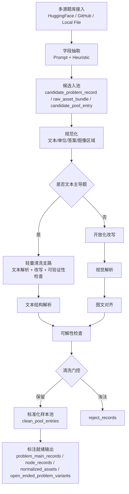

# benchmarkallinone

`benchmarkallinone` 是对 `benchmark/` 与 `agent-pipeline-main/` 两套实现进行功能对齐、优势融合后的统一工程，目标是把大规模数据采集与清洗稳定跑通，并把输出直接组织成可进入标注阶段的结构化结果。

## 统一流程图



## 融合策略

### 保留自 `benchmark/` 的能力
- 更完整的清洗主链：规范化、开放化改写、文本主导分流、视觉解析、图文对齐、可解性检查、门控决策。
- 更丰富的结构化输出：`candidate_problem_records`、`raw_asset_bundles`、`clean_problem_records`、`normalized_assets`、`text_structure_records`、`visual_structure_records`、`solvability_reports`、`node_records` 等。
- 更贴近 `pipeline初步设计.md` 的采集→清洗→标注前就绪目标。

### 融合自 `agent-pipeline-main/` 的能力
- Prompt 驱动字段抽取，增强不同数据源字段映射稳定性。
- `local_file` 连接器，支持本地 `json/jsonl/csv/tsv/parquet` 数据直连。
- Hugging Face 原始文件兜底：补上 `MM_Math` 原始压缩包与 `PhysReason` zip 结构的回退采集能力。
- 更适合大规模远程数据源的多入口采集方式。

## 项目结构

```text
benchmarkallinone/
├── configs/
│   ├── default_multidataset.yaml
│   └── local_file_example.yaml
├── prompts/
│   ├── extract_unified_sample.md
│   ├── extract_question_answer_image.md
│   └── collection/
├── run_pipeline.py
├── requirements.txt
└── src/benchmarkallinone/
    ├── __init__.py
    ├── __main__.py
    ├── cleaning_semantics.py
    ├── pipeline.py
    └── semantics.py
```

## 运行方式

### 1. 安装依赖
```bash
python3 -m pip install -r benchmarkallinone/requirements.txt
```

### 2. 配置模型访问
默认从环境变量读取 `OPENAI_API_KEY`。如仅使用启发式抽取，可把配置中的 `enabled` 设为 `false`。

### 3. 运行默认多数据集流程
```bash
python3 benchmarkallinone/run_pipeline.py --config benchmarkallinone/configs/default_multidataset.yaml
```

### 4. 运行本地文件示例
```bash
python3 benchmarkallinone/run_pipeline.py --config benchmarkallinone/configs/local_file_example.yaml
```

### 6. 生成样本花名册 manifest
```bash
python3 scripts/build_sample_manifest.py --outputs-root outputs --ready-root ready
```

默认会生成仓库根目录下的 `manifests/sample_roster.json`，用于统一登记每条样本的：
- 当前状态（如 `pass/review/reject`）
- 来源 run 目录
- 是否已进入哪些 `ready/...` package
- run / sample 级时间字段

如需只看某个数据集，可指定：
```bash
python3 scripts/build_sample_manifest.py --outputs-root outputs --ready-root ready --dataset eee_bench
```

manifest 里现在同时保留两种口径：
- `records`：文件级明细；同一题如果出现在多个 source run，会保留多条，适合追来源、防误删。
- `canonical_records`：按 `dataset_key + problem_id` 去重后的题目级口径，适合做统计、汇报和 merge 盘点。

### 当前 manifest 摘要
基于当前生成的 `manifests/sample_roster.json`：

| 指标 | 当前值 |
| --- | ---: |
| 文件级样本记录数 | `8720` |
| 按题唯一后的 `canonical_records` | `5729` |
| 覆盖数据集数 | `14` |
| 已登记 `ready` package 数 | `11` |

按题唯一后的部分数据集状态分布：

| 数据集 | 题目数 | pass | review | reject |
| --- | ---: | ---: | ---: | ---: |
| `eee_bench` | `2027` | `1456` | `567` | `4` |
| `emma_physics` | `312` | `189` | `111` | `12` |
| `mathvision` | `1239` | `711` | `523` | `5` |
| `msearth_open_ended` | `495` | `180` | `273` | `42` |
| `mm_math` | `340` | `73` | `257` | `10` |
| `multi_physics` | `320` | `69` | `239` | `12` |
| `physreason` | `548` | `268` | `273` | `7` |
| `seephys` | `320` | `262` | `57` | `1` |

这个摘要以后可以直接作为仓库内的当前结果口径；如 manifest 重建，以上数字也应同步更新。

### 7. 导出 ready 数据为统一 problem JSON
```bash
python3 scripts/export_ready_to_problem_json.py --ready-root ready
```

默认会导出到仓库根目录下的 `ready_problem_exports/`，避免与运行时缓存和中间产物混在 `outputs/` 目录里。

如需只导出某个 ready 包，可指定：
```bash
python3 scripts/export_ready_to_problem_json.py --ready-root ready --dataset mm_math_000_300
```

### outputs 保留规则
- `outputs/repo_cache/` 及其嵌套 cache 目录继续视为运行缓存，不纳入版本控制。
- 其余需要保留的 `outputs/` 运行结果应直接纳入 Git 跟踪，不再额外复制到 `outputs/ready_problem_exports/` 这类历史目录。
- 超过 7 天、未进入 `ready/`、且未被文档或脚本引用的旧实验 / smoke / validation / debug 输出应及时清理。
- `ready` 的标准导出位置固定为仓库根目录下的 `ready_problem_exports/`。

## 标注前就绪输出

运行完成后，每个数据集目录下会生成：
- `candidate_problem_records.jsonl`
- `raw_asset_bundles.jsonl`
- `clean_pool_entries.jsonl`
- `clean_problem_records.jsonl`
- `normalized_assets.jsonl`
- `text_structure_records.jsonl`
- `visual_structure_records.jsonl`
- `solvability_reports.jsonl`
- `node_records.jsonl`
- `open_ended_problem_variants.jsonl`
- `problem_main_records.jsonl`
- `reject_records.jsonl`

这些文件已经覆盖标注前输入所需的核心结构，可直接作为后续标注阶段的数据底座。

## 当前完成与未完成

### 已完成
- 多源采集统一入口。
- 清洗主链与文本主导轻量支路。
- 选择题开放化改写、纯图编号题剔除。
- 图像质量分析、视觉结构抽取、文本结构抽取、图文对齐、可解性检查。
- 标注前就绪的结构化输出。

### 尚未完成
- 文档中完整的标注阶段（`P/T/K/R/S/A/B` 全量构建、解法族聚类、回流补丁）。
- 独立的 QA / Format / 发布后回流模块。
- 更细粒度的 source-specific 阈值调参与评测报告自动汇总。

当前工程已经满足“大规模数据采集与清洗 + 输出直接进入标注阶段”这一目标，后续可以在此基础上继续扩展标注、质检与格式化发布链路。
