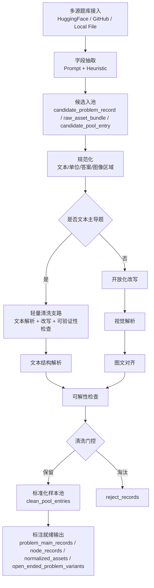

# benchmarkallinone

`benchmarkallinone` 是对 `benchmark/` 与 `agent-pipeline-main/` 两套实现进行功能对齐、优势融合后的统一工程，目标是把大规模数据采集与清洗稳定跑通，并把输出直接组织成可进入标注阶段的结构化结果。

## 当前仓库工作口径（qjb policy 草案）

从 `qjb` 分支开始，仓库默认按下面这条边界工作：

- **Git 负责同步**：代码、脚本、文档、规则、配置、必要的小型 plans/manifests
- **机器本地负责持有**：`outputs/`、`ready/`、`ready_problem_exports/`
- `ready/` 视为**本地派生产物**，默认通过本机脚本从本机 `outputs/` 重建
- 跨机器同步 `outputs/` 时，使用 `rsync/scp/挂载目录/对象存储` 等 Git 之外的方式
- 当前已知的 **最全 outputs 主源头** 应固定在一台机器上，其它机器按需补齐

这意味着：后续仓库不再把 `outputs/`、`ready/` 当作需要随代码一起提交和分发的内容，而是把真正重要的部分收敛为 **构建规则 + 构建脚本 + 文档口径**。

相关文档入口：
- `docs/output_to_ready_inventory_2026-04-10.md`
- `docs/qjb_script_boundary_audit_2026-04-10.md`
- `docs/qjb_branch_sync_plan_2026-04-10.md`
- `docs/qjb_branch_execution_checklist_2026-04-10.md`

## 统一流程图



## 融合策略

### 保留自 `benchmark/` 的能力
- 更完整的清洗主链：规范化、开放化改写、文本主导分流、视觉解析、图文对齐、可解性检查、门控决策。
- 更丰富的结构化输出：`candidate_problem_records`、`raw_asset_bundles`、`clean_problem_records`、`normalized_assets`、`text_structure_records`、`visual_structure_records`、`solvability_reports`、`node_records` 等。
- 更贴近 `pipeline初步设计.md` 的采集→清洗→标注前就绪目标。

### 融合自 `agent-pipeline-main/` 的能力
- Prompt 驱动字段抽取，增强不同数据源字段映射稳定性。
- `local_file` 连接器，支持本地 `json/jsonl/csv/tsv/parquet` 数据直连。
- Hugging Face 原始文件兜底：补上 `MM_Math` 原始压缩包与 `PhysReason` zip 结构的回退采集能力。
- 更适合大规模远程数据源的多入口采集方式。

## 项目结构

```text
.
├── configs/
├── docs/
├── manifests/
├── plans/
├── prompts/
├── scripts/
├── src/benchmarkallinone/
├── requirements.txt
└── run_pipeline.py
```

其中：

- Python 包源码位于 `src/benchmarkallinone/`
- 仓库级运行入口位于根目录 `run_pipeline.py`
- `outputs/`、`ready/`、`ready_problem_exports/` 属于本地产物，不再作为仓库结构的一部分说明

## 运行方式

### 1. 安装依赖
```bash
python3 -m pip install -r requirements.txt
```

### 2. 配置模型访问
默认从环境变量读取 `OPENAI_API_KEY`。如仅使用启发式抽取，可把配置中的 `enabled` 设为 `false`。

### 3. 运行默认多数据集流程
```bash
python3 run_pipeline.py --config configs/default_multidataset.yaml
```

### 4. 运行本地文件示例
```bash
python3 run_pipeline.py --config configs/local_file_example.yaml
```

### 5. 从本地 outputs 构建 ready（canonical 主链）
```bash
python3 scripts/build_ready_from_outputs_content_dedup.py --dataset <dataset_key>
```

这是当前 `qjb` policy 下的 **canonical `outputs -> ready` 主链入口**。

默认建议**按数据集逐个运行**，不要在这里直接跑全量。

如需只构建某个数据集，可结合脚本参数指定数据集过滤条件（建议使用 `--dataset <dataset_key>` 逐个跑）。脚本现在会输出轻量进度日志，至少包括：

- 当前 dataset
- 当前 range / run
- 已扫描样本数
- 写出进度

构建完成后，应重点检查：

- `datasets/<dataset>/summary.json`
- `datasets/<dataset>/selection_manifest.json`
- `selection_validation.ok = true`
- `write_validation.ok = true`

> 注意：`ready/` 现在被视为**本地派生产物**，不再作为 Git 同步对象。跨机器时请同步 `outputs/` 和代码版本，而不是同步 `ready/` 目录本身。

### 6. 脚本边界：哪些是主链，哪些不是

当前与 `qjb` local-artifact policy 最相关的脚本，建议按下面 4 层理解：

1. **主构建链（canonical）**
   - `scripts/build_ready_from_outputs_content_dedup.py`
   - 负责：`outputs -> selection/merge/dedup -> ready`

2. **盘点 / 覆盖 / 追踪层**
   - `scripts/build_sample_manifest.py`
   - `scripts/build_output_root_coverage.py`
   - 负责：盘点本机 `outputs/` 与 `ready/` 的覆盖和对应关系

3. **post-ready / review-release 层**
   - `scripts/build_review_docs.py`
   - `scripts/apply_manual_review_release.py`
   - `configs/review_release_policies.yaml`
   - 负责：在 canonical ready 已存在的前提下，生成 review 文档、执行 manual release、刷新台账

4. **post-ready export 层**
   - `scripts/export_ready_to_problem_json.py`
   - 负责：把本机已有 `ready/` 继续导出成 `ready_problem_exports/`

其中需要特别注意的是：

- `scripts/build_review_docs.py` **不是** build-ready 主链的一部分
- 它当前依赖本机 `ready/`，并且对固定 canonical `ready/...` package 路径有较强硬编码依赖
- 因此它应被视为 **ready downstream consumer**，不是“拉下仓库就能无前置直接运行的通用入口”
- `scripts/apply_manual_review_release.py` 现在支持从 `configs/review_release_policies.yaml` 读取**统一的多数据集 release policy**，避免把每个数据集的 bucket 规则散落在脚本参数和临时文档里

如需看完整边界说明，优先阅读：
- `docs/qjb_script_boundary_audit_2026-04-10.md`

### 7.1 统一 review-release policy 配置（post-ready）
```bash
python3 scripts/apply_manual_review_release.py \
  --policy-config configs/review_release_policies.yaml \
  --dataset mm_math \
  --candidate-json docs/review/mm_math_A_bucket_candidates_2026-04-09.json \
  --release-bucket A \
  --dry-run
```

这一步会从 `configs/review_release_policies.yaml` 中解析：
- 数据集对应的 canonical `dataset_root`
- 当前 bucket 使用的 `candidate_key`
- release basis / policy doc / pass 后写回的 reason codes
- bucket 的 reason-code selection rule
- 相邻观察 bucket（如 `adjacent_text_sufficient_candidates`）

如果要正式执行，再补上 `--ledger-out ...`，去掉 `--dry-run`。

当前建议：
- 每个数据集的 review-release 策略都收口到这一个总配置里
- 每个 bucket 明确写 `selection.match_mode + decision_reason_codes`
- 脚本继续保留旧参数模式，保证向后兼容

### 7.2 从统一 policy 配置导出 candidate buckets（post-ready）
```bash
python3 scripts/export_review_release_candidates.py \
  --policy-config configs/review_release_policies.yaml \
  --dataset mm_math \
  --release-bucket A \
  --out docs/review/mm_math_A_bucket_candidates_config_generated.json
```

这个脚本会：
- 从统一 policy config 读取数据集 `dataset_root`
- 按 bucket 的 `selection` 规则导出 candidate json
- 同时导出相邻 observation bucket（如果配置了）
- 对已经执行过 manual release 的样本，优先从 provenance 中读取原始 `original_decision_reason_codes`，从而能复原 release 前 bucket

### 7.3 基于统一 policy 配置刷新 review docs（post-ready）
```bash
python3 scripts/build_review_docs.py
```

这一步现在会：
- 优先从 `configs/review_release_policies.yaml` 解析数据集对应的 canonical `dataset_root`
- 在 `docs/review/<dataset>.md` 中附带该数据集当前已配置的 release bucket 摘要

### 8. 生成样本花名册 manifest（inventory / post-build）
```bash
python3 scripts/build_sample_manifest.py --outputs-root outputs --ready-root ready
```
基于当前生成的 `manifests/sample_roster.json`：

| 指标 | 当前值 |
| --- | ---: |
| 文件级样本记录数 | `8720` |
| 按题唯一后的 `canonical_records` | `5729` |
| 覆盖数据集数 | `14` |
| 已登记 `ready` package 数 | `11` |

按题唯一后的部分数据集状态分布：

| 数据集 | 题目数 | pass | review | reject |
| --- | ---: | ---: | ---: | ---: |
| `eee_bench` | `2027` | `1456` | `567` | `4` |
| `emma_physics` | `312` | `189` | `111` | `12` |
| `mathvision` | `1239` | `711` | `523` | `5` |
| `msearth_open_ended` | `495` | `180` | `273` | `42` |
| `mm_math` | `340` | `73` | `257` | `10` |
| `multi_physics` | `320` | `69` | `239` | `12` |
| `physreason` | `548` | `268` | `273` | `7` |
| `seephys` | `320` | `262` | `57` | `1` |

这个摘要以后可以直接作为仓库内的当前结果口径；如 manifest 重建，以上数字也应同步更新。

### 8. 导出 ready 数据为统一 problem JSON（post-ready export）
```bash
python3 scripts/export_ready_to_problem_json.py --ready-root ready
```

这一步属于 **post-ready export**，不是 `outputs -> ready` 主构建链的一部分。

默认会导出到仓库根目录下的 `ready_problem_exports/`，作为当前机器本地从 `ready/` 派生出的下游导出结果。

如需只导出某个 ready 包，可指定：
```bash
python3 scripts/export_ready_to_problem_json.py --ready-root ready --dataset mm_math_000_300
```

> 注意：`ready_problem_exports/` 也属于**本地派生产物**，默认不应再纳入 Git 跟踪。

### 本地产物管理规则
- `outputs/`、`ready/`、`ready_problem_exports/` 都按**本地运行/派生产物**对待，不再作为仓库同步对象。
- `outputs/repo_cache/` 及其嵌套 cache 目录继续视为运行缓存。
- 跨机器共享时，优先同步 `outputs/`；`ready/` 默认在目标机器本地重建。
- 如果确实需要保留示例数据，请放到 `examples/` 或 `fixtures/`，不要继续混在真实 `outputs/`、`ready/` 目录里。
- 超过 7 天、未进入当前工作流、且未被文档或脚本引用的旧实验 / smoke / validation / debug 输出，应在确认后单独清理，但清理动作不应混入日常代码提交。

## 标注前就绪输出

运行完成后，每个数据集目录下会生成：
- `candidate_problem_records.jsonl`
- `raw_asset_bundles.jsonl`
- `clean_pool_entries.jsonl`
- `clean_problem_records.jsonl`
- `normalized_assets.jsonl`
- `text_structure_records.jsonl`
- `visual_structure_records.jsonl`
- `solvability_reports.jsonl`
- `node_records.jsonl`
- `open_ended_problem_variants.jsonl`
- `problem_main_records.jsonl`
- `reject_records.jsonl`

这些文件已经覆盖标注前输入所需的核心结构，可直接作为后续标注阶段的数据底座。

## 当前完成与未完成

### 已完成
- 多源采集统一入口。
- 清洗主链与文本主导轻量支路。
- 选择题开放化改写、纯图编号题剔除。
- 图像质量分析、视觉结构抽取、文本结构抽取、图文对齐、可解性检查。
- 标注前就绪的结构化输出。

### 尚未完成
- 文档中完整的标注阶段（`P/T/K/R/S/A/B` 全量构建、解法族聚类、回流补丁）。
- 独立的 QA / Format / 发布后回流模块。
- 更细粒度的 source-specific 阈值调参与评测报告自动汇总。

当前工程已经满足“大规模数据采集与清洗 + 输出直接进入标注阶段”这一目标，后续可以在此基础上继续扩展标注、质检与格式化发布链路。
