# CIRCUIT 数据集 Pipeline 与 Multi-Agent 自动化方案

## 需要先确定的点：
1.数据应该格式化为什么格式，这个的设计需要考虑后面的步骤所需的字段
2.确定pipeline
3.所以先理一下后面用什么字段，这个有数据集中带的，也有我们自己需要生成的

## 结论：现在GPT5.4在xhigh思考努力的情况下绝大概率不会有问题，先把流程跑通之后再检查一下有没有问题

## 1. 整体 Pipeline

### 1.1 总目标

围绕高质量、多解法、可持续更新的多模态推理数据集，构建一条可自动化运行的数据生产线；在本文后续细化部分，以 M3CoT 中的“真正的多步多模态题”作为代表样本展开说明。

主线仍采用五段，但清洗阶段内部新增“选择题开放化改写与图编号剔除”子流程：

1. 采集（Collection）
2. 清洗（Cleaning，含选择题开放化改写）
3. 标注（Annotation）
4. 质检（QA）
5. 格式化发布（Format）

### 1.2 总体流程图

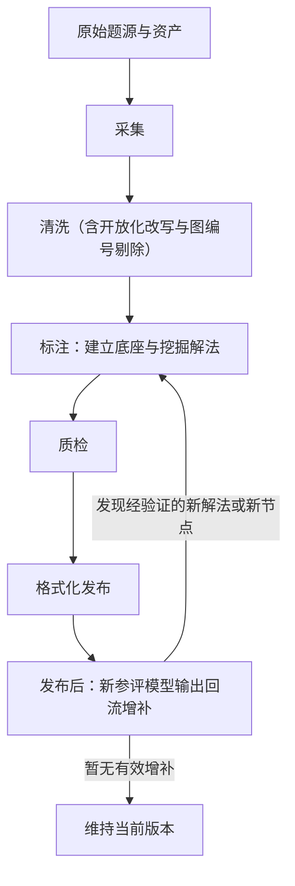

| 节点 | 含义 | 详细解释 |
| --- | --- | --- |
| 原始题源与资产 | 全流程起点 | 指原始题图、题干、答案、来源信息及其他辅助资源，尚未经过筛选和标准化。 |
| 采集 | 候选题接入阶段 | 把来自不同来源的原始样本统一接入系统，形成候选题池与初始元数据。 |
| 清洗 | 标准化与筛题阶段 | 对候选题做规范化、图文对齐、可解性检查与题型开放化改写；对依赖干扰项成立的概念辨析题执行“挖空式”开放问答改写，对纯图编号选择题直接剔除。 |
| 标注：建立底座与挖掘解法 | 首轮深标阶段 | 先构建 `P/T/K` 底座，再利用多模型、多策略挖掘候选解法与中间节点，形成首轮高覆盖度标注结果。 |
| 质检 | 发布前审核阶段 | 对结构正确性、证据充分性、解法覆盖度和可重建性做集中审核。 |
| 格式化发布 | 数据出库阶段 | 将通过审核的结果写成统一数据格式，生成正式版本与发布包。 |
| 发布后：新参评模型输出回流增补 | 发布后持续维护闭环 | 收集新发布或新参加测评模型的答案与轨迹，对“答案正确、验证通过但中间节点命中率低”的路径做合法性审核，并把真正的新中间节点 / 新解法以补丁形式回写到后续版本。 |

### 1.3 六段主线的输入输出（其中发布后回流为非阻塞增量环）

| 阶段 | 目标 | 主要输入 | 主要输出 |
| --- | --- | --- | --- |
| 采集 | 建立高冗余候选池 | 原始题图或多张辅助图、题干、答案、来源信息 | 候选题池、初始元数据与初始评分 |
| 清洗 | 筛出适合深标的高质量样本，并把可改写选择题转成开放问答版本 | 候选题池 | 标准化样本池、开放化改写记录、淘汰记录 |
| 标注 | 生成 `P/T/K/R/S/A/B` 结构化 GT，并为后续回流预留可对齐的节点库与解法库 | 标准化样本池 | 首轮高覆盖度的多解法结构化标注 |
| 质检 | 验证结构、证据、覆盖度 | 标注结果 | 发布候选集、`qa_records`（质检记录） |
| 格式化 | 生成稳定可维护的数据组织 | 发布候选集 | 发布包、版本快照 |
| 发布后回流增补 | 利用新参评模型持续扩展节点与解法库 | 已发布数据集、新参评模型答案 / 轨迹、现有节点库与解法库 | `dataset_patch`（数据集补丁）、新版本候选 |

---

## 2. 分阶段细化方案

## 2.1 采集阶段

### 2.1.1 目标

从数据集中筛出的“真正的多步多模态题”候选样本建立大规模候选池，为后续清洗和深标做准备。

### 2.1.2 输入

- 原始题图或多张辅助图
- 原始题干
- 原始答案
- 题目 ID / 来源信息 / 领域标签
- 如有公开解析、步骤说明或参考说明文本

### 2.1.3 输出

- `candidate_problem_record`：候选题目记录，表示一条样本在进入正式清洗前的结构化草稿信息
- `raw_asset_bundle`：原始资源包，表示该题关联的图像、文本、答案和来源元数据集合
- `initial_image_dependency_score`：初始图像依赖分数，表示该题对图像信息的依赖强度
- `initial_multi_solution_score`：初始多解潜力分数，表示该题可能存在多种合法解法的程度
- `initial_verifiability_score`：初始可验证性分数，表示该题答案与过程是否容易被后续程序或规则验证

### 2.1.4 这一阶段做什么

#### Step C1：样本接入

做什么：
- 收集候选样本、题图、题干、答案、来源元数据
- 给每个样本分配稳定 ID

用什么做：
- 样本抓取脚本
- 元数据登记脚本
- GPT 元数据补全

#### Step C2：资产登记**应该都是齐全的**

做什么：
- 检查图像 / 文本 / answer 是否齐全
- 建立资产清单

用什么做：
- 资产校验脚本
- 文件完整性检查器

#### Step C3：初步价值打分**这几个比较重要**

做什么：
- 判断图像依赖强不强
- 判断是否是真正的多步多模态题**这里有些数据集已经有标识，比如M3CoT，但是没有标注的数据集，需要做：
  - 1.判断图文是否相关
  
- 判断多解的可能性，针对不同的数据集判断方式不一样。
- 把“多解潜力高的数据集 / 多解潜力低的数据集”显式分流：
  - 如果该数据集以单解题为主，则不要强推多解 agent，也不要为了凑多解而增加额外生成压力；这类数据集只保留基础可验证性与可标注性检查。
  - 只有当该数据集整体上存在较稳定的多解潜力，或者该题本身被判定为高多解潜力时，才进入后续的强多解挖掘链路。

用什么做：
- GPT 分类器
- 规则打分器
- 多步多模态可评测性启发式脚本
- 数据集级分流规则表（控制多解挖掘强度）

#### Step C4：候选入池

做什么：
- 把样本登记为候选题
- 保存初始分数和来源信息

用什么做：
- schema validator
- 候选池写入脚本

### 2.1.5 数据采集自动化流程图

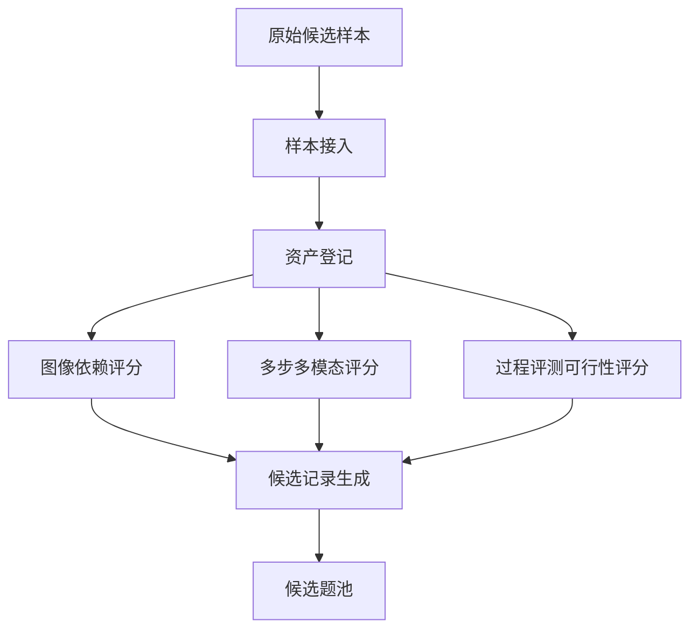

| 节点 | 含义 | 详细解释 |
| --- | --- | --- |
| 原始候选样本 | 采集输入 | 指从 M3CoT 或其他来源拿到的原始题目样本，通常包含图像、题干、答案与基础来源信息。 |
| 样本接入 | 统一登记入口 | 给样本分配稳定 ID，并把分散来源的数据拉到统一处理框架中。 |
| 资产登记 | 资源清点 | 检查图像、文本、答案、来源元数据是否完整，建立资源清单。 |
| 图像依赖评分 | 多模态必要性初筛 | 判断该题是否真的必须使用图像，避免把“带图但不需要看图”的题混进来。 |
| 多步多模态评分 | 多步性筛选 | 判断该题是否至少需要两步以上图文联合推理，而不是单步视觉识别或单步文本判断。 |
| 过程评测可行性评分 | 过程可标注性筛选 | 判断该题能否拆出中间步骤、证据绑定和评测 rubric。 |
| 候选记录生成 | 入库前结构化 | 把评分结果与原始元数据写成统一候选记录。 |
| 候选题池 | 采集阶段产物 | 作为后续清洗阶段的输入，是尚未标准化但已经过初筛的样本集合。 |

### 2.1.6 采集阶段参与 Agent

| Agent | 做什么 | 输入 | 输出 |
| --- | --- | --- | --- |
| `Source Intake Agent` | 接收样本与原始资产 | 原始样本包 | `candidate_problem_record`（候选题目记录草稿） |
| `Asset Registry Agent` | 建立资产清单 | 图像、题干、答案、来源信息 | `raw_asset_bundle`（原始资源包） |
| `Potential Scorer Agent` | 评估图像依赖、多步性、过程评测可行性 | 原始资产 | 三类初始分数 |
| `Candidate Registrar Agent` | 将样本写入候选池 | 候选记录 | 候选池条目 |

---

## 2.2 清洗阶段**这部分主要是做规范化数据，去掉数据集中的冗余内容，剔除模糊的图片等等**

### 2.2.1 目标

把候选池变成适合深度标注的高质量标准化样本池，并在进入标注前完成题型标准化：

- 原本就是开放问答的题直接保留；
- 可直接去选项的选择题改写成开放问答；
- 依赖干扰项才能成立的概念辨析题，不保留显式选项列表，而是把原先由选项承载的目标项“挖空”后让模型直接回答；
- 一个选项中包含多个原子答案时，按答案粒度拆成多道开放子题；
- 纯图编号选择题（如 graph A/B/C/D、diagram A/B/C/D）直接淘汰，不进入后续深标。

### 2.2.2 输入

- `candidate_problem_record`
- `raw_asset_bundle`
- 初始评分

### 2.2.3 输出

- `clean_problem_record`：清洗后题目记录，表示通过基础清洗与筛选后的题目主记录
- `normalized_assets`：标准化资源包，表示经过格式统一和区域规范化后的资源集合
- `alignment_report`：对齐报告，表示图像与文本在实体、条件和目标层面的对应关系与冲突信息
- `solvability_report`：可解性报告，表示题目是否具备清晰目标、可验证答案、足够文本条件与必要视觉锚定
- `rewrite_report`：题型改写报告，表示原题是否被改成开放问答、是否被拆成多道子题、是否因纯图编号而被剔除
- `open_ended_problem_variants`：开放问答版本集合，表示由原题派生出的一个或多个开放问答题面
- `clean_pool_entry`：清洗池条目，表示允许进入深度标注阶段的样本记录
- `reject_log`：淘汰日志，表示被过滤样本及其淘汰原因的记录

### 2.2.4 这一阶段做什么

#### Step L2：规范化**规范化为我们自己的格式，自己规定一个**

做什么：
- 变量命名统一
- 单位统一
- 图像区域裁剪与标注统一
- 题面与答案格式标准化
- 去掉 `<image>`、`Choices` 等数据集私有噪声标记，保留真正有语义的题面内容
- 当前版本明确**不做 OCR 矫正**，也不做复杂的图中文字修复；这里只做格式标准化、噪声清理和字段规范化，不把 OCR 修复作为清洗阶段的必做项
- 对文本主导题先做“图像必要性判断”；如果判定该题主要依赖文字即可作答，则进入轻量清洗支路，不强制进入完整视觉解析链

用什么做：
- rule-based text cleaner
- unit normalizer
- image region normalizer
- answer normalizer
- text-dominant detector（文本主导题识别器）

#### Step L3：题型标准化与开放化改写

做什么：
- 识别原题是原生开放题、一般选择题、依赖干扰项的概念辨析题、纯图编号选择题，还是可拆分组合题
- 对原生开放题直接保留
- 对普通选择题去掉 `Choices`，把目标直接改成开放回答
- 对依赖干扰项才能成立的概念辨析题，不保留原选项列表，而是把原先由选项承载的目标项挖空，让模型直接作答
- 对一个选项中包含多个原子答案的题，拆成多道开放子题
- 对纯图编号选择题（例如 `graph A/B/C/D`、`diagram A/B/C/D`、`waveform A/B/C/D`）直接淘汰
- 记录原题、改写题、拆分关系、挖空策略、淘汰原因与改写审计

用什么做：
- question type classifier
- option stripper / blanking rewriter
- subquestion splitter
- rewrite audit logger

#### Step L4：图文对齐

做什么：
- 从图像中解析关键视觉实体与关系
- 从文本中解析关键条件、目标与改写后的开放问答槽位
- 对齐两者并记录冲突

用什么做：
- visual parser
- text parser
- alignment engine
- GPT 冲突解释器

#### Step L5：保留或淘汰

做什么：
- 对开放化改写失败、改写后目标不明确、拆分后答案不可校验的样本退回复核或淘汰
- 对纯图编号选择题直接淘汰
- 根据图文绑定强度、可验证性、多步性和改写质量决定保留或淘汰；有些数据集比如化学或生物题本身主要依赖文字，不需要图像，这类数据可以保留但不能占太高比例
- 对文本主导题采用轻量门控：只要文本可验证性、题面清晰度和改写质量达标，就可以不依赖完整视觉解析结果进入保留判断

用什么做：
- gatekeeper 规则
- rewrite validator
- GPT 复核器
- text-first gate（文本优先门控规则）

### 2.2.5 清洗阶段流程图

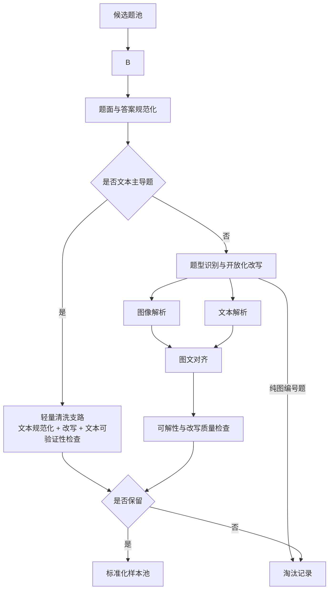

| 节点 | 含义 | 详细解释 |
| --- | --- | --- |
| 候选题池 | 清洗输入 | 来自采集阶段的候选样本集合，质量参差不齐，需要进一步清洗。 |
| 题面与答案规范化 | 基础标准化 | 统一变量、单位、题面格式和答案表达，并清理 `<image>`、`Choices` 等噪声标记；当前版本明确不把 OCR 矫正当作该步骤的必做项。 |
| 是否文本主导题 | 清洗分流判断 | 判断该题是否主要依赖文字即可完成作答；若是，则走轻量清洗支路，减少不必要的视觉解析负担。 |
| 轻量清洗支路 | 文本优先清洗 | 面向文本主导题，只做文本规范化、开放化改写、文本结构检查与文本可验证性检查，不强制进入完整图像解析链。 |
| 题型识别与开放化改写 | 题型标准化 | 识别开放题、普通选择题、概念辨析题、可拆分组合题和纯图编号题；将可改写题改成开放问答，将纯图编号题直接剔除。 |
| 图像解析 | 视觉结构抽取 | 从图像中识别实体、关系、局部区域或关键视觉线索，形成结构化视觉表示。 |
| 文本解析 | 条件目标抽取 | 从题干中抽出已知条件、约束、目标，以及开放化改写后的回答槽位。 |
| 可解性与改写质量检查 | 可评测性判断 | 检查答案是否可验证、是否存在至少一条合法图文联合推理路径，以及改写后的开放题是否目标明确。 |
| 是否保留 | 清洗门控 | 根据图像必要性、多步性、可验证性、对齐质量和改写质量决定保留还是淘汰；文本主导题允许基于轻量支路结果直接决策。 |
| 标准化样本池 | 清洗结果 | 留给标注阶段的高质量样本集合。 |
| 淘汰记录 | 清洗日志 | 保存被过滤样本及其淘汰原因，便于回溯和分析。 |

### 2.2.6 清洗阶段参与 Agent

| Agent | 做什么 | 输入 | 输出 |
| --- | --- | --- | --- |
| `Normalization Agent` | 单位、图像区域、答案格式和噪声标记规范化 | 原始资产 | `normalized_assets`（标准化资源包） |
| `Question Rewrite Agent` | 识别选择题并改写为开放问答，必要时拆题或剔除纯图编号题 | 标准化文本、答案、选项 | `rewrite_report`（题型改写报告）、`open_ended_problem_variants`（开放问答版本集合） |
| `Visual Parser Agent` | 把图转成视觉实体与关系 | 标准化图像 | 视觉结构 |
| `Text Context Parser Agent` | 把题干转成条件、目标与开放回答槽位 | 标准化文本、改写后题面 | 文本结构 |
| `Alignment Agent` | 对齐图像与文本 | 视觉结构、文本结构 | `alignment_report`（对齐报告） |
| `Solvability Checker Agent` | 做可解性、答案验证与改写质量检查 | 标准化样本、开放题版本 | `solvability_report`（可解性报告） |
| `Clean Gate Agent` | 决定保留或淘汰 | 清洗报告、改写报告 | `clean_pool_entry`（清洗池条目）或 `reject_log`（淘汰日志） |

---

## 2.3 标注阶段

### 2.3.1 目标

把每道 M3CoT 风格的“真正的多步多模态题”变成支持一题多解的结构化 ground truth 节点集合。

### 2.3.2 输入

- `clean_problem_record`
- `normalized_assets`
- `alignment_report`
- `solvability_report`
- 可验证答案

### 2.3.3 输出

- `problem_record`：正式题目记录，表示进入标注主流程后的标准化题目主对象
- `p_facts`：感知事实集合，表示从图像中抽取出的客观视觉事实
- `t_facts`：题干条件集合，表示从文本中抽取出的已知条件、目标和约束
- `k_atoms`：知识原子集合，表示本题可能调用的知识点、规则或定理单元
- `r_nodes`：中间推理节点集合，表示从解题过程抽出的标准化中间结论节点
- `solution_library`：解法库，表示该题当前已整理出的多个解法族及其方法签名
- `solution_memberships`：解法归属关系，表示哪些 `r_nodes` 属于哪些解法，以及它们在解法中的角色
- `evidence_bindings`：证据绑定集合，表示每个关键节点由哪些图像、文本、知识或前驱节点支持
- `cot_variants`：推理文本变体集合，表示不同模型或不同提示词生成的原始解题过程文本
- `coverage_state`：覆盖状态，表示当前这道题的一题多解覆盖程度是否已经接近饱和

### 2.3.4 这一阶段做什么

#### Step A1：构建 `P/T/K` 底座 (事实与知识基础建立)

**做什么：**
将题目剥离出最底层的客观事实和先验知识，且不包含任何逻辑推导过程，为后续推理建立不可动摇的地基。具体包括：提取图像中的客观视觉事实（P感知事实），题干明确给定的条件（T题干条件），并在知识库中枚举可能用到的学科知识与推理规则（K知识原子）。

**怎么做（具体方法与流程）：**
1. **P事实（Perception）抽取**：调用具备先进 Vision 能力的模型（如 GPT-4o），并结合前置阶段生成的 `alignment_report`（图文对齐报告）。提供严格的 Prompt，要求“仅描述客观所见的图中实体、位置关系、颜色/标注/趋势等视觉事实，禁止直接进入结论推导”，生成诸如“图中有三段不同颜色的折线”“右上区域标注了温度变化箭头”这样的绝对事实。
2. **T条件（Text Condition）抽取**：调用纯文本大模型（如 GPT-4o/Claude3.5）解析题干文本。使用基于正则前筛与大模型结合的文本解析器，找出已知约束、给定数值、题目目标，以及必须结合图像才能解释的条件。
3. **K原子（Knowledge Atoms）枚举**：构建一个按学科分层的 `Rule Catalog`，覆盖 science、math、commonsense 等可能知识族。利用 `Knowledge Librarian Agent` 对比前面抽取的 P事实 和 T条件，通过 Embedding 检索或多层分类器打分，捞取出“解本题高概率会用到的规则、定理、常识或图表解释原则”，将其作为本题的 K 知识原子选项集挂载。

#### Step A2：多角色异构求解

**做什么：**
通过各种策略逼迫模型给出尽可能多、甚至刁钻的解题方案，从而供下一步构建中间事实 ground truth 节点，穷尽该类真正多步多模态题的多样化解题路径。

**怎么做（具体方法与流程）：**
组建一个包含不同预设人设的大型 `Solver Ensemble` 求解 Agent 池，并发使用四个诱导策略：
1. **异构模型直接生成**：同时向 DeepSeek-R1、Claude-3.5-Sonnet、GPT-4o 发送同样的 `problem_record`，收集各模型的原生第一直觉 CoT。
2. **方法约束诱导（Method-constrained Prompting）**：向池内 Agent 注入不同求解路线，例如“必须先抽取图中关键证据，再结合题干条件做两步以上推理”“必须先只看文本提出假设，再回到图中验证”。
3. **对抗与避让生成（Adversarial Prompting）**：把前馈中已获得的最主流解法作为“负面条件”输给大模型，下发强制禁令：“不要重复当前主流做法，必须寻找另一条独立的图文联合推理路径”。
4. **逆向探寻（Reverse Reasoning Prompting）**：直接把标准答案前置给模型，让其“由果溯因”，反推必须成立的中间节点与关键视觉证据。

#### Step A3：Claim 拆解与 `R` 节点归纳 (推论原子化)

**做什么：**
步骤 A2 产出的是几十段各自为营、长短不一的自然语言 CoT。这步的作用是将这些自然文本“打碎”，分离为细粒度的标准推论片段（R节点），并对它们进行语义归并和等价合组，建立起评测节点网的核心。

**怎么做（具体方法与流程）：**
1. **句法拆解（Claim Extractor）**：将生成出的乱段文字通过带格式化 JSON schema 约束的 Prompt 送入信息抽取大模型。要求模型根据“先看图得到什么、再结合文本推出什么、最终如何到达答案”的结构，将大段文本按粒度切分成单步推论序列。
2. **类型标注（Type Tagging）**：强制 Agent 给切分好的单句打上 `reasoning_type` 标签（例如：视觉识别、条件转化、规则调用、数值计算、全局整合），方便后续在各个维度进行特定评测。
3. **等价归组（Canonicalization / Semantic Grouping）**：使用文本相似度模型（Sentence-BERT）或大模型扮演的判别器对海量 Claim 集合寻找等价聚类。一旦判定在语义与结果上等价（如模型A写“图中折线先升后降”、模型B写“曲线趋势是上升后下降”），即给定相同的 `equivalence_group_id`。系统选取其中最规范的一句设为 `canonical_claim`，其余表述记为 `surface_forms`。

#### Step A4：Solution Family 聚类 (解法拓扑重建)

**做什么：**
把从离散状态下清洗出来的 R 节点，重新拼装回各个具体的解法路径中去。通过路径依赖关系分析，把本质上是一条思路的方法聚成一个族（Family），并剥离出主干节点和边缘非必要节点。

**怎么做（具体方法与流程）：**
1. **方法签名提取（Method Signature Extraction）**：向 `Solution Grouper Agent` 输入一条处理好的 CoT 的节点序列。让它归纳出这整个长序列的核心骨架，例如：提取出 `[先识别图中关键对象, 再结合题干约束, 最后进行定量或逻辑整合]` 记为该 Trace 的 signature。
2. **解法族聚类（Trace Clustering）**：当遇到多条 Trace 拥有高度重合的方法签名时（比如它们只是分析顺序不同，或解释啰嗦程度不同），一并归口至相同的 `solution_id`。
3. **抽取最小必要集（Minimal-set Extractor）**：对同一解法族内聚拢的数条 CoT 进行“图交叉运算”。求出所有该族 CoT “必经”的 R 节点集合，标记为 `required_r_ids`；只在部分思路中出现的可有可无解释节点，标记为 `optional_r_ids`。

#### Step A5：Evidence Binding （证据锚定与支撑链构建）

**做什么：**
保证多 Agent 系统不是在幻觉里造数据。这一步的责任是给刚产生的每一个中间结论（R节点）以及最终答案（A节点）“找依据”，强行要求上溯追踪支撑源，如果找不着依据，直接否决该节点。

**怎么做（具体方法与流程）：**
1. **图文溯源推理（Graph Reasoner）**：下发一条明确的任务指令给 `Binding Generator Agent`：针对每一个组装进 Solution 树里的 R 节点，将其上游支撑必须精准映射给底层源。比如“R节点：图中趋势表明对象A先增加后减少”，其支撑对象必须清晰锁定在一个 `P_fact`（图中折线的变化趋势）、一个 `T_fact`（题干中要求比较变化过程）、以及一个 `K_atom`（趋势判读规则或相关学科知识）。
2. **支撑强度硬分级（Verifier Signal Merger）**：利用写好的多模态一致性检查脚本（Multimodal Verifier），将刚刚挂接到前置 P/T/K 的事实与结论做一致性核验。如果图像证据、文本条件与 R 节点结论完全一致，将支撑强度标注为 `HIGH(多源一致)`；如果只能依靠大模型纯文本逻辑推理圆过去，记作 `MEDIUM(语义支撑)`。

#### Step A6：Coverage Hunter 查漏补缺 (解法完备性覆盖)

**做什么：**
反复审视当前建立的 `Solution Library`（解法集），监控有没有因为模型“懒惰”而遗漏的特定视角或有效路径，进而主动倒逼生成新解法路径。

**怎么做（具体方法与流程）：**
1. **未使用知识对照扫描（Unused Knowledge Scanner）**：每完成一轮题目的初标注阶段，执行一道 Python 批处理，将当前题目最初选定的候选 `K_atoms`（见Step A1） 抽出来，和目前题库内所有 Solution 调用过的字典进行 Difference Check。
2. **寻找破局点（Novelty Search Loop）**：假如扫描发现该题一开始标记有“地图比例尺换算”或“折叠对称关系”这类知识原子，但前面的多 Agent 群体由于思维惰性，解题时始终只用最直观的文本线索，导致这些 K 原子闲置。
3. **靶向强填（Coverage Hunter Prompts）**：立刻自动召唤休眠的 `Coverage Hunter Agent`，将此残缺缺漏包装成高优任务：“此题目前还未存在使用该知识的解答路径。现在严禁你重复已有主流思路，必须强制代入该知识并吐出全新的 CoT 轨迹”。若生成成功则转入步骤 A3 重新录入流转闭环。

#### Step A7：发布后模型输出回流增补 (低命中新解回收)

**做什么：**
数据集首发后，持续收集新发布或新参加测评模型的答案与轨迹，用“节点命中率 + 正确性验证”联合判断是否出现了当前节点库尚未覆盖的新解法。如果某条路径最终答案正确、验证过程通过，但对现有中间节点的命中率较低，则把它视为潜在新解候选，用于增补中间节点与解法族。

**具体流程：**
1. **Trace Collection**：在数据集发布后，持续收集新模型在正式评测、复测或公开测试中的答案、推理轨迹与运行元数据；即使只有答案与简短解释，也要保留原始输出供后续比对。
2. **命中率比对与候选筛选（Trace Mapping）**：将模型产出的 Trace 调用 `Trace Mapper Agent` 与当前 `Solution Library`、`R` 节点库进行对齐。若该路径答案正确且经过验证，同时对库内中间节点命中率偏低，则送入“潜在新解候选池”。
3. **新颖性验证与版本化回写（Novelty Verification & Patching）**：对于“低命中率但答案正确且验证通过”的 Trace，交由 `Novelty Detector Agent` 与 `Feedback Judge Agent` 审核其是否真的是图文一致、逻辑合法的新方法。若成立，则抽取新增 `R` 节点、补充 `solution family`，并由 `Patch Writer Agent` 生成结构化补丁写入下一版本。

### 2.3.5 标注阶段整体流程图

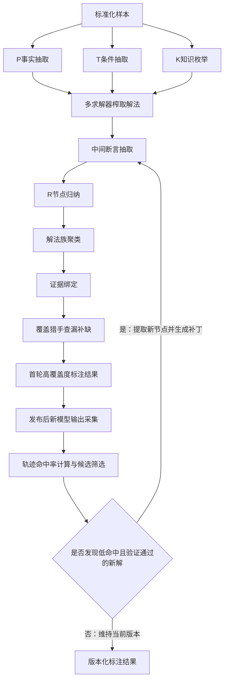

| 节点 | 含义 | 详细解释 |
| --- | --- | --- |
| 标准化样本 | 标注输入 | 经过清洗后的高质量题目，图像、文本、答案与对齐关系都已基本稳定。 |
| P事实抽取 | 感知事实构建 | 从图像中抽取客观可见事实，例如对象、位置、颜色、趋势、连接或局部结构。 |
| T条件抽取 | 题干条件构建 | 从文本中抽取已知条件、限制、目标和必要上下文。 |
| K知识枚举 | 知识库挂接 | 枚举本题可能调用的知识原子，不只包括当前已有解法，还包括潜在可用知识。 |
| 多求解器榨取解法 | 多路径求解 | 用多模型、多角色、多提示词去主动挖掘不同解法与不同中间过程。 |
| 中间断言抽取 | CoT 拆句 | 将自然语言解法拆成可评测的单步断言或 claim。 |
| R节点归纳 | 中间节点规范化 | 把不同表述的 claim 做原子化、等价归并和类型标注，得到 canonical R 节点。 |
| 解法族聚类 | 一题多解整理 | 将多条 trace 归并成若干 `solution family`，区分主干节点和可选节点。 |
| 证据绑定 | 支撑链建立 | 为每个关键节点绑定图像、文本、知识或前驱节点等支撑来源。 |
| 覆盖猎手查漏补缺 | 主动补解机制 | 检查是否还有未覆盖知识、未覆盖视角或未覆盖解法路径，并继续定向搜索。 |
| 首轮高覆盖度标注结果 | 首发底稿 | A1-A6 完成后得到的首轮高覆盖度标注结果，可直接进入质检与首发流程。 |
| 发布后新模型输出采集 | 发布后反馈入口 | 收集数据集发布后，新发布或新参加测评模型的答案、轨迹和运行元数据。 |
| 轨迹命中率计算与候选筛选 | 新颖性候选筛选入口 | 将回流输出与现有节点库、解法库对齐，重点筛出“答案正确、验证通过但中间节点命中率低”的路径。 |
| 是否发现低命中且验证通过的新解 | 回流决策点 | 判断该低命中路径是否是合法新解；若是，则提取新节点并形成版本化补丁。 |
| 版本化标注结果 | 持续更新产物 | 首发版本及其后续增量回流合并后的版本化标注结果。 |

### 2.3.6 标注阶段参与 Agent

| Agent | 做什么 | 输入 | 输出 |
| --- | --- | --- | --- |
| `Perception Extraction Agent` | 生成 `P facts` | image、alignment | `p_facts`（感知事实集合） |
| `Text Condition Agent` | 生成 `T facts` | 题干文本 | `t_facts`（题干条件集合） |
| `Knowledge Librarian Agent` | 生成 `K atoms` | 题目结构、已有解法 | `k_atoms`（知识原子集合） |
| `Solver Ensemble Agent` | 生成多样化候选解法 | `P/T/K`、问题本体 | `cot_variants`（推理文本变体集合） |
| `Claim Extraction Agent` | 切出 claim 序列 | CoT | claim 序列 |
| `Node Induction Agent` | 归纳 `R nodes` | claim 序列 | `r_nodes`（中间推理节点集合） |
| `Solution Grouper Agent` | 形成 `solution_library` | `r_nodes`、traces | `solution_library`（解法库） |
| `Evidence Binder Agent` | 生成 `evidence_bindings` | `P/T/K/R` | `evidence_bindings`（证据绑定集合） |
| `Coverage Hunter Agent` | 搜索遗漏解法 | 当前 solution 库 | 新路径候选 |
| `Trace Collector Agent` | 收集发布后新模型输出 | 新参评模型答案、轨迹、运行元数据 | `feedback_record`（回流记录） |
| `Trace Mapper Agent` | 对齐回流 Trace 并计算命中率 | 回流 Trace、solution 库、节点库 | 命中率报告、候选筛选结果 |
| `Novelty Detector Agent` | 检测潜在新节点与新解法 | 命中率报告、模型 Trace | 新 `R` 节点候选、新解候选 |
| `Feedback Judge Agent` | 审核是否允许回写 | 新解候选、验证结果 | 回流审核结论 |
| `Patch Writer Agent` | 生成版本化增量补丁 | 审核通过样本 | `dataset_patch`（数据集补丁） |

---

## 2.4 质检阶段

### 2.4.1 目标

保证标注结构正确、证据充分、覆盖足够高，才进入发布阶段。

### 2.4.2 输入

- `problem_record`
- `p_facts`
- `t_facts`
- `k_atoms`
- `r_nodes`
- `solution_library`
- `evidence_bindings`
- `cot_variants`

### 2.4.3 输出

- `qa_records`：质检记录集合，表示规则检查、人工智能评审和错误定位的结果汇总
- `verifier_report`：验证器报告，表示图文一致性、数值回算或逻辑核验的结果
- `judge_report`：评审报告，表示多个评审代理对感知、知识和推理质量的审核结论
- `reconstruction_report`：重建报告，表示从规范化标注反向重建解释时的成功情况与问题定位
- `coverage_audit`：覆盖审计报告，表示该题当前多解法覆盖是否足够、是否仍需补解
- `release_ready_record`：可发布记录，表示该题已经通过质检，可以进入格式化与发布阶段

### 2.4.4 这一阶段做什么

#### Step Q1：规则质检

做什么：
- 检查字段完整性
- 检查对象引用是否合法
- 检查 solution membership 是否自洽

用什么做：
- schema validator
- relation checker
- graph consistency checker

#### Step Q2：多模态一致性验证

做什么：
- 检查图像与文本是否一致
- 检查知识调用是否与题型匹配
- 检查数值或逻辑回算是否成立

用什么做：
- multimodal verifier
- symbolic / numeric checker
- unit checker

#### Step Q3：judge committee 审核

做什么：
- 审核感知真实性
- 审核知识适用性
- 审核中间推理支撑

用什么做：
- GPT judge committee
- disagreement detector

#### Step Q4：重建式验证

做什么：
- 从 canonical 标注反向重建解释
- 检查节点粒度和桥梁是否合理

用什么做：
- reconstruction prompting
- trace compare script

#### Step Q5：coverage 审核

做什么：
- 检查是否还存在明显漏解
- 判断是否达到发布阈值

用什么做：
- coverage auditor
- additional solver round
- novelty probe

### 2.4.5 质检阶段自动化流程图

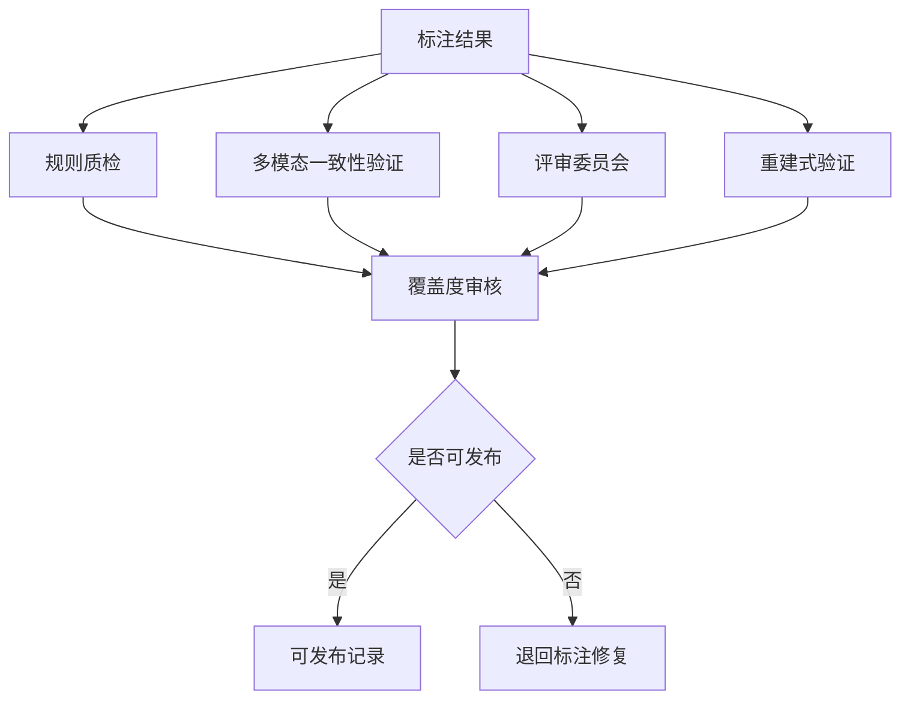

| 节点 | 含义 | 详细解释 |
| --- | --- | --- |
| 标注结果 | 质检输入 | 来自标注阶段的全部结构化对象，包括 `P/T/K/R`、解法族、证据绑定等。 |
| 规则质检 | 结构合法性检查 | 检查字段是否完整、对象引用是否正确、关系是否自洽。 |
| 多模态一致性验证 | 图文与逻辑校验 | 验证图像、文本、知识和答案之间是否一致，必要时做数值或符号回算。 |
| 评审委员会 | 多视角审核 | 从感知、知识、推理三个维度独立审查标注质量，减少单一判断偏差。 |
| 重建式验证 | 反向可解释性检查 | 从 canonical 标注反向重建过程，判断节点粒度和桥梁步骤是否合理。 |
| 覆盖度审核 | 多解覆盖评估 | 检查这道题是否还存在明显漏解，是否已接近覆盖饱和。 |
| 是否可发布 | 质检门控 | 汇总所有质检信号，决定进入发布还是返回修复。 |
| 可发布记录 | 质检通过产物 | 表示该题已经通过发布前审核，可以进入格式化阶段。 |
| 退回标注修复 | 返工出口 | 表示当前题目仍有结构错误、证据不足或覆盖不够，需要回到前面修正。 |

### 2.4.6 质检阶段参与 Agent

| Agent | 做什么 | 输入 | 输出 |
| --- | --- | --- | --- |
| `Rule Check Agent` | 规则与引用质检 | 标注结果 | `qa_records`（质检记录集合） |
| `Multimodal Verifier Agent` | 图文、规则、数值/逻辑一致性验证 | 标注结果 | `verifier_report`（验证器报告） |
| `Perception Judge Agent` | 审核 `P facts` | `p_facts` | judge vote |
| `Knowledge Judge Agent` | 审核 `K atoms` | `k_atoms` | judge vote |
| `Reasoning Judge Agent` | 审核 `R nodes` 与 bindings | `r_nodes`、bindings | judge vote |
| `Reconstruction Agent` | 反向重建解释 | canonical 标注 | `reconstruction_report`（重建报告） |
| `Coverage Auditor Agent` | 审核覆盖是否足够 | 全部标注对象 | `coverage_audit`（覆盖审计报告） |
| `Release Arbiter Agent` | 决定发布或退回 | 全部 QA 信号 | `release_ready_record`（可发布记录） |

---

## 2.5 格式化阶段

### 2.5.1 目标

把通过 QA 的结果整理成稳定、可维护、可增量更新的发布格式。

### 2.5.2 输入

- `release_ready_record`
- 全部结构化 GT 对象
- QA 与 verifier 结果

### 2.5.3 输出

- 发布版主表：正式发布时的题目主记录表
- 子表文件：与主表关联的事实表、节点表、解法表和证据表等结构化子表
- 版本快照：当前发布版本的完整状态记录
- 变更日志：本次发布相比上一版本新增、修改和删除内容的说明
- 索引清单：题目、资源、解法和节点等对象的索引文件集合

### 2.5.4 这一阶段做什么

#### Step F1：对象落表

做什么：
- 把对象分别落到主表与子表

用什么做：
- formatter
- JSONL writer

#### Step F2：索引构建

做什么：
- 构建 problem 索引、solution 索引、asset 索引

用什么做：
- index builder

#### Step F3：派生视图生成

做什么：
- 生成 DAG 依赖视图
- 生成可视化辅助文件

用什么做：
- dependency exporter
- DAG renderer

#### Step F4：版本封装

做什么：
- 输出 version snapshot
- 记录 changelog

用什么做：
- versioning tool
- release packager

### 2.5.5 M3CoT 真多步多模态题自动化流程图

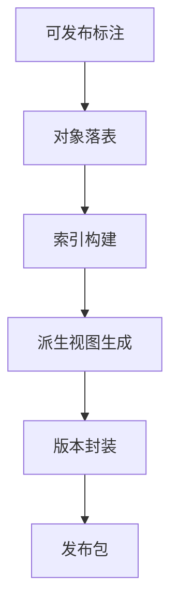

| 节点 | 含义 | 详细解释 |
| --- | --- | --- |
| 可发布标注 | 格式化输入 | 指已经通过 QA 审核、允许正式出库的结构化标注结果。 |
| 对象落表 | 主表子表写出 | 按预定义 schema 把题目、事实、节点、解法、证据等对象分别写入对应数据表。 |
| 索引构建 | 可检索化处理 | 建立题目索引、资源索引、解法索引等，方便后续训练、评测和回流更新。 |
| 派生视图生成 | 辅助表示输出 | 生成 DAG、依赖图或可视化文件，供展示、调试和分析使用。 |
| 版本封装 | 版本化整理 | 生成版本号、变更日志和打包元信息。 |
| 发布包 | 最终产物 | 对外发布或内部使用的数据集版本包。 |

### 2.5.6 格式化阶段参与 Agent

| Agent | 做什么 | 输入 | 输出 |
| --- | --- | --- | --- |
| `Formatter Agent` | 对象落表 | 全部 GT 对象 | JSONL 子表 |
| `Index Builder Agent` | 构建索引 | JSONL 子表 | 索引文件 |
| `Derived View Agent` | 生成 DAG 等派生视图 | `r_nodes`、memberships | 派生视图 |
| `Versioning Agent` | 打包版本与日志 | 发布对象 | 版本快照 |
| `Release Packager Agent` | 生成最终发布包 | 版本对象 | `release_bundle`（发布包） |

---

## 3. Agent 协作方案

## 3.1 总体协作模式

建议采用：

- 任务编排器 `Orchestrator`
- 中间对象存储 `Object Store`
- 队列驱动 `Task Queue`
- 阶段门控 `Stage Gate`

即：

- 每个阶段产出结构化对象
- 下一个阶段只读取对象，不直接读原始自由文本
- 每个阶段都有 gate 决定“通过 / 退回 / 淘汰”

### 3.1.1 协作总图

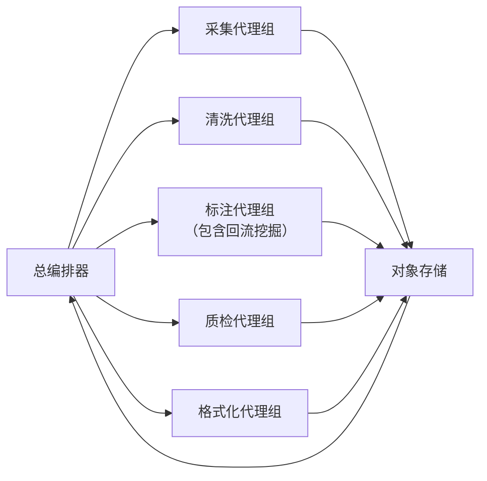

| 节点 | 含义 | 详细解释 |
| --- | --- | --- |
| 总编排器 | 全局调度中心 | 负责任务拆分、阶段调度、状态管理、失败重试和阶段之间的衔接。 |
| 采集代理组 | 采集执行单元 | 负责样本接入、资产登记、初筛评分和候选入池。 |
| 清洗代理组 | 清洗执行单元 | 负责规范化、选择题开放化改写、纯图编号题剔除、图文对齐、可解性检查和保留决策。 |
| 标注代理组（包含回流挖掘） | 标注执行单元 | 负责构建 `P/T/K` 底座、生成候选解法、归纳 `R` 节点、聚类解法并补齐遗漏路径。 |
| 质检代理组 | 审核执行单元 | 负责规则质检、多模态一致性验证、重建式验证和覆盖度审核。 |
| 格式化代理组 | 出库执行单元 | 负责对象落表、索引构建、派生视图生成和版本封装。 |
| 对象存储 | 中间数据中心 | 保存各阶段产生的结构化对象，供后续阶段读取、更新和回写。 |

---

## 3.2 Agent 定义模板

每个 Agent 建议统一按以下字段定义：

- `agent_name`：代理名称，表示该 Agent 的唯一标识
- `stage`：所属阶段，表示该 Agent 位于采集、清洗、标注、质检还是格式化阶段
- `mission`：核心任务，表示该 Agent 负责完成的主要工作
- `input_schema`：输入结构，表示该 Agent 接收的数据对象格式
- `output_schema`：输出结构，表示该 Agent 产出的数据对象格式
- `tools`：可用工具，表示该 Agent 在执行时允许调用的方法、脚本或模型能力
- `decision_rule`：决策规则，表示该 Agent 在分支判断时依据的标准
- `failure_action`：失败处理动作，表示该 Agent 在失败时如何重试、退回或报错
- `handoff_target`：交接目标，表示该 Agent 完成后把结果交给哪个下游 Agent 或阶段

说明：后文凡是在输出位置出现类似 `candidate_problem_record`、`alignment_report`、`solution_library` 这类英文字段，都默认在后面附上中文解释，说明该字段具体表示什么。

这样后续实现时，每个 agent 都可以直接落成独立模块。

---

## 3.3 各阶段 Agent 编排

## 3.3.1 采集阶段 Agent 编排

### 编排逻辑

`Source Intake Agent` → `Asset Registry Agent` → `Potential Scorer Agent` → `Candidate Registrar Agent`

### 协作图

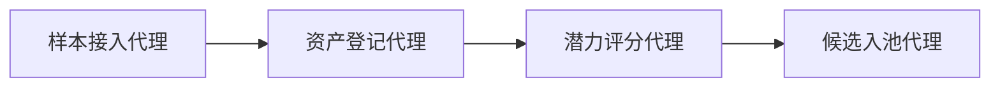

| 节点 | 含义 | 详细解释 |
| --- | --- | --- |
| 样本接入代理 | 采集入口代理 | 负责接收外部题目样本并创建初始题目记录。 |
| 资产登记代理 | 资源登记代理 | 负责登记图像、文本、答案和来源元数据，形成资源清单。 |
| 潜力评分代理 | 初筛评估代理 | 负责判断图像依赖、多步性和过程评测潜力。 |
| 候选入池代理 | 候选写入代理 | 负责把通过初筛的样本写入候选题池。 |

### Agent 定义

| Agent | mission | input_schema | output_schema | decision_rule |
| --- | --- | --- | --- | --- |
| `Source Intake Agent` | 接收原始样本并创建草稿题目记录 | 原始样本包 | `candidate_problem_record`（候选题目记录草稿） | 资产齐全才进入下一步 |
| `Asset Registry Agent` | 统一登记 image、text、answer、metadata | 草稿记录、原始资产 | `raw_asset_bundle`（原始资源包） | 缺核心资产则标红 |
| `Potential Scorer Agent` | 给出图像依赖、多步性、过程评测可行性分数，并判断多解挖掘强度 | 资产清单 | 初始评分（图像依赖、多步性、可评测性三类初始分数） | 如果该数据集以单解题为主，则不要强推多解 agent，只保留基础评分与降优先级处理；只有数据集级或题目级多解潜力足够高时才进入强多解链路 |
| `Candidate Registrar Agent` | 写入候选池 | 候选记录、评分 | 候选池条目（候选样本在候选池中的正式记录） | schema 通过才入池 |

---

## 3.3.2 清洗阶段 Agent 编排

### 编排逻辑

标准主链：`Normalization Agent` → `Question Rewrite Agent` → `Visual Parser Agent` + `Text Context Parser Agent` → `Alignment Agent` → `Solvability Checker Agent` → `Clean Gate Agent`

文本主导轻量支路：`Normalization Agent` → `Question Rewrite Agent` → `Text Context Parser Agent` → `Solvability Checker Agent` → `Clean Gate Agent`

说明：如果题目被判定为文本主导题，则不强制进入 `Visual Parser Agent` 与 `Alignment Agent` 的完整视觉链路；当前版本也明确不把 OCR 矫正作为清洗阶段前置要求。

### 协作图

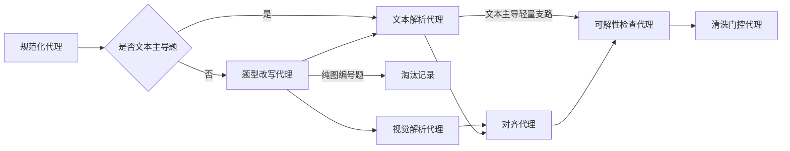

| 节点 | 含义 | 详细解释 |
| --- | --- | --- |
| 规范化代理 | 标准化处理 | 统一单位、图像区域、题面和答案格式，并清理噪声标记；当前版本不把 OCR 矫正作为该代理的工作范围。 |
| 是否文本主导题 | 清洗分流判断 | 判断该题是否主要依赖文字即可完成作答；若是，则进入文本优先的轻量支路。 |
| 题型改写代理 | 开放化改写处理 | 识别选择题类型，把可改写题转成开放问答；对依赖干扰项的概念辨析题执行挖空式改写；纯图编号题直接剔除。 |
| 视觉解析代理 | 图像结构抽取 | 从图像中抽出关键视觉实体、关系和局部区域。 |
| 文本解析代理 | 文本结构抽取 | 从题干中抽出条件、目标、约束以及改写后的开放回答槽位。 |
| 对齐代理 | 图文融合整理 | 对齐视觉结构与文本结构，输出一致性报告和冲突报告；文本主导题可以跳过该完整链路。 |
| 可解性检查代理 | 可评测性检测 | 判断答案是否可验证、是否存在合法多模态推理路径，以及开放化改写后的题面是否目标明确；文本主导题可直接基于文本解析结果进入该步。 |
| 清洗门控代理 | 清洗决策出口 | 根据前面报告决定保留还是淘汰该题。 |
| 淘汰记录 | 清洗剔除出口 | 保存纯图编号题或改写失败题的淘汰原因。 |

### Agent 定义

| Agent | mission | input_schema | output_schema | decision_rule |
| --- | --- | --- | --- | --- |
| `Normalization Agent` | 规范化文本、单位、图像区域、答案格式，并清理 `<image>`、`Choices` 等噪声标记 | 原始资产 | `normalized_assets`（标准化资源包） | 规范化失败则退回修复；当前版本明确不做 OCR 矫正或复杂文字修复 |
| `Question Rewrite Agent` | 识别选择题并改写成开放问答，必要时拆成多道子题；纯图编号题直接剔除 | 标准化文本、答案、选项 | `rewrite_report`（题型改写报告）、`open_ended_problem_variants`（开放问答版本集合） | 纯图编号题直接淘汰；改写目标不明确则退回复核 |
| `Visual Parser Agent` | 解析图像中的关键视觉实体与关系 | 标准化图像 | visual structure（视觉结构表示） | 仅在题目被判定为视觉必要时强制调用；文本主导题可跳过 |
| `Text Context Parser Agent` | 解析题干中的条件、目标与开放回答槽位 | 标准化文本、改写后题面 | text structure（文本结构表示） | 解析失败则退回修复 |
| `Alignment Agent` | 对齐图像与文本 | visual structure、text structure | `alignment_report`（对齐报告） | 冲突过多则淘汰；文本主导题允许不经过完整图文对齐链 |
| `Solvability Checker Agent` | 可解性、答案验证与改写质量检查 | 清洗后样本、开放题版本 | `solvability_report`（可解性报告） | 不可验证或改写后不可答则淘汰；文本主导题可按轻量支路直接进入该步 |
| `Clean Gate Agent` | 通过 / 淘汰 | 全部清洗报告、改写报告 | `clean_pool_entry`（清洗池条目）或 `reject_log`（淘汰日志） | 满足清洗阈值且改写质量通过才保留 |

---

## 3.3.3 标注阶段 Agent 编排

### 编排逻辑

`Perception Extraction Agent` + `Text Condition Agent` + `Knowledge Librarian Agent` → `Solver Ensemble Agent` → `Claim Extraction Agent` → `Node Induction Agent` → `Solution Grouper Agent` → `Evidence Binder Agent` → `Coverage Hunter Agent` → `Trace Collector Agent` → `Trace Mapper Agent` → `Novelty Detector Agent` → `Feedback Judge Agent` → `Patch Writer Agent`

### 协作图

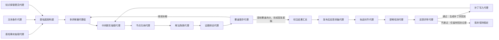

| 节点 | 含义 | 详细解释 |
| --- | --- | --- |
| 感知事实抽取代理 | P 层构建入口 | 从图像中抽取客观视觉事实，供后续推理使用。 |
| 文本条件代理 | T 层构建入口 | 从题干中抽取条件、目标和限制。 |
| 知识库管理员代理 | K 层构建入口 | 枚举题目可能调用的知识原子并维护知识覆盖状态。 |
| 多求解器代理组 | 多路径解法生成中心 | 用多模型、多角色和多提示词生成大量候选解法。 |
| 中间断言抽取代理 | claim 切分模块 | 把自然语言推理拆成单步断言。 |
| 节点归纳代理 | R 节点构建模块 | 把 claim 做归一化、等价归并和类型标注。 |
| 解法聚类代理 | solution 整理模块 | 将不同 trace 归并成解法族，并提取方法签名与最小必要集。 |
| 证据绑定代理 | 支撑链生成模块 | 为关键节点绑定图像、文本、知识和前驱支撑。 |
| 覆盖猎手代理 | 主动补解模块 | 扫描是否仍存在未覆盖知识、未覆盖路径和未覆盖解法。 |
| 标注结果汇总 | 首发底稿汇总模块 | 汇总 A1-A6 产生的高覆盖度标注结果，形成可进入质检与首发流程的版本底稿。 |
| 发布后反馈采集代理 | 发布后回流入口模块 | 收集数据集发布后新参评模型的答案、轨迹和运行元数据。 |
| 轨迹对齐代理 | 已有解映射模块 | 将回流输出与现有节点库、解法库做对齐和命中率计算。 |
| 新解检测代理 | 新路径验证模块 | 判断低命中且答案正确的输出是否是新解，并提取需要回写的新节点。 |
| 反馈评审代理 | 回流审核模块 | 审核候选新路径是否图文一致、逻辑合法且值得写回主库。 |
| 补丁写入代理 | 增量回写模块 | 将审核通过的新节点、新解法写成结构化补丁，供下个版本合并。 |

### Agent 定义

| Agent | mission | input_schema | output_schema | decision_rule |
| --- | --- | --- | --- | --- |
| `Perception Extraction Agent` | 建立 `P facts` | diagram、alignment | `p_facts`（感知事实集合） | 必须能 grounding |
| `Text Condition Agent` | 建立 `T facts` | 题干文本 | `t_facts`（题干条件集合） | condition type 必须明确 |
| `Knowledge Librarian Agent` | 建立 `K atoms` | 结构、题干、已有解法 | `k_atoms`（知识原子集合） | 既要记 used，也要记 plausible |
| `Solver Ensemble Agent` | 生成多样化解法 | `P/T/K`、题目 | `cot_variants`（推理文本变体集合） | 必须覆盖多种方法提示 |
| `Claim Extraction Agent` | 抽取 claim 序列 | CoT | claims（断言序列） | 只保留可判定 claim |
| `Node Induction Agent` | 形成 canonical `R nodes` | claims | `r_nodes`（中间推理节点集合） | 节点要可归并、可对齐 |
| `Solution Grouper Agent` | 聚成 solution family | `r_nodes`、traces | `solution_library`（解法库） | 依据 minimal set 和 method signature |
| `Evidence Binder Agent` | 建立证据绑定 | `P/T/K/R` | `evidence_bindings`（证据绑定集合） | 关键节点必须有支撑 |
| `Coverage Hunter Agent` | 搜索遗漏方法 | 当前 solution 库 | 新路径候选（补充解法候选） | 直到 A2 的多种方法都不再产生有效新解 |
| `Trace Collector Agent` | 收集发布后回流输出 | 新参评模型答案、轨迹、运行元数据 | `feedback_record`（回流记录） | 原始输出必须完整保存 |
| `Trace Mapper Agent` | 对回流 Trace 做对齐与算命中率 | 回流 Trace、`solution_library`、节点库 | `alignment_result`（轨迹对齐结果） | 只有答案正确且低命中的路径才进入新解候选 |
| `Novelty Detector Agent` | 检测潜在新桥梁、新知识、新 solution | `alignment_result`、Trace | `novelty_report`（新颖性报告） | 低命中不等于新解 |
| `Feedback Judge Agent` | 审核回流路径是否合法 | `novelty_report`、验证结果 | 回流审核结论 | 必须同时满足答案正确、验证通过、逻辑合法 |
| `Patch Writer Agent` | 生成版本化增量 patch | 审核通过样本 | `dataset_patch`（数据集补丁） | 只写结构化 canonical 版本 |

---

## 3.3.4 质检阶段 Agent 编排

### 编排逻辑

`Rule Check Agent` + `Multimodal Verifier Agent` + `Judge Committee` + `Reconstruction Agent` → `Coverage Auditor Agent` → `Release Arbiter Agent`

### 协作图

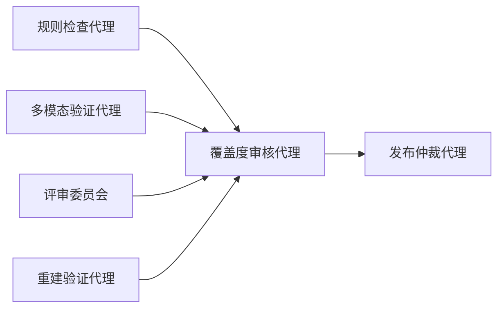

| 节点 | 含义 | 详细解释 |
| --- | --- | --- |
| 规则检查代理 | 结构审查模块 | 检查字段、引用、关系和对象表结构是否合法。 |
| 多模态验证代理 | 一致性审查模块 | 检查图文、知识、答案和逻辑之间的一致性。 |
| 评审委员会 | 多视角人工智能审查模块 | 由多个 judge 共同判断感知真实性、知识适用性和推理可靠性。 |
| 重建验证代理 | 可重建性审查模块 | 检查当前标注能否反向重建出清晰合理的解释路径。 |
| 覆盖度审核代理 | 覆盖饱和判断模块 | 汇总所有 QA 信号，判断是否仍需继续补解。 |
| 发布仲裁代理 | 最终发布决策模块 | 决定该题是进入发布集还是退回修复。 |

### Agent 定义

| Agent | mission | input_schema | output_schema | decision_rule |
| --- | --- | --- | --- | --- |
| `Rule Check Agent` | 做结构和字段合法性检查 | 标注对象 | `qa_records`（质检记录集合） | 不通过则退回修复 |
| `Multimodal Verifier Agent` | 做图文一致性和数值/逻辑验证 | 标注对象 | `verifier_report`（验证器报告） | 关键一致性失败则不发布 |
| `Perception Judge Agent` | 审核 P | `p_facts` | judge vote（感知评审投票结果） | grounding 不足则否决 |
| `Knowledge Judge Agent` | 审核 K | `k_atoms` | judge vote（知识评审投票结果） | 不合法知识则否决 |
| `Reasoning Judge Agent` | 审核 R 和 bindings | `r_nodes`、bindings | judge vote（推理评审投票结果） | 关键桥梁无支撑则否决 |
| `Reconstruction Agent` | 做重建式验证 | canonical 标注 | reconstruction report（重建报告） | 重建失败则退回调整粒度 |
| `Coverage Auditor Agent` | 判断覆盖是否足够 | 全部 QA 信号 | `coverage_audit`（覆盖审计报告） | 仍可显著补解则不发布 |
| `Release Arbiter Agent` | 决定发布或退回 | QA 汇总 | `release_ready_record`（可发布记录） | 只有全部达标才放行 |

---

## 3.3.5 格式化阶段 Agent 编排

### 编排逻辑

`Formatter Agent` → `Index Builder Agent` → `Derived View Agent` → `Versioning Agent` → `Release Packager Agent`

### 协作图

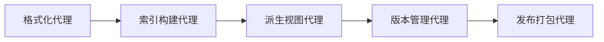

| 节点 | 含义 | 详细解释 |
| --- | --- | --- |
| 格式化代理 | 对象落表模块 | 把通过 QA 的结构化对象写成正式数据表。 |
| 索引构建代理 | 索引生成模块 | 生成题目、资源、解法和节点等索引。 |
| 派生视图代理 | 辅助视图模块 | 生成 DAG、依赖图和可视化辅助文件。 |
| 版本管理代理 | 版本控制模块 | 负责版本号、变更日志和快照管理。 |
| 发布打包代理 | 发布输出模块 | 将当前版本封装成最终发布包。 |

### Agent 定义

| Agent | mission | input_schema | output_schema | decision_rule |
| --- | --- | --- | --- | --- |
| `Formatter Agent` | 把对象写成主表和子表 | 发布候选对象 | JSONL 表（结构化子表文件） | schema 不通过不能写出 |
| `Index Builder Agent` | 构建索引 | JSONL 表 | 索引文件（索引清单） | problem / solution / asset 必须可索引 |
| `Derived View Agent` | 生成派生视图 | `r_nodes` 等 | DAG 等视图（派生视图文件） | 只生成辅助视图，不影响主 GT |
| `Versioning Agent` | 生成版本快照 | 发布对象 | 版本对象（版本快照与版本元数据） | 每次发布必须留 changelog |
| `Release Packager Agent` | 打包发布 | 版本对象 | release bundle（发布包） | 校验通过才打包 |

---

## 3.3.6 发布后回流阶段 Agent 编排

### 编排逻辑

`Trace Collector Agent` → `Trace Mapper Agent` → `Novelty Detector Agent` → `Feedback Judge Agent` → `Patch Writer Agent` → `Versioning Agent`

### 协作图

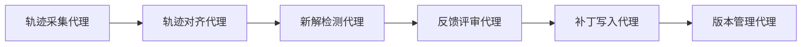

| 节点 | 含义 | 详细解释 |
| --- | --- | --- |
| 轨迹采集代理 | 发布后回流入口模块 | 收集数据集发布后，新发布或新参加测评模型的答案、推理轨迹和运行元数据。 |
| 轨迹对齐代理 | 已有解映射模块 | 将新轨迹映射到现有节点库和解法库，计算中间节点命中率与解法覆盖情况。 |
| 新解检测代理 | 新颖性分析模块 | 判断当前轨迹是旧解变体、节点增补，还是潜在新解。 |
| 反馈评审代理 | 回流审核模块 | 审核“答案正确但低命中”的路径是否真的合法，防止把幻觉写回主库。 |
| 补丁写入代理 | 增量更新模块 | 把通过审核的新节点、新解法或新知识写成结构化 patch。 |
| 版本管理代理 | 回流版本更新模块 | 将 patch 合并到正式版本，并生成新的版本快照和日志。 |

### Agent 定义

| Agent | mission | input_schema | output_schema | decision_rule |
| --- | --- | --- | --- | --- |
| `Trace Collector Agent` | 收集发布后回流输出 | 新参评模型输出、运行元数据 | `feedback_record`（回流记录） | trace / answer / 元数据必须尽量完整保存 |
| `Trace Mapper Agent` | 映射已有节点和 solution，并计算命中率 | trace、现有数据集、节点库、solution 库 | `alignment_result`（对齐结果） | 先判已有解，再筛答案正确且低命中的候选 |
| `Novelty Detector Agent` | 检测新桥梁、新知识、新 solution | `alignment_result`、trace | `novelty_report`（新颖性报告） | 低命中不等于新解 |
| `Feedback Judge Agent` | 判断新路径是否合法且值得回写 | 新解候选、验证结果 | 审核结论（回流审核结果） | 必须同时满足答案正确、验证通过、逻辑自洽 |
| `Patch Writer Agent` | 生成增量 patch | 审核通过样本 | `dataset_patch`（数据集补丁） | 只写结构化 canonical 版本 |
| `Versioning Agent` | 合并 patch 并升级版本 | patch | 新版本（更新后的版本快照） | 所有回流更新都走版本化写回 |

---
