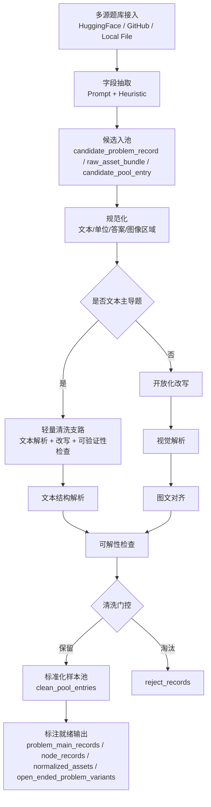

# benchmarkallinone

`benchmarkallinone` 是对 `benchmark/` 与 `agent-pipeline-main/` 两套实现进行功能对齐、优势融合后的统一工程，目标是把大规模数据采集与清洗稳定跑通，并把输出直接组织成可进入标注阶段的结构化结果。

## 统一流程图



## 融合策略

### 保留自 `benchmark/` 的能力
- 更完整的清洗主链：规范化、开放化改写、文本主导分流、视觉解析、图文对齐、可解性检查、门控决策。
- 更丰富的结构化输出：`candidate_problem_records`、`raw_asset_bundles`、`clean_problem_records`、`normalized_assets`、`text_structure_records`、`visual_structure_records`、`solvability_reports`、`node_records` 等。
- 更贴近 `pipeline初步设计.md` 的采集→清洗→标注前就绪目标。

### 融合自 `agent-pipeline-main/` 的能力
- Prompt 驱动字段抽取，增强不同数据源字段映射稳定性。
- `local_file` 连接器，支持本地 `json/jsonl/csv/tsv/parquet` 数据直连。
- Hugging Face 原始文件兜底：补上 `MM_Math` 原始压缩包与 `PhysReason` zip 结构的回退采集能力。
- 更适合大规模远程数据源的多入口采集方式。

## 项目结构

```text
benchmarkallinone/
├── configs/
│   ├── default_multidataset.yaml
│   └── local_file_example.yaml
├── prompts/
│   ├── extract_unified_sample.md
│   ├── extract_question_answer_image.md
│   └── collection/
├── run_pipeline.py
├── requirements.txt
└── src/benchmarkallinone/
    ├── __init__.py
    ├── __main__.py
    ├── cleaning_semantics.py
    ├── pipeline.py
    └── semantics.py
```

其中 `outputs/` 是运行时生成目录，不属于后续合并到 `main` 的源码主体；为降低 merge 噪音，当前分支不再保留该目录，并通过 `benchmarkallinone/.gitignore` 忽略。

## 合并到 `main` 的建议方式

当前 `ler` 分支采用“独立子工程”布局：
- 把新实现完整保留在 `benchmarkallinone/` 内，避免直接覆盖 `main` 里已有的根目录入口与历史结构。
- `plans/` 继续保留设计文档，作为后续 merge / review 时的对照依据。
- `outputs/`、`__pycache__/`、临时报告产物不再纳入版本控制，减少无关文件对 merge 的干扰。

如果后续要合并到 `main`，建议按以下顺序进行：
1. 第一阶段先整体合入 `benchmarkallinone/` 与 `plans/`，不要立即改写 `main` 现有根目录 `run_pipeline.py`、`configs/`、`prompts/`、`benchmark/src/`。
2. 第二阶段再按模块比较，把 `benchmarkallinone/src/benchmarkallinone/pipeline.py` 中需要保留的能力逐步迁移或替换到 `main` 的正式入口。
3. 所有运行产物继续放在本地生成，不作为 merge 的一部分提交。

这样可以把“代码合并”与“结构替换”拆成两个动作，显著降低冲突面。

## 运行方式

### 1. 安装依赖
```bash
python3 -m pip install -r benchmarkallinone/requirements.txt
```

### 2. 配置模型访问
默认从环境变量读取 `OPENAI_API_KEY`。如仅使用启发式抽取，可把配置中的 `enabled` 设为 `false`。

### 3. 运行默认多数据集流程
```bash
python3 benchmarkallinone/run_pipeline.py --config benchmarkallinone/configs/default_multidataset.yaml
```

### 4. 运行本地文件示例
```bash
python3 benchmarkallinone/run_pipeline.py --config benchmarkallinone/configs/local_file_example.yaml
```

## 标注前就绪输出

运行完成后，每个数据集目录下会生成：
- `candidate_problem_records.jsonl`
- `raw_asset_bundles.jsonl`
- `clean_pool_entries.jsonl`
- `clean_problem_records.jsonl`
- `normalized_assets.jsonl`
- `text_structure_records.jsonl`
- `visual_structure_records.jsonl`
- `solvability_reports.jsonl`
- `node_records.jsonl`
- `open_ended_problem_variants.jsonl`
- `problem_main_records.jsonl`
- `reject_records.jsonl`

这些文件已经覆盖标注前输入所需的核心结构，可直接作为后续标注阶段的数据底座。

## 当前完成与未完成

### 已完成
- 多源采集统一入口。
- 清洗主链与文本主导轻量支路。
- 选择题开放化改写、纯图编号题剔除。
- 图像质量分析、视觉结构抽取、文本结构抽取、图文对齐、可解性检查。
- 标注前就绪的结构化输出。

### 尚未完成
- 文档中完整的标注阶段（`P/T/K/R/S/A/B` 全量构建、解法族聚类、回流补丁）。
- 独立的 QA / Format / 发布后回流模块。
- 更细粒度的 source-specific 阈值调参与评测报告自动汇总。

当前工程已经满足“大规模数据采集与清洗 + 输出直接进入标注阶段”这一目标，后续可以在此基础上继续扩展标注、质检与格式化发布链路。
