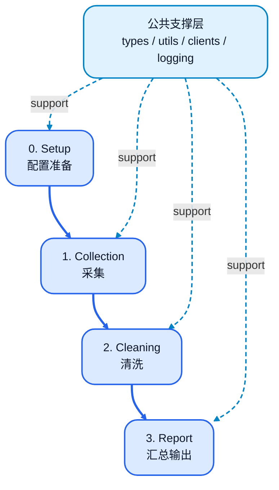
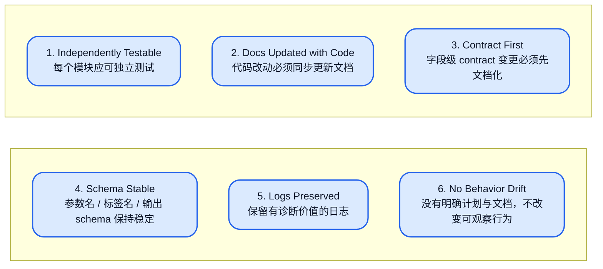

# qjb 四阶段正式版流程图（A版）

## 1. Mermaid 总览图（严格对齐版）



### 图中各阶段含义

| 阶段 | 主要内容 | 对应模块 |
|---|---|---|
| 0. Setup | 参数加载（Config Load）<br>参数校验（Validation）<br>运行初始化（Run Initialization） | `pipeline_setup.py` |
| 1. Collection | 数据接入（Ingestion）<br>预处理（Preprocess）<br>信息提取（Extract）<br>初始评分 / 候选入池（Scoring / Pooling） | `pipeline_collection.py`<br>`pipeline_extraction.py` |
| 2. Cleaning | 规范化（Normalization）<br>结构 / 对齐 / 可解性分析（Semantics）<br>改写 / 转换（Rewrite / Transform）<br>判定 / 打分（Gate / Scoring） | `pipeline_normalization.py`<br>`cleaning_semantics.py`<br>`pipeline_rewrite.py`<br>`pipeline_cleaning.py` |
| 3. Report | records 写出<br>dataset summary<br>run summary<br>sample bundles / artifacts | `pipeline_reporting.py` |
| 公共支撑层 | 贯穿 0~3 全阶段的共享基础设施 | `pipeline_types.py`<br>`pipeline_utils.py`<br>`pipeline_clients.py`<br>`pipeline_logging.py` |

---

## 2. 纯文本备用版

```text
┌──────────────────────────────────────────────────────────────────────┐
│ 0. 配置准备（Setup）                                                │
│                                                                      │
│  0.1 参数加载（Config Load）                                        │
│  0.2 参数校验（Validation）                                         │
│  0.3 运行初始化（Run Initialization）                               │
│                                                                      │
│  模块：pipeline_setup.py                                             │
└──────────────────────────────────────────────────────────────────────┘
                                   │
                                   ▼
┌──────────────────────────────────────────────────────────────────────┐
│ 1. 采集（Collection）                                               │
│                                                                      │
│  1.1 数据接入（Ingestion）                                          │
│  1.2 预处理（Preprocess）                                           │
│  1.3 信息提取（Extract）                                            │
│  1.4 初始评分 / 候选入池（Scoring / Pooling）                       │
│                                                                      │
│  模块：pipeline_collection.py / pipeline_extraction.py              │
└──────────────────────────────────────────────────────────────────────┘
                                   │
                                   ▼
┌──────────────────────────────────────────────────────────────────────┐
│ 2. 清洗（Cleaning）                                                 │
│                                                                      │
│  2.1 规范化（Normalization）                                        │
│  2.2 结构 / 对齐 / 可解性分析（Semantics）                          │
│  2.3 改写 / 转换（Rewrite / Transform）                             │
│  2.4 判定 / 打分（Gate / Scoring）                                  │
│                                                                      │
│  模块：pipeline_normalization.py                                    │
│       cleaning_semantics.py                                         │
│       pipeline_rewrite.py                                           │
│       pipeline_cleaning.py                                          │
└──────────────────────────────────────────────────────────────────────┘
                                   │
                                   ▼
┌──────────────────────────────────────────────────────────────────────┐
│ 3. 汇总输出（Report）                                               │
│                                                                      │
│  3.1 records 写出                                                   │
│  3.2 dataset summary                                                │
│  3.3 run summary                                                    │
│  3.4 sample bundles / artifacts                                     │
│                                                                      │
│  模块：pipeline_reporting.py                                        │
└──────────────────────────────────────────────────────────────────────┘

────────────────────────────────────────────────────────────────────────
公共支撑层（贯穿 0~3 全阶段）
- pipeline_types.py
- pipeline_utils.py
- pipeline_clients.py
- pipeline_logging.py
────────────────────────────────────────────────────────────────────────
```

---

## 3. 职责边界（四卡片版文案）

### 卡片 1｜Setup

**负责**
- 配置加载与合并
- CLI 参数覆盖
- 参数校验
- 运行初始化
- runtime context 建立

**不负责**
- 样本接入
- 语义分析
- rewrite / gate
- summary 写出

---

### 卡片 2｜Collection

**负责**
- 样本接入
- 资产登记
- 基本完整性检查
- 来源整理
- 稳定 ID 生成
- 初始评分 / 候选入池

**不负责**
- 深层语义纠错
- 最终答案裁决
- 最终 pass / review / reject
- 解题过程标注 / 多解法建模

---

### 卡片 3｜Cleaning

**负责**
- 文本规范化
- 字段标准化映射
- 图像质量判断
- 图文对齐
- rewrite / transform
- gate 决策

**不负责**
- 穷举全部解法
- 构建完整推理图
- 发布版数据切片

---

### 卡片 4｜Report

**负责**
- dataset bundle 累积
- dataset summary
- run summary
- records JSONL 写出
- 持久化产物整理

**不负责**
- 参数组装与运行初始化
- 样本接入与候选入池
- rewrite / gate 决策
- 语义清洗规则执行

---

## 4. 全局稳定约束图



> 模块可以继续拆分，但 schema、日志、行为和契约不能随意漂移。

---

## 5. 最适合放进 PPT 的一句话总结

> 这套 pipeline 的正式口径是 Setup、Collection、Cleaning、Report 四大阶段；Collection 负责接入与候选入池，Cleaning 负责规范化、改写与 gate，Report 负责聚合写出，而 types / utils / clients / logging 作为公共支撑层贯穿全流程，并受到稳定契约约束。
