# Geometry3K：20 条采集清洗逐样本报告

- pipeline_run_id：`run_f2958f3118292117`
- 数据集 key：`geometry3k`
- processed_samples：`20` / requested `20`
- 决策计数：`pass=2`，`review=1`，`reject=17`
- 改写策略计数：`{"blank_open": 10, "keep_open": 10}`
- 对齐状态计数：`bad:17, good:3`
- 高频原因码：`missing_grounded_visual_path:17, text_image_misaligned:17, answer_not_verifiable:10, missing_answer:10, missing_core_field:10, missing_core_image:10, rewrite_variant_invalid:10, target_underspecified:10`
- 占位符题面（`text/bar`）样本数：`10`
- 文本主导样本数：`0`

## 01. prob_0b8c4f4f2f5237b2c8444c67

- 样本文件：[benchmarkallinone/outputs/report_priority_20/run_f2958f3118292117/datasets/geometry3k/samples/prob_0b8c4f4f2f5237b2c8444c67.json](../../datasets/geometry3k/samples/prob_0b8c4f4f2f5237b2c8444c67.json)
- 源数据集：`Geometry3K`
- 源 split：`repo_discovered`
- 源题目 ID：`16`
- 清洗路径：`multimodal_full`
- 是否文本主导：`False`
- 是否依赖图像：`True`
- 决策：`reject`
- 决策原因码：`answer_not_verifiable, missing_answer, missing_core_field, missing_core_image, missing_grounded_visual_path, rewrite_variant_invalid, target_underspecified, text_image_misaligned`
- 开放化改写策略：`keep_open`
- 对齐状态：`bad`
- 可解性分数：`0.18`
- 可解性提示：`reject`
- 质量风险标记：`low_text_completeness, missing_answer, missing_core_image`

### 采集阶段信号

```json
{
  "core_asset_completeness": {
    "has_question_text": true,
    "has_answer_text": false,
    "image_count": 0,
    "has_multiple_images": false
  },
  "initial_scores": {
    "initial_image_dependency_score": 0.9,
    "initial_multi_solution_score": 0.46,
    "initial_verifiability_score": 0.2
  }
}
```

### 1) 处理前：原始题目 / 原始答案

**原始题目**

```text
text
```

**原始答案**

```text

```

### 2) 处理后：规范化题目 / 规范化答案

**规范化题目**

```text
text
```

**规范化答案**

```text

```

### 3) 开放化改写前后

**改写前（使用规范化题目作为输入）**

```text
text
```

**改写后（开放题变体）**

```text
text
```

- 期望答案类型：`unknown`
- 期望答案：``
- 改写 rationale：`Question is already open-ended.`
- 丢弃原因码：`无`

### 4) 图像与可视化产物

- 原始图像来源：无
- 持久化主图：无
- ROI 裁剪图：无

### 5) 清洗判定证据

```json
{
  "clean_score": 0.379,
  "decision": "reject",
  "decision_reason_codes": [
    "answer_not_verifiable",
    "missing_answer",
    "missing_core_field",
    "missing_core_image",
    "missing_grounded_visual_path",
    "rewrite_variant_invalid",
    "target_underspecified",
    "text_image_misaligned"
  ],
  "alignment_summary": {
    "alignment_id": "align_01208026c0344d08f0fdfb0e",
    "coverage_score": 0.18,
    "consistency_score": 0.0,
    "alignment_status": "bad",
    "conflict_count": 2
  },
  "solvability_summary": {
    "solvability_id": "solv_prob_0b8c4f4f2f5237b2c8444c67",
    "solvability_score": 0.18,
    "reasoning_path_exists": false,
    "decision_hint": "reject",
    "failure_codes": [
      "answer_not_verifiable",
      "target_underspecified",
      "rewrite_variant_invalid",
      "missing_grounded_visual_path",
      "missing_core_field"
    ]
  },
  "missing_field_summary": {
    "missing_question_text": false,
    "missing_answer_text": true,
    "missing_image_count": 1
  },
  "risk_flags": [
    "low_text_completeness",
    "missing_answer",
    "missing_core_image"
  ],
  "reject_record": {
    "reject_id": "reject_01208026c0344d08f0fdfb0e",
    "problem_id": "prob_0b8c4f4f2f5237b2c8444c67",
    "stage": "cleaning",
    "reject_level": "problem",
    "reject_reason_codes": [
      "answer_not_verifiable",
      "missing_answer",
      "missing_core_field",
      "missing_core_image",
      "missing_grounded_visual_path",
      "rewrite_variant_invalid",
      "target_underspecified",
      "text_image_misaligned"
    ],
    "reject_reason_detail": "Question is already open-ended.",
    "blocking_fields": [
      "low_text_completeness",
      "missing_answer",
      "missing_core_image"
    ],
    "evidence_refs": [
      "align_01208026c0344d08f0fdfb0e",
      "solv_prob_0b8c4f4f2f5237b2c8444c67"
    ],
    "recoverable": false,
    "recommended_action": "drop",
    "reviewed_by": null,
    "created_at": "2026-03-25T08:47:19Z"
  }
}
```

---

## 02. prob_26afcd1ea78dbf16787ce296

- 样本文件：[benchmarkallinone/outputs/report_priority_20/run_f2958f3118292117/datasets/geometry3k/samples/prob_26afcd1ea78dbf16787ce296.json](../../datasets/geometry3k/samples/prob_26afcd1ea78dbf16787ce296.json)
- 源数据集：`Geometry3K`
- 源 split：`repo_discovered`
- 源题目 ID：`12`
- 清洗路径：`multimodal_full`
- 是否文本主导：`False`
- 是否依赖图像：`True`
- 决策：`reject`
- 决策原因码：`answer_not_verifiable, missing_answer, missing_core_field, missing_core_image, missing_grounded_visual_path, rewrite_variant_invalid, target_underspecified, text_image_misaligned`
- 开放化改写策略：`keep_open`
- 对齐状态：`bad`
- 可解性分数：`0.18`
- 可解性提示：`reject`
- 质量风险标记：`low_text_completeness, missing_answer, missing_core_image`

### 采集阶段信号

```json
{
  "core_asset_completeness": {
    "has_question_text": true,
    "has_answer_text": false,
    "image_count": 0,
    "has_multiple_images": false
  },
  "initial_scores": {
    "initial_image_dependency_score": 0.9,
    "initial_multi_solution_score": 0.46,
    "initial_verifiability_score": 0.2
  }
}
```

### 1) 处理前：原始题目 / 原始答案

**原始题目**

```text
text
```

**原始答案**

```text

```

### 2) 处理后：规范化题目 / 规范化答案

**规范化题目**

```text
text
```

**规范化答案**

```text

```

### 3) 开放化改写前后

**改写前（使用规范化题目作为输入）**

```text
text
```

**改写后（开放题变体）**

```text
text
```

- 期望答案类型：`unknown`
- 期望答案：``
- 改写 rationale：`Question is already open-ended.`
- 丢弃原因码：`无`

### 4) 图像与可视化产物

- 原始图像来源：无
- 持久化主图：无
- ROI 裁剪图：无

### 5) 清洗判定证据

```json
{
  "clean_score": 0.379,
  "decision": "reject",
  "decision_reason_codes": [
    "answer_not_verifiable",
    "missing_answer",
    "missing_core_field",
    "missing_core_image",
    "missing_grounded_visual_path",
    "rewrite_variant_invalid",
    "target_underspecified",
    "text_image_misaligned"
  ],
  "alignment_summary": {
    "alignment_id": "align_642d6e14efcfad9f8ae32255",
    "coverage_score": 0.18,
    "consistency_score": 0.0,
    "alignment_status": "bad",
    "conflict_count": 2
  },
  "solvability_summary": {
    "solvability_id": "solv_prob_26afcd1ea78dbf16787ce296",
    "solvability_score": 0.18,
    "reasoning_path_exists": false,
    "decision_hint": "reject",
    "failure_codes": [
      "answer_not_verifiable",
      "target_underspecified",
      "rewrite_variant_invalid",
      "missing_grounded_visual_path",
      "missing_core_field"
    ]
  },
  "missing_field_summary": {
    "missing_question_text": false,
    "missing_answer_text": true,
    "missing_image_count": 1
  },
  "risk_flags": [
    "low_text_completeness",
    "missing_answer",
    "missing_core_image"
  ],
  "reject_record": {
    "reject_id": "reject_642d6e14efcfad9f8ae32255",
    "problem_id": "prob_26afcd1ea78dbf16787ce296",
    "stage": "cleaning",
    "reject_level": "problem",
    "reject_reason_codes": [
      "answer_not_verifiable",
      "missing_answer",
      "missing_core_field",
      "missing_core_image",
      "missing_grounded_visual_path",
      "rewrite_variant_invalid",
      "target_underspecified",
      "text_image_misaligned"
    ],
    "reject_reason_detail": "Question is already open-ended.",
    "blocking_fields": [
      "low_text_completeness",
      "missing_answer",
      "missing_core_image"
    ],
    "evidence_refs": [
      "align_642d6e14efcfad9f8ae32255",
      "solv_prob_26afcd1ea78dbf16787ce296"
    ],
    "recoverable": false,
    "recommended_action": "drop",
    "reviewed_by": null,
    "created_at": "2026-03-25T08:47:19Z"
  }
}
```

---

## 03. prob_2c352c4c39e9e1f9efa361b3

- 样本文件：[benchmarkallinone/outputs/report_priority_20/run_f2958f3118292117/datasets/geometry3k/samples/prob_2c352c4c39e9e1f9efa361b3.json](../../datasets/geometry3k/samples/prob_2c352c4c39e9e1f9efa361b3.json)
- 源数据集：`Geometry3K`
- 源 split：`repo_discovered`
- 源题目 ID：`19`
- 清洗路径：`multimodal_full`
- 是否文本主导：`False`
- 是否依赖图像：`True`
- 决策：`reject`
- 决策原因码：`missing_grounded_visual_path, text_image_misaligned`
- 开放化改写策略：`blank_open`
- 对齐状态：`bad`
- 可解性分数：`0.8`
- 可解性提示：`reject`
- 质量风险标记：`low_text_completeness`

### 采集阶段信号

```json
{
  "core_asset_completeness": {
    "has_question_text": true,
    "has_answer_text": true,
    "image_count": 3,
    "has_multiple_images": true
  },
  "initial_scores": {
    "initial_image_dependency_score": 0.9,
    "initial_multi_solution_score": 0.52,
    "initial_verifiability_score": 0.718
  }
}
```

### 1) 处理前：原始题目 / 原始答案

**原始题目**

```text
Find \sin x.
```

**原始答案**

```text
\frac { 2 \sqrt { 2 } } { 5 }
```

### 2) 处理后：规范化题目 / 规范化答案

**规范化题目**

```text
Find \sin x.
```

**规范化答案**

```text
\frac { 2 \sqrt { 2 } } { 5 }
```

### 3) 开放化改写前后

**改写前（使用规范化题目作为输入）**

```text
Find \sin x.
```

**改写后（开放题变体）**

```text
Find \sin x.
```

- 期望答案类型：`text`
- 期望答案：`\frac { 2 \sqrt { 2 } } { 5 }`
- 改写 rationale：`Converted multiple choice into blank-style open-ended question.`
- 丢弃原因码：`无`

### 4) 图像与可视化产物

- 原始图像来源：[benchmark/outputs/repo_cache/geometry3k/annotation_tool/data_collection/data_examples/19/img_diagram.png](../../../../../../benchmark/outputs/repo_cache/geometry3k/annotation_tool/data_collection/data_examples/19/img_diagram.png)
- 持久化主图：[benchmarkallinone/outputs/report_priority_20/run_f2958f3118292117/datasets/geometry3k/artifacts/images/prob_2c352c4c39e9e1f9efa361b3_primary.png](../../datasets/geometry3k/artifacts/images/prob_2c352c4c39e9e1f9efa361b3_primary.png)

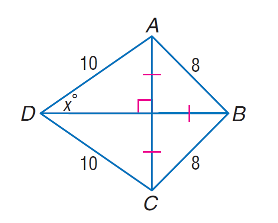
- ROI 裁剪图：[benchmarkallinone/outputs/report_priority_20/run_f2958f3118292117/datasets/geometry3k/artifacts/crops/prob_2c352c4c39e9e1f9efa361b3_primary_roi.png](../../datasets/geometry3k/artifacts/crops/prob_2c352c4c39e9e1f9efa361b3_primary_roi.png)

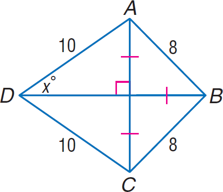

### 5) 清洗判定证据

```json
{
  "clean_score": 0.7001,
  "decision": "reject",
  "decision_reason_codes": [
    "missing_grounded_visual_path",
    "text_image_misaligned"
  ],
  "alignment_summary": {
    "alignment_id": "align_b27d8fc271853a97e92d9718",
    "coverage_score": 0.18,
    "consistency_score": 0.1,
    "alignment_status": "bad",
    "conflict_count": 1
  },
  "solvability_summary": {
    "solvability_id": "solv_prob_2c352c4c39e9e1f9efa361b3",
    "solvability_score": 0.8,
    "reasoning_path_exists": false,
    "decision_hint": "reject",
    "failure_codes": [
      "missing_grounded_visual_path"
    ]
  },
  "missing_field_summary": {
    "missing_question_text": false,
    "missing_answer_text": false,
    "missing_image_count": 0
  },
  "risk_flags": [
    "low_text_completeness"
  ],
  "reject_record": {
    "reject_id": "reject_b27d8fc271853a97e92d9718",
    "problem_id": "prob_2c352c4c39e9e1f9efa361b3",
    "stage": "cleaning",
    "reject_level": "problem",
    "reject_reason_codes": [
      "missing_grounded_visual_path",
      "text_image_misaligned"
    ],
    "reject_reason_detail": "Converted multiple choice into blank-style open-ended question.",
    "blocking_fields": [
      "low_text_completeness"
    ],
    "evidence_refs": [
      "align_b27d8fc271853a97e92d9718",
      "solv_prob_2c352c4c39e9e1f9efa361b3"
    ],
    "recoverable": false,
    "recommended_action": "drop",
    "reviewed_by": null,
    "created_at": "2026-03-25T08:47:19Z"
  }
}
```

---

## 04. prob_4f568d54411d00680fdbddd9

- 样本文件：[benchmarkallinone/outputs/report_priority_20/run_f2958f3118292117/datasets/geometry3k/samples/prob_4f568d54411d00680fdbddd9.json](../../datasets/geometry3k/samples/prob_4f568d54411d00680fdbddd9.json)
- 源数据集：`Geometry3K`
- 源 split：`repo_discovered`
- 源题目 ID：`17`
- 清洗路径：`multimodal_full`
- 是否文本主导：`False`
- 是否依赖图像：`True`
- 决策：`reject`
- 决策原因码：`answer_not_verifiable, missing_answer, missing_core_field, missing_core_image, missing_grounded_visual_path, rewrite_variant_invalid, target_underspecified, text_image_misaligned`
- 开放化改写策略：`keep_open`
- 对齐状态：`bad`
- 可解性分数：`0.18`
- 可解性提示：`reject`
- 质量风险标记：`low_text_completeness, missing_answer, missing_core_image`

### 采集阶段信号

```json
{
  "core_asset_completeness": {
    "has_question_text": true,
    "has_answer_text": false,
    "image_count": 0,
    "has_multiple_images": false
  },
  "initial_scores": {
    "initial_image_dependency_score": 0.9,
    "initial_multi_solution_score": 0.46,
    "initial_verifiability_score": 0.2
  }
}
```

### 1) 处理前：原始题目 / 原始答案

**原始题目**

```text
text
```

**原始答案**

```text

```

### 2) 处理后：规范化题目 / 规范化答案

**规范化题目**

```text
text
```

**规范化答案**

```text

```

### 3) 开放化改写前后

**改写前（使用规范化题目作为输入）**

```text
text
```

**改写后（开放题变体）**

```text
text
```

- 期望答案类型：`unknown`
- 期望答案：``
- 改写 rationale：`Question is already open-ended.`
- 丢弃原因码：`无`

### 4) 图像与可视化产物

- 原始图像来源：无
- 持久化主图：无
- ROI 裁剪图：无

### 5) 清洗判定证据

```json
{
  "clean_score": 0.379,
  "decision": "reject",
  "decision_reason_codes": [
    "answer_not_verifiable",
    "missing_answer",
    "missing_core_field",
    "missing_core_image",
    "missing_grounded_visual_path",
    "rewrite_variant_invalid",
    "target_underspecified",
    "text_image_misaligned"
  ],
  "alignment_summary": {
    "alignment_id": "align_eb27f8dc24b1a5b12201b241",
    "coverage_score": 0.18,
    "consistency_score": 0.0,
    "alignment_status": "bad",
    "conflict_count": 2
  },
  "solvability_summary": {
    "solvability_id": "solv_prob_4f568d54411d00680fdbddd9",
    "solvability_score": 0.18,
    "reasoning_path_exists": false,
    "decision_hint": "reject",
    "failure_codes": [
      "answer_not_verifiable",
      "target_underspecified",
      "rewrite_variant_invalid",
      "missing_grounded_visual_path",
      "missing_core_field"
    ]
  },
  "missing_field_summary": {
    "missing_question_text": false,
    "missing_answer_text": true,
    "missing_image_count": 1
  },
  "risk_flags": [
    "low_text_completeness",
    "missing_answer",
    "missing_core_image"
  ],
  "reject_record": {
    "reject_id": "reject_eb27f8dc24b1a5b12201b241",
    "problem_id": "prob_4f568d54411d00680fdbddd9",
    "stage": "cleaning",
    "reject_level": "problem",
    "reject_reason_codes": [
      "answer_not_verifiable",
      "missing_answer",
      "missing_core_field",
      "missing_core_image",
      "missing_grounded_visual_path",
      "rewrite_variant_invalid",
      "target_underspecified",
      "text_image_misaligned"
    ],
    "reject_reason_detail": "Question is already open-ended.",
    "blocking_fields": [
      "low_text_completeness",
      "missing_answer",
      "missing_core_image"
    ],
    "evidence_refs": [
      "align_eb27f8dc24b1a5b12201b241",
      "solv_prob_4f568d54411d00680fdbddd9"
    ],
    "recoverable": false,
    "recommended_action": "drop",
    "reviewed_by": null,
    "created_at": "2026-03-25T08:47:19Z"
  }
}
```

---

## 05. prob_4fe0268819e3dd424ca2f5bc

- 样本文件：[benchmarkallinone/outputs/report_priority_20/run_f2958f3118292117/datasets/geometry3k/samples/prob_4fe0268819e3dd424ca2f5bc.json](../../datasets/geometry3k/samples/prob_4fe0268819e3dd424ca2f5bc.json)
- 源数据集：`Geometry3K`
- 源 split：`repo_discovered`
- 源题目 ID：`13`
- 清洗路径：`multimodal_full`
- 是否文本主导：`False`
- 是否依赖图像：`True`
- 决策：`reject`
- 决策原因码：`low_resolution, missing_grounded_visual_path, text_image_misaligned`
- 开放化改写策略：`blank_open`
- 对齐状态：`bad`
- 可解性分数：`0.8`
- 可解性提示：`reject`
- 质量风险标记：`low_resolution, low_text_completeness`

### 采集阶段信号

```json
{
  "core_asset_completeness": {
    "has_question_text": true,
    "has_answer_text": true,
    "image_count": 3,
    "has_multiple_images": true
  },
  "initial_scores": {
    "initial_image_dependency_score": 0.9,
    "initial_multi_solution_score": 0.52,
    "initial_verifiability_score": 0.8756
  }
}
```

### 1) 处理前：原始题目 / 原始答案

**原始题目**

```text
Find y so that the quadrilateral is a parallelogram.
```

**原始答案**

```text
9
```

### 2) 处理后：规范化题目 / 规范化答案

**规范化题目**

```text
Find y so that the quadrilateral is a parallelogram.
```

**规范化答案**

```text
9
```

### 3) 开放化改写前后

**改写前（使用规范化题目作为输入）**

```text
Find y so that the quadrilateral is a parallelogram.
```

**改写后（开放题变体）**

```text
Find y so that the quadrilateral is a parallelogram.
```

- 期望答案类型：`numeric`
- 期望答案：`9`
- 改写 rationale：`Converted multiple choice into blank-style open-ended question.`
- 丢弃原因码：`无`

### 4) 图像与可视化产物

- 原始图像来源：[benchmark/outputs/repo_cache/geometry3k/annotation_tool/data_collection/data_examples/13/img_diagram.png](../../../../../../benchmark/outputs/repo_cache/geometry3k/annotation_tool/data_collection/data_examples/13/img_diagram.png)
- 持久化主图：[benchmarkallinone/outputs/report_priority_20/run_f2958f3118292117/datasets/geometry3k/artifacts/images/prob_4fe0268819e3dd424ca2f5bc_primary.png](../../datasets/geometry3k/artifacts/images/prob_4fe0268819e3dd424ca2f5bc_primary.png)

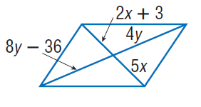
- ROI 裁剪图：[benchmarkallinone/outputs/report_priority_20/run_f2958f3118292117/datasets/geometry3k/artifacts/crops/prob_4fe0268819e3dd424ca2f5bc_primary_roi.png](../../datasets/geometry3k/artifacts/crops/prob_4fe0268819e3dd424ca2f5bc_primary_roi.png)

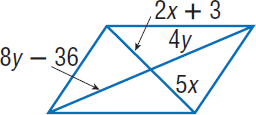

### 5) 清洗判定证据

```json
{
  "clean_score": 0.712,
  "decision": "reject",
  "decision_reason_codes": [
    "low_resolution",
    "missing_grounded_visual_path",
    "text_image_misaligned"
  ],
  "alignment_summary": {
    "alignment_id": "align_ffb2efcd6e2d43b2651eabb5",
    "coverage_score": 0.18,
    "consistency_score": 0.1,
    "alignment_status": "bad",
    "conflict_count": 1
  },
  "solvability_summary": {
    "solvability_id": "solv_prob_4fe0268819e3dd424ca2f5bc",
    "solvability_score": 0.8,
    "reasoning_path_exists": false,
    "decision_hint": "reject",
    "failure_codes": [
      "missing_grounded_visual_path"
    ]
  },
  "missing_field_summary": {
    "missing_question_text": false,
    "missing_answer_text": false,
    "missing_image_count": 0
  },
  "risk_flags": [
    "low_resolution",
    "low_text_completeness"
  ],
  "reject_record": {
    "reject_id": "reject_ffb2efcd6e2d43b2651eabb5",
    "problem_id": "prob_4fe0268819e3dd424ca2f5bc",
    "stage": "cleaning",
    "reject_level": "problem",
    "reject_reason_codes": [
      "low_resolution",
      "missing_grounded_visual_path",
      "text_image_misaligned"
    ],
    "reject_reason_detail": "Converted multiple choice into blank-style open-ended question.",
    "blocking_fields": [
      "low_resolution",
      "low_text_completeness"
    ],
    "evidence_refs": [
      "align_ffb2efcd6e2d43b2651eabb5",
      "solv_prob_4fe0268819e3dd424ca2f5bc"
    ],
    "recoverable": false,
    "recommended_action": "drop",
    "reviewed_by": null,
    "created_at": "2026-03-25T08:47:18Z"
  }
}
```

---

## 06. prob_500d9d9b4f5e0d375365c25f

- 样本文件：[benchmarkallinone/outputs/report_priority_20/run_f2958f3118292117/datasets/geometry3k/samples/prob_500d9d9b4f5e0d375365c25f.json](../../datasets/geometry3k/samples/prob_500d9d9b4f5e0d375365c25f.json)
- 源数据集：`Geometry3K`
- 源 split：`repo_discovered`
- 源题目 ID：`10`
- 清洗路径：`multimodal_full`
- 是否文本主导：`False`
- 是否依赖图像：`True`
- 决策：`reject`
- 决策原因码：`answer_not_verifiable, missing_answer, missing_core_field, missing_core_image, missing_grounded_visual_path, rewrite_variant_invalid, target_underspecified, text_image_misaligned`
- 开放化改写策略：`keep_open`
- 对齐状态：`bad`
- 可解性分数：`0.18`
- 可解性提示：`reject`
- 质量风险标记：`low_text_completeness, missing_answer, missing_core_image`

### 采集阶段信号

```json
{
  "core_asset_completeness": {
    "has_question_text": true,
    "has_answer_text": false,
    "image_count": 0,
    "has_multiple_images": false
  },
  "initial_scores": {
    "initial_image_dependency_score": 0.9,
    "initial_multi_solution_score": 0.46,
    "initial_verifiability_score": 0.2
  }
}
```

### 1) 处理前：原始题目 / 原始答案

**原始题目**

```text
text
```

**原始答案**

```text

```

### 2) 处理后：规范化题目 / 规范化答案

**规范化题目**

```text
text
```

**规范化答案**

```text

```

### 3) 开放化改写前后

**改写前（使用规范化题目作为输入）**

```text
text
```

**改写后（开放题变体）**

```text
text
```

- 期望答案类型：`unknown`
- 期望答案：``
- 改写 rationale：`Question is already open-ended.`
- 丢弃原因码：`无`

### 4) 图像与可视化产物

- 原始图像来源：无
- 持久化主图：无
- ROI 裁剪图：无

### 5) 清洗判定证据

```json
{
  "clean_score": 0.379,
  "decision": "reject",
  "decision_reason_codes": [
    "answer_not_verifiable",
    "missing_answer",
    "missing_core_field",
    "missing_core_image",
    "missing_grounded_visual_path",
    "rewrite_variant_invalid",
    "target_underspecified",
    "text_image_misaligned"
  ],
  "alignment_summary": {
    "alignment_id": "align_486545d27e0305ab9168e5f8",
    "coverage_score": 0.18,
    "consistency_score": 0.0,
    "alignment_status": "bad",
    "conflict_count": 2
  },
  "solvability_summary": {
    "solvability_id": "solv_prob_500d9d9b4f5e0d375365c25f",
    "solvability_score": 0.18,
    "reasoning_path_exists": false,
    "decision_hint": "reject",
    "failure_codes": [
      "answer_not_verifiable",
      "target_underspecified",
      "rewrite_variant_invalid",
      "missing_grounded_visual_path",
      "missing_core_field"
    ]
  },
  "missing_field_summary": {
    "missing_question_text": false,
    "missing_answer_text": true,
    "missing_image_count": 1
  },
  "risk_flags": [
    "low_text_completeness",
    "missing_answer",
    "missing_core_image"
  ],
  "reject_record": {
    "reject_id": "reject_486545d27e0305ab9168e5f8",
    "problem_id": "prob_500d9d9b4f5e0d375365c25f",
    "stage": "cleaning",
    "reject_level": "problem",
    "reject_reason_codes": [
      "answer_not_verifiable",
      "missing_answer",
      "missing_core_field",
      "missing_core_image",
      "missing_grounded_visual_path",
      "rewrite_variant_invalid",
      "target_underspecified",
      "text_image_misaligned"
    ],
    "reject_reason_detail": "Question is already open-ended.",
    "blocking_fields": [
      "low_text_completeness",
      "missing_answer",
      "missing_core_image"
    ],
    "evidence_refs": [
      "align_486545d27e0305ab9168e5f8",
      "solv_prob_500d9d9b4f5e0d375365c25f"
    ],
    "recoverable": false,
    "recommended_action": "drop",
    "reviewed_by": null,
    "created_at": "2026-03-25T08:47:19Z"
  }
}
```

---

## 07. prob_547222eedba408e75af13ac8

- 样本文件：[benchmarkallinone/outputs/report_priority_20/run_f2958f3118292117/datasets/geometry3k/samples/prob_547222eedba408e75af13ac8.json](../../datasets/geometry3k/samples/prob_547222eedba408e75af13ac8.json)
- 源数据集：`Geometry3K`
- 源 split：`repo_discovered`
- 源题目 ID：`14`
- 清洗路径：`multimodal_full`
- 是否文本主导：`False`
- 是否依赖图像：`True`
- 决策：`reject`
- 决策原因码：`missing_grounded_visual_path, text_image_misaligned`
- 开放化改写策略：`blank_open`
- 对齐状态：`bad`
- 可解性分数：`0.8`
- 可解性提示：`reject`
- 质量风险标记：`low_text_completeness`

### 采集阶段信号

```json
{
  "core_asset_completeness": {
    "has_question_text": true,
    "has_answer_text": true,
    "image_count": 3,
    "has_multiple_images": true
  },
  "initial_scores": {
    "initial_image_dependency_score": 0.9,
    "initial_multi_solution_score": 0.52,
    "initial_verifiability_score": 0.8798
  }
}
```

### 1) 处理前：原始题目 / 原始答案

**原始题目**

```text
Find x.
```

**原始答案**

```text
48
```

### 2) 处理后：规范化题目 / 规范化答案

**规范化题目**

```text
Find x.
```

**规范化答案**

```text
48
```

### 3) 开放化改写前后

**改写前（使用规范化题目作为输入）**

```text
Find x.
```

**改写后（开放题变体）**

```text
Find x.
```

- 期望答案类型：`numeric`
- 期望答案：`48`
- 改写 rationale：`Converted multiple choice into blank-style open-ended question.`
- 丢弃原因码：`无`

### 4) 图像与可视化产物

- 原始图像来源：[benchmark/outputs/repo_cache/geometry3k/annotation_tool/data_collection/data_examples/14/img_diagram.png](../../../../../../benchmark/outputs/repo_cache/geometry3k/annotation_tool/data_collection/data_examples/14/img_diagram.png)
- 持久化主图：[benchmarkallinone/outputs/report_priority_20/run_f2958f3118292117/datasets/geometry3k/artifacts/images/prob_547222eedba408e75af13ac8_primary.png](../../datasets/geometry3k/artifacts/images/prob_547222eedba408e75af13ac8_primary.png)

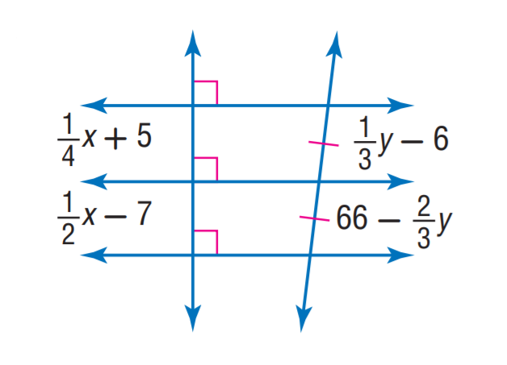
- ROI 裁剪图：[benchmarkallinone/outputs/report_priority_20/run_f2958f3118292117/datasets/geometry3k/artifacts/crops/prob_547222eedba408e75af13ac8_primary_roi.png](../../datasets/geometry3k/artifacts/crops/prob_547222eedba408e75af13ac8_primary_roi.png)

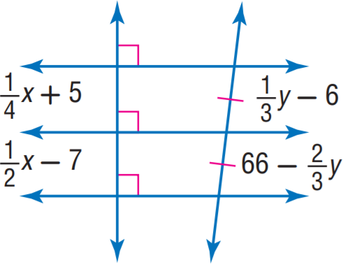

### 5) 清洗判定证据

```json
{
  "clean_score": 0.7008,
  "decision": "reject",
  "decision_reason_codes": [
    "missing_grounded_visual_path",
    "text_image_misaligned"
  ],
  "alignment_summary": {
    "alignment_id": "align_d744217f2930410745b86bdd",
    "coverage_score": 0.18,
    "consistency_score": 0.1,
    "alignment_status": "bad",
    "conflict_count": 1
  },
  "solvability_summary": {
    "solvability_id": "solv_prob_547222eedba408e75af13ac8",
    "solvability_score": 0.8,
    "reasoning_path_exists": false,
    "decision_hint": "reject",
    "failure_codes": [
      "missing_grounded_visual_path"
    ]
  },
  "missing_field_summary": {
    "missing_question_text": false,
    "missing_answer_text": false,
    "missing_image_count": 0
  },
  "risk_flags": [
    "low_text_completeness"
  ],
  "reject_record": {
    "reject_id": "reject_d744217f2930410745b86bdd",
    "problem_id": "prob_547222eedba408e75af13ac8",
    "stage": "cleaning",
    "reject_level": "problem",
    "reject_reason_codes": [
      "missing_grounded_visual_path",
      "text_image_misaligned"
    ],
    "reject_reason_detail": "Converted multiple choice into blank-style open-ended question.",
    "blocking_fields": [
      "low_text_completeness"
    ],
    "evidence_refs": [
      "align_d744217f2930410745b86bdd",
      "solv_prob_547222eedba408e75af13ac8"
    ],
    "recoverable": false,
    "recommended_action": "drop",
    "reviewed_by": null,
    "created_at": "2026-03-25T08:47:18Z"
  }
}
```

---

## 08. prob_587dba2dc2c1ee5e87d9c128

- 样本文件：[benchmarkallinone/outputs/report_priority_20/run_f2958f3118292117/datasets/geometry3k/samples/prob_587dba2dc2c1ee5e87d9c128.json](../../datasets/geometry3k/samples/prob_587dba2dc2c1ee5e87d9c128.json)
- 源数据集：`Geometry3K`
- 源 split：`repo_discovered`
- 源题目 ID：`16`
- 清洗路径：`multimodal_full`
- 是否文本主导：`False`
- 是否依赖图像：`True`
- 决策：`review`
- 决策原因码：`normalized_question_incomplete`
- 开放化改写策略：`blank_open`
- 对齐状态：`good`
- 可解性分数：`1.0`
- 可解性提示：`pass`
- 质量风险标记：`low_text_completeness`

### 采集阶段信号

```json
{
  "core_asset_completeness": {
    "has_question_text": true,
    "has_answer_text": true,
    "image_count": 3,
    "has_multiple_images": true
  },
  "initial_scores": {
    "initial_image_dependency_score": 0.9,
    "initial_multi_solution_score": 0.52,
    "initial_verifiability_score": 0.876
  }
}
```

### 1) 处理前：原始题目 / 原始答案

**原始题目**

```text
If A D = 27, A B = 8, and A E = 12, find B C.
```

**原始答案**

```text
10
```

### 2) 处理后：规范化题目 / 规范化答案

**规范化题目**

```text
If A D = 27, A B = 8, and A E = 12, find B C.
```

**规范化答案**

```text
10
```

### 3) 开放化改写前后

**改写前（使用规范化题目作为输入）**

```text
If A D = 27, A B = 8, and A E = 12, find B C.
```

**改写后（开放题变体）**

```text
If A D = 27, A B = 8, and A E = 12, find B C.
```

- 期望答案类型：`numeric`
- 期望答案：`10`
- 改写 rationale：`Converted multiple choice into blank-style open-ended question.`
- 丢弃原因码：`无`

### 4) 图像与可视化产物

- 原始图像来源：[benchmark/outputs/repo_cache/geometry3k/annotation_tool/data_collection/data_examples/16/img_diagram.png](../../../../../../benchmark/outputs/repo_cache/geometry3k/annotation_tool/data_collection/data_examples/16/img_diagram.png)
- 持久化主图：[benchmarkallinone/outputs/report_priority_20/run_f2958f3118292117/datasets/geometry3k/artifacts/images/prob_587dba2dc2c1ee5e87d9c128_primary.png](../../datasets/geometry3k/artifacts/images/prob_587dba2dc2c1ee5e87d9c128_primary.png)

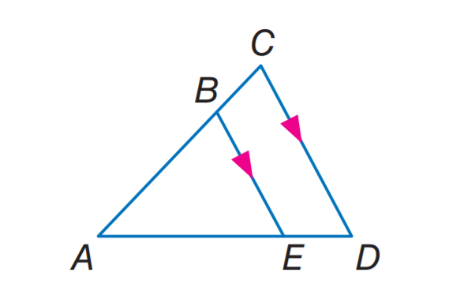
- ROI 裁剪图：[benchmarkallinone/outputs/report_priority_20/run_f2958f3118292117/datasets/geometry3k/artifacts/crops/prob_587dba2dc2c1ee5e87d9c128_primary_roi.png](../../datasets/geometry3k/artifacts/crops/prob_587dba2dc2c1ee5e87d9c128_primary_roi.png)

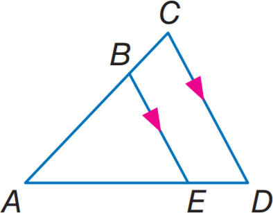

### 5) 清洗判定证据

```json
{
  "clean_score": 0.8674,
  "decision": "review",
  "decision_reason_codes": [
    "normalized_question_incomplete"
  ],
  "alignment_summary": {
    "alignment_id": "align_b9d3ab7d7bfb496884409409",
    "coverage_score": 0.9,
    "consistency_score": 0.9,
    "alignment_status": "good",
    "conflict_count": 1
  },
  "solvability_summary": {
    "solvability_id": "solv_prob_587dba2dc2c1ee5e87d9c128",
    "solvability_score": 1.0,
    "reasoning_path_exists": true,
    "decision_hint": "pass",
    "failure_codes": []
  },
  "missing_field_summary": {
    "missing_question_text": false,
    "missing_answer_text": false,
    "missing_image_count": 0
  },
  "risk_flags": [
    "low_text_completeness"
  ],
  "reject_record": null
}
```

---

## 09. prob_67ad61b584692ca997d73675

- 样本文件：[benchmarkallinone/outputs/report_priority_20/run_f2958f3118292117/datasets/geometry3k/samples/prob_67ad61b584692ca997d73675.json](../../datasets/geometry3k/samples/prob_67ad61b584692ca997d73675.json)
- 源数据集：`Geometry3K`
- 源 split：`repo_discovered`
- 源题目 ID：`17`
- 清洗路径：`multimodal_full`
- 是否文本主导：`False`
- 是否依赖图像：`True`
- 决策：`pass`
- 决策原因码：`meets_cleaning_requirements`
- 开放化改写策略：`blank_open`
- 对齐状态：`good`
- 可解性分数：`1.0`
- 可解性提示：`pass`
- 质量风险标记：`无`

### 采集阶段信号

```json
{
  "core_asset_completeness": {
    "has_question_text": true,
    "has_answer_text": true,
    "image_count": 3,
    "has_multiple_images": true
  },
  "initial_scores": {
    "initial_image_dependency_score": 0.9,
    "initial_multi_solution_score": 0.52,
    "initial_verifiability_score": 0.8776
  }
}
```

### 1) 处理前：原始题目 / 原始答案

**原始题目**

```text
parallelogram M N P Q with m \angle M = 10 x and m \angle N = 20 x, find \angle Q.
```

**原始答案**

```text
120
```

### 2) 处理后：规范化题目 / 规范化答案

**规范化题目**

```text
parallelogram M N P Q with m \angle M = 10 x and m \angle N = 20 x, find \angle Q.
```

**规范化答案**

```text
120
```

### 3) 开放化改写前后

**改写前（使用规范化题目作为输入）**

```text
parallelogram M N P Q with m \angle M = 10 x and m \angle N = 20 x, find \angle Q.
```

**改写后（开放题变体）**

```text
parallelogram M N P Q with m \angle M = 10 x and m \angle N = 20 x, find \angle Q.
```

- 期望答案类型：`numeric`
- 期望答案：`120`
- 改写 rationale：`Converted multiple choice into blank-style open-ended question.`
- 丢弃原因码：`无`

### 4) 图像与可视化产物

- 原始图像来源：[benchmark/outputs/repo_cache/geometry3k/annotation_tool/data_collection/data_examples/17/img_diagram.png](../../../../../../benchmark/outputs/repo_cache/geometry3k/annotation_tool/data_collection/data_examples/17/img_diagram.png)
- 持久化主图：[benchmarkallinone/outputs/report_priority_20/run_f2958f3118292117/datasets/geometry3k/artifacts/images/prob_67ad61b584692ca997d73675_primary.png](../../datasets/geometry3k/artifacts/images/prob_67ad61b584692ca997d73675_primary.png)

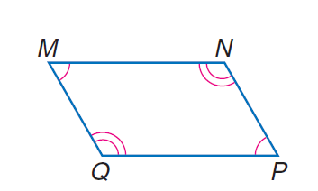
- ROI 裁剪图：[benchmarkallinone/outputs/report_priority_20/run_f2958f3118292117/datasets/geometry3k/artifacts/crops/prob_67ad61b584692ca997d73675_primary_roi.png](../../datasets/geometry3k/artifacts/crops/prob_67ad61b584692ca997d73675_primary_roi.png)

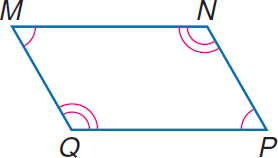

### 5) 清洗判定证据

```json
{
  "clean_score": 0.8749,
  "decision": "pass",
  "decision_reason_codes": [
    "meets_cleaning_requirements"
  ],
  "alignment_summary": {
    "alignment_id": "align_b781ac64425491d168e23630",
    "coverage_score": 0.9,
    "consistency_score": 0.9,
    "alignment_status": "good",
    "conflict_count": 1
  },
  "solvability_summary": {
    "solvability_id": "solv_prob_67ad61b584692ca997d73675",
    "solvability_score": 1.0,
    "reasoning_path_exists": true,
    "decision_hint": "pass",
    "failure_codes": []
  },
  "missing_field_summary": {
    "missing_question_text": false,
    "missing_answer_text": false,
    "missing_image_count": 0
  },
  "risk_flags": [],
  "reject_record": null
}
```

---

## 10. prob_9de5cd824bf155092954b785

- 样本文件：[benchmarkallinone/outputs/report_priority_20/run_f2958f3118292117/datasets/geometry3k/samples/prob_9de5cd824bf155092954b785.json](../../datasets/geometry3k/samples/prob_9de5cd824bf155092954b785.json)
- 源数据集：`Geometry3K`
- 源 split：`repo_discovered`
- 源题目 ID：`15`
- 清洗路径：`multimodal_full`
- 是否文本主导：`False`
- 是否依赖图像：`True`
- 决策：`reject`
- 决策原因码：`missing_grounded_visual_path, text_image_misaligned`
- 开放化改写策略：`blank_open`
- 对齐状态：`bad`
- 可解性分数：`0.8`
- 可解性提示：`reject`
- 质量风险标记：`low_text_completeness`

### 采集阶段信号

```json
{
  "core_asset_completeness": {
    "has_question_text": true,
    "has_answer_text": true,
    "image_count": 3,
    "has_multiple_images": true
  },
  "initial_scores": {
    "initial_image_dependency_score": 0.9,
    "initial_multi_solution_score": 0.52,
    "initial_verifiability_score": 0.8734
  }
}
```

### 1) 处理前：原始题目 / 原始答案

**原始题目**

```text
Find y.
```

**原始答案**

```text
5 \sqrt { 3 }
```

### 2) 处理后：规范化题目 / 规范化答案

**规范化题目**

```text
Find y.
```

**规范化答案**

```text
5 \sqrt { 3 }
```

### 3) 开放化改写前后

**改写前（使用规范化题目作为输入）**

```text
Find y.
```

**改写后（开放题变体）**

```text
Find y.
```

- 期望答案类型：`short_text`
- 期望答案：`5 \sqrt { 3 }`
- 改写 rationale：`Converted multiple choice into blank-style open-ended question.`
- 丢弃原因码：`无`

### 4) 图像与可视化产物

- 原始图像来源：[benchmark/outputs/repo_cache/geometry3k/annotation_tool/data_collection/data_examples/15/img_diagram.png](../../../../../../benchmark/outputs/repo_cache/geometry3k/annotation_tool/data_collection/data_examples/15/img_diagram.png)
- 持久化主图：[benchmarkallinone/outputs/report_priority_20/run_f2958f3118292117/datasets/geometry3k/artifacts/images/prob_9de5cd824bf155092954b785_primary.png](../../datasets/geometry3k/artifacts/images/prob_9de5cd824bf155092954b785_primary.png)

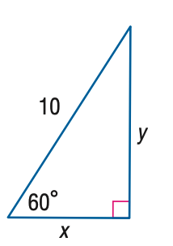
- ROI 裁剪图：[benchmarkallinone/outputs/report_priority_20/run_f2958f3118292117/datasets/geometry3k/artifacts/crops/prob_9de5cd824bf155092954b785_primary_roi.png](../../datasets/geometry3k/artifacts/crops/prob_9de5cd824bf155092954b785_primary_roi.png)

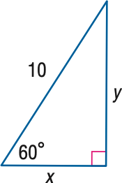

### 5) 清洗判定证据

```json
{
  "clean_score": 0.682,
  "decision": "reject",
  "decision_reason_codes": [
    "missing_grounded_visual_path",
    "text_image_misaligned"
  ],
  "alignment_summary": {
    "alignment_id": "align_cdb15e8c8584eeb175ea3e5b",
    "coverage_score": 0.18,
    "consistency_score": 0.1,
    "alignment_status": "bad",
    "conflict_count": 1
  },
  "solvability_summary": {
    "solvability_id": "solv_prob_9de5cd824bf155092954b785",
    "solvability_score": 0.8,
    "reasoning_path_exists": false,
    "decision_hint": "reject",
    "failure_codes": [
      "missing_grounded_visual_path"
    ]
  },
  "missing_field_summary": {
    "missing_question_text": false,
    "missing_answer_text": false,
    "missing_image_count": 0
  },
  "risk_flags": [
    "low_text_completeness"
  ],
  "reject_record": {
    "reject_id": "reject_cdb15e8c8584eeb175ea3e5b",
    "problem_id": "prob_9de5cd824bf155092954b785",
    "stage": "cleaning",
    "reject_level": "problem",
    "reject_reason_codes": [
      "missing_grounded_visual_path",
      "text_image_misaligned"
    ],
    "reject_reason_detail": "Converted multiple choice into blank-style open-ended question.",
    "blocking_fields": [
      "low_text_completeness"
    ],
    "evidence_refs": [
      "align_cdb15e8c8584eeb175ea3e5b",
      "solv_prob_9de5cd824bf155092954b785"
    ],
    "recoverable": false,
    "recommended_action": "drop",
    "reviewed_by": null,
    "created_at": "2026-03-25T08:47:18Z"
  }
}
```

---

## 11. prob_ab0c128d10354cc8961112d9

- 样本文件：[benchmarkallinone/outputs/report_priority_20/run_f2958f3118292117/datasets/geometry3k/samples/prob_ab0c128d10354cc8961112d9.json](../../datasets/geometry3k/samples/prob_ab0c128d10354cc8961112d9.json)
- 源数据集：`Geometry3K`
- 源 split：`repo_discovered`
- 源题目 ID：`13`
- 清洗路径：`multimodal_full`
- 是否文本主导：`False`
- 是否依赖图像：`True`
- 决策：`reject`
- 决策原因码：`answer_not_verifiable, missing_answer, missing_core_field, missing_core_image, missing_grounded_visual_path, rewrite_variant_invalid, target_underspecified, text_image_misaligned`
- 开放化改写策略：`keep_open`
- 对齐状态：`bad`
- 可解性分数：`0.18`
- 可解性提示：`reject`
- 质量风险标记：`low_text_completeness, missing_answer, missing_core_image`

### 采集阶段信号

```json
{
  "core_asset_completeness": {
    "has_question_text": true,
    "has_answer_text": false,
    "image_count": 0,
    "has_multiple_images": false
  },
  "initial_scores": {
    "initial_image_dependency_score": 0.9,
    "initial_multi_solution_score": 0.46,
    "initial_verifiability_score": 0.2
  }
}
```

### 1) 处理前：原始题目 / 原始答案

**原始题目**

```text
text
```

**原始答案**

```text

```

### 2) 处理后：规范化题目 / 规范化答案

**规范化题目**

```text
text
```

**规范化答案**

```text

```

### 3) 开放化改写前后

**改写前（使用规范化题目作为输入）**

```text
text
```

**改写后（开放题变体）**

```text
text
```

- 期望答案类型：`unknown`
- 期望答案：``
- 改写 rationale：`Question is already open-ended.`
- 丢弃原因码：`无`

### 4) 图像与可视化产物

- 原始图像来源：无
- 持久化主图：无
- ROI 裁剪图：无

### 5) 清洗判定证据

```json
{
  "clean_score": 0.379,
  "decision": "reject",
  "decision_reason_codes": [
    "answer_not_verifiable",
    "missing_answer",
    "missing_core_field",
    "missing_core_image",
    "missing_grounded_visual_path",
    "rewrite_variant_invalid",
    "target_underspecified",
    "text_image_misaligned"
  ],
  "alignment_summary": {
    "alignment_id": "align_0de51f1b4fd5750d0615bcdd",
    "coverage_score": 0.18,
    "consistency_score": 0.0,
    "alignment_status": "bad",
    "conflict_count": 2
  },
  "solvability_summary": {
    "solvability_id": "solv_prob_ab0c128d10354cc8961112d9",
    "solvability_score": 0.18,
    "reasoning_path_exists": false,
    "decision_hint": "reject",
    "failure_codes": [
      "answer_not_verifiable",
      "target_underspecified",
      "rewrite_variant_invalid",
      "missing_grounded_visual_path",
      "missing_core_field"
    ]
  },
  "missing_field_summary": {
    "missing_question_text": false,
    "missing_answer_text": true,
    "missing_image_count": 1
  },
  "risk_flags": [
    "low_text_completeness",
    "missing_answer",
    "missing_core_image"
  ],
  "reject_record": {
    "reject_id": "reject_0de51f1b4fd5750d0615bcdd",
    "problem_id": "prob_ab0c128d10354cc8961112d9",
    "stage": "cleaning",
    "reject_level": "problem",
    "reject_reason_codes": [
      "answer_not_verifiable",
      "missing_answer",
      "missing_core_field",
      "missing_core_image",
      "missing_grounded_visual_path",
      "rewrite_variant_invalid",
      "target_underspecified",
      "text_image_misaligned"
    ],
    "reject_reason_detail": "Question is already open-ended.",
    "blocking_fields": [
      "low_text_completeness",
      "missing_answer",
      "missing_core_image"
    ],
    "evidence_refs": [
      "align_0de51f1b4fd5750d0615bcdd",
      "solv_prob_ab0c128d10354cc8961112d9"
    ],
    "recoverable": false,
    "recommended_action": "drop",
    "reviewed_by": null,
    "created_at": "2026-03-25T08:47:19Z"
  }
}
```

---

## 12. prob_ad3577c4848dffeefe50a8c3

- 样本文件：[benchmarkallinone/outputs/report_priority_20/run_f2958f3118292117/datasets/geometry3k/samples/prob_ad3577c4848dffeefe50a8c3.json](../../datasets/geometry3k/samples/prob_ad3577c4848dffeefe50a8c3.json)
- 源数据集：`Geometry3K`
- 源 split：`repo_discovered`
- 源题目 ID：`12`
- 清洗路径：`multimodal_full`
- 是否文本主导：`False`
- 是否依赖图像：`True`
- 决策：`reject`
- 决策原因码：`missing_grounded_visual_path, text_image_misaligned`
- 开放化改写策略：`blank_open`
- 对齐状态：`bad`
- 可解性分数：`0.8`
- 可解性提示：`reject`
- 质量风险标记：`low_text_completeness`

### 采集阶段信号

```json
{
  "core_asset_completeness": {
    "has_question_text": true,
    "has_answer_text": true,
    "image_count": 3,
    "has_multiple_images": true
  },
  "initial_scores": {
    "initial_image_dependency_score": 0.9,
    "initial_multi_solution_score": 0.52,
    "initial_verifiability_score": 0.8848
  }
}
```

### 1) 处理前：原始题目 / 原始答案

**原始题目**

```text
Find x.
```

**原始答案**

```text
13
```

### 2) 处理后：规范化题目 / 规范化答案

**规范化题目**

```text
Find x.
```

**规范化答案**

```text
13
```

### 3) 开放化改写前后

**改写前（使用规范化题目作为输入）**

```text
Find x.
```

**改写后（开放题变体）**

```text
Find x.
```

- 期望答案类型：`numeric`
- 期望答案：`13`
- 改写 rationale：`Converted multiple choice into blank-style open-ended question.`
- 丢弃原因码：`无`

### 4) 图像与可视化产物

- 原始图像来源：[benchmark/outputs/repo_cache/geometry3k/annotation_tool/data_collection/data_examples/12/img_diagram.png](../../../../../../benchmark/outputs/repo_cache/geometry3k/annotation_tool/data_collection/data_examples/12/img_diagram.png)
- 持久化主图：[benchmarkallinone/outputs/report_priority_20/run_f2958f3118292117/datasets/geometry3k/artifacts/images/prob_ad3577c4848dffeefe50a8c3_primary.png](../../datasets/geometry3k/artifacts/images/prob_ad3577c4848dffeefe50a8c3_primary.png)

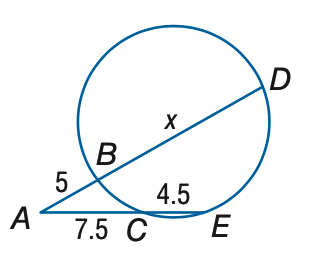
- ROI 裁剪图：[benchmarkallinone/outputs/report_priority_20/run_f2958f3118292117/datasets/geometry3k/artifacts/crops/prob_ad3577c4848dffeefe50a8c3_primary_roi.png](../../datasets/geometry3k/artifacts/crops/prob_ad3577c4848dffeefe50a8c3_primary_roi.png)

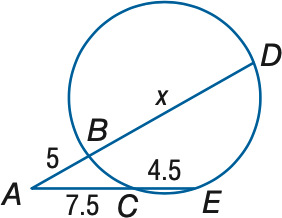

### 5) 清洗判定证据

```json
{
  "clean_score": 0.7079,
  "decision": "reject",
  "decision_reason_codes": [
    "missing_grounded_visual_path",
    "text_image_misaligned"
  ],
  "alignment_summary": {
    "alignment_id": "align_5e4a79bd6bd2fe5a93956985",
    "coverage_score": 0.18,
    "consistency_score": 0.1,
    "alignment_status": "bad",
    "conflict_count": 1
  },
  "solvability_summary": {
    "solvability_id": "solv_prob_ad3577c4848dffeefe50a8c3",
    "solvability_score": 0.8,
    "reasoning_path_exists": false,
    "decision_hint": "reject",
    "failure_codes": [
      "missing_grounded_visual_path"
    ]
  },
  "missing_field_summary": {
    "missing_question_text": false,
    "missing_answer_text": false,
    "missing_image_count": 0
  },
  "risk_flags": [
    "low_text_completeness"
  ],
  "reject_record": {
    "reject_id": "reject_5e4a79bd6bd2fe5a93956985",
    "problem_id": "prob_ad3577c4848dffeefe50a8c3",
    "stage": "cleaning",
    "reject_level": "problem",
    "reject_reason_codes": [
      "missing_grounded_visual_path",
      "text_image_misaligned"
    ],
    "reject_reason_detail": "Converted multiple choice into blank-style open-ended question.",
    "blocking_fields": [
      "low_text_completeness"
    ],
    "evidence_refs": [
      "align_5e4a79bd6bd2fe5a93956985",
      "solv_prob_ad3577c4848dffeefe50a8c3"
    ],
    "recoverable": false,
    "recommended_action": "drop",
    "reviewed_by": null,
    "created_at": "2026-03-25T08:47:18Z"
  }
}
```

---

## 13. prob_b0d266b39ecc7b8fcd3a33dd

- 样本文件：[benchmarkallinone/outputs/report_priority_20/run_f2958f3118292117/datasets/geometry3k/samples/prob_b0d266b39ecc7b8fcd3a33dd.json](../../datasets/geometry3k/samples/prob_b0d266b39ecc7b8fcd3a33dd.json)
- 源数据集：`Geometry3K`
- 源 split：`repo_discovered`
- 源题目 ID：`11`
- 清洗路径：`multimodal_full`
- 是否文本主导：`False`
- 是否依赖图像：`True`
- 决策：`pass`
- 决策原因码：`meets_cleaning_requirements`
- 开放化改写策略：`blank_open`
- 对齐状态：`good`
- 可解性分数：`1.0`
- 可解性提示：`pass`
- 质量风险标记：`severe_crop_loss`

### 采集阶段信号

```json
{
  "core_asset_completeness": {
    "has_question_text": true,
    "has_answer_text": true,
    "image_count": 3,
    "has_multiple_images": true
  },
  "initial_scores": {
    "initial_image_dependency_score": 0.9,
    "initial_multi_solution_score": 0.52,
    "initial_verifiability_score": 0.8793
  }
}
```

### 1) 处理前：原始题目 / 原始答案

**原始题目**

```text
In \odot X, A B = 30, C D = 30, and m \widehat C Z = 40. Find m \widehat A B.
```

**原始答案**

```text
80
```

### 2) 处理后：规范化题目 / 规范化答案

**规范化题目**

```text
In \odot X, A B = 30, C D = 30, and m \widehat C Z = 40. Find m \widehat A B.
```

**规范化答案**

```text
80
```

### 3) 开放化改写前后

**改写前（使用规范化题目作为输入）**

```text
In \odot X, A B = 30, C D = 30, and m \widehat C Z = 40. Find m \widehat A B.
```

**改写后（开放题变体）**

```text
In \odot X, A B = 30, C D = 30, and m \widehat C Z = 40. Find m \widehat A B.
```

- 期望答案类型：`numeric`
- 期望答案：`80`
- 改写 rationale：`Converted multiple choice into blank-style open-ended question.`
- 丢弃原因码：`无`

### 4) 图像与可视化产物

- 原始图像来源：[benchmark/outputs/repo_cache/geometry3k/annotation_tool/data_collection/data_examples/11/img_diagram.png](../../../../../../benchmark/outputs/repo_cache/geometry3k/annotation_tool/data_collection/data_examples/11/img_diagram.png)
- 持久化主图：[benchmarkallinone/outputs/report_priority_20/run_f2958f3118292117/datasets/geometry3k/artifacts/images/prob_b0d266b39ecc7b8fcd3a33dd_primary.png](../../datasets/geometry3k/artifacts/images/prob_b0d266b39ecc7b8fcd3a33dd_primary.png)

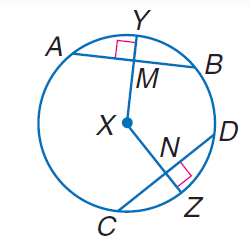
- ROI 裁剪图：[benchmarkallinone/outputs/report_priority_20/run_f2958f3118292117/datasets/geometry3k/artifacts/crops/prob_b0d266b39ecc7b8fcd3a33dd_primary_roi.png](../../datasets/geometry3k/artifacts/crops/prob_b0d266b39ecc7b8fcd3a33dd_primary_roi.png)

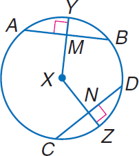

### 5) 清洗判定证据

```json
{
  "clean_score": 0.8768,
  "decision": "pass",
  "decision_reason_codes": [
    "meets_cleaning_requirements"
  ],
  "alignment_summary": {
    "alignment_id": "align_2d21807ce29dcc00758d365d",
    "coverage_score": 0.9,
    "consistency_score": 0.9,
    "alignment_status": "good",
    "conflict_count": 1
  },
  "solvability_summary": {
    "solvability_id": "solv_prob_b0d266b39ecc7b8fcd3a33dd",
    "solvability_score": 1.0,
    "reasoning_path_exists": true,
    "decision_hint": "pass",
    "failure_codes": []
  },
  "missing_field_summary": {
    "missing_question_text": false,
    "missing_answer_text": false,
    "missing_image_count": 0
  },
  "risk_flags": [
    "severe_crop_loss"
  ],
  "reject_record": null
}
```

---

## 14. prob_b4d2ca64c115022263a69adc

- 样本文件：[benchmarkallinone/outputs/report_priority_20/run_f2958f3118292117/datasets/geometry3k/samples/prob_b4d2ca64c115022263a69adc.json](../../datasets/geometry3k/samples/prob_b4d2ca64c115022263a69adc.json)
- 源数据集：`Geometry3K`
- 源 split：`repo_discovered`
- 源题目 ID：`14`
- 清洗路径：`multimodal_full`
- 是否文本主导：`False`
- 是否依赖图像：`True`
- 决策：`reject`
- 决策原因码：`answer_not_verifiable, missing_answer, missing_core_field, missing_core_image, missing_grounded_visual_path, rewrite_variant_invalid, target_underspecified, text_image_misaligned`
- 开放化改写策略：`keep_open`
- 对齐状态：`bad`
- 可解性分数：`0.18`
- 可解性提示：`reject`
- 质量风险标记：`low_text_completeness, missing_answer, missing_core_image`

### 采集阶段信号

```json
{
  "core_asset_completeness": {
    "has_question_text": true,
    "has_answer_text": false,
    "image_count": 0,
    "has_multiple_images": false
  },
  "initial_scores": {
    "initial_image_dependency_score": 0.9,
    "initial_multi_solution_score": 0.46,
    "initial_verifiability_score": 0.2
  }
}
```

### 1) 处理前：原始题目 / 原始答案

**原始题目**

```text
text
```

**原始答案**

```text

```

### 2) 处理后：规范化题目 / 规范化答案

**规范化题目**

```text
text
```

**规范化答案**

```text

```

### 3) 开放化改写前后

**改写前（使用规范化题目作为输入）**

```text
text
```

**改写后（开放题变体）**

```text
text
```

- 期望答案类型：`unknown`
- 期望答案：``
- 改写 rationale：`Question is already open-ended.`
- 丢弃原因码：`无`

### 4) 图像与可视化产物

- 原始图像来源：无
- 持久化主图：无
- ROI 裁剪图：无

### 5) 清洗判定证据

```json
{
  "clean_score": 0.379,
  "decision": "reject",
  "decision_reason_codes": [
    "answer_not_verifiable",
    "missing_answer",
    "missing_core_field",
    "missing_core_image",
    "missing_grounded_visual_path",
    "rewrite_variant_invalid",
    "target_underspecified",
    "text_image_misaligned"
  ],
  "alignment_summary": {
    "alignment_id": "align_5accc639d5b9521f51b3b073",
    "coverage_score": 0.18,
    "consistency_score": 0.0,
    "alignment_status": "bad",
    "conflict_count": 2
  },
  "solvability_summary": {
    "solvability_id": "solv_prob_b4d2ca64c115022263a69adc",
    "solvability_score": 0.18,
    "reasoning_path_exists": false,
    "decision_hint": "reject",
    "failure_codes": [
      "answer_not_verifiable",
      "target_underspecified",
      "rewrite_variant_invalid",
      "missing_grounded_visual_path",
      "missing_core_field"
    ]
  },
  "missing_field_summary": {
    "missing_question_text": false,
    "missing_answer_text": true,
    "missing_image_count": 1
  },
  "risk_flags": [
    "low_text_completeness",
    "missing_answer",
    "missing_core_image"
  ],
  "reject_record": {
    "reject_id": "reject_5accc639d5b9521f51b3b073",
    "problem_id": "prob_b4d2ca64c115022263a69adc",
    "stage": "cleaning",
    "reject_level": "problem",
    "reject_reason_codes": [
      "answer_not_verifiable",
      "missing_answer",
      "missing_core_field",
      "missing_core_image",
      "missing_grounded_visual_path",
      "rewrite_variant_invalid",
      "target_underspecified",
      "text_image_misaligned"
    ],
    "reject_reason_detail": "Question is already open-ended.",
    "blocking_fields": [
      "low_text_completeness",
      "missing_answer",
      "missing_core_image"
    ],
    "evidence_refs": [
      "align_5accc639d5b9521f51b3b073",
      "solv_prob_b4d2ca64c115022263a69adc"
    ],
    "recoverable": false,
    "recommended_action": "drop",
    "reviewed_by": null,
    "created_at": "2026-03-25T08:47:19Z"
  }
}
```

---

## 15. prob_b50fce315368ee6f19693292

- 样本文件：[benchmarkallinone/outputs/report_priority_20/run_f2958f3118292117/datasets/geometry3k/samples/prob_b50fce315368ee6f19693292.json](../../datasets/geometry3k/samples/prob_b50fce315368ee6f19693292.json)
- 源数据集：`Geometry3K`
- 源 split：`repo_discovered`
- 源题目 ID：`18`
- 清洗路径：`multimodal_full`
- 是否文本主导：`False`
- 是否依赖图像：`True`
- 决策：`reject`
- 决策原因码：`missing_grounded_visual_path, text_image_misaligned`
- 开放化改写策略：`blank_open`
- 对齐状态：`bad`
- 可解性分数：`0.8`
- 可解性提示：`reject`
- 质量风险标记：`low_text_completeness`

### 采集阶段信号

```json
{
  "core_asset_completeness": {
    "has_question_text": true,
    "has_answer_text": true,
    "image_count": 3,
    "has_multiple_images": true
  },
  "initial_scores": {
    "initial_image_dependency_score": 0.9,
    "initial_multi_solution_score": 0.52,
    "initial_verifiability_score": 0.8778
  }
}
```

### 1) 处理前：原始题目 / 原始答案

**原始题目**

```text
Find y so that the quadrilateral is a parallelogram.
```

**原始答案**

```text
22
```

### 2) 处理后：规范化题目 / 规范化答案

**规范化题目**

```text
Find y so that the quadrilateral is a parallelogram.
```

**规范化答案**

```text
22
```

### 3) 开放化改写前后

**改写前（使用规范化题目作为输入）**

```text
Find y so that the quadrilateral is a parallelogram.
```

**改写后（开放题变体）**

```text
Find y so that the quadrilateral is a parallelogram.
```

- 期望答案类型：`numeric`
- 期望答案：`22`
- 改写 rationale：`Converted multiple choice into blank-style open-ended question.`
- 丢弃原因码：`无`

### 4) 图像与可视化产物

- 原始图像来源：[benchmark/outputs/repo_cache/geometry3k/annotation_tool/data_collection/data_examples/18/img_diagram.png](../../../../../../benchmark/outputs/repo_cache/geometry3k/annotation_tool/data_collection/data_examples/18/img_diagram.png)
- 持久化主图：[benchmarkallinone/outputs/report_priority_20/run_f2958f3118292117/datasets/geometry3k/artifacts/images/prob_b50fce315368ee6f19693292_primary.png](../../datasets/geometry3k/artifacts/images/prob_b50fce315368ee6f19693292_primary.png)

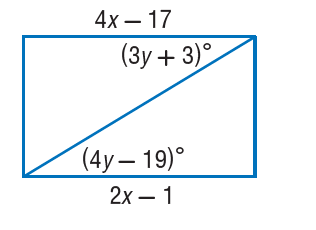
- ROI 裁剪图：[benchmarkallinone/outputs/report_priority_20/run_f2958f3118292117/datasets/geometry3k/artifacts/crops/prob_b50fce315368ee6f19693292_primary_roi.png](../../datasets/geometry3k/artifacts/crops/prob_b50fce315368ee6f19693292_primary_roi.png)

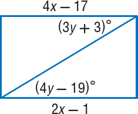

### 5) 清洗判定证据

```json
{
  "clean_score": 0.7151,
  "decision": "reject",
  "decision_reason_codes": [
    "missing_grounded_visual_path",
    "text_image_misaligned"
  ],
  "alignment_summary": {
    "alignment_id": "align_256f2557fba847612fef8c5a",
    "coverage_score": 0.18,
    "consistency_score": 0.1,
    "alignment_status": "bad",
    "conflict_count": 1
  },
  "solvability_summary": {
    "solvability_id": "solv_prob_b50fce315368ee6f19693292",
    "solvability_score": 0.8,
    "reasoning_path_exists": false,
    "decision_hint": "reject",
    "failure_codes": [
      "missing_grounded_visual_path"
    ]
  },
  "missing_field_summary": {
    "missing_question_text": false,
    "missing_answer_text": false,
    "missing_image_count": 0
  },
  "risk_flags": [
    "low_text_completeness"
  ],
  "reject_record": {
    "reject_id": "reject_256f2557fba847612fef8c5a",
    "problem_id": "prob_b50fce315368ee6f19693292",
    "stage": "cleaning",
    "reject_level": "problem",
    "reject_reason_codes": [
      "missing_grounded_visual_path",
      "text_image_misaligned"
    ],
    "reject_reason_detail": "Converted multiple choice into blank-style open-ended question.",
    "blocking_fields": [
      "low_text_completeness"
    ],
    "evidence_refs": [
      "align_256f2557fba847612fef8c5a",
      "solv_prob_b50fce315368ee6f19693292"
    ],
    "recoverable": false,
    "recommended_action": "drop",
    "reviewed_by": null,
    "created_at": "2026-03-25T08:47:19Z"
  }
}
```

---

## 16. prob_b9c2c215b013f6093835bd03

- 样本文件：[benchmarkallinone/outputs/report_priority_20/run_f2958f3118292117/datasets/geometry3k/samples/prob_b9c2c215b013f6093835bd03.json](../../datasets/geometry3k/samples/prob_b9c2c215b013f6093835bd03.json)
- 源数据集：`Geometry3K`
- 源 split：`repo_discovered`
- 源题目 ID：`20`
- 清洗路径：`multimodal_full`
- 是否文本主导：`False`
- 是否依赖图像：`True`
- 决策：`reject`
- 决策原因码：`low_resolution, missing_grounded_visual_path, text_image_misaligned`
- 开放化改写策略：`blank_open`
- 对齐状态：`bad`
- 可解性分数：`0.8`
- 可解性提示：`reject`
- 质量风险标记：`low_resolution, low_text_completeness`

### 采集阶段信号

```json
{
  "core_asset_completeness": {
    "has_question_text": true,
    "has_answer_text": true,
    "image_count": 3,
    "has_multiple_images": true
  },
  "initial_scores": {
    "initial_image_dependency_score": 0.9,
    "initial_multi_solution_score": 0.52,
    "initial_verifiability_score": 0.8713
  }
}
```

### 1) 处理前：原始题目 / 原始答案

**原始题目**

```text
Find y so that the quadrilateral is a parallelogram.
```

**原始答案**

```text
16
```

### 2) 处理后：规范化题目 / 规范化答案

**规范化题目**

```text
Find y so that the quadrilateral is a parallelogram.
```

**规范化答案**

```text
16
```

### 3) 开放化改写前后

**改写前（使用规范化题目作为输入）**

```text
Find y so that the quadrilateral is a parallelogram.
```

**改写后（开放题变体）**

```text
Find y so that the quadrilateral is a parallelogram.
```

- 期望答案类型：`numeric`
- 期望答案：`16`
- 改写 rationale：`Converted multiple choice into blank-style open-ended question.`
- 丢弃原因码：`无`

### 4) 图像与可视化产物

- 原始图像来源：[benchmark/outputs/repo_cache/geometry3k/annotation_tool/data_collection/data_examples/20/img_diagram.png](../../../../../../benchmark/outputs/repo_cache/geometry3k/annotation_tool/data_collection/data_examples/20/img_diagram.png)
- 持久化主图：[benchmarkallinone/outputs/report_priority_20/run_f2958f3118292117/datasets/geometry3k/artifacts/images/prob_b9c2c215b013f6093835bd03_primary.png](../../datasets/geometry3k/artifacts/images/prob_b9c2c215b013f6093835bd03_primary.png)

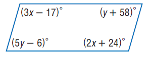
- ROI 裁剪图：[benchmarkallinone/outputs/report_priority_20/run_f2958f3118292117/datasets/geometry3k/artifacts/crops/prob_b9c2c215b013f6093835bd03_primary_roi.png](../../datasets/geometry3k/artifacts/crops/prob_b9c2c215b013f6093835bd03_primary_roi.png)

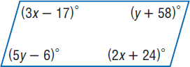

### 5) 清洗判定证据

```json
{
  "clean_score": 0.7058,
  "decision": "reject",
  "decision_reason_codes": [
    "low_resolution",
    "missing_grounded_visual_path",
    "text_image_misaligned"
  ],
  "alignment_summary": {
    "alignment_id": "align_e2e6cc4090d7c55c302b77cc",
    "coverage_score": 0.18,
    "consistency_score": 0.1,
    "alignment_status": "bad",
    "conflict_count": 1
  },
  "solvability_summary": {
    "solvability_id": "solv_prob_b9c2c215b013f6093835bd03",
    "solvability_score": 0.8,
    "reasoning_path_exists": false,
    "decision_hint": "reject",
    "failure_codes": [
      "missing_grounded_visual_path"
    ]
  },
  "missing_field_summary": {
    "missing_question_text": false,
    "missing_answer_text": false,
    "missing_image_count": 0
  },
  "risk_flags": [
    "low_resolution",
    "low_text_completeness"
  ],
  "reject_record": {
    "reject_id": "reject_e2e6cc4090d7c55c302b77cc",
    "problem_id": "prob_b9c2c215b013f6093835bd03",
    "stage": "cleaning",
    "reject_level": "problem",
    "reject_reason_codes": [
      "low_resolution",
      "missing_grounded_visual_path",
      "text_image_misaligned"
    ],
    "reject_reason_detail": "Converted multiple choice into blank-style open-ended question.",
    "blocking_fields": [
      "low_resolution",
      "low_text_completeness"
    ],
    "evidence_refs": [
      "align_e2e6cc4090d7c55c302b77cc",
      "solv_prob_b9c2c215b013f6093835bd03"
    ],
    "recoverable": false,
    "recommended_action": "drop",
    "reviewed_by": null,
    "created_at": "2026-03-25T08:47:19Z"
  }
}
```

---

## 17. prob_c0b2eed2e08242de385e61d0

- 样本文件：[benchmarkallinone/outputs/report_priority_20/run_f2958f3118292117/datasets/geometry3k/samples/prob_c0b2eed2e08242de385e61d0.json](../../datasets/geometry3k/samples/prob_c0b2eed2e08242de385e61d0.json)
- 源数据集：`Geometry3K`
- 源 split：`repo_discovered`
- 源题目 ID：`18`
- 清洗路径：`multimodal_full`
- 是否文本主导：`False`
- 是否依赖图像：`True`
- 决策：`reject`
- 决策原因码：`answer_not_verifiable, missing_answer, missing_core_field, missing_core_image, missing_grounded_visual_path, rewrite_variant_invalid, target_underspecified, text_image_misaligned`
- 开放化改写策略：`keep_open`
- 对齐状态：`bad`
- 可解性分数：`0.18`
- 可解性提示：`reject`
- 质量风险标记：`low_text_completeness, missing_answer, missing_core_image`

### 采集阶段信号

```json
{
  "core_asset_completeness": {
    "has_question_text": true,
    "has_answer_text": false,
    "image_count": 0,
    "has_multiple_images": false
  },
  "initial_scores": {
    "initial_image_dependency_score": 0.9,
    "initial_multi_solution_score": 0.46,
    "initial_verifiability_score": 0.2
  }
}
```

### 1) 处理前：原始题目 / 原始答案

**原始题目**

```text
text
```

**原始答案**

```text

```

### 2) 处理后：规范化题目 / 规范化答案

**规范化题目**

```text
text
```

**规范化答案**

```text

```

### 3) 开放化改写前后

**改写前（使用规范化题目作为输入）**

```text
text
```

**改写后（开放题变体）**

```text
text
```

- 期望答案类型：`unknown`
- 期望答案：``
- 改写 rationale：`Question is already open-ended.`
- 丢弃原因码：`无`

### 4) 图像与可视化产物

- 原始图像来源：无
- 持久化主图：无
- ROI 裁剪图：无

### 5) 清洗判定证据

```json
{
  "clean_score": 0.379,
  "decision": "reject",
  "decision_reason_codes": [
    "answer_not_verifiable",
    "missing_answer",
    "missing_core_field",
    "missing_core_image",
    "missing_grounded_visual_path",
    "rewrite_variant_invalid",
    "target_underspecified",
    "text_image_misaligned"
  ],
  "alignment_summary": {
    "alignment_id": "align_e07497f8c0b7c03706050d19",
    "coverage_score": 0.18,
    "consistency_score": 0.0,
    "alignment_status": "bad",
    "conflict_count": 2
  },
  "solvability_summary": {
    "solvability_id": "solv_prob_c0b2eed2e08242de385e61d0",
    "solvability_score": 0.18,
    "reasoning_path_exists": false,
    "decision_hint": "reject",
    "failure_codes": [
      "answer_not_verifiable",
      "target_underspecified",
      "rewrite_variant_invalid",
      "missing_grounded_visual_path",
      "missing_core_field"
    ]
  },
  "missing_field_summary": {
    "missing_question_text": false,
    "missing_answer_text": true,
    "missing_image_count": 1
  },
  "risk_flags": [
    "low_text_completeness",
    "missing_answer",
    "missing_core_image"
  ],
  "reject_record": {
    "reject_id": "reject_e07497f8c0b7c03706050d19",
    "problem_id": "prob_c0b2eed2e08242de385e61d0",
    "stage": "cleaning",
    "reject_level": "problem",
    "reject_reason_codes": [
      "answer_not_verifiable",
      "missing_answer",
      "missing_core_field",
      "missing_core_image",
      "missing_grounded_visual_path",
      "rewrite_variant_invalid",
      "target_underspecified",
      "text_image_misaligned"
    ],
    "reject_reason_detail": "Question is already open-ended.",
    "blocking_fields": [
      "low_text_completeness",
      "missing_answer",
      "missing_core_image"
    ],
    "evidence_refs": [
      "align_e07497f8c0b7c03706050d19",
      "solv_prob_c0b2eed2e08242de385e61d0"
    ],
    "recoverable": false,
    "recommended_action": "drop",
    "reviewed_by": null,
    "created_at": "2026-03-25T08:47:19Z"
  }
}
```

---

## 18. prob_ee58c1a88d50480ee5afb072

- 样本文件：[benchmarkallinone/outputs/report_priority_20/run_f2958f3118292117/datasets/geometry3k/samples/prob_ee58c1a88d50480ee5afb072.json](../../datasets/geometry3k/samples/prob_ee58c1a88d50480ee5afb072.json)
- 源数据集：`Geometry3K`
- 源 split：`repo_discovered`
- 源题目 ID：`19`
- 清洗路径：`multimodal_full`
- 是否文本主导：`False`
- 是否依赖图像：`True`
- 决策：`reject`
- 决策原因码：`answer_not_verifiable, missing_answer, missing_core_field, missing_core_image, missing_grounded_visual_path, rewrite_variant_invalid, target_underspecified, text_image_misaligned`
- 开放化改写策略：`keep_open`
- 对齐状态：`bad`
- 可解性分数：`0.18`
- 可解性提示：`reject`
- 质量风险标记：`low_text_completeness, missing_answer, missing_core_image`

### 采集阶段信号

```json
{
  "core_asset_completeness": {
    "has_question_text": true,
    "has_answer_text": false,
    "image_count": 0,
    "has_multiple_images": false
  },
  "initial_scores": {
    "initial_image_dependency_score": 0.9,
    "initial_multi_solution_score": 0.46,
    "initial_verifiability_score": 0.2
  }
}
```

### 1) 处理前：原始题目 / 原始答案

**原始题目**

```text
text
```

**原始答案**

```text

```

### 2) 处理后：规范化题目 / 规范化答案

**规范化题目**

```text
text
```

**规范化答案**

```text

```

### 3) 开放化改写前后

**改写前（使用规范化题目作为输入）**

```text
text
```

**改写后（开放题变体）**

```text
text
```

- 期望答案类型：`unknown`
- 期望答案：``
- 改写 rationale：`Question is already open-ended.`
- 丢弃原因码：`无`

### 4) 图像与可视化产物

- 原始图像来源：无
- 持久化主图：无
- ROI 裁剪图：无

### 5) 清洗判定证据

```json
{
  "clean_score": 0.379,
  "decision": "reject",
  "decision_reason_codes": [
    "answer_not_verifiable",
    "missing_answer",
    "missing_core_field",
    "missing_core_image",
    "missing_grounded_visual_path",
    "rewrite_variant_invalid",
    "target_underspecified",
    "text_image_misaligned"
  ],
  "alignment_summary": {
    "alignment_id": "align_6b48c493bfdb7bace9a7a3b4",
    "coverage_score": 0.18,
    "consistency_score": 0.0,
    "alignment_status": "bad",
    "conflict_count": 2
  },
  "solvability_summary": {
    "solvability_id": "solv_prob_ee58c1a88d50480ee5afb072",
    "solvability_score": 0.18,
    "reasoning_path_exists": false,
    "decision_hint": "reject",
    "failure_codes": [
      "answer_not_verifiable",
      "target_underspecified",
      "rewrite_variant_invalid",
      "missing_grounded_visual_path",
      "missing_core_field"
    ]
  },
  "missing_field_summary": {
    "missing_question_text": false,
    "missing_answer_text": true,
    "missing_image_count": 1
  },
  "risk_flags": [
    "low_text_completeness",
    "missing_answer",
    "missing_core_image"
  ],
  "reject_record": {
    "reject_id": "reject_6b48c493bfdb7bace9a7a3b4",
    "problem_id": "prob_ee58c1a88d50480ee5afb072",
    "stage": "cleaning",
    "reject_level": "problem",
    "reject_reason_codes": [
      "answer_not_verifiable",
      "missing_answer",
      "missing_core_field",
      "missing_core_image",
      "missing_grounded_visual_path",
      "rewrite_variant_invalid",
      "target_underspecified",
      "text_image_misaligned"
    ],
    "reject_reason_detail": "Question is already open-ended.",
    "blocking_fields": [
      "low_text_completeness",
      "missing_answer",
      "missing_core_image"
    ],
    "evidence_refs": [
      "align_6b48c493bfdb7bace9a7a3b4",
      "solv_prob_ee58c1a88d50480ee5afb072"
    ],
    "recoverable": false,
    "recommended_action": "drop",
    "reviewed_by": null,
    "created_at": "2026-03-25T08:47:19Z"
  }
}
```

---

## 19. prob_f73305ee5ba88004f7b38554

- 样本文件：[benchmarkallinone/outputs/report_priority_20/run_f2958f3118292117/datasets/geometry3k/samples/prob_f73305ee5ba88004f7b38554.json](../../datasets/geometry3k/samples/prob_f73305ee5ba88004f7b38554.json)
- 源数据集：`Geometry3K`
- 源 split：`repo_discovered`
- 源题目 ID：`15`
- 清洗路径：`multimodal_full`
- 是否文本主导：`False`
- 是否依赖图像：`True`
- 决策：`reject`
- 决策原因码：`answer_not_verifiable, missing_answer, missing_core_field, missing_core_image, missing_grounded_visual_path, rewrite_variant_invalid, target_underspecified, text_image_misaligned`
- 开放化改写策略：`keep_open`
- 对齐状态：`bad`
- 可解性分数：`0.18`
- 可解性提示：`reject`
- 质量风险标记：`low_text_completeness, missing_answer, missing_core_image`

### 采集阶段信号

```json
{
  "core_asset_completeness": {
    "has_question_text": true,
    "has_answer_text": false,
    "image_count": 0,
    "has_multiple_images": false
  },
  "initial_scores": {
    "initial_image_dependency_score": 0.9,
    "initial_multi_solution_score": 0.46,
    "initial_verifiability_score": 0.2
  }
}
```

### 1) 处理前：原始题目 / 原始答案

**原始题目**

```text
text
```

**原始答案**

```text

```

### 2) 处理后：规范化题目 / 规范化答案

**规范化题目**

```text
text
```

**规范化答案**

```text

```

### 3) 开放化改写前后

**改写前（使用规范化题目作为输入）**

```text
text
```

**改写后（开放题变体）**

```text
text
```

- 期望答案类型：`unknown`
- 期望答案：``
- 改写 rationale：`Question is already open-ended.`
- 丢弃原因码：`无`

### 4) 图像与可视化产物

- 原始图像来源：无
- 持久化主图：无
- ROI 裁剪图：无

### 5) 清洗判定证据

```json
{
  "clean_score": 0.379,
  "decision": "reject",
  "decision_reason_codes": [
    "answer_not_verifiable",
    "missing_answer",
    "missing_core_field",
    "missing_core_image",
    "missing_grounded_visual_path",
    "rewrite_variant_invalid",
    "target_underspecified",
    "text_image_misaligned"
  ],
  "alignment_summary": {
    "alignment_id": "align_ea716a007a3937f8a11f6f01",
    "coverage_score": 0.18,
    "consistency_score": 0.0,
    "alignment_status": "bad",
    "conflict_count": 2
  },
  "solvability_summary": {
    "solvability_id": "solv_prob_f73305ee5ba88004f7b38554",
    "solvability_score": 0.18,
    "reasoning_path_exists": false,
    "decision_hint": "reject",
    "failure_codes": [
      "answer_not_verifiable",
      "target_underspecified",
      "rewrite_variant_invalid",
      "missing_grounded_visual_path",
      "missing_core_field"
    ]
  },
  "missing_field_summary": {
    "missing_question_text": false,
    "missing_answer_text": true,
    "missing_image_count": 1
  },
  "risk_flags": [
    "low_text_completeness",
    "missing_answer",
    "missing_core_image"
  ],
  "reject_record": {
    "reject_id": "reject_ea716a007a3937f8a11f6f01",
    "problem_id": "prob_f73305ee5ba88004f7b38554",
    "stage": "cleaning",
    "reject_level": "problem",
    "reject_reason_codes": [
      "answer_not_verifiable",
      "missing_answer",
      "missing_core_field",
      "missing_core_image",
      "missing_grounded_visual_path",
      "rewrite_variant_invalid",
      "target_underspecified",
      "text_image_misaligned"
    ],
    "reject_reason_detail": "Question is already open-ended.",
    "blocking_fields": [
      "low_text_completeness",
      "missing_answer",
      "missing_core_image"
    ],
    "evidence_refs": [
      "align_ea716a007a3937f8a11f6f01",
      "solv_prob_f73305ee5ba88004f7b38554"
    ],
    "recoverable": false,
    "recommended_action": "drop",
    "reviewed_by": null,
    "created_at": "2026-03-25T08:47:19Z"
  }
}
```

---

## 20. prob_fec7be4fa91711009d842297

- 样本文件：[benchmarkallinone/outputs/report_priority_20/run_f2958f3118292117/datasets/geometry3k/samples/prob_fec7be4fa91711009d842297.json](../../datasets/geometry3k/samples/prob_fec7be4fa91711009d842297.json)
- 源数据集：`Geometry3K`
- 源 split：`repo_discovered`
- 源题目 ID：`11`
- 清洗路径：`multimodal_full`
- 是否文本主导：`False`
- 是否依赖图像：`True`
- 决策：`reject`
- 决策原因码：`answer_not_verifiable, missing_answer, missing_core_field, missing_core_image, missing_grounded_visual_path, rewrite_variant_invalid, target_underspecified, text_image_misaligned`
- 开放化改写策略：`keep_open`
- 对齐状态：`bad`
- 可解性分数：`0.18`
- 可解性提示：`reject`
- 质量风险标记：`low_text_completeness, missing_answer, missing_core_image`

### 采集阶段信号

```json
{
  "core_asset_completeness": {
    "has_question_text": true,
    "has_answer_text": false,
    "image_count": 0,
    "has_multiple_images": false
  },
  "initial_scores": {
    "initial_image_dependency_score": 0.9,
    "initial_multi_solution_score": 0.46,
    "initial_verifiability_score": 0.2
  }
}
```

### 1) 处理前：原始题目 / 原始答案

**原始题目**

```text
text
```

**原始答案**

```text

```

### 2) 处理后：规范化题目 / 规范化答案

**规范化题目**

```text
text
```

**规范化答案**

```text

```

### 3) 开放化改写前后

**改写前（使用规范化题目作为输入）**

```text
text
```

**改写后（开放题变体）**

```text
text
```

- 期望答案类型：`unknown`
- 期望答案：``
- 改写 rationale：`Question is already open-ended.`
- 丢弃原因码：`无`

### 4) 图像与可视化产物

- 原始图像来源：无
- 持久化主图：无
- ROI 裁剪图：无

### 5) 清洗判定证据

```json
{
  "clean_score": 0.379,
  "decision": "reject",
  "decision_reason_codes": [
    "answer_not_verifiable",
    "missing_answer",
    "missing_core_field",
    "missing_core_image",
    "missing_grounded_visual_path",
    "rewrite_variant_invalid",
    "target_underspecified",
    "text_image_misaligned"
  ],
  "alignment_summary": {
    "alignment_id": "align_0e67a95ad324b0ae1e0416c8",
    "coverage_score": 0.18,
    "consistency_score": 0.0,
    "alignment_status": "bad",
    "conflict_count": 2
  },
  "solvability_summary": {
    "solvability_id": "solv_prob_fec7be4fa91711009d842297",
    "solvability_score": 0.18,
    "reasoning_path_exists": false,
    "decision_hint": "reject",
    "failure_codes": [
      "answer_not_verifiable",
      "target_underspecified",
      "rewrite_variant_invalid",
      "missing_grounded_visual_path",
      "missing_core_field"
    ]
  },
  "missing_field_summary": {
    "missing_question_text": false,
    "missing_answer_text": true,
    "missing_image_count": 1
  },
  "risk_flags": [
    "low_text_completeness",
    "missing_answer",
    "missing_core_image"
  ],
  "reject_record": {
    "reject_id": "reject_0e67a95ad324b0ae1e0416c8",
    "problem_id": "prob_fec7be4fa91711009d842297",
    "stage": "cleaning",
    "reject_level": "problem",
    "reject_reason_codes": [
      "answer_not_verifiable",
      "missing_answer",
      "missing_core_field",
      "missing_core_image",
      "missing_grounded_visual_path",
      "rewrite_variant_invalid",
      "target_underspecified",
      "text_image_misaligned"
    ],
    "reject_reason_detail": "Question is already open-ended.",
    "blocking_fields": [
      "low_text_completeness",
      "missing_answer",
      "missing_core_image"
    ],
    "evidence_refs": [
      "align_0e67a95ad324b0ae1e0416c8",
      "solv_prob_fec7be4fa91711009d842297"
    ],
    "recoverable": false,
    "recommended_action": "drop",
    "reviewed_by": null,
    "created_at": "2026-03-25T08:47:19Z"
  }
}
```

