# MathVision：20 条采集清洗逐样本报告

- pipeline_run_id：`run_f2958f3118292117`
- 数据集 key：`mathvision`
- processed_samples：`20` / requested `20`
- 决策计数：`pass=11`，`review=3`，`reject=6`
- 改写策略计数：`{"keep_open": 13, "blank_open": 6, "split_open": 1}`
- 对齐状态计数：`good:20`
- 高频原因码：`meets_cleaning_requirements:11, low_resolution:6, normalized_question_incomplete:2, split_variant_needs_review:1`
- 占位符题面（`text/bar`）样本数：`0`
- 文本主导样本数：`0`

## 01. prob_1107f37018a7c959da630720

- 样本文件：[benchmarkallinone/outputs/report_priority_20/run_f2958f3118292117/datasets/mathvision/samples/prob_1107f37018a7c959da630720.json](../../datasets/mathvision/samples/prob_1107f37018a7c959da630720.json)
- 源数据集：`MathVision`
- 源 split：`test`
- 源题目 ID：`13`
- 清洗路径：`multimodal_full`
- 是否文本主导：`False`
- 是否依赖图像：`True`
- 决策：`pass`
- 决策原因码：`meets_cleaning_requirements`
- 开放化改写策略：`blank_open`
- 对齐状态：`good`
- 可解性分数：`1.0`
- 可解性提示：`pass`
- 质量风险标记：`无`

### 采集阶段信号

```json
{
  "core_asset_completeness": {
    "has_question_text": true,
    "has_answer_text": true,
    "image_count": 1,
    "has_multiple_images": false
  },
  "initial_scores": {
    "initial_image_dependency_score": 0.9,
    "initial_multi_solution_score": 0.52,
    "initial_verifiability_score": 0.879
  }
}
```

### 1) 处理前：原始题目 / 原始答案

**原始题目**

```text
Which of these figures differs from the rest four?
<image1>
```

**原始答案**

```text
E
```

### 2) 处理后：规范化题目 / 规范化答案

**规范化题目**

```text
Which of these figures differs from the rest four?
<image1>
```

**规范化答案**

```text
E
```

### 3) 开放化改写前后

**改写前（使用规范化题目作为输入）**

```text
Which of these figures differs from the rest four?
<image1>
```

**改写后（开放题变体）**

```text
Which of these figures differs from the rest four?
<image1>
```

- 期望答案类型：`numeric`
- 期望答案：`E`
- 改写 rationale：`Converted multiple choice into blank-style open-ended question.`
- 丢弃原因码：`无`

### 4) 图像与可视化产物

- 原始图像来源：`inline://pil_image`
- 持久化主图：[benchmarkallinone/outputs/report_priority_20/run_f2958f3118292117/datasets/mathvision/artifacts/images/prob_1107f37018a7c959da630720_primary.png](../../datasets/mathvision/artifacts/images/prob_1107f37018a7c959da630720_primary.png)

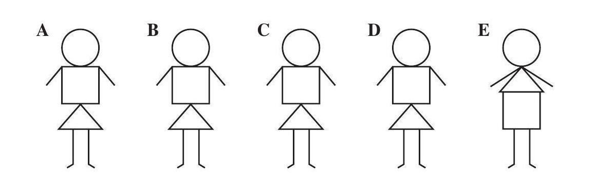
- ROI 裁剪图：[benchmarkallinone/outputs/report_priority_20/run_f2958f3118292117/datasets/mathvision/artifacts/crops/prob_1107f37018a7c959da630720_primary_roi.png](../../datasets/mathvision/artifacts/crops/prob_1107f37018a7c959da630720_primary_roi.png)

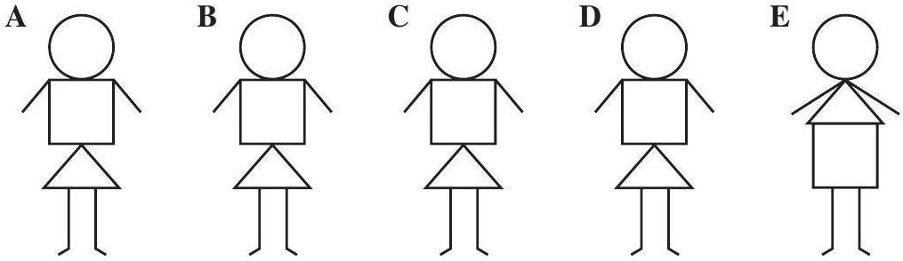

### 5) 清洗判定证据

```json
{
  "clean_score": 0.8737,
  "decision": "pass",
  "decision_reason_codes": [
    "meets_cleaning_requirements"
  ],
  "alignment_summary": {
    "alignment_id": "align_8105c11d4c7c1bf7f24b853f",
    "coverage_score": 0.9,
    "consistency_score": 0.9,
    "alignment_status": "good",
    "conflict_count": 1
  },
  "solvability_summary": {
    "solvability_id": "solv_prob_1107f37018a7c959da630720",
    "solvability_score": 1.0,
    "reasoning_path_exists": true,
    "decision_hint": "pass",
    "failure_codes": []
  },
  "missing_field_summary": {
    "missing_question_text": false,
    "missing_answer_text": false,
    "missing_image_count": 0
  },
  "risk_flags": [],
  "reject_record": null
}
```

---

## 02. prob_2697a38f8457c2a73358c701

- 样本文件：[benchmarkallinone/outputs/report_priority_20/run_f2958f3118292117/datasets/mathvision/samples/prob_2697a38f8457c2a73358c701.json](../../datasets/mathvision/samples/prob_2697a38f8457c2a73358c701.json)
- 源数据集：`MathVision`
- 源 split：`test`
- 源题目 ID：`16`
- 清洗路径：`multimodal_full`
- 是否文本主导：`False`
- 是否依赖图像：`True`
- 决策：`reject`
- 决策原因码：`low_resolution`
- 开放化改写策略：`keep_open`
- 对齐状态：`good`
- 可解性分数：`1.0`
- 可解性提示：`pass`
- 质量风险标记：`low_resolution`

### 采集阶段信号

```json
{
  "core_asset_completeness": {
    "has_question_text": true,
    "has_answer_text": true,
    "image_count": 1,
    "has_multiple_images": false
  },
  "initial_scores": {
    "initial_image_dependency_score": 0.9,
    "initial_multi_solution_score": 0.46,
    "initial_verifiability_score": 0.8776
  }
}
```

### 1) 处理前：原始题目 / 原始答案

**原始题目**

```text
How many points are there in the three unseen sides of dice?
<image1>
```

**原始答案**

```text
11
```

### 2) 处理后：规范化题目 / 规范化答案

**规范化题目**

```text
How many points are there in the three unseen sides of dice?
<image1>
```

**规范化答案**

```text
11
```

### 3) 开放化改写前后

**改写前（使用规范化题目作为输入）**

```text
How many points are there in the three unseen sides of dice?
<image1>
```

**改写后（开放题变体）**

```text
How many points are there in the three unseen sides of dice?
<image1>
```

- 期望答案类型：`numeric`
- 期望答案：`11`
- 改写 rationale：`Question is already open-ended.`
- 丢弃原因码：`无`

### 4) 图像与可视化产物

- 原始图像来源：`inline://pil_image`
- 持久化主图：[benchmarkallinone/outputs/report_priority_20/run_f2958f3118292117/datasets/mathvision/artifacts/images/prob_2697a38f8457c2a73358c701_primary.png](../../datasets/mathvision/artifacts/images/prob_2697a38f8457c2a73358c701_primary.png)

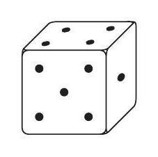
- ROI 裁剪图：[benchmarkallinone/outputs/report_priority_20/run_f2958f3118292117/datasets/mathvision/artifacts/crops/prob_2697a38f8457c2a73358c701_primary_roi.png](../../datasets/mathvision/artifacts/crops/prob_2697a38f8457c2a73358c701_primary_roi.png)

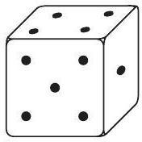

### 5) 清洗判定证据

```json
{
  "clean_score": 0.8731,
  "decision": "reject",
  "decision_reason_codes": [
    "low_resolution"
  ],
  "alignment_summary": {
    "alignment_id": "align_caa590b74bc98d9578760317",
    "coverage_score": 0.9,
    "consistency_score": 0.9,
    "alignment_status": "good",
    "conflict_count": 1
  },
  "solvability_summary": {
    "solvability_id": "solv_prob_2697a38f8457c2a73358c701",
    "solvability_score": 1.0,
    "reasoning_path_exists": true,
    "decision_hint": "pass",
    "failure_codes": []
  },
  "missing_field_summary": {
    "missing_question_text": false,
    "missing_answer_text": false,
    "missing_image_count": 0
  },
  "risk_flags": [
    "low_resolution"
  ],
  "reject_record": {
    "reject_id": "reject_caa590b74bc98d9578760317",
    "problem_id": "prob_2697a38f8457c2a73358c701",
    "stage": "cleaning",
    "reject_level": "problem",
    "reject_reason_codes": [
      "low_resolution"
    ],
    "reject_reason_detail": "Question is already open-ended.",
    "blocking_fields": [
      "low_resolution"
    ],
    "evidence_refs": [
      "align_caa590b74bc98d9578760317",
      "solv_prob_2697a38f8457c2a73358c701"
    ],
    "recoverable": false,
    "recommended_action": "drop",
    "reviewed_by": null,
    "created_at": "2026-03-25T08:47:27Z"
  }
}
```

---

## 03. prob_2829868b5411041402b3c9cf

- 样本文件：[benchmarkallinone/outputs/report_priority_20/run_f2958f3118292117/datasets/mathvision/samples/prob_2829868b5411041402b3c9cf.json](../../datasets/mathvision/samples/prob_2829868b5411041402b3c9cf.json)
- 源数据集：`MathVision`
- 源 split：`test`
- 源题目 ID：`7`
- 清洗路径：`multimodal_full`
- 是否文本主导：`False`
- 是否依赖图像：`True`
- 决策：`reject`
- 决策原因码：`low_resolution`
- 开放化改写策略：`keep_open`
- 对齐状态：`good`
- 可解性分数：`1.0`
- 可解性提示：`pass`
- 质量风险标记：`low_resolution, low_text_completeness`

### 采集阶段信号

```json
{
  "core_asset_completeness": {
    "has_question_text": true,
    "has_answer_text": true,
    "image_count": 1,
    "has_multiple_images": false
  },
  "initial_scores": {
    "initial_image_dependency_score": 0.9,
    "initial_multi_solution_score": 0.46,
    "initial_verifiability_score": 0.8865
  }
}
```

### 1) 处理前：原始题目 / 原始答案

**原始题目**

```text
How many bricks are missing in the wall?
<image1>
```

**原始答案**

```text
6
```

### 2) 处理后：规范化题目 / 规范化答案

**规范化题目**

```text
How many bricks are missing in the wall?
<image1>
```

**规范化答案**

```text
6
```

### 3) 开放化改写前后

**改写前（使用规范化题目作为输入）**

```text
How many bricks are missing in the wall?
<image1>
```

**改写后（开放题变体）**

```text
How many bricks are missing in the wall?
<image1>
```

- 期望答案类型：`numeric`
- 期望答案：`6`
- 改写 rationale：`Question is already open-ended.`
- 丢弃原因码：`无`

### 4) 图像与可视化产物

- 原始图像来源：`inline://pil_image`
- 持久化主图：[benchmarkallinone/outputs/report_priority_20/run_f2958f3118292117/datasets/mathvision/artifacts/images/prob_2829868b5411041402b3c9cf_primary.png](../../datasets/mathvision/artifacts/images/prob_2829868b5411041402b3c9cf_primary.png)

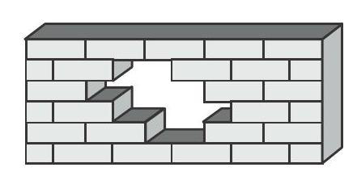
- ROI 裁剪图：[benchmarkallinone/outputs/report_priority_20/run_f2958f3118292117/datasets/mathvision/artifacts/crops/prob_2829868b5411041402b3c9cf_primary_roi.png](../../datasets/mathvision/artifacts/crops/prob_2829868b5411041402b3c9cf_primary_roi.png)

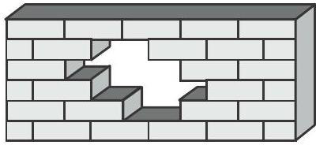

### 5) 清洗判定证据

```json
{
  "clean_score": 0.883,
  "decision": "reject",
  "decision_reason_codes": [
    "low_resolution"
  ],
  "alignment_summary": {
    "alignment_id": "align_1f5912580f9c534286f27b36",
    "coverage_score": 0.9,
    "consistency_score": 0.9,
    "alignment_status": "good",
    "conflict_count": 1
  },
  "solvability_summary": {
    "solvability_id": "solv_prob_2829868b5411041402b3c9cf",
    "solvability_score": 1.0,
    "reasoning_path_exists": true,
    "decision_hint": "pass",
    "failure_codes": []
  },
  "missing_field_summary": {
    "missing_question_text": false,
    "missing_answer_text": false,
    "missing_image_count": 0
  },
  "risk_flags": [
    "low_resolution",
    "low_text_completeness"
  ],
  "reject_record": {
    "reject_id": "reject_1f5912580f9c534286f27b36",
    "problem_id": "prob_2829868b5411041402b3c9cf",
    "stage": "cleaning",
    "reject_level": "problem",
    "reject_reason_codes": [
      "low_resolution"
    ],
    "reject_reason_detail": "Question is already open-ended.",
    "blocking_fields": [
      "low_resolution",
      "low_text_completeness"
    ],
    "evidence_refs": [
      "align_1f5912580f9c534286f27b36",
      "solv_prob_2829868b5411041402b3c9cf"
    ],
    "recoverable": false,
    "recommended_action": "drop",
    "reviewed_by": null,
    "created_at": "2026-03-25T08:47:26Z"
  }
}
```

---

## 04. prob_2ade924e60e14f2fc742fbe0

- 样本文件：[benchmarkallinone/outputs/report_priority_20/run_f2958f3118292117/datasets/mathvision/samples/prob_2ade924e60e14f2fc742fbe0.json](../../datasets/mathvision/samples/prob_2ade924e60e14f2fc742fbe0.json)
- 源数据集：`MathVision`
- 源 split：`test`
- 源题目 ID：`6`
- 清洗路径：`multimodal_full`
- 是否文本主导：`False`
- 是否依赖图像：`True`
- 决策：`pass`
- 决策原因码：`meets_cleaning_requirements`
- 开放化改写策略：`blank_open`
- 对齐状态：`good`
- 可解性分数：`1.0`
- 可解性提示：`pass`
- 质量风险标记：`无`

### 采集阶段信号

```json
{
  "core_asset_completeness": {
    "has_question_text": true,
    "has_answer_text": true,
    "image_count": 1,
    "has_multiple_images": false
  },
  "initial_scores": {
    "initial_image_dependency_score": 0.9,
    "initial_multi_solution_score": 0.7,
    "initial_verifiability_score": 0.8899
  }
}
```

### 1) 处理前：原始题目 / 原始答案

**原始题目**

```text
Misty the cat has five kittens: two of them are striped, one spotty, the rest of them are absolutely white. In which picture can we see the kittens of Misty, knowing that the ears of one of them are of different colour?
<image1>
```

**原始答案**

```text
D
```

### 2) 处理后：规范化题目 / 规范化答案

**规范化题目**

```text
Misty the cat has five kittens: two of them are striped, one spotty, the rest of them are absolutely white. In which picture can we see the kittens of Misty, knowing that the ears of one of them are of different colour?
<image1>
```

**规范化答案**

```text
D
```

### 3) 开放化改写前后

**改写前（使用规范化题目作为输入）**

```text
Misty the cat has five kittens: two of them are striped, one spotty, the rest of them are absolutely white. In which picture can we see the kittens of Misty, knowing that the ears of one of them are of different colour?
<image1>
```

**改写后（开放题变体）**

```text
Misty the cat has five kittens: two of them are striped, one spotty, the rest of them are absolutely white. In which picture can we see the kittens of Misty, knowing that the ears of one of them are of different colour?
<image1>
```

- 期望答案类型：`numeric`
- 期望答案：`D`
- 改写 rationale：`Converted multiple choice into blank-style open-ended question.`
- 丢弃原因码：`无`

### 4) 图像与可视化产物

- 原始图像来源：`inline://pil_image`
- 持久化主图：[benchmarkallinone/outputs/report_priority_20/run_f2958f3118292117/datasets/mathvision/artifacts/images/prob_2ade924e60e14f2fc742fbe0_primary.png](../../datasets/mathvision/artifacts/images/prob_2ade924e60e14f2fc742fbe0_primary.png)

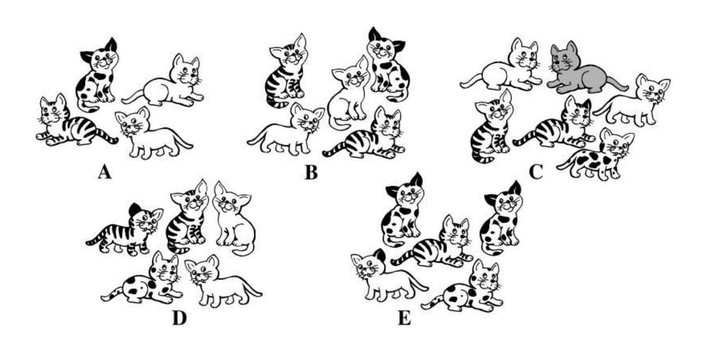
- ROI 裁剪图：[benchmarkallinone/outputs/report_priority_20/run_f2958f3118292117/datasets/mathvision/artifacts/crops/prob_2ade924e60e14f2fc742fbe0_primary_roi.png](../../datasets/mathvision/artifacts/crops/prob_2ade924e60e14f2fc742fbe0_primary_roi.png)

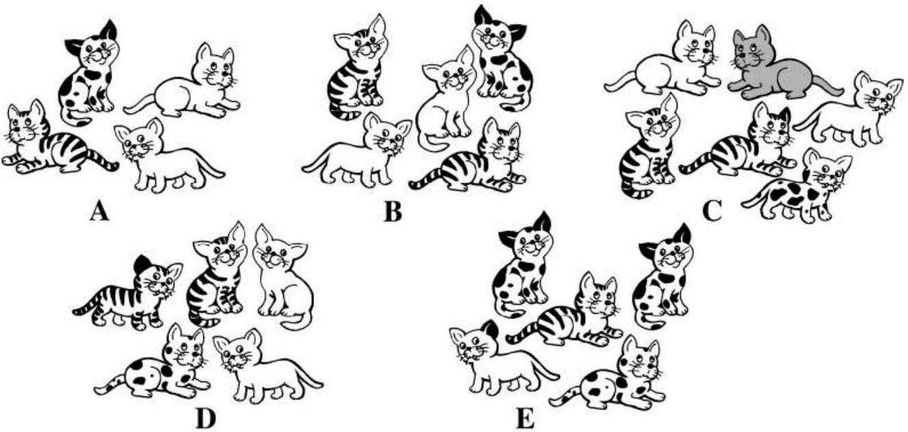

### 5) 清洗判定证据

```json
{
  "clean_score": 0.9135,
  "decision": "pass",
  "decision_reason_codes": [
    "meets_cleaning_requirements"
  ],
  "alignment_summary": {
    "alignment_id": "align_f352a63dd7701df56a36753a",
    "coverage_score": 0.9,
    "consistency_score": 0.9,
    "alignment_status": "good",
    "conflict_count": 1
  },
  "solvability_summary": {
    "solvability_id": "solv_prob_2ade924e60e14f2fc742fbe0",
    "solvability_score": 1.0,
    "reasoning_path_exists": true,
    "decision_hint": "pass",
    "failure_codes": []
  },
  "missing_field_summary": {
    "missing_question_text": false,
    "missing_answer_text": false,
    "missing_image_count": 0
  },
  "risk_flags": [],
  "reject_record": null
}
```

---

## 05. prob_2ef5fecbeffcabb3a53c12ed

- 样本文件：[benchmarkallinone/outputs/report_priority_20/run_f2958f3118292117/datasets/mathvision/samples/prob_2ef5fecbeffcabb3a53c12ed.json](../../datasets/mathvision/samples/prob_2ef5fecbeffcabb3a53c12ed.json)
- 源数据集：`MathVision`
- 源 split：`test`
- 源题目 ID：`2`
- 清洗路径：`multimodal_full`
- 是否文本主导：`False`
- 是否依赖图像：`True`
- 决策：`review`
- 决策原因码：`normalized_question_incomplete`
- 开放化改写策略：`blank_open`
- 对齐状态：`good`
- 可解性分数：`1.0`
- 可解性提示：`pass`
- 质量风险标记：`low_text_completeness`

### 采集阶段信号

```json
{
  "core_asset_completeness": {
    "has_question_text": true,
    "has_answer_text": true,
    "image_count": 1,
    "has_multiple_images": false
  },
  "initial_scores": {
    "initial_image_dependency_score": 0.9,
    "initial_multi_solution_score": 0.52,
    "initial_verifiability_score": 0.8866
  }
}
```

### 1) 处理前：原始题目 / 原始答案

**原始题目**

```text
Which bike is most expensive?
<image1>
```

**原始答案**

```text
A
```

### 2) 处理后：规范化题目 / 规范化答案

**规范化题目**

```text
Which bike is most expensive?
<image1>
```

**规范化答案**

```text
A
```

### 3) 开放化改写前后

**改写前（使用规范化题目作为输入）**

```text
Which bike is most expensive?
<image1>
```

**改写后（开放题变体）**

```text
Which bike is most expensive?
<image1>
```

- 期望答案类型：`numeric`
- 期望答案：`A`
- 改写 rationale：`Converted multiple choice into blank-style open-ended question.`
- 丢弃原因码：`无`

### 4) 图像与可视化产物

- 原始图像来源：`inline://pil_image`
- 持久化主图：[benchmarkallinone/outputs/report_priority_20/run_f2958f3118292117/datasets/mathvision/artifacts/images/prob_2ef5fecbeffcabb3a53c12ed_primary.png](../../datasets/mathvision/artifacts/images/prob_2ef5fecbeffcabb3a53c12ed_primary.png)

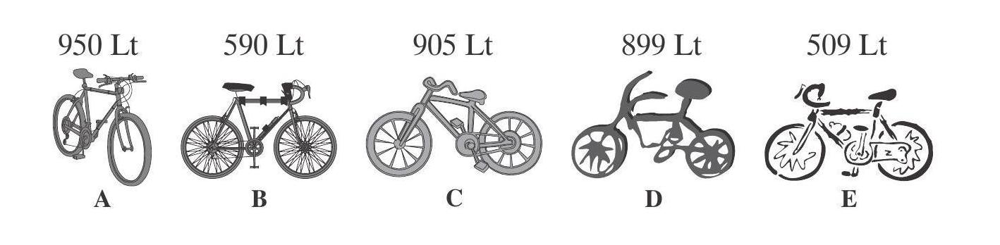
- ROI 裁剪图：[benchmarkallinone/outputs/report_priority_20/run_f2958f3118292117/datasets/mathvision/artifacts/crops/prob_2ef5fecbeffcabb3a53c12ed_primary_roi.png](../../datasets/mathvision/artifacts/crops/prob_2ef5fecbeffcabb3a53c12ed_primary_roi.png)

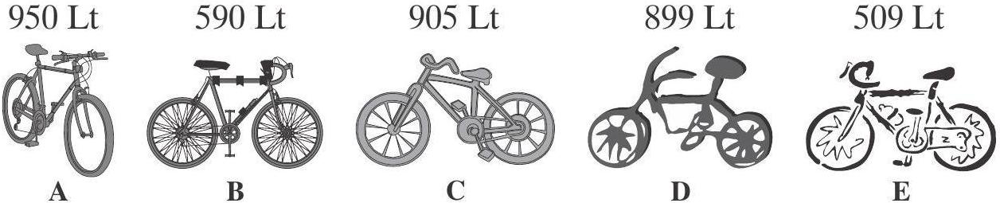

### 5) 清洗判定证据

```json
{
  "clean_score": 0.8816,
  "decision": "review",
  "decision_reason_codes": [
    "normalized_question_incomplete"
  ],
  "alignment_summary": {
    "alignment_id": "align_f3230c66adf1c5e027f45224",
    "coverage_score": 0.9,
    "consistency_score": 0.9,
    "alignment_status": "good",
    "conflict_count": 1
  },
  "solvability_summary": {
    "solvability_id": "solv_prob_2ef5fecbeffcabb3a53c12ed",
    "solvability_score": 1.0,
    "reasoning_path_exists": true,
    "decision_hint": "pass",
    "failure_codes": []
  },
  "missing_field_summary": {
    "missing_question_text": false,
    "missing_answer_text": false,
    "missing_image_count": 0
  },
  "risk_flags": [
    "low_text_completeness"
  ],
  "reject_record": null
}
```

---

## 06. prob_3d78becf15a57caf11f3ca84

- 样本文件：[benchmarkallinone/outputs/report_priority_20/run_f2958f3118292117/datasets/mathvision/samples/prob_3d78becf15a57caf11f3ca84.json](../../datasets/mathvision/samples/prob_3d78becf15a57caf11f3ca84.json)
- 源数据集：`MathVision`
- 源 split：`test`
- 源题目 ID：`9`
- 清洗路径：`multimodal_full`
- 是否文本主导：`False`
- 是否依赖图像：`True`
- 决策：`pass`
- 决策原因码：`meets_cleaning_requirements`
- 开放化改写策略：`blank_open`
- 对齐状态：`good`
- 可解性分数：`1.0`
- 可解性提示：`pass`
- 质量风险标记：`无`

### 采集阶段信号

```json
{
  "core_asset_completeness": {
    "has_question_text": true,
    "has_answer_text": true,
    "image_count": 1,
    "has_multiple_images": false
  },
  "initial_scores": {
    "initial_image_dependency_score": 0.9,
    "initial_multi_solution_score": 0.52,
    "initial_verifiability_score": 0.8898
  }
}
```

### 1) 处理前：原始题目 / 原始答案

**原始题目**

```text
A squirrel is following the paths of labyrinth and collecting food for winter. Which stuff it will not be able to take?
<image1>
```

**原始答案**

```text
D
```

### 2) 处理后：规范化题目 / 规范化答案

**规范化题目**

```text
A squirrel is following the paths of labyrinth and collecting food for winter. Which stuff it will not be able to take?
<image1>
```

**规范化答案**

```text
D
```

### 3) 开放化改写前后

**改写前（使用规范化题目作为输入）**

```text
A squirrel is following the paths of labyrinth and collecting food for winter. Which stuff it will not be able to take?
<image1>
```

**改写后（开放题变体）**

```text
A squirrel is following the paths of labyrinth and collecting food for winter. Which stuff it will not be able to take?
<image1>
```

- 期望答案类型：`numeric`
- 期望答案：`D`
- 改写 rationale：`Converted multiple choice into blank-style open-ended question.`
- 丢弃原因码：`无`

### 4) 图像与可视化产物

- 原始图像来源：`inline://pil_image`
- 持久化主图：[benchmarkallinone/outputs/report_priority_20/run_f2958f3118292117/datasets/mathvision/artifacts/images/prob_3d78becf15a57caf11f3ca84_primary.png](../../datasets/mathvision/artifacts/images/prob_3d78becf15a57caf11f3ca84_primary.png)

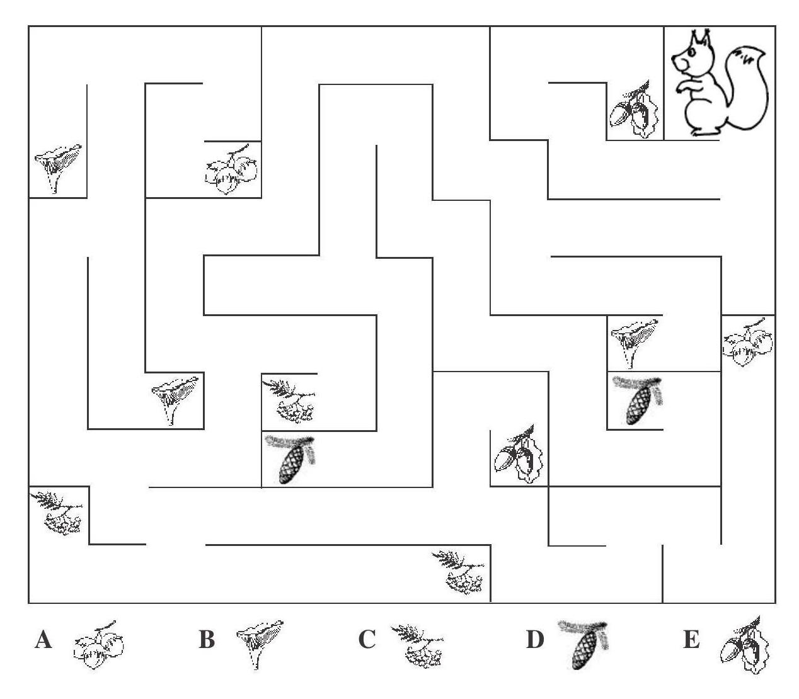
- ROI 裁剪图：[benchmarkallinone/outputs/report_priority_20/run_f2958f3118292117/datasets/mathvision/artifacts/crops/prob_3d78becf15a57caf11f3ca84_primary_roi.png](../../datasets/mathvision/artifacts/crops/prob_3d78becf15a57caf11f3ca84_primary_roi.png)

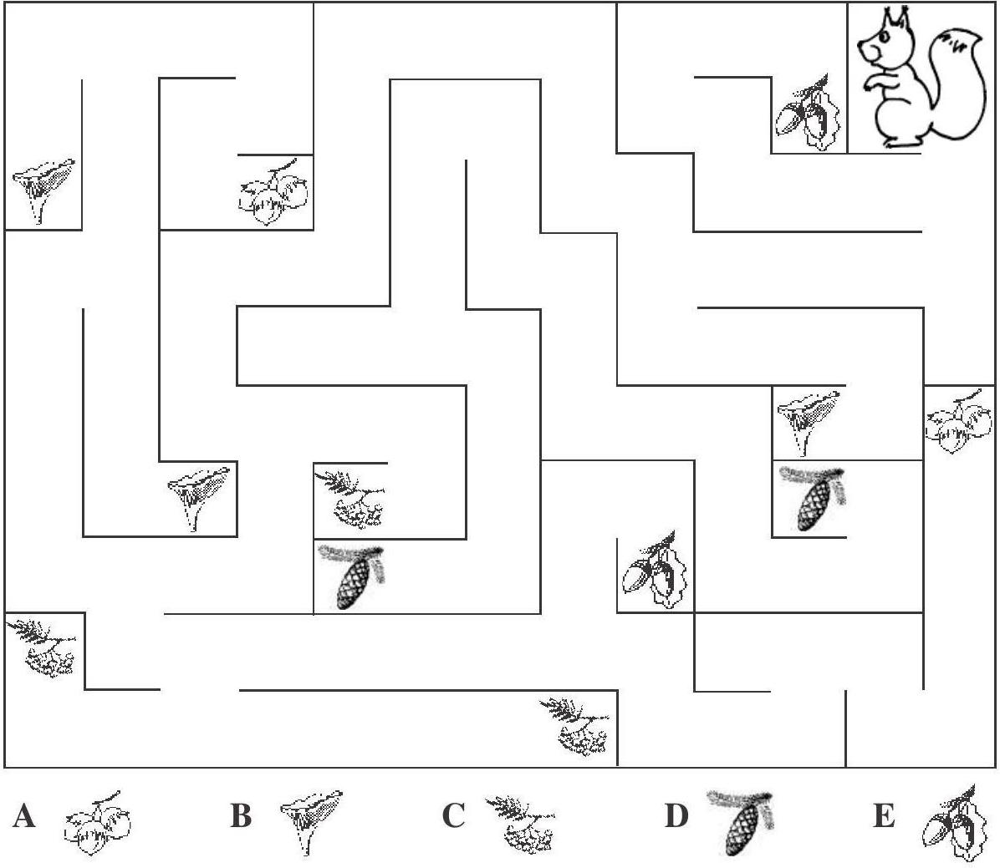

### 5) 清洗判定证据

```json
{
  "clean_score": 0.8991,
  "decision": "pass",
  "decision_reason_codes": [
    "meets_cleaning_requirements"
  ],
  "alignment_summary": {
    "alignment_id": "align_9d75c335412d974eb07019f8",
    "coverage_score": 0.9,
    "consistency_score": 0.9,
    "alignment_status": "good",
    "conflict_count": 1
  },
  "solvability_summary": {
    "solvability_id": "solv_prob_3d78becf15a57caf11f3ca84",
    "solvability_score": 1.0,
    "reasoning_path_exists": true,
    "decision_hint": "pass",
    "failure_codes": []
  },
  "missing_field_summary": {
    "missing_question_text": false,
    "missing_answer_text": false,
    "missing_image_count": 0
  },
  "risk_flags": [],
  "reject_record": null
}
```

---

## 07. prob_4a8f5a264adc1d6d534c5550

- 样本文件：[benchmarkallinone/outputs/report_priority_20/run_f2958f3118292117/datasets/mathvision/samples/prob_4a8f5a264adc1d6d534c5550.json](../../datasets/mathvision/samples/prob_4a8f5a264adc1d6d534c5550.json)
- 源数据集：`MathVision`
- 源 split：`test`
- 源题目 ID：`4`
- 清洗路径：`multimodal_full`
- 是否文本主导：`False`
- 是否依赖图像：`True`
- 决策：`pass`
- 决策原因码：`meets_cleaning_requirements`
- 开放化改写策略：`keep_open`
- 对齐状态：`good`
- 可解性分数：`1.0`
- 可解性提示：`pass`
- 质量风险标记：`无`

### 采集阶段信号

```json
{
  "core_asset_completeness": {
    "has_question_text": true,
    "has_answer_text": true,
    "image_count": 1,
    "has_multiple_images": false
  },
  "initial_scores": {
    "initial_image_dependency_score": 0.9,
    "initial_multi_solution_score": 0.64,
    "initial_verifiability_score": 0.8884
  }
}
```

### 1) 处理前：原始题目 / 原始答案

**原始题目**

```text
How many different digits can you find in this picture?
<image1>
```

**原始答案**

```text
6
```

### 2) 处理后：规范化题目 / 规范化答案

**规范化题目**

```text
How many different digits can you find in this picture?
<image1>
```

**规范化答案**

```text
6
```

### 3) 开放化改写前后

**改写前（使用规范化题目作为输入）**

```text
How many different digits can you find in this picture?
<image1>
```

**改写后（开放题变体）**

```text
How many different digits can you find in this picture?
<image1>
```

- 期望答案类型：`numeric`
- 期望答案：`6`
- 改写 rationale：`Question is already open-ended.`
- 丢弃原因码：`无`

### 4) 图像与可视化产物

- 原始图像来源：`inline://pil_image`
- 持久化主图：[benchmarkallinone/outputs/report_priority_20/run_f2958f3118292117/datasets/mathvision/artifacts/images/prob_4a8f5a264adc1d6d534c5550_primary.png](../../datasets/mathvision/artifacts/images/prob_4a8f5a264adc1d6d534c5550_primary.png)

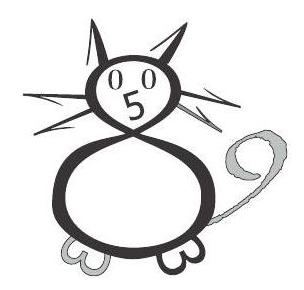
- ROI 裁剪图：[benchmarkallinone/outputs/report_priority_20/run_f2958f3118292117/datasets/mathvision/artifacts/crops/prob_4a8f5a264adc1d6d534c5550_primary_roi.png](../../datasets/mathvision/artifacts/crops/prob_4a8f5a264adc1d6d534c5550_primary_roi.png)

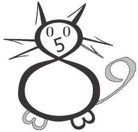

### 5) 清洗判定证据

```json
{
  "clean_score": 0.888,
  "decision": "pass",
  "decision_reason_codes": [
    "meets_cleaning_requirements"
  ],
  "alignment_summary": {
    "alignment_id": "align_741a186c98a2e0b48243d249",
    "coverage_score": 0.9,
    "consistency_score": 0.9,
    "alignment_status": "good",
    "conflict_count": 1
  },
  "solvability_summary": {
    "solvability_id": "solv_prob_4a8f5a264adc1d6d534c5550",
    "solvability_score": 1.0,
    "reasoning_path_exists": true,
    "decision_hint": "pass",
    "failure_codes": []
  },
  "missing_field_summary": {
    "missing_question_text": false,
    "missing_answer_text": false,
    "missing_image_count": 0
  },
  "risk_flags": [],
  "reject_record": null
}
```

---

## 08. prob_562573f1741448047ddf9a5d

- 样本文件：[benchmarkallinone/outputs/report_priority_20/run_f2958f3118292117/datasets/mathvision/samples/prob_562573f1741448047ddf9a5d.json](../../datasets/mathvision/samples/prob_562573f1741448047ddf9a5d.json)
- 源数据集：`MathVision`
- 源 split：`test`
- 源题目 ID：`1`
- 清洗路径：`multimodal_full`
- 是否文本主导：`False`
- 是否依赖图像：`True`
- 决策：`reject`
- 决策原因码：`low_resolution`
- 开放化改写策略：`keep_open`
- 对齐状态：`good`
- 可解性分数：`1.0`
- 可解性提示：`pass`
- 质量风险标记：`low_resolution`

### 采集阶段信号

```json
{
  "core_asset_completeness": {
    "has_question_text": true,
    "has_answer_text": true,
    "image_count": 1,
    "has_multiple_images": false
  },
  "initial_scores": {
    "initial_image_dependency_score": 0.9,
    "initial_multi_solution_score": 0.46,
    "initial_verifiability_score": 0.8754
  }
}
```

### 1) 处理前：原始题目 / 原始答案

**原始题目**

```text
Which number should be written in place of the question mark?
<image1>
```

**原始答案**

```text
60
```

### 2) 处理后：规范化题目 / 规范化答案

**规范化题目**

```text
Which number should be written in place of the question mark?
<image1>
```

**规范化答案**

```text
60
```

### 3) 开放化改写前后

**改写前（使用规范化题目作为输入）**

```text
Which number should be written in place of the question mark?
<image1>
```

**改写后（开放题变体）**

```text
Which number should be written in place of the question mark?
<image1>
```

- 期望答案类型：`numeric`
- 期望答案：`60`
- 改写 rationale：`Question is already open-ended.`
- 丢弃原因码：`无`

### 4) 图像与可视化产物

- 原始图像来源：`inline://pil_image`
- 持久化主图：[benchmarkallinone/outputs/report_priority_20/run_f2958f3118292117/datasets/mathvision/artifacts/images/prob_562573f1741448047ddf9a5d_primary.png](../../datasets/mathvision/artifacts/images/prob_562573f1741448047ddf9a5d_primary.png)

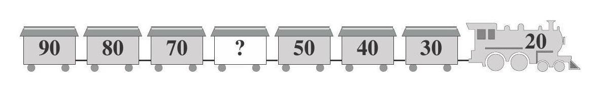
- ROI 裁剪图：[benchmarkallinone/outputs/report_priority_20/run_f2958f3118292117/datasets/mathvision/artifacts/crops/prob_562573f1741448047ddf9a5d_primary_roi.png](../../datasets/mathvision/artifacts/crops/prob_562573f1741448047ddf9a5d_primary_roi.png)

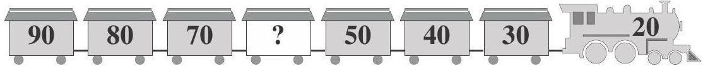

### 5) 清洗判定证据

```json
{
  "clean_score": 0.8941,
  "decision": "reject",
  "decision_reason_codes": [
    "low_resolution"
  ],
  "alignment_summary": {
    "alignment_id": "align_e2cf90adbfb0b6d50871191c",
    "coverage_score": 0.9,
    "consistency_score": 0.9,
    "alignment_status": "good",
    "conflict_count": 1
  },
  "solvability_summary": {
    "solvability_id": "solv_prob_562573f1741448047ddf9a5d",
    "solvability_score": 1.0,
    "reasoning_path_exists": true,
    "decision_hint": "pass",
    "failure_codes": []
  },
  "missing_field_summary": {
    "missing_question_text": false,
    "missing_answer_text": false,
    "missing_image_count": 0
  },
  "risk_flags": [
    "low_resolution"
  ],
  "reject_record": {
    "reject_id": "reject_e2cf90adbfb0b6d50871191c",
    "problem_id": "prob_562573f1741448047ddf9a5d",
    "stage": "cleaning",
    "reject_level": "problem",
    "reject_reason_codes": [
      "low_resolution"
    ],
    "reject_reason_detail": "Question is already open-ended.",
    "blocking_fields": [
      "low_resolution"
    ],
    "evidence_refs": [
      "align_e2cf90adbfb0b6d50871191c",
      "solv_prob_562573f1741448047ddf9a5d"
    ],
    "recoverable": false,
    "recommended_action": "drop",
    "reviewed_by": null,
    "created_at": "2026-03-25T08:47:26Z"
  }
}
```

---

## 09. prob_5f474e063b4dedfb7fbad5ae

- 样本文件：[benchmarkallinone/outputs/report_priority_20/run_f2958f3118292117/datasets/mathvision/samples/prob_5f474e063b4dedfb7fbad5ae.json](../../datasets/mathvision/samples/prob_5f474e063b4dedfb7fbad5ae.json)
- 源数据集：`MathVision`
- 源 split：`test`
- 源题目 ID：`17`
- 清洗路径：`multimodal_full`
- 是否文本主导：`False`
- 是否依赖图像：`True`
- 决策：`reject`
- 决策原因码：`low_resolution`
- 开放化改写策略：`keep_open`
- 对齐状态：`good`
- 可解性分数：`1.0`
- 可解性提示：`pass`
- 质量风险标记：`low_resolution`

### 采集阶段信号

```json
{
  "core_asset_completeness": {
    "has_question_text": true,
    "has_answer_text": true,
    "image_count": 1,
    "has_multiple_images": false
  },
  "initial_scores": {
    "initial_image_dependency_score": 0.9,
    "initial_multi_solution_score": 0.46,
    "initial_verifiability_score": 0.8726
  }
}
```

### 1) 处理前：原始题目 / 原始答案

**原始题目**

```text
A jump of a little kangaroo is three times shorter than its mother's. How many jumps should the little kangaroo make to cover the distance equal to 7 jumps of its mother?
<image1>
```

**原始答案**

```text
21
```

### 2) 处理后：规范化题目 / 规范化答案

**规范化题目**

```text
A jump of a little kangaroo is three times shorter than its mother's. How many jumps should the little kangaroo make to cover the distance equal to 7 jumps of its mother?
<image1>
```

**规范化答案**

```text
21
```

### 3) 开放化改写前后

**改写前（使用规范化题目作为输入）**

```text
A jump of a little kangaroo is three times shorter than its mother's. How many jumps should the little kangaroo make to cover the distance equal to 7 jumps of its mother?
<image1>
```

**改写后（开放题变体）**

```text
A jump of a little kangaroo is three times shorter than its mother's. How many jumps should the little kangaroo make to cover the distance equal to 7 jumps of its mother?
<image1>
```

- 期望答案类型：`numeric`
- 期望答案：`21`
- 改写 rationale：`Question is already open-ended.`
- 丢弃原因码：`无`

### 4) 图像与可视化产物

- 原始图像来源：`inline://pil_image`
- 持久化主图：[benchmarkallinone/outputs/report_priority_20/run_f2958f3118292117/datasets/mathvision/artifacts/images/prob_5f474e063b4dedfb7fbad5ae_primary.png](../../datasets/mathvision/artifacts/images/prob_5f474e063b4dedfb7fbad5ae_primary.png)

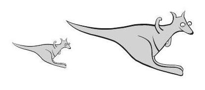
- ROI 裁剪图：[benchmarkallinone/outputs/report_priority_20/run_f2958f3118292117/datasets/mathvision/artifacts/crops/prob_5f474e063b4dedfb7fbad5ae_primary_roi.png](../../datasets/mathvision/artifacts/crops/prob_5f474e063b4dedfb7fbad5ae_primary_roi.png)

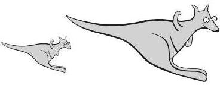

### 5) 清洗判定证据

```json
{
  "clean_score": 0.8818,
  "decision": "reject",
  "decision_reason_codes": [
    "low_resolution"
  ],
  "alignment_summary": {
    "alignment_id": "align_8690ac1f8b8f33964f0b3bab",
    "coverage_score": 0.9,
    "consistency_score": 0.9,
    "alignment_status": "good",
    "conflict_count": 1
  },
  "solvability_summary": {
    "solvability_id": "solv_prob_5f474e063b4dedfb7fbad5ae",
    "solvability_score": 1.0,
    "reasoning_path_exists": true,
    "decision_hint": "pass",
    "failure_codes": []
  },
  "missing_field_summary": {
    "missing_question_text": false,
    "missing_answer_text": false,
    "missing_image_count": 0
  },
  "risk_flags": [
    "low_resolution"
  ],
  "reject_record": {
    "reject_id": "reject_8690ac1f8b8f33964f0b3bab",
    "problem_id": "prob_5f474e063b4dedfb7fbad5ae",
    "stage": "cleaning",
    "reject_level": "problem",
    "reject_reason_codes": [
      "low_resolution"
    ],
    "reject_reason_detail": "Question is already open-ended.",
    "blocking_fields": [
      "low_resolution"
    ],
    "evidence_refs": [
      "align_8690ac1f8b8f33964f0b3bab",
      "solv_prob_5f474e063b4dedfb7fbad5ae"
    ],
    "recoverable": false,
    "recommended_action": "drop",
    "reviewed_by": null,
    "created_at": "2026-03-25T08:47:27Z"
  }
}
```

---

## 10. prob_731d12752f80a77f518bd334

- 样本文件：[benchmarkallinone/outputs/report_priority_20/run_f2958f3118292117/datasets/mathvision/samples/prob_731d12752f80a77f518bd334.json](../../datasets/mathvision/samples/prob_731d12752f80a77f518bd334.json)
- 源数据集：`MathVision`
- 源 split：`test`
- 源题目 ID：`12`
- 清洗路径：`multimodal_full`
- 是否文本主导：`False`
- 是否依赖图像：`True`
- 决策：`pass`
- 决策原因码：`meets_cleaning_requirements`
- 开放化改写策略：`keep_open`
- 对齐状态：`good`
- 可解性分数：`1.0`
- 可解性提示：`pass`
- 质量风险标记：`无`

### 采集阶段信号

```json
{
  "core_asset_completeness": {
    "has_question_text": true,
    "has_answer_text": true,
    "image_count": 1,
    "has_multiple_images": false
  },
  "initial_scores": {
    "initial_image_dependency_score": 0.9,
    "initial_multi_solution_score": 0.46,
    "initial_verifiability_score": 0.8896
  }
}
```

### 1) 处理前：原始题目 / 原始答案

**原始题目**

```text
Now it is 2008. What is the total sum of these digits?
<image1>
```

**原始答案**

```text
10
```

### 2) 处理后：规范化题目 / 规范化答案

**规范化题目**

```text
Now it is 2008. What is the total sum of these digits?
<image1>
```

**规范化答案**

```text
10
```

### 3) 开放化改写前后

**改写前（使用规范化题目作为输入）**

```text
Now it is 2008. What is the total sum of these digits?
<image1>
```

**改写后（开放题变体）**

```text
Now it is 2008. What is the total sum of these digits?
<image1>
```

- 期望答案类型：`numeric`
- 期望答案：`10`
- 改写 rationale：`Question is already open-ended.`
- 丢弃原因码：`无`

### 4) 图像与可视化产物

- 原始图像来源：`inline://pil_image`
- 持久化主图：[benchmarkallinone/outputs/report_priority_20/run_f2958f3118292117/datasets/mathvision/artifacts/images/prob_731d12752f80a77f518bd334_primary.png](../../datasets/mathvision/artifacts/images/prob_731d12752f80a77f518bd334_primary.png)

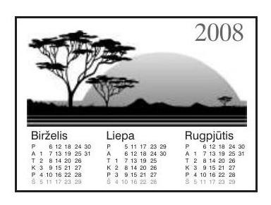
- ROI 裁剪图：[benchmarkallinone/outputs/report_priority_20/run_f2958f3118292117/datasets/mathvision/artifacts/crops/prob_731d12752f80a77f518bd334_primary_roi.png](../../datasets/mathvision/artifacts/crops/prob_731d12752f80a77f518bd334_primary_roi.png)

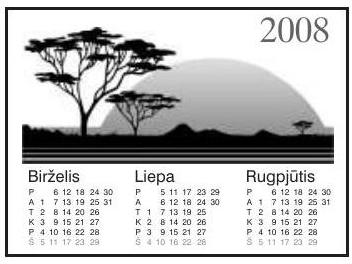

### 5) 清洗判定证据

```json
{
  "clean_score": 0.8896,
  "decision": "pass",
  "decision_reason_codes": [
    "meets_cleaning_requirements"
  ],
  "alignment_summary": {
    "alignment_id": "align_0748ecd311a6f06f66e05f98",
    "coverage_score": 0.9,
    "consistency_score": 0.9,
    "alignment_status": "good",
    "conflict_count": 1
  },
  "solvability_summary": {
    "solvability_id": "solv_prob_731d12752f80a77f518bd334",
    "solvability_score": 1.0,
    "reasoning_path_exists": true,
    "decision_hint": "pass",
    "failure_codes": []
  },
  "missing_field_summary": {
    "missing_question_text": false,
    "missing_answer_text": false,
    "missing_image_count": 0
  },
  "risk_flags": [],
  "reject_record": null
}
```

---

## 11. prob_7a6265664903ad85323527d5

- 样本文件：[benchmarkallinone/outputs/report_priority_20/run_f2958f3118292117/datasets/mathvision/samples/prob_7a6265664903ad85323527d5.json](../../datasets/mathvision/samples/prob_7a6265664903ad85323527d5.json)
- 源数据集：`MathVision`
- 源 split：`test`
- 源题目 ID：`14`
- 清洗路径：`multimodal_full`
- 是否文本主导：`False`
- 是否依赖图像：`True`
- 决策：`pass`
- 决策原因码：`meets_cleaning_requirements`
- 开放化改写策略：`keep_open`
- 对齐状态：`good`
- 可解性分数：`1.0`
- 可解性提示：`pass`
- 质量风险标记：`无`

### 采集阶段信号

```json
{
  "core_asset_completeness": {
    "has_question_text": true,
    "has_answer_text": true,
    "image_count": 1,
    "has_multiple_images": false
  },
  "initial_scores": {
    "initial_image_dependency_score": 0.9,
    "initial_multi_solution_score": 0.46,
    "initial_verifiability_score": 0.8814
  }
}
```

### 1) 处理前：原始题目 / 原始答案

**原始题目**

```text
Mary has written all the numbers from 1 to 30 . How many times has she written digit 2?
<image1>
```

**原始答案**

```text
13
```

### 2) 处理后：规范化题目 / 规范化答案

**规范化题目**

```text
Mary has written all the numbers from 1 to 30 . How many times has she written digit 2?
<image1>
```

**规范化答案**

```text
13
```

### 3) 开放化改写前后

**改写前（使用规范化题目作为输入）**

```text
Mary has written all the numbers from 1 to 30 . How many times has she written digit 2?
<image1>
```

**改写后（开放题变体）**

```text
Mary has written all the numbers from 1 to 30 . How many times has she written digit 2?
<image1>
```

- 期望答案类型：`numeric`
- 期望答案：`13`
- 改写 rationale：`Question is already open-ended.`
- 丢弃原因码：`无`

### 4) 图像与可视化产物

- 原始图像来源：`inline://pil_image`
- 持久化主图：[benchmarkallinone/outputs/report_priority_20/run_f2958f3118292117/datasets/mathvision/artifacts/images/prob_7a6265664903ad85323527d5_primary.png](../../datasets/mathvision/artifacts/images/prob_7a6265664903ad85323527d5_primary.png)


- ROI 裁剪图：[benchmarkallinone/outputs/report_priority_20/run_f2958f3118292117/datasets/mathvision/artifacts/crops/prob_7a6265664903ad85323527d5_primary_roi.png](../../datasets/mathvision/artifacts/crops/prob_7a6265664903ad85323527d5_primary_roi.png)


### 5) 清洗判定证据

```json
{
  "clean_score": 0.8824,
  "decision": "pass",
  "decision_reason_codes": [
    "meets_cleaning_requirements"
  ],
  "alignment_summary": {
    "alignment_id": "align_c0b4256ecbd28f92ea98f5e7",
    "coverage_score": 0.9,
    "consistency_score": 0.9,
    "alignment_status": "good",
    "conflict_count": 1
  },
  "solvability_summary": {
    "solvability_id": "solv_prob_7a6265664903ad85323527d5",
    "solvability_score": 1.0,
    "reasoning_path_exists": true,
    "decision_hint": "pass",
    "failure_codes": []
  },
  "missing_field_summary": {
    "missing_question_text": false,
    "missing_answer_text": false,
    "missing_image_count": 0
  },
  "risk_flags": [],
  "reject_record": null
}
```

---

## 12. prob_7e9b53fd1e9797e41cfb5247

- 样本文件：[benchmarkallinone/outputs/report_priority_20/run_f2958f3118292117/datasets/mathvision/samples/prob_7e9b53fd1e9797e41cfb5247.json](../../datasets/mathvision/samples/prob_7e9b53fd1e9797e41cfb5247.json)
- 源数据集：`MathVision`
- 源 split：`test`
- 源题目 ID：`5`
- 清洗路径：`multimodal_full`
- 是否文本主导：`False`
- 是否依赖图像：`True`
- 决策：`pass`
- 决策原因码：`meets_cleaning_requirements`
- 开放化改写策略：`keep_open`
- 对齐状态：`good`
- 可解性分数：`1.0`
- 可解性提示：`pass`
- 质量风险标记：`无`

### 采集阶段信号

```json
{
  "core_asset_completeness": {
    "has_question_text": true,
    "has_answer_text": true,
    "image_count": 1,
    "has_multiple_images": false
  },
  "initial_scores": {
    "initial_image_dependency_score": 0.9,
    "initial_multi_solution_score": 0.46,
    "initial_verifiability_score": 0.8778
  }
}
```

### 1) 处理前：原始题目 / 原始答案

**原始题目**

```text
Which number do you have to write in the last daisy?
<image1>
```

**原始答案**

```text
61
```

### 2) 处理后：规范化题目 / 规范化答案

**规范化题目**

```text
Which number do you have to write in the last daisy?
<image1>
```

**规范化答案**

```text
61
```

### 3) 开放化改写前后

**改写前（使用规范化题目作为输入）**

```text
Which number do you have to write in the last daisy?
<image1>
```

**改写后（开放题变体）**

```text
Which number do you have to write in the last daisy?
<image1>
```

- 期望答案类型：`numeric`
- 期望答案：`61`
- 改写 rationale：`Question is already open-ended.`
- 丢弃原因码：`无`

### 4) 图像与可视化产物

- 原始图像来源：`inline://pil_image`
- 持久化主图：[benchmarkallinone/outputs/report_priority_20/run_f2958f3118292117/datasets/mathvision/artifacts/images/prob_7e9b53fd1e9797e41cfb5247_primary.png](../../datasets/mathvision/artifacts/images/prob_7e9b53fd1e9797e41cfb5247_primary.png)

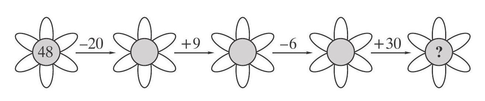
- ROI 裁剪图：[benchmarkallinone/outputs/report_priority_20/run_f2958f3118292117/datasets/mathvision/artifacts/crops/prob_7e9b53fd1e9797e41cfb5247_primary_roi.png](../../datasets/mathvision/artifacts/crops/prob_7e9b53fd1e9797e41cfb5247_primary_roi.png)

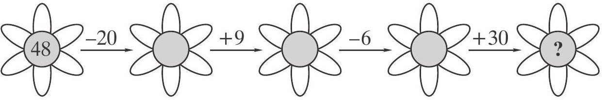

### 5) 清洗判定证据

```json
{
  "clean_score": 0.8723,
  "decision": "pass",
  "decision_reason_codes": [
    "meets_cleaning_requirements"
  ],
  "alignment_summary": {
    "alignment_id": "align_bceddcfc471a5b5af964e59e",
    "coverage_score": 0.9,
    "consistency_score": 0.9,
    "alignment_status": "good",
    "conflict_count": 1
  },
  "solvability_summary": {
    "solvability_id": "solv_prob_7e9b53fd1e9797e41cfb5247",
    "solvability_score": 1.0,
    "reasoning_path_exists": true,
    "decision_hint": "pass",
    "failure_codes": []
  },
  "missing_field_summary": {
    "missing_question_text": false,
    "missing_answer_text": false,
    "missing_image_count": 0
  },
  "risk_flags": [],
  "reject_record": null
}
```

---

## 13. prob_b5a65bdb6d9cd6b3e8ec12f9

- 样本文件：[benchmarkallinone/outputs/report_priority_20/run_f2958f3118292117/datasets/mathvision/samples/prob_b5a65bdb6d9cd6b3e8ec12f9.json](../../datasets/mathvision/samples/prob_b5a65bdb6d9cd6b3e8ec12f9.json)
- 源数据集：`MathVision`
- 源 split：`test`
- 源题目 ID：`10`
- 清洗路径：`multimodal_full`
- 是否文本主导：`False`
- 是否依赖图像：`True`
- 决策：`pass`
- 决策原因码：`meets_cleaning_requirements`
- 开放化改写策略：`keep_open`
- 对齐状态：`good`
- 可解性分数：`1.0`
- 可解性提示：`pass`
- 质量风险标记：`无`

### 采集阶段信号

```json
{
  "core_asset_completeness": {
    "has_question_text": true,
    "has_answer_text": true,
    "image_count": 1,
    "has_multiple_images": false
  },
  "initial_scores": {
    "initial_image_dependency_score": 0.9,
    "initial_multi_solution_score": 0.46,
    "initial_verifiability_score": 0.8876
  }
}
```

### 1) 处理前：原始题目 / 原始答案

**原始题目**

```text
Four people can be seated at a square table. How many people at most could be seated if we pushed four tables of this kind together in one row?
<image1>
```

**原始答案**

```text
10
```

### 2) 处理后：规范化题目 / 规范化答案

**规范化题目**

```text
Four people can be seated at a square table. How many people at most could be seated if we pushed four tables of this kind together in one row?
<image1>
```

**规范化答案**

```text
10
```

### 3) 开放化改写前后

**改写前（使用规范化题目作为输入）**

```text
Four people can be seated at a square table. How many people at most could be seated if we pushed four tables of this kind together in one row?
<image1>
```

**改写后（开放题变体）**

```text
Four people can be seated at a square table. How many people at most could be seated if we pushed four tables of this kind together in one row?
<image1>
```

- 期望答案类型：`numeric`
- 期望答案：`10`
- 改写 rationale：`Question is already open-ended.`
- 丢弃原因码：`无`

### 4) 图像与可视化产物

- 原始图像来源：`inline://pil_image`
- 持久化主图：[benchmarkallinone/outputs/report_priority_20/run_f2958f3118292117/datasets/mathvision/artifacts/images/prob_b5a65bdb6d9cd6b3e8ec12f9_primary.png](../../datasets/mathvision/artifacts/images/prob_b5a65bdb6d9cd6b3e8ec12f9_primary.png)

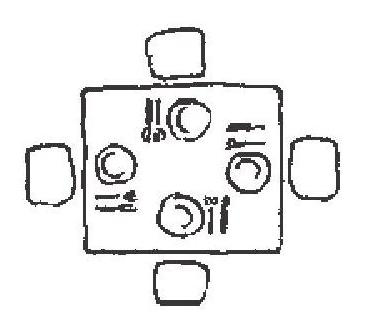
- ROI 裁剪图：[benchmarkallinone/outputs/report_priority_20/run_f2958f3118292117/datasets/mathvision/artifacts/crops/prob_b5a65bdb6d9cd6b3e8ec12f9_primary_roi.png](../../datasets/mathvision/artifacts/crops/prob_b5a65bdb6d9cd6b3e8ec12f9_primary_roi.png)

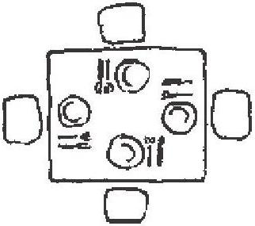

### 5) 清洗判定证据

```json
{
  "clean_score": 0.912,
  "decision": "pass",
  "decision_reason_codes": [
    "meets_cleaning_requirements"
  ],
  "alignment_summary": {
    "alignment_id": "align_5397ca07e0a683946b5ff90a",
    "coverage_score": 0.9,
    "consistency_score": 0.98,
    "alignment_status": "good",
    "conflict_count": 0
  },
  "solvability_summary": {
    "solvability_id": "solv_prob_b5a65bdb6d9cd6b3e8ec12f9",
    "solvability_score": 1.0,
    "reasoning_path_exists": true,
    "decision_hint": "pass",
    "failure_codes": []
  },
  "missing_field_summary": {
    "missing_question_text": false,
    "missing_answer_text": false,
    "missing_image_count": 0
  },
  "risk_flags": [],
  "reject_record": null
}
```

---

## 14. prob_bcc0fd0c2d1c0fc914fbdde7

- 样本文件：[benchmarkallinone/outputs/report_priority_20/run_f2958f3118292117/datasets/mathvision/samples/prob_bcc0fd0c2d1c0fc914fbdde7.json](../../datasets/mathvision/samples/prob_bcc0fd0c2d1c0fc914fbdde7.json)
- 源数据集：`MathVision`
- 源 split：`test`
- 源题目 ID：`11`
- 清洗路径：`multimodal_full`
- 是否文本主导：`False`
- 是否依赖图像：`True`
- 决策：`pass`
- 决策原因码：`meets_cleaning_requirements`
- 开放化改写策略：`keep_open`
- 对齐状态：`good`
- 可解性分数：`1.0`
- 可解性提示：`pass`
- 质量风险标记：`无`

### 采集阶段信号

```json
{
  "core_asset_completeness": {
    "has_question_text": true,
    "has_answer_text": true,
    "image_count": 1,
    "has_multiple_images": false
  },
  "initial_scores": {
    "initial_image_dependency_score": 0.9,
    "initial_multi_solution_score": 0.46,
    "initial_verifiability_score": 0.8871
  }
}
```

### 1) 处理前：原始题目 / 原始答案

**原始题目**

```text
Mike has built a construction, shown in the upper picture, from equal cubes. Lily has taken several cubes out of it, thus Mike's construction became such as we see in the lower picture. How many cubes has Lily taken?
<image1>
```

**原始答案**

```text
7
```

### 2) 处理后：规范化题目 / 规范化答案

**规范化题目**

```text
Mike has built a construction, shown in the upper picture, from equal cubes. Lily has taken several cubes out of it, thus Mike's construction became such as we see in the lower picture. How many cubes has Lily taken?
<image1>
```

**规范化答案**

```text
7
```

### 3) 开放化改写前后

**改写前（使用规范化题目作为输入）**

```text
Mike has built a construction, shown in the upper picture, from equal cubes. Lily has taken several cubes out of it, thus Mike's construction became such as we see in the lower picture. How many cubes has Lily taken?
<image1>
```

**改写后（开放题变体）**

```text
Mike has built a construction, shown in the upper picture, from equal cubes. Lily has taken several cubes out of it, thus Mike's construction became such as we see in the lower picture. How many cubes has Lily taken?
<image1>
```

- 期望答案类型：`numeric`
- 期望答案：`7`
- 改写 rationale：`Question is already open-ended.`
- 丢弃原因码：`无`

### 4) 图像与可视化产物

- 原始图像来源：`inline://pil_image`
- 持久化主图：[benchmarkallinone/outputs/report_priority_20/run_f2958f3118292117/datasets/mathvision/artifacts/images/prob_bcc0fd0c2d1c0fc914fbdde7_primary.png](../../datasets/mathvision/artifacts/images/prob_bcc0fd0c2d1c0fc914fbdde7_primary.png)

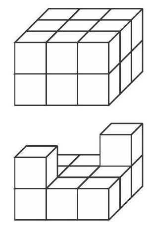
- ROI 裁剪图：[benchmarkallinone/outputs/report_priority_20/run_f2958f3118292117/datasets/mathvision/artifacts/crops/prob_bcc0fd0c2d1c0fc914fbdde7_primary_roi.png](../../datasets/mathvision/artifacts/crops/prob_bcc0fd0c2d1c0fc914fbdde7_primary_roi.png)

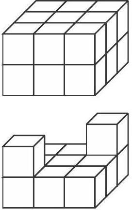

### 5) 清洗判定证据

```json
{
  "clean_score": 0.909,
  "decision": "pass",
  "decision_reason_codes": [
    "meets_cleaning_requirements"
  ],
  "alignment_summary": {
    "alignment_id": "align_b513c36049396f89b36d4def",
    "coverage_score": 0.9,
    "consistency_score": 0.9,
    "alignment_status": "good",
    "conflict_count": 1
  },
  "solvability_summary": {
    "solvability_id": "solv_prob_bcc0fd0c2d1c0fc914fbdde7",
    "solvability_score": 1.0,
    "reasoning_path_exists": true,
    "decision_hint": "pass",
    "failure_codes": []
  },
  "missing_field_summary": {
    "missing_question_text": false,
    "missing_answer_text": false,
    "missing_image_count": 0
  },
  "risk_flags": [],
  "reject_record": null
}
```

---

## 15. prob_d837e96fe47132ae0dbdff78

- 样本文件：[benchmarkallinone/outputs/report_priority_20/run_f2958f3118292117/datasets/mathvision/samples/prob_d837e96fe47132ae0dbdff78.json](../../datasets/mathvision/samples/prob_d837e96fe47132ae0dbdff78.json)
- 源数据集：`MathVision`
- 源 split：`test`
- 源题目 ID：`15`
- 清洗路径：`multimodal_full`
- 是否文本主导：`False`
- 是否依赖图像：`True`
- 决策：`pass`
- 决策原因码：`meets_cleaning_requirements`
- 开放化改写策略：`blank_open`
- 对齐状态：`good`
- 可解性分数：`1.0`
- 可解性提示：`pass`
- 质量风险标记：`无`

### 采集阶段信号

```json
{
  "core_asset_completeness": {
    "has_question_text": true,
    "has_answer_text": true,
    "image_count": 1,
    "has_multiple_images": false
  },
  "initial_scores": {
    "initial_image_dependency_score": 0.9,
    "initial_multi_solution_score": 0.52,
    "initial_verifiability_score": 0.8793
  }
}
```

### 1) 处理前：原始题目 / 原始答案

**原始题目**

```text
Emily celebrated her birthday on Thursday, and her sister Liepa 8 days earlier. Which weekday was that?
<image1>
```

**原始答案**

```text
Wednesday
```

### 2) 处理后：规范化题目 / 规范化答案

**规范化题目**

```text
Emily celebrated her birthday on Thursday, and her sister Liepa 8 days earlier. Which weekday was that?
<image1>
```

**规范化答案**

```text
Wednesday
```

### 3) 开放化改写前后

**改写前（使用规范化题目作为输入）**

```text
Emily celebrated her birthday on Thursday, and her sister Liepa 8 days earlier. Which weekday was that?
<image1>
```

**改写后（开放题变体）**

```text
Emily celebrated her birthday on Thursday, and her sister Liepa 8 days earlier. Which weekday was that?
<image1>
```

- 期望答案类型：`short_text`
- 期望答案：`Wednesday`
- 改写 rationale：`Converted multiple choice into blank-style open-ended question.`
- 丢弃原因码：`无`

### 4) 图像与可视化产物

- 原始图像来源：`inline://pil_image`
- 持久化主图：[benchmarkallinone/outputs/report_priority_20/run_f2958f3118292117/datasets/mathvision/artifacts/images/prob_d837e96fe47132ae0dbdff78_primary.png](../../datasets/mathvision/artifacts/images/prob_d837e96fe47132ae0dbdff78_primary.png)

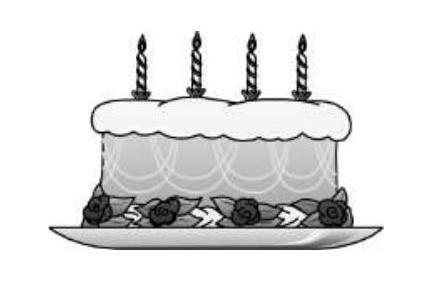
- ROI 裁剪图：[benchmarkallinone/outputs/report_priority_20/run_f2958f3118292117/datasets/mathvision/artifacts/crops/prob_d837e96fe47132ae0dbdff78_primary_roi.png](../../datasets/mathvision/artifacts/crops/prob_d837e96fe47132ae0dbdff78_primary_roi.png)

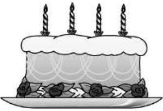

### 5) 清洗判定证据

```json
{
  "clean_score": 0.88,
  "decision": "pass",
  "decision_reason_codes": [
    "meets_cleaning_requirements"
  ],
  "alignment_summary": {
    "alignment_id": "align_a1a3ca041b2ecfebe856091f",
    "coverage_score": 0.9,
    "consistency_score": 0.9,
    "alignment_status": "good",
    "conflict_count": 1
  },
  "solvability_summary": {
    "solvability_id": "solv_prob_d837e96fe47132ae0dbdff78",
    "solvability_score": 1.0,
    "reasoning_path_exists": true,
    "decision_hint": "pass",
    "failure_codes": []
  },
  "missing_field_summary": {
    "missing_question_text": false,
    "missing_answer_text": false,
    "missing_image_count": 0
  },
  "risk_flags": [],
  "reject_record": null
}
```

---

## 16. prob_eae8bfdacea7f380cd8ffdab

- 样本文件：[benchmarkallinone/outputs/report_priority_20/run_f2958f3118292117/datasets/mathvision/samples/prob_eae8bfdacea7f380cd8ffdab.json](../../datasets/mathvision/samples/prob_eae8bfdacea7f380cd8ffdab.json)
- 源数据集：`MathVision`
- 源 split：`test`
- 源题目 ID：`18`
- 清洗路径：`multimodal_full`
- 是否文本主导：`False`
- 是否依赖图像：`True`
- 决策：`reject`
- 决策原因码：`low_resolution`
- 开放化改写策略：`keep_open`
- 对齐状态：`good`
- 可解性分数：`1.0`
- 可解性提示：`pass`
- 质量风险标记：`low_resolution`

### 采集阶段信号

```json
{
  "core_asset_completeness": {
    "has_question_text": true,
    "has_answer_text": true,
    "image_count": 1,
    "has_multiple_images": false
  },
  "initial_scores": {
    "initial_image_dependency_score": 0.9,
    "initial_multi_solution_score": 0.46,
    "initial_verifiability_score": 0.8722
  }
}
```

### 1) 处理前：原始题目 / 原始答案

**原始题目**

```text
A fifteen-meter log has to be sawn into three-meter pieces. How many cuts are needed for that?
<image1>
```

**原始答案**

```text
4
```

### 2) 处理后：规范化题目 / 规范化答案

**规范化题目**

```text
A fifteen-meter log has to be sawn into three-meter pieces. How many cuts are needed for that?
<image1>
```

**规范化答案**

```text
4
```

### 3) 开放化改写前后

**改写前（使用规范化题目作为输入）**

```text
A fifteen-meter log has to be sawn into three-meter pieces. How many cuts are needed for that?
<image1>
```

**改写后（开放题变体）**

```text
A fifteen-meter log has to be sawn into three-meter pieces. How many cuts are needed for that?
<image1>
```

- 期望答案类型：`numeric`
- 期望答案：`4`
- 改写 rationale：`Question is already open-ended.`
- 丢弃原因码：`无`

### 4) 图像与可视化产物

- 原始图像来源：`inline://pil_image`
- 持久化主图：[benchmarkallinone/outputs/report_priority_20/run_f2958f3118292117/datasets/mathvision/artifacts/images/prob_eae8bfdacea7f380cd8ffdab_primary.png](../../datasets/mathvision/artifacts/images/prob_eae8bfdacea7f380cd8ffdab_primary.png)

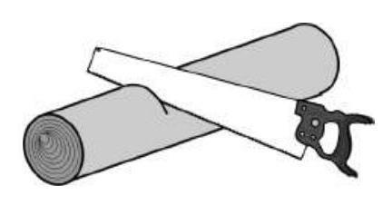
- ROI 裁剪图：[benchmarkallinone/outputs/report_priority_20/run_f2958f3118292117/datasets/mathvision/artifacts/crops/prob_eae8bfdacea7f380cd8ffdab_primary_roi.png](../../datasets/mathvision/artifacts/crops/prob_eae8bfdacea7f380cd8ffdab_primary_roi.png)

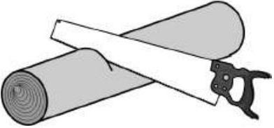

### 5) 清洗判定证据

```json
{
  "clean_score": 0.8703,
  "decision": "reject",
  "decision_reason_codes": [
    "low_resolution"
  ],
  "alignment_summary": {
    "alignment_id": "align_c721151d1ec540d06c10ff71",
    "coverage_score": 0.9,
    "consistency_score": 0.9,
    "alignment_status": "good",
    "conflict_count": 1
  },
  "solvability_summary": {
    "solvability_id": "solv_prob_eae8bfdacea7f380cd8ffdab",
    "solvability_score": 1.0,
    "reasoning_path_exists": true,
    "decision_hint": "pass",
    "failure_codes": []
  },
  "missing_field_summary": {
    "missing_question_text": false,
    "missing_answer_text": false,
    "missing_image_count": 0
  },
  "risk_flags": [
    "low_resolution"
  ],
  "reject_record": {
    "reject_id": "reject_c721151d1ec540d06c10ff71",
    "problem_id": "prob_eae8bfdacea7f380cd8ffdab",
    "stage": "cleaning",
    "reject_level": "problem",
    "reject_reason_codes": [
      "low_resolution"
    ],
    "reject_reason_detail": "Question is already open-ended.",
    "blocking_fields": [
      "low_resolution"
    ],
    "evidence_refs": [
      "align_c721151d1ec540d06c10ff71",
      "solv_prob_eae8bfdacea7f380cd8ffdab"
    ],
    "recoverable": false,
    "recommended_action": "drop",
    "reviewed_by": null,
    "created_at": "2026-03-25T08:47:27Z"
  }
}
```

---

## 17. prob_ed19939e515d4b079340ed7b

- 样本文件：[benchmarkallinone/outputs/report_priority_20/run_f2958f3118292117/datasets/mathvision/samples/prob_ed19939e515d4b079340ed7b.json](../../datasets/mathvision/samples/prob_ed19939e515d4b079340ed7b.json)
- 源数据集：`MathVision`
- 源 split：`test`
- 源题目 ID：`19`
- 清洗路径：`multimodal_full`
- 是否文本主导：`False`
- 是否依赖图像：`True`
- 决策：`review`
- 决策原因码：`split_variant_needs_review`
- 开放化改写策略：`split_open`
- 对齐状态：`good`
- 可解性分数：`1.0`
- 可解性提示：`pass`
- 质量风险标记：`无`

### 采集阶段信号

```json
{
  "core_asset_completeness": {
    "has_question_text": true,
    "has_answer_text": true,
    "image_count": 1,
    "has_multiple_images": false
  },
  "initial_scores": {
    "initial_image_dependency_score": 0.9,
    "initial_multi_solution_score": 0.52,
    "initial_verifiability_score": 0.8648
  }
}
```

### 1) 处理前：原始题目 / 原始答案

**原始题目**

```text
Eve has taken 2 bananas to school. At first she changed each of them into 4 apples, later on she exchanged each apple into 3 mandarins. How many mandarins has Eve got? <image1>
```

**原始答案**

```text
$2 \cdot 4 \cdot 3$
```

### 2) 处理后：规范化题目 / 规范化答案

**规范化题目**

```text
Eve has taken 2 bananas to school. At first she changed each of them into 4 apples, later on she exchanged each apple into 3 mandarins. How many mandarins has Eve got? <image1>
```

**规范化答案**

```text
$2 \cdot 4 \cdot 3$
```

### 3) 开放化改写前后

**改写前（使用规范化题目作为输入）**

```text
Eve has taken 2 bananas to school. At first she changed each of them into 4 apples, later on she exchanged each apple into 3 mandarins. How many mandarins has Eve got? <image1>
```

**改写后（开放题变体）**

```text
Eve has taken 2 bananas to school. At first she changed each of them into 4 apples, later on she exchanged each apple into 3 mandarins. How many mandarins has Eve got? <image1>
请只回答第 1 个目标量。
```

- 期望答案类型：`short_text`
- 期望答案：`$2 \cdot 4 \cdot 3$`
- 改写 rationale：`Compound choice answer was split into multiple open-ended targets.`
- 丢弃原因码：`无`

### 4) 图像与可视化产物

- 原始图像来源：`inline://pil_image`
- 持久化主图：[benchmarkallinone/outputs/report_priority_20/run_f2958f3118292117/datasets/mathvision/artifacts/images/prob_ed19939e515d4b079340ed7b_primary.png](../../datasets/mathvision/artifacts/images/prob_ed19939e515d4b079340ed7b_primary.png)

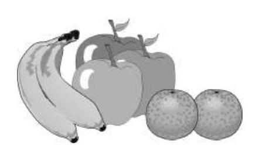
- ROI 裁剪图：[benchmarkallinone/outputs/report_priority_20/run_f2958f3118292117/datasets/mathvision/artifacts/crops/prob_ed19939e515d4b079340ed7b_primary_roi.png](../../datasets/mathvision/artifacts/crops/prob_ed19939e515d4b079340ed7b_primary_roi.png)

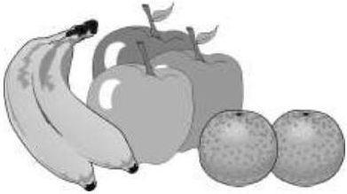

### 5) 清洗判定证据

```json
{
  "clean_score": 0.8684,
  "decision": "review",
  "decision_reason_codes": [
    "split_variant_needs_review"
  ],
  "alignment_summary": {
    "alignment_id": "align_36b7dca86b7ebb7c77a9284d",
    "coverage_score": 0.9,
    "consistency_score": 0.9,
    "alignment_status": "good",
    "conflict_count": 1
  },
  "solvability_summary": {
    "solvability_id": "solv_prob_ed19939e515d4b079340ed7b",
    "solvability_score": 1.0,
    "reasoning_path_exists": true,
    "decision_hint": "pass",
    "failure_codes": []
  },
  "missing_field_summary": {
    "missing_question_text": false,
    "missing_answer_text": false,
    "missing_image_count": 0
  },
  "risk_flags": [],
  "reject_record": null
}
```

---

## 18. prob_ef193b51f1204df8d218b161

- 样本文件：[benchmarkallinone/outputs/report_priority_20/run_f2958f3118292117/datasets/mathvision/samples/prob_ef193b51f1204df8d218b161.json](../../datasets/mathvision/samples/prob_ef193b51f1204df8d218b161.json)
- 源数据集：`MathVision`
- 源 split：`test`
- 源题目 ID：`20`
- 清洗路径：`multimodal_full`
- 是否文本主导：`False`
- 是否依赖图像：`True`
- 决策：`reject`
- 决策原因码：`low_resolution`
- 开放化改写策略：`keep_open`
- 对齐状态：`good`
- 可解性分数：`1.0`
- 可解性提示：`pass`
- 质量风险标记：`low_resolution`

### 采集阶段信号

```json
{
  "core_asset_completeness": {
    "has_question_text": true,
    "has_answer_text": true,
    "image_count": 1,
    "has_multiple_images": false
  },
  "initial_scores": {
    "initial_image_dependency_score": 0.9,
    "initial_multi_solution_score": 0.46,
    "initial_verifiability_score": 0.8811
  }
}
```

### 1) 处理前：原始题目 / 原始答案

**原始题目**

```text
How many plums (see the picture) weigh as much as an apple?
<image1>
```

**原始答案**

```text
3
```

### 2) 处理后：规范化题目 / 规范化答案

**规范化题目**

```text
How many plums (see the picture) weigh as much as an apple?
<image1>
```

**规范化答案**

```text
3
```

### 3) 开放化改写前后

**改写前（使用规范化题目作为输入）**

```text
How many plums (see the picture) weigh as much as an apple?
<image1>
```

**改写后（开放题变体）**

```text
How many plums (see the picture) weigh as much as an apple?
<image1>
```

- 期望答案类型：`numeric`
- 期望答案：`3`
- 改写 rationale：`Question is already open-ended.`
- 丢弃原因码：`无`

### 4) 图像与可视化产物

- 原始图像来源：`inline://pil_image`
- 持久化主图：[benchmarkallinone/outputs/report_priority_20/run_f2958f3118292117/datasets/mathvision/artifacts/images/prob_ef193b51f1204df8d218b161_primary.png](../../datasets/mathvision/artifacts/images/prob_ef193b51f1204df8d218b161_primary.png)

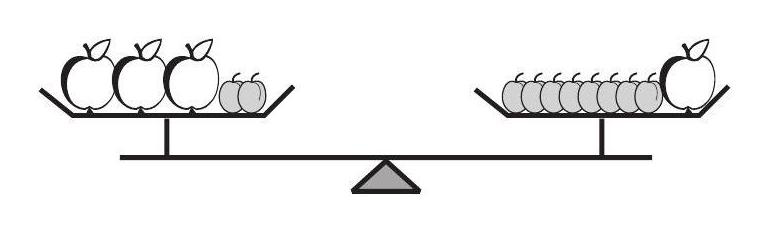
- ROI 裁剪图：[benchmarkallinone/outputs/report_priority_20/run_f2958f3118292117/datasets/mathvision/artifacts/crops/prob_ef193b51f1204df8d218b161_primary_roi.png](../../datasets/mathvision/artifacts/crops/prob_ef193b51f1204df8d218b161_primary_roi.png)

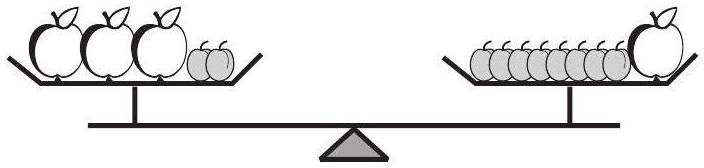

### 5) 清洗判定证据

```json
{
  "clean_score": 0.878,
  "decision": "reject",
  "decision_reason_codes": [
    "low_resolution"
  ],
  "alignment_summary": {
    "alignment_id": "align_577164a97f97b04365caf922",
    "coverage_score": 0.9,
    "consistency_score": 0.9,
    "alignment_status": "good",
    "conflict_count": 1
  },
  "solvability_summary": {
    "solvability_id": "solv_prob_ef193b51f1204df8d218b161",
    "solvability_score": 1.0,
    "reasoning_path_exists": true,
    "decision_hint": "pass",
    "failure_codes": []
  },
  "missing_field_summary": {
    "missing_question_text": false,
    "missing_answer_text": false,
    "missing_image_count": 0
  },
  "risk_flags": [
    "low_resolution"
  ],
  "reject_record": {
    "reject_id": "reject_577164a97f97b04365caf922",
    "problem_id": "prob_ef193b51f1204df8d218b161",
    "stage": "cleaning",
    "reject_level": "problem",
    "reject_reason_codes": [
      "low_resolution"
    ],
    "reject_reason_detail": "Question is already open-ended.",
    "blocking_fields": [
      "low_resolution"
    ],
    "evidence_refs": [
      "align_577164a97f97b04365caf922",
      "solv_prob_ef193b51f1204df8d218b161"
    ],
    "recoverable": false,
    "recommended_action": "drop",
    "reviewed_by": null,
    "created_at": "2026-03-25T08:47:27Z"
  }
}
```

---

## 19. prob_f02369237abcf94209081a56

- 样本文件：[benchmarkallinone/outputs/report_priority_20/run_f2958f3118292117/datasets/mathvision/samples/prob_f02369237abcf94209081a56.json](../../datasets/mathvision/samples/prob_f02369237abcf94209081a56.json)
- 源数据集：`MathVision`
- 源 split：`test`
- 源题目 ID：`3`
- 清洗路径：`multimodal_full`
- 是否文本主导：`False`
- 是否依赖图像：`True`
- 决策：`review`
- 决策原因码：`normalized_question_incomplete`
- 开放化改写策略：`blank_open`
- 对齐状态：`good`
- 可解性分数：`1.0`
- 可解性提示：`pass`
- 质量风险标记：`low_text_completeness`

### 采集阶段信号

```json
{
  "core_asset_completeness": {
    "has_question_text": true,
    "has_answer_text": true,
    "image_count": 1,
    "has_multiple_images": false
  },
  "initial_scores": {
    "initial_image_dependency_score": 0.9,
    "initial_multi_solution_score": 0.52,
    "initial_verifiability_score": 0.8719
  }
}
```

### 1) 处理前：原始题目 / 原始答案

**原始题目**

```text
Which kite has the longest string?
<image1>
```

**原始答案**

```text
C
```

### 2) 处理后：规范化题目 / 规范化答案

**规范化题目**

```text
Which kite has the longest string?
<image1>
```

**规范化答案**

```text
C
```

### 3) 开放化改写前后

**改写前（使用规范化题目作为输入）**

```text
Which kite has the longest string?
<image1>
```

**改写后（开放题变体）**

```text
Which kite has the longest string?
<image1>
```

- 期望答案类型：`numeric`
- 期望答案：`C`
- 改写 rationale：`Converted multiple choice into blank-style open-ended question.`
- 丢弃原因码：`无`

### 4) 图像与可视化产物

- 原始图像来源：`inline://pil_image`
- 持久化主图：[benchmarkallinone/outputs/report_priority_20/run_f2958f3118292117/datasets/mathvision/artifacts/images/prob_f02369237abcf94209081a56_primary.png](../../datasets/mathvision/artifacts/images/prob_f02369237abcf94209081a56_primary.png)

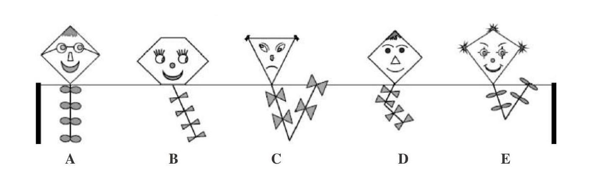
- ROI 裁剪图：[benchmarkallinone/outputs/report_priority_20/run_f2958f3118292117/datasets/mathvision/artifacts/crops/prob_f02369237abcf94209081a56_primary_roi.png](../../datasets/mathvision/artifacts/crops/prob_f02369237abcf94209081a56_primary_roi.png)

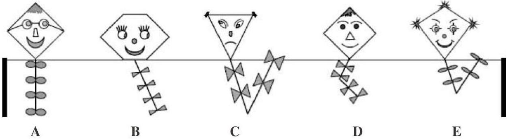

### 5) 清洗判定证据

```json
{
  "clean_score": 0.8613,
  "decision": "review",
  "decision_reason_codes": [
    "normalized_question_incomplete"
  ],
  "alignment_summary": {
    "alignment_id": "align_3a1464c35047c1a40db9ca5f",
    "coverage_score": 0.9,
    "consistency_score": 0.9,
    "alignment_status": "good",
    "conflict_count": 1
  },
  "solvability_summary": {
    "solvability_id": "solv_prob_f02369237abcf94209081a56",
    "solvability_score": 1.0,
    "reasoning_path_exists": true,
    "decision_hint": "pass",
    "failure_codes": []
  },
  "missing_field_summary": {
    "missing_question_text": false,
    "missing_answer_text": false,
    "missing_image_count": 0
  },
  "risk_flags": [
    "low_text_completeness"
  ],
  "reject_record": null
}
```

---

## 20. prob_f732438f47fa7b38775bb162

- 样本文件：[benchmarkallinone/outputs/report_priority_20/run_f2958f3118292117/datasets/mathvision/samples/prob_f732438f47fa7b38775bb162.json](../../datasets/mathvision/samples/prob_f732438f47fa7b38775bb162.json)
- 源数据集：`MathVision`
- 源 split：`test`
- 源题目 ID：`8`
- 清洗路径：`multimodal_full`
- 是否文本主导：`False`
- 是否依赖图像：`True`
- 决策：`pass`
- 决策原因码：`meets_cleaning_requirements`
- 开放化改写策略：`keep_open`
- 对齐状态：`good`
- 可解性分数：`1.0`
- 可解性提示：`pass`
- 质量风险标记：`无`

### 采集阶段信号

```json
{
  "core_asset_completeness": {
    "has_question_text": true,
    "has_answer_text": true,
    "image_count": 1,
    "has_multiple_images": false
  },
  "initial_scores": {
    "initial_image_dependency_score": 0.9,
    "initial_multi_solution_score": 0.46,
    "initial_verifiability_score": 0.8916
  }
}
```

### 1) 处理前：原始题目 / 原始答案

**原始题目**

```text
The sums of the all the three numbers on each side of the triangle are equal. Two numbers happened to be stained with ink. How much is the sum of these two numbers?
<image1>
```

**原始答案**

```text
2
```

### 2) 处理后：规范化题目 / 规范化答案

**规范化题目**

```text
The sums of the all the three numbers on each side of the triangle are equal. Two numbers happened to be stained with ink. How much is the sum of these two numbers?
<image1>
```

**规范化答案**

```text
2
```

### 3) 开放化改写前后

**改写前（使用规范化题目作为输入）**

```text
The sums of the all the three numbers on each side of the triangle are equal. Two numbers happened to be stained with ink. How much is the sum of these two numbers?
<image1>
```

**改写后（开放题变体）**

```text
The sums of the all the three numbers on each side of the triangle are equal. Two numbers happened to be stained with ink. How much is the sum of these two numbers?
<image1>
```

- 期望答案类型：`numeric`
- 期望答案：`2`
- 改写 rationale：`Question is already open-ended.`
- 丢弃原因码：`无`

### 4) 图像与可视化产物

- 原始图像来源：`inline://pil_image`
- 持久化主图：[benchmarkallinone/outputs/report_priority_20/run_f2958f3118292117/datasets/mathvision/artifacts/images/prob_f732438f47fa7b38775bb162_primary.png](../../datasets/mathvision/artifacts/images/prob_f732438f47fa7b38775bb162_primary.png)

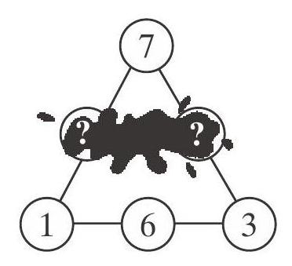
- ROI 裁剪图：[benchmarkallinone/outputs/report_priority_20/run_f2958f3118292117/datasets/mathvision/artifacts/crops/prob_f732438f47fa7b38775bb162_primary_roi.png](../../datasets/mathvision/artifacts/crops/prob_f732438f47fa7b38775bb162_primary_roi.png)

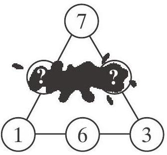

### 5) 清洗判定证据

```json
{
  "clean_score": 0.908,
  "decision": "pass",
  "decision_reason_codes": [
    "meets_cleaning_requirements"
  ],
  "alignment_summary": {
    "alignment_id": "align_64523e590f8a2a6c980da8d0",
    "coverage_score": 0.9,
    "consistency_score": 0.9,
    "alignment_status": "good",
    "conflict_count": 1
  },
  "solvability_summary": {
    "solvability_id": "solv_prob_f732438f47fa7b38775bb162",
    "solvability_score": 1.0,
    "reasoning_path_exists": true,
    "decision_hint": "pass",
    "failure_codes": []
  },
  "missing_field_summary": {
    "missing_question_text": false,
    "missing_answer_text": false,
    "missing_image_count": 0
  },
  "risk_flags": [],
  "reject_record": null
}
```

