# PhysReason：20 条采集清洗逐样本报告

- pipeline_run_id：`run_f2958f3118292117`
- 数据集 key：`physreason`
- processed_samples：`20` / requested `20`
- 决策计数：`pass=4`，`review=11`，`reject=5`
- 改写策略计数：`{"keep_open": 20}`
- 对齐状态计数：`risky:12, good:8`
- 高频原因码：`alignment_risky:11, low_resolution:5, meets_cleaning_requirements:4`
- 占位符题面（`text/bar`）样本数：`0`
- 文本主导样本数：`1`

## 01. prob_09ebb13be9a4c2a4c0aa9dc7

- 样本文件：[benchmarkallinone/outputs/report_priority_20/run_f2958f3118292117/datasets/physreason/samples/prob_09ebb13be9a4c2a4c0aa9dc7.json](../../datasets/physreason/samples/prob_09ebb13be9a4c2a4c0aa9dc7.json)
- 源数据集：`PhysReason`
- 源 split：`mini`
- 源题目 ID：`cal_problem_00140`
- 清洗路径：`multimodal_full`
- 是否文本主导：`False`
- 是否依赖图像：`True`
- 决策：`review`
- 决策原因码：`alignment_risky`
- 开放化改写策略：`keep_open`
- 对齐状态：`risky`
- 可解性分数：`1.0`
- 可解性提示：`pass`
- 质量风险标记：`无`

### 采集阶段信号

```json
{
  "core_asset_completeness": {
    "has_question_text": true,
    "has_answer_text": true,
    "image_count": 1,
    "has_multiple_images": false
  },
  "initial_scores": {
    "initial_image_dependency_score": 0.9,
    "initial_multi_solution_score": 0.46,
    "initial_verifiability_score": 0.8795
  }
}
```

### 1) 处理前：原始题目 / 原始答案

**原始题目**

```text
As shown in Figure (1), a device for detecting gas discharge processes has two electrodes connected to a long straight wire in an ionization chamber filled with neon gas (Ne). These electrodes are then connected to a high-voltage power supply via two horizontal long wires. In a plane perpendicular to the long straight wire, a circular solenoid made of thin wire with a resistance of $R_{0}=10\Omega$ and $N=5\times 10^{3}$ turns is installed, with the axis of symmetry aligned with the straight wire. The two ends, c and d, of the thin wire are connected to a resistor of resistance $R=90\Omega$. The cross-section of the solenoid is a circle with a radius of $a=1.0\times10^{-2}\mathrm{m}$, and its center is at a distance of $r=0.1\mathrm{m}$ from the long straight wire. After the gas is ionized, a clockwise current $I$ is generated in the long straight wire circuit, and its $I-t$ graph is shown in Figure (2). For the convenience of calculation, the magnitude of the magnetic induction intensity at all locations inside the solenoid can be regarded as $B={\frac{k I}{r}}$, where $k=2\times10^{-7}\mathrm{T\cdotm/A}$.

1. Determine the amount of charge $Q$ that passes through the cross-section of the long straight wire within the time interval of $0 \sim 6.0 \times 10^{-3}\mathrm{s}$.
2. Calculate the magnetic flux $\Phi$ through one turn of the solenoid at time $3.0\times10^{-3}\mathrm{s}$.
```

**原始答案**

```text
0.5C
6.28×10^-8Wb
```

### 2) 处理后：规范化题目 / 规范化答案

**规范化题目**

```text
As shown in Figure (1), a device for detecting gas discharge processes has two electrodes connected to a long straight wire in an ionization chamber filled with neon gas (Ne). These electrodes are then connected to a high-voltage power supply via two horizontal long wires. In a plane perpendicular to the long straight wire, a circular solenoid made of thin wire with a resistance of $R_{0}=10\Omega$ and $N=5\times 10^{3}$ turns is installed, with the axis of symmetry aligned with the straight wire. The two ends, c and d, of the thin wire are connected to a resistor of resistance $R=90\Omega$. The cross-section of the solenoid is a circle with a radius of $a=1.0\times10^{-2}\mathrm{m}$, and its center is at a distance of $r=0.1\mathrm{m}$ from the long straight wire. After the gas is ionized, a clockwise current $I$ is generated in the long straight wire circuit, and its $I-t$ graph is shown in Figure (2). For the convenience of calculation, the magnitude of the magnetic induction intensity at all locations inside the solenoid can be regarded as $B={\frac{k I}{r}}$, where $k=2\times10^{-7}\mathrm{T\cdotm/A}$.

1. Determine the amount of charge $Q$ that passes through the cross-section of the long straight wire within the time interval of $0 \sim 6.0 \times 10^{-3}\mathrm{s}$.
2. Calculate the magnetic flux $\Phi$ through one turn of the solenoid at time $3.0\times10^{-3}\mathrm{s}$.
```

**规范化答案**

```text
0.5C
6.28×10^-8Wb
```

### 3) 开放化改写前后

**改写前（使用规范化题目作为输入）**

```text
As shown in Figure (1), a device for detecting gas discharge processes has two electrodes connected to a long straight wire in an ionization chamber filled with neon gas (Ne). These electrodes are then connected to a high-voltage power supply via two horizontal long wires. In a plane perpendicular to the long straight wire, a circular solenoid made of thin wire with a resistance of $R_{0}=10\Omega$ and $N=5\times 10^{3}$ turns is installed, with the axis of symmetry aligned with the straight wire. The two ends, c and d, of the thin wire are connected to a resistor of resistance $R=90\Omega$. The cross-section of the solenoid is a circle with a radius of $a=1.0\times10^{-2}\mathrm{m}$, and its center is at a distance of $r=0.1\mathrm{m}$ from the long straight wire. After the gas is ionized, a clockwise current $I$ is generated in the long straight wire circuit, and its $I-t$ graph is shown in Figure (2). For the convenience of calculation, the magnitude of the magnetic induction intensity at all locations inside the solenoid can be regarded as $B={\frac{k I}{r}}$, where $k=2\times10^{-7}\mathrm{T\cdotm/A}$.

1. Determine the amount of charge $Q$ that passes through the cross-section of the long straight wire within the time interval of $0 \sim 6.0 \times 10^{-3}\mathrm{s}$.
2. Calculate the magnetic flux $\Phi$ through one turn of the solenoid at time $3.0\times10^{-3}\mathrm{s}$.
```

**改写后（开放题变体）**

```text
As shown in Figure (1), a device for detecting gas discharge processes has two electrodes connected to a long straight wire in an ionization chamber filled with neon gas (Ne). These electrodes are then connected to a high-voltage power supply via two horizontal long wires. In a plane perpendicular to the long straight wire, a circular solenoid made of thin wire with a resistance of $R_{0}=10\Omega$ and $N=5\times 10^{3}$ turns is installed, with the axis of symmetry aligned with the straight wire. The two ends, c and d, of the thin wire are connected to a resistor of resistance $R=90\Omega$. The cross-section of the solenoid is a circle with a radius of $a=1.0\times10^{-2}\mathrm{m}$, and its center is at a distance of $r=0.1\mathrm{m}$ from the long straight wire. After the gas is ionized, a clockwise current $I$ is generated in the long straight wire circuit, and its $I-t$ graph is shown in Figure (2). For the convenience of calculation, the magnitude of the magnetic induction intensity at all locations inside the solenoid can be regarded as $B={\frac{k I}{r}}$, where $k=2\times10^{-7}\mathrm{T\cdotm/A}$.

1. Determine the amount of charge $Q$ that passes through the cross-section of the long straight wire within the time interval of $0 \sim 6.0 \times 10^{-3}\mathrm{s}$.
2. Calculate the magnetic flux $\Phi$ through one turn of the solenoid at time $3.0\times10^{-3}\mathrm{s}$.
```

- 期望答案类型：`short_text`
- 期望答案：`0.5C
6.28×10^-8Wb`
- 改写 rationale：`Question is already open-ended.`
- 丢弃原因码：`无`

### 4) 图像与可视化产物

- 原始图像来源：[benchmark/outputs/repo_cache/hf_raw/physreason/PhysReason-mini/cal_problem_00140/images/4755e336562938ed69907184902e80a1a7137054d0f0b7602151404202e45c57.jpg](../../../../../../benchmark/outputs/repo_cache/hf_raw/physreason/PhysReason-mini/cal_problem_00140/images/4755e336562938ed69907184902e80a1a7137054d0f0b7602151404202e45c57.jpg)
- 持久化主图：[benchmarkallinone/outputs/report_priority_20/run_f2958f3118292117/datasets/physreason/artifacts/images/prob_09ebb13be9a4c2a4c0aa9dc7_primary.png](../../datasets/physreason/artifacts/images/prob_09ebb13be9a4c2a4c0aa9dc7_primary.png)

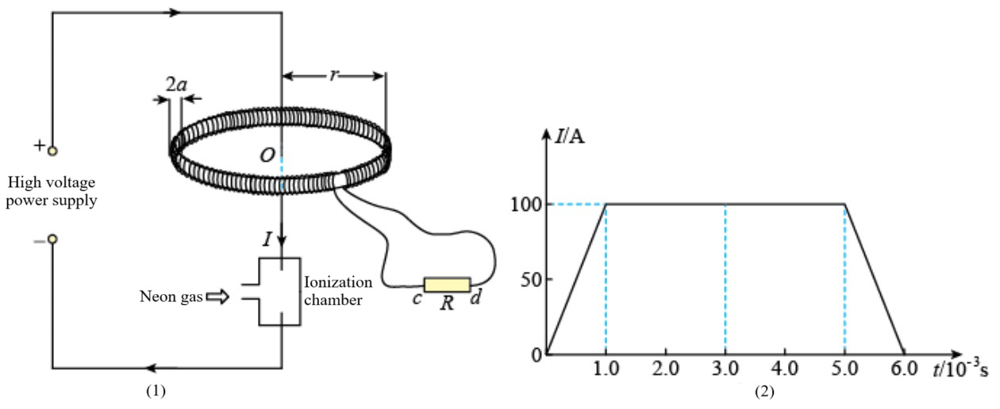
- ROI 裁剪图：[benchmarkallinone/outputs/report_priority_20/run_f2958f3118292117/datasets/physreason/artifacts/crops/prob_09ebb13be9a4c2a4c0aa9dc7_primary_roi.png](../../datasets/physreason/artifacts/crops/prob_09ebb13be9a4c2a4c0aa9dc7_primary_roi.png)

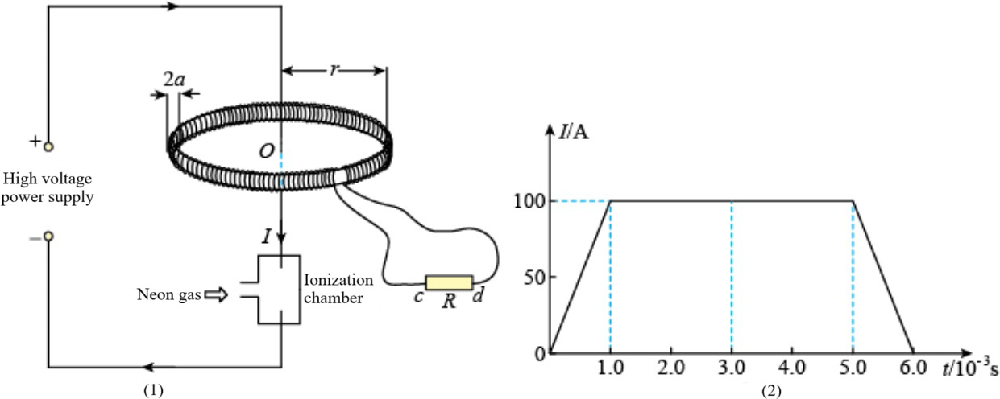

### 5) 清洗判定证据

```json
{
  "clean_score": 0.8903,
  "decision": "review",
  "decision_reason_codes": [
    "alignment_risky"
  ],
  "alignment_summary": {
    "alignment_id": "align_6053dc1f4b9c3ed5c40551c9",
    "coverage_score": 0.9,
    "consistency_score": 0.82,
    "alignment_status": "risky",
    "conflict_count": 1
  },
  "solvability_summary": {
    "solvability_id": "solv_prob_09ebb13be9a4c2a4c0aa9dc7",
    "solvability_score": 1.0,
    "reasoning_path_exists": true,
    "decision_hint": "pass",
    "failure_codes": []
  },
  "missing_field_summary": {
    "missing_question_text": false,
    "missing_answer_text": false,
    "missing_image_count": 0
  },
  "risk_flags": [],
  "reject_record": null
}
```

---

## 02. prob_191200cc3560c2c27233a042

- 样本文件：[benchmarkallinone/outputs/report_priority_20/run_f2958f3118292117/datasets/physreason/samples/prob_191200cc3560c2c27233a042.json](../../datasets/physreason/samples/prob_191200cc3560c2c27233a042.json)
- 源数据集：`PhysReason`
- 源 split：`mini`
- 源题目 ID：`cal_problem_00122`
- 清洗路径：`multimodal_full`
- 是否文本主导：`False`
- 是否依赖图像：`True`
- 决策：`reject`
- 决策原因码：`low_resolution`
- 开放化改写策略：`keep_open`
- 对齐状态：`good`
- 可解性分数：`1.0`
- 可解性提示：`pass`
- 质量风险标记：`low_resolution`

### 采集阶段信号

```json
{
  "core_asset_completeness": {
    "has_question_text": true,
    "has_answer_text": true,
    "image_count": 1,
    "has_multiple_images": false
  },
  "initial_scores": {
    "initial_image_dependency_score": 0.9,
    "initial_multi_solution_score": 0.64,
    "initial_verifiability_score": 0.7159
  }
}
```

### 1) 处理前：原始题目 / 原始答案

**原始题目**

```text
Millikan proved the quantization of electric charge by observing the motion of oil droplets, for which he was awarded the Nobel Prize in Physics in 1923. The figure illustrates the principle of the Millikan oil-drop experiment, where two sufficiently large metal plates are placed horizontally with a separation of $d$. The upper plate has a small hole in the center. Small oil droplets are sprayed through the hole, and some of them acquire electric charges due to collisions or friction. Two spherical oil droplets, $A$ and $B$, each with a mass of $m_0$, are located on the same vertical line. They both fall with a uniform velocity through a distance of $h_1$ within time $t$. At this moment, a voltage $U$ is applied across the two plates (with the upper plate connected to the positive terminal), $A$ continues to fall at its original velocity, while $B$ begins to move upwards with a uniform velocity after a period of time. $B$ rises through a distance of $h_2 (h_2\neq h_1)$ in time $t$, after which it merges with $A$ to form a new spherical oil droplet, which continues to move between the plates until it reaches uniform velocity. The magnitude of the air resistance on a spherical oil droplet is given by $f=k m^{\frac{1}{3}}v$, where $k$ is a proportionality constant, $m$ is the mass of the oil droplet, and $v$ is the droplet's speed. Air buoyancy is negligible, and the acceleration due to gravity is $g$.

1. Determine the proportionality constant $k$.
2. Determine the charge and polarity of oil droplets $A$ and $B$.
3. Calculate the change in potential energy of object $B$ as it rises a distance $h_2$.
4. Determine the magnitude and direction of the uniform velocity of the new oil droplet.
```

**原始答案**

```text
k={\frac{m_{0}^{\frac{2}{3}}g t}{h_{1}}}
Oil droplet A is uncharged, and oil droplet B carries a negative charge. And q=\frac{m_{0}g d(h_{1}+h_{2})}{h_{1}U}
\Delta E_{p}=-\frac{m_{0}g h_{2}(h_{1}+h_{2})}{h_{1}}
If $F^{\prime}>2m_{0}g$, $v_{2}=\frac{h_{2}-h_{1}}{\sqrt[3]{2}t}$, the velocity direction is upwards; if $F^{\prime}<2m_{0}g$, $v_2=\frac{h_1 - h_2}{\sqrt{3}{2}t}$, the velocity direction is downwards.
```

### 2) 处理后：规范化题目 / 规范化答案

**规范化题目**

```text
Millikan proved the quantization of electric charge by observing the motion of oil droplets, for which he was awarded the Nobel Prize in Physics in 1923. The figure illustrates the principle of the Millikan oil-drop experiment, where two sufficiently large metal plates are placed horizontally with a separation of $d$. The upper plate has a small hole in the center. Small oil droplets are sprayed through the hole, and some of them acquire electric charges due to collisions or friction. Two spherical oil droplets, $A$ and $B$, each with a mass of $m_0$, are located on the same vertical line. They both fall with a uniform velocity through a distance of $h_1$ within time $t$. At this moment, a voltage $U$ is applied across the two plates (with the upper plate connected to the positive terminal), $A$ continues to fall at its original velocity, while $B$ begins to move upwards with a uniform velocity after a period of time. $B$ rises through a distance of $h_2 (h_2\neq h_1)$ in time $t$, after which it merges with $A$ to form a new spherical oil droplet, which continues to move between the plates until it reaches uniform velocity. The magnitude of the air resistance on a spherical oil droplet is given by $f=k m^{\frac{1}{3}}v$, where $k$ is a proportionality constant, $m$ is the mass of the oil droplet, and $v$ is the droplet's speed. Air buoyancy is negligible, and the acceleration due to gravity is $g$.

1. Determine the proportionality constant $k$.
2. Determine the charge and polarity of oil droplets $A$ and $B$.
3. Calculate the change in potential energy of object $B$ as it rises a distance $h_2$.
4. Determine the magnitude and direction of the uniform velocity of the new oil droplet.
```

**规范化答案**

```text
k={\frac{m_{0}^{\frac{2}{3}}g t}{h_{1}}}
Oil droplet A is uncharged, and oil droplet B carries a negative charge. And q=\frac{m_{0}g d(h_{1}+h_{2})}{h_{1}U}
\Delta E_{p}=-\frac{m_{0}g h_{2}(h_{1}+h_{2})}{h_{1}}
If $F^{\prime}>2m_{0}g$, $v_{2}=\frac{h_{2}-h_{1}}{\sqrt[3]{2}t}$, the velocity direction is upwards; if $F^{\prime}<2m_{0}g$, $v_2=\frac{h_1 - h_2}{\sqrt{3}{2}t}$, the velocity direction is downwards
```

### 3) 开放化改写前后

**改写前（使用规范化题目作为输入）**

```text
Millikan proved the quantization of electric charge by observing the motion of oil droplets, for which he was awarded the Nobel Prize in Physics in 1923. The figure illustrates the principle of the Millikan oil-drop experiment, where two sufficiently large metal plates are placed horizontally with a separation of $d$. The upper plate has a small hole in the center. Small oil droplets are sprayed through the hole, and some of them acquire electric charges due to collisions or friction. Two spherical oil droplets, $A$ and $B$, each with a mass of $m_0$, are located on the same vertical line. They both fall with a uniform velocity through a distance of $h_1$ within time $t$. At this moment, a voltage $U$ is applied across the two plates (with the upper plate connected to the positive terminal), $A$ continues to fall at its original velocity, while $B$ begins to move upwards with a uniform velocity after a period of time. $B$ rises through a distance of $h_2 (h_2\neq h_1)$ in time $t$, after which it merges with $A$ to form a new spherical oil droplet, which continues to move between the plates until it reaches uniform velocity. The magnitude of the air resistance on a spherical oil droplet is given by $f=k m^{\frac{1}{3}}v$, where $k$ is a proportionality constant, $m$ is the mass of the oil droplet, and $v$ is the droplet's speed. Air buoyancy is negligible, and the acceleration due to gravity is $g$.

1. Determine the proportionality constant $k$.
2. Determine the charge and polarity of oil droplets $A$ and $B$.
3. Calculate the change in potential energy of object $B$ as it rises a distance $h_2$.
4. Determine the magnitude and direction of the uniform velocity of the new oil droplet.
```

**改写后（开放题变体）**

```text
Millikan proved the quantization of electric charge by observing the motion of oil droplets, for which he was awarded the Nobel Prize in Physics in 1923. The figure illustrates the principle of the Millikan oil-drop experiment, where two sufficiently large metal plates are placed horizontally with a separation of $d$. The upper plate has a small hole in the center. Small oil droplets are sprayed through the hole, and some of them acquire electric charges due to collisions or friction. Two spherical oil droplets, $A$ and $B$, each with a mass of $m_0$, are located on the same vertical line. They both fall with a uniform velocity through a distance of $h_1$ within time $t$. At this moment, a voltage $U$ is applied across the two plates (with the upper plate connected to the positive terminal), $A$ continues to fall at its original velocity, while $B$ begins to move upwards with a uniform velocity after a period of time. $B$ rises through a distance of $h_2 (h_2\neq h_1)$ in time $t$, after which it merges with $A$ to form a new spherical oil droplet, which continues to move between the plates until it reaches uniform velocity. The magnitude of the air resistance on a spherical oil droplet is given by $f=k m^{\frac{1}{3}}v$, where $k$ is a proportionality constant, $m$ is the mass of the oil droplet, and $v$ is the droplet's speed. Air buoyancy is negligible, and the acceleration due to gravity is $g$.

1. Determine the proportionality constant $k$.
2. Determine the charge and polarity of oil droplets $A$ and $B$.
3. Calculate the change in potential energy of object $B$ as it rises a distance $h_2$.
4. Determine the magnitude and direction of the uniform velocity of the new oil droplet.
```

- 期望答案类型：`set`
- 期望答案：`k={\frac{m_{0}^{\frac{2}{3}}g t}{h_{1}}}
Oil droplet A is uncharged, and oil droplet B carries a negative charge. And q=\frac{m_{0}g d(h_{1}+h_{2})}{h_{1}U}
\Delta E_{p}=-\frac{m_{0}g h_{2}(h_{1}+h_{2})}{h_{1}}
If $F^{\prime}>2m_{0}g$, $v_{2}=\frac{h_{2}-h_{1}}{\sqrt[3]{2}t}$, the velocity direction is upwards; if $F^{\prime}<2m_{0}g$, $v_2=\frac{h_1 - h_2}{\sqrt{3}{2}t}$, the velocity direction is downwards`
- 改写 rationale：`Question is already open-ended.`
- 丢弃原因码：`无`

### 4) 图像与可视化产物

- 原始图像来源：[benchmark/outputs/repo_cache/hf_raw/physreason/PhysReason-mini/cal_problem_00122/images/f423b6f518060b5698efee4188a1a5d1d9b23dd8972ee4f5af2fa4f6b1e8224e.jpg](../../../../../../benchmark/outputs/repo_cache/hf_raw/physreason/PhysReason-mini/cal_problem_00122/images/f423b6f518060b5698efee4188a1a5d1d9b23dd8972ee4f5af2fa4f6b1e8224e.jpg)
- 持久化主图：[benchmarkallinone/outputs/report_priority_20/run_f2958f3118292117/datasets/physreason/artifacts/images/prob_191200cc3560c2c27233a042_primary.png](../../datasets/physreason/artifacts/images/prob_191200cc3560c2c27233a042_primary.png)

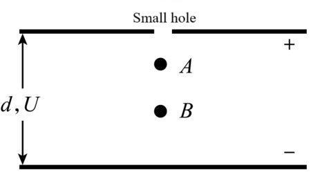
- ROI 裁剪图：[benchmarkallinone/outputs/report_priority_20/run_f2958f3118292117/datasets/physreason/artifacts/crops/prob_191200cc3560c2c27233a042_primary_roi.png](../../datasets/physreason/artifacts/crops/prob_191200cc3560c2c27233a042_primary_roi.png)

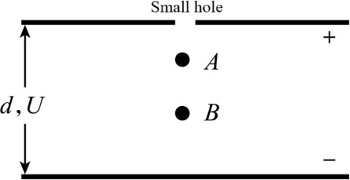

### 5) 清洗判定证据

```json
{
  "clean_score": 0.9131,
  "decision": "reject",
  "decision_reason_codes": [
    "low_resolution"
  ],
  "alignment_summary": {
    "alignment_id": "align_d910b2e587ecf13c21788197",
    "coverage_score": 0.9,
    "consistency_score": 0.98,
    "alignment_status": "good",
    "conflict_count": 0
  },
  "solvability_summary": {
    "solvability_id": "solv_prob_191200cc3560c2c27233a042",
    "solvability_score": 1.0,
    "reasoning_path_exists": true,
    "decision_hint": "pass",
    "failure_codes": []
  },
  "missing_field_summary": {
    "missing_question_text": false,
    "missing_answer_text": false,
    "missing_image_count": 0
  },
  "risk_flags": [
    "low_resolution"
  ],
  "reject_record": {
    "reject_id": "reject_d910b2e587ecf13c21788197",
    "problem_id": "prob_191200cc3560c2c27233a042",
    "stage": "cleaning",
    "reject_level": "problem",
    "reject_reason_codes": [
      "low_resolution"
    ],
    "reject_reason_detail": "Question is already open-ended.",
    "blocking_fields": [
      "low_resolution"
    ],
    "evidence_refs": [
      "align_d910b2e587ecf13c21788197",
      "solv_prob_191200cc3560c2c27233a042"
    ],
    "recoverable": false,
    "recommended_action": "drop",
    "reviewed_by": null,
    "created_at": "2026-03-25T08:49:00Z"
  }
}
```

---

## 03. prob_2983315182e764b2248e405b

- 样本文件：[benchmarkallinone/outputs/report_priority_20/run_f2958f3118292117/datasets/physreason/samples/prob_2983315182e764b2248e405b.json](../../datasets/physreason/samples/prob_2983315182e764b2248e405b.json)
- 源数据集：`PhysReason`
- 源 split：`mini`
- 源题目 ID：`cal_problem_00080`
- 清洗路径：`multimodal_full`
- 是否文本主导：`False`
- 是否依赖图像：`True`
- 决策：`reject`
- 决策原因码：`low_resolution`
- 开放化改写策略：`keep_open`
- 对齐状态：`good`
- 可解性分数：`1.0`
- 可解性提示：`pass`
- 质量风险标记：`low_resolution`

### 采集阶段信号

```json
{
  "core_asset_completeness": {
    "has_question_text": true,
    "has_answer_text": true,
    "image_count": 1,
    "has_multiple_images": false
  },
  "initial_scores": {
    "initial_image_dependency_score": 0.9,
    "initial_multi_solution_score": 0.46,
    "initial_verifiability_score": 0.7247
  }
}
```

### 1) 处理前：原始题目 / 原始答案

**原始题目**

```text
As shown in the figure, an elastic bumper is installed at the bottom of a fixed inclined plane with an inclination angle of $\theta$. The masses of two blocks, P and Q, are $m$ and $4m$, respectively. Q is initially at rest at point A on the inclined plane. At a certain moment, P collides elastically with Q with an upward velocity $v_{0}$ along the inclined plane. The coefficient of kinetic friction between Q and the inclined plane is equal to $\tan \theta$, and the maximum static friction is equal to the sliding friction. There is no friction between P and the inclined plane, and there is no loss of kinetic energy in the collision between P and the bumper. Both blocks can be considered as point masses. The inclined plane is sufficiently long, and P will not collide with Q before Q's velocity reduces to zero. The magnitude of gravitational acceleration is $g$.

1. Determine the magnitudes of the velocities of P and Q, $v_{P_{1}}$ and $v_{Q_{1}}$, immediately after the first collision between P and Q.
2. Determine the height $h_{n}$ that block Q rises to after the $n$-th collision.
3. Determine the total height $H$ that block Q rises from point A.
4. To ensure that P does not collide with Q before Q's velocity reduces to zero, determine the minimum distance $s$ between point A and the bumper.
```

**原始答案**

```text
The speed of P is $\frac{3}{5}v_{0}$, The speed of Q is$\frac{2}{5}v_{0}$
$h_{n}=(\frac{7}{25})^{n-1}\cdot\frac{v_{0}^{2}}{25g}$ ($n=1,2,3 \ldots$)
$H=\frac{v_{0}^{2}}{18g}$
$s=\frac{(8\sqrt{7}-13)v_{0}^{2}}{200g\sin\theta}$
```

### 2) 处理后：规范化题目 / 规范化答案

**规范化题目**

```text
As shown in the figure, an elastic bumper is installed at the bottom of a fixed inclined plane with an inclination angle of $\theta$. The masses of two blocks, P and Q, are $m$ and $4m$, respectively. Q is initially at rest at point A on the inclined plane. At a certain moment, P collides elastically with Q with an upward velocity $v_{0}$ along the inclined plane. The coefficient of kinetic friction between Q and the inclined plane is equal to $\tan \theta$, and the maximum static friction is equal to the sliding friction. There is no friction between P and the inclined plane, and there is no loss of kinetic energy in the collision between P and the bumper. Both blocks can be considered as point masses. The inclined plane is sufficiently long, and P will not collide with Q before Q's velocity reduces to zero. The magnitude of gravitational acceleration is $g$.

1. Determine the magnitudes of the velocities of P and Q, $v_{P_{1}}$ and $v_{Q_{1}}$, immediately after the first collision between P and Q.
2. Determine the height $h_{n}$ that block Q rises to after the $n$-th collision.
3. Determine the total height $H$ that block Q rises from point A.
4. To ensure that P does not collide with Q before Q's velocity reduces to zero, determine the minimum distance $s$ between point A and the bumper.
```

**规范化答案**

```text
The speed of P is $\frac{3}{5}v_{0}$, The speed of Q is$\frac{2}{5}v_{0}$
$h_{n}=(\frac{7}{25})^{n-1}\cdot\frac{v_{0}^{2}}{25g}$ ($n=1,2,3 \ldots$)
$H=\frac{v_{0}^{2}}{18g}$
$s=\frac{(8\sqrt{7}-13)v_{0}^{2}}{200g\sin\theta}$
```

### 3) 开放化改写前后

**改写前（使用规范化题目作为输入）**

```text
As shown in the figure, an elastic bumper is installed at the bottom of a fixed inclined plane with an inclination angle of $\theta$. The masses of two blocks, P and Q, are $m$ and $4m$, respectively. Q is initially at rest at point A on the inclined plane. At a certain moment, P collides elastically with Q with an upward velocity $v_{0}$ along the inclined plane. The coefficient of kinetic friction between Q and the inclined plane is equal to $\tan \theta$, and the maximum static friction is equal to the sliding friction. There is no friction between P and the inclined plane, and there is no loss of kinetic energy in the collision between P and the bumper. Both blocks can be considered as point masses. The inclined plane is sufficiently long, and P will not collide with Q before Q's velocity reduces to zero. The magnitude of gravitational acceleration is $g$.

1. Determine the magnitudes of the velocities of P and Q, $v_{P_{1}}$ and $v_{Q_{1}}$, immediately after the first collision between P and Q.
2. Determine the height $h_{n}$ that block Q rises to after the $n$-th collision.
3. Determine the total height $H$ that block Q rises from point A.
4. To ensure that P does not collide with Q before Q's velocity reduces to zero, determine the minimum distance $s$ between point A and the bumper.
```

**改写后（开放题变体）**

```text
As shown in the figure, an elastic bumper is installed at the bottom of a fixed inclined plane with an inclination angle of $\theta$. The masses of two blocks, P and Q, are $m$ and $4m$, respectively. Q is initially at rest at point A on the inclined plane. At a certain moment, P collides elastically with Q with an upward velocity $v_{0}$ along the inclined plane. The coefficient of kinetic friction between Q and the inclined plane is equal to $\tan \theta$, and the maximum static friction is equal to the sliding friction. There is no friction between P and the inclined plane, and there is no loss of kinetic energy in the collision between P and the bumper. Both blocks can be considered as point masses. The inclined plane is sufficiently long, and P will not collide with Q before Q's velocity reduces to zero. The magnitude of gravitational acceleration is $g$.

1. Determine the magnitudes of the velocities of P and Q, $v_{P_{1}}$ and $v_{Q_{1}}$, immediately after the first collision between P and Q.
2. Determine the height $h_{n}$ that block Q rises to after the $n$-th collision.
3. Determine the total height $H$ that block Q rises from point A.
4. To ensure that P does not collide with Q before Q's velocity reduces to zero, determine the minimum distance $s$ between point A and the bumper.
```

- 期望答案类型：`set`
- 期望答案：`The speed of P is $\frac{3}{5}v_{0}$, The speed of Q is$\frac{2}{5}v_{0}$
$h_{n}=(\frac{7}{25})^{n-1}\cdot\frac{v_{0}^{2}}{25g}$ ($n=1,2,3 \ldots$)
$H=\frac{v_{0}^{2}}{18g}$
$s=\frac{(8\sqrt{7}-13)v_{0}^{2}}{200g\sin\theta}$`
- 改写 rationale：`Question is already open-ended.`
- 丢弃原因码：`无`

### 4) 图像与可视化产物

- 原始图像来源：[benchmark/outputs/repo_cache/hf_raw/physreason/PhysReason-mini/cal_problem_00080/images/7c05238b1dcc73ebff573912ec129aa8a18a06bda240522d3aee68663c0dabb8.jpg](../../../../../../benchmark/outputs/repo_cache/hf_raw/physreason/PhysReason-mini/cal_problem_00080/images/7c05238b1dcc73ebff573912ec129aa8a18a06bda240522d3aee68663c0dabb8.jpg)
- 持久化主图：[benchmarkallinone/outputs/report_priority_20/run_f2958f3118292117/datasets/physreason/artifacts/images/prob_2983315182e764b2248e405b_primary.png](../../datasets/physreason/artifacts/images/prob_2983315182e764b2248e405b_primary.png)

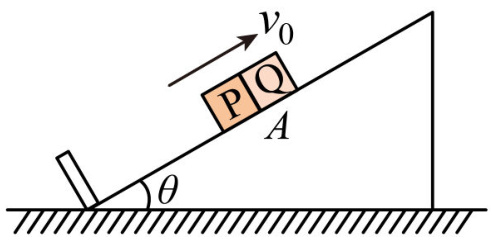
- ROI 裁剪图：[benchmarkallinone/outputs/report_priority_20/run_f2958f3118292117/datasets/physreason/artifacts/crops/prob_2983315182e764b2248e405b_primary_roi.png](../../datasets/physreason/artifacts/crops/prob_2983315182e764b2248e405b_primary_roi.png)

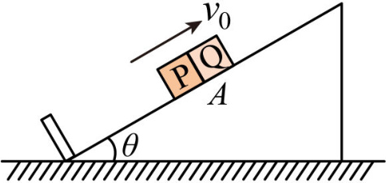

### 5) 清洗判定证据

```json
{
  "clean_score": 0.9258,
  "decision": "reject",
  "decision_reason_codes": [
    "low_resolution"
  ],
  "alignment_summary": {
    "alignment_id": "align_441761e78bb539aaef72fead",
    "coverage_score": 0.9,
    "consistency_score": 0.98,
    "alignment_status": "good",
    "conflict_count": 0
  },
  "solvability_summary": {
    "solvability_id": "solv_prob_2983315182e764b2248e405b",
    "solvability_score": 1.0,
    "reasoning_path_exists": true,
    "decision_hint": "pass",
    "failure_codes": []
  },
  "missing_field_summary": {
    "missing_question_text": false,
    "missing_answer_text": false,
    "missing_image_count": 0
  },
  "risk_flags": [
    "low_resolution"
  ],
  "reject_record": {
    "reject_id": "reject_441761e78bb539aaef72fead",
    "problem_id": "prob_2983315182e764b2248e405b",
    "stage": "cleaning",
    "reject_level": "problem",
    "reject_reason_codes": [
      "low_resolution"
    ],
    "reject_reason_detail": "Question is already open-ended.",
    "blocking_fields": [
      "low_resolution"
    ],
    "evidence_refs": [
      "align_441761e78bb539aaef72fead",
      "solv_prob_2983315182e764b2248e405b"
    ],
    "recoverable": false,
    "recommended_action": "drop",
    "reviewed_by": null,
    "created_at": "2026-03-25T08:49:00Z"
  }
}
```

---

## 04. prob_2ac5fbae9d6541b8773e8f8a

- 样本文件：[benchmarkallinone/outputs/report_priority_20/run_f2958f3118292117/datasets/physreason/samples/prob_2ac5fbae9d6541b8773e8f8a.json](../../datasets/physreason/samples/prob_2ac5fbae9d6541b8773e8f8a.json)
- 源数据集：`PhysReason`
- 源 split：`mini`
- 源题目 ID：`cal_problem_00130`
- 清洗路径：`multimodal_full`
- 是否文本主导：`False`
- 是否依赖图像：`True`
- 决策：`review`
- 决策原因码：`alignment_risky`
- 开放化改写策略：`keep_open`
- 对齐状态：`risky`
- 可解性分数：`1.0`
- 可解性提示：`pass`
- 质量风险标记：`无`

### 采集阶段信号

```json
{
  "core_asset_completeness": {
    "has_question_text": true,
    "has_answer_text": true,
    "image_count": 1,
    "has_multiple_images": false
  },
  "initial_scores": {
    "initial_image_dependency_score": 0.9,
    "initial_multi_solution_score": 0.46,
    "initial_verifiability_score": 0.871
  }
}
```

### 1) 处理前：原始题目 / 原始答案

**原始题目**

```text
As shown in figure (a), four points A, B, M, and N in the same vertical plane are all at a distance of $\sqrt{2}L$ from point $O$. $O$ is the midpoint of the horizontal line connecting A and B. M and N are on the perpendicular bisector of the line connecting A and B. Two point charges, each with a charge of $Q$ ($Q>0$), are fixed at points A and B, respectively. An $x$-axis is established with $O$ as the origin, and vertically downwards as the positive direction. If the electric potential at infinity is taken as zero, the variation of electric potential $\varphi$ along ON with respect to position $x$ is shown in figure (b). A small ball $S_{1}$ with a charge of $Q$ ($Q>0$) falls vertically from point M with a certain initial kinetic energy, and passes through point N after a certain period. The magnitude of its acceleration $a$ during its motion in the ON segment varies with position $x$ as shown in figure (c). In the figures, $g$ is the magnitude of the gravitational acceleration, and $k$ is the electrostatic constant.

1. Determine the magnitude of the electric force experienced by the small ball $S_1$ at point M.
2. When the small ball $S_{1}$ moves to point N, it undergoes an elastic collision with an uncharged insulating small ball $S_{2}$ moving along the negative $x$-axis. It is known that the masses of $S_1$ and $S_{2}$ are equal, and the kinetic energy of $S_{1}$ is $\frac{4k Q^{2}}{3L}$ before and after the collision. The collision time is extremely short. Determine the magnitude of the momentum of $S_{2}$ before the collision.
3. Now, $S_{2}$ is fixed at point N. To ensure that $S_1$ can move to point N and collide with it, what condition must be satisfied by the initial kinetic energy of $S_1$ when it falls from point M?
```

**原始答案**

```text
$\frac{\sqrt{2}k Q^{2}}{4L^{2}}$
$\frac{8k Q^{2}{\sqrt{g L}}}{9g L^{2}}$
$E_{k}>\frac{(13-8\sqrt{2})k Q^{2}}{27L}$
```

### 2) 处理后：规范化题目 / 规范化答案

**规范化题目**

```text
As shown in figure (a), four points A, B, M, and N in the same vertical plane are all at a distance of $\sqrt{2}L$ from point $O$. $O$ is the midpoint of the horizontal line connecting A and B. M and N are on the perpendicular bisector of the line connecting A and B. Two point charges, each with a charge of $Q$ ($Q>0$), are fixed at points A and B, respectively. An $x$-axis is established with $O$ as the origin, and vertically downwards as the positive direction. If the electric potential at infinity is taken as zero, the variation of electric potential $\varphi$ along ON with respect to position $x$ is shown in figure (b). A small ball $S_{1}$ with a charge of $Q$ ($Q>0$) falls vertically from point M with a certain initial kinetic energy, and passes through point N after a certain period. The magnitude of its acceleration $a$ during its motion in the ON segment varies with position $x$ as shown in figure (c). In the figures, $g$ is the magnitude of the gravitational acceleration, and $k$ is the electrostatic constant.

1. Determine the magnitude of the electric force experienced by the small ball $S_1$ at point M.
2. When the small ball $S_{1}$ moves to point N, it undergoes an elastic collision with an uncharged insulating small ball $S_{2}$ moving along the negative $x$-axis. It is known that the masses of $S_1$ and $S_{2}$ are equal, and the kinetic energy of $S_{1}$ is $\frac{4k Q^{2}}{3L}$ before and after the collision. The collision time is extremely short. Determine the magnitude of the momentum of $S_{2}$ before the collision.
3. Now, $S_{2}$ is fixed at point N. To ensure that $S_1$ can move to point N and collide with it, what condition must be satisfied by the initial kinetic energy of $S_1$ when it falls from point M?
```

**规范化答案**

```text
$\frac{\sqrt{2}k Q^{2}}{4L^{2}}$
$\frac{8k Q^{2}{\sqrt{g L}}}{9g L^{2}}$
$E_{k}>\frac{(13-8\sqrt{2})k Q^{2}}{27L}$
```

### 3) 开放化改写前后

**改写前（使用规范化题目作为输入）**

```text
As shown in figure (a), four points A, B, M, and N in the same vertical plane are all at a distance of $\sqrt{2}L$ from point $O$. $O$ is the midpoint of the horizontal line connecting A and B. M and N are on the perpendicular bisector of the line connecting A and B. Two point charges, each with a charge of $Q$ ($Q>0$), are fixed at points A and B, respectively. An $x$-axis is established with $O$ as the origin, and vertically downwards as the positive direction. If the electric potential at infinity is taken as zero, the variation of electric potential $\varphi$ along ON with respect to position $x$ is shown in figure (b). A small ball $S_{1}$ with a charge of $Q$ ($Q>0$) falls vertically from point M with a certain initial kinetic energy, and passes through point N after a certain period. The magnitude of its acceleration $a$ during its motion in the ON segment varies with position $x$ as shown in figure (c). In the figures, $g$ is the magnitude of the gravitational acceleration, and $k$ is the electrostatic constant.

1. Determine the magnitude of the electric force experienced by the small ball $S_1$ at point M.
2. When the small ball $S_{1}$ moves to point N, it undergoes an elastic collision with an uncharged insulating small ball $S_{2}$ moving along the negative $x$-axis. It is known that the masses of $S_1$ and $S_{2}$ are equal, and the kinetic energy of $S_{1}$ is $\frac{4k Q^{2}}{3L}$ before and after the collision. The collision time is extremely short. Determine the magnitude of the momentum of $S_{2}$ before the collision.
3. Now, $S_{2}$ is fixed at point N. To ensure that $S_1$ can move to point N and collide with it, what condition must be satisfied by the initial kinetic energy of $S_1$ when it falls from point M?
```

**改写后（开放题变体）**

```text
As shown in figure (a), four points A, B, M, and N in the same vertical plane are all at a distance of $\sqrt{2}L$ from point $O$. $O$ is the midpoint of the horizontal line connecting A and B. M and N are on the perpendicular bisector of the line connecting A and B. Two point charges, each with a charge of $Q$ ($Q>0$), are fixed at points A and B, respectively. An $x$-axis is established with $O$ as the origin, and vertically downwards as the positive direction. If the electric potential at infinity is taken as zero, the variation of electric potential $\varphi$ along ON with respect to position $x$ is shown in figure (b). A small ball $S_{1}$ with a charge of $Q$ ($Q>0$) falls vertically from point M with a certain initial kinetic energy, and passes through point N after a certain period. The magnitude of its acceleration $a$ during its motion in the ON segment varies with position $x$ as shown in figure (c). In the figures, $g$ is the magnitude of the gravitational acceleration, and $k$ is the electrostatic constant.

1. Determine the magnitude of the electric force experienced by the small ball $S_1$ at point M.
2. When the small ball $S_{1}$ moves to point N, it undergoes an elastic collision with an uncharged insulating small ball $S_{2}$ moving along the negative $x$-axis. It is known that the masses of $S_1$ and $S_{2}$ are equal, and the kinetic energy of $S_{1}$ is $\frac{4k Q^{2}}{3L}$ before and after the collision. The collision time is extremely short. Determine the magnitude of the momentum of $S_{2}$ before the collision.
3. Now, $S_{2}$ is fixed at point N. To ensure that $S_1$ can move to point N and collide with it, what condition must be satisfied by the initial kinetic energy of $S_1$ when it falls from point M?
```

- 期望答案类型：`short_text`
- 期望答案：`$\frac{\sqrt{2}k Q^{2}}{4L^{2}}$
$\frac{8k Q^{2}{\sqrt{g L}}}{9g L^{2}}$
$E_{k}>\frac{(13-8\sqrt{2})k Q^{2}}{27L}$`
- 改写 rationale：`Question is already open-ended.`
- 丢弃原因码：`无`

### 4) 图像与可视化产物

- 原始图像来源：[benchmark/outputs/repo_cache/hf_raw/physreason/PhysReason-mini/cal_problem_00130/images/6c53e3d8eda6c674f7e51b7ca28e52a4ab7ca0c2b692cf73ea8d49f1155bba26.jpg](../../../../../../benchmark/outputs/repo_cache/hf_raw/physreason/PhysReason-mini/cal_problem_00130/images/6c53e3d8eda6c674f7e51b7ca28e52a4ab7ca0c2b692cf73ea8d49f1155bba26.jpg)
- 持久化主图：[benchmarkallinone/outputs/report_priority_20/run_f2958f3118292117/datasets/physreason/artifacts/images/prob_2ac5fbae9d6541b8773e8f8a_primary.png](../../datasets/physreason/artifacts/images/prob_2ac5fbae9d6541b8773e8f8a_primary.png)

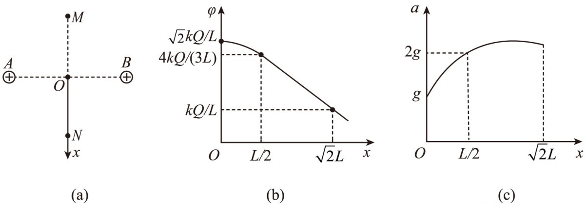
- ROI 裁剪图：[benchmarkallinone/outputs/report_priority_20/run_f2958f3118292117/datasets/physreason/artifacts/crops/prob_2ac5fbae9d6541b8773e8f8a_primary_roi.png](../../datasets/physreason/artifacts/crops/prob_2ac5fbae9d6541b8773e8f8a_primary_roi.png)

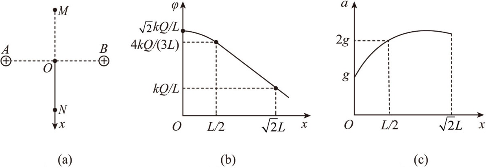

### 5) 清洗判定证据

```json
{
  "clean_score": 0.8781,
  "decision": "review",
  "decision_reason_codes": [
    "alignment_risky"
  ],
  "alignment_summary": {
    "alignment_id": "align_d92f25d1d6821b51498a4933",
    "coverage_score": 0.9,
    "consistency_score": 0.82,
    "alignment_status": "risky",
    "conflict_count": 1
  },
  "solvability_summary": {
    "solvability_id": "solv_prob_2ac5fbae9d6541b8773e8f8a",
    "solvability_score": 1.0,
    "reasoning_path_exists": true,
    "decision_hint": "pass",
    "failure_codes": []
  },
  "missing_field_summary": {
    "missing_question_text": false,
    "missing_answer_text": false,
    "missing_image_count": 0
  },
  "risk_flags": [],
  "reject_record": null
}
```

---

## 05. prob_4fc9ebcb563cd3afdf658f5a

- 样本文件：[benchmarkallinone/outputs/report_priority_20/run_f2958f3118292117/datasets/physreason/samples/prob_4fc9ebcb563cd3afdf658f5a.json](../../datasets/physreason/samples/prob_4fc9ebcb563cd3afdf658f5a.json)
- 源数据集：`PhysReason`
- 源 split：`mini`
- 源题目 ID：`cal_problem_00045`
- 清洗路径：`multimodal_full`
- 是否文本主导：`False`
- 是否依赖图像：`True`
- 决策：`review`
- 决策原因码：`alignment_risky`
- 开放化改写策略：`keep_open`
- 对齐状态：`risky`
- 可解性分数：`1.0`
- 可解性提示：`pass`
- 质量风险标记：`无`

### 采集阶段信号

```json
{
  "core_asset_completeness": {
    "has_question_text": true,
    "has_answer_text": true,
    "image_count": 1,
    "has_multiple_images": false
  },
  "initial_scores": {
    "initial_image_dependency_score": 0.9,
    "initial_multi_solution_score": 0.46,
    "initial_verifiability_score": 0.7081
  }
}
```

### 1) 处理前：原始题目 / 原始答案

**原始题目**

```text
In a vertical plane, a block $a$ of mass $m$ is initially at rest at point $A$ directly below the suspension point $O$. A conveyor belt MN, rotating counterclockwise with a velocity $v$, is coplanar with the horizontal tracks AB, CD, and FG. The lengths of AB, MN, and CD are all $l$. The radius of the circular arc thin pipe DE is $R$, and EF lies on the vertical diameter, with point $E$ at a height $H$. Initially, a block $b$, identical to block $a$, is suspended from point $O$ and pulled to the left to a height $h$ before being released from rest. The string remains taut, and when it reaches its lowest point, it undergoes an elastic head-on collision with block $a$. Given $m=2g$, $l=1m$, $R=0.4m$, $H=0.2m$, $v=2m/s$, and the coefficient of kinetic friction between the block and MN, CD is $\mu=0.5$. Tracks AB and pipe DE are frictionless. Block $a$ comes to rest without bouncing upon landing on FG. Neglect the gaps between $M$, $B$, $N$, $C$. CD is smoothly connected to DE. Treat the blocks as point masses, and let $g=10m/\mathrm{s}^{2}$.

1. If $h=1.25m$, determine the magnitude of the velocity $v_{0}$ of block $a$ immediately after the collision with block $b$.
2. Determine the relationship between the normal force $F_{N}$ exerted by the pipe on block $a$ when it is at the highest point of $DE$ and the height $h$.
3. If the release height of block $b$ is $0.9m<h<1.65m$, determine the range of the final resting position $x$ of block $a$ (with point $A$ as the origin and the horizontal direction to the right as positive, establishing the x-axis).
```

**原始答案**

```text
5\mathrm{m/s}
F_{N}=0.1h-0.14(N) (h \geq 1.2m, direction of $F_{N}$ is vertically downwards)
when $0.9m<h<1.2m$，$2.6m{<}x{\leq}3m$，When $1.2m \leq h \leq 1.65m$，$(3+{\frac{\sqrt{3}}{5}})m \leq x \leq (3.6+{\frac{\sqrt{3}}{5}})m$
```

### 2) 处理后：规范化题目 / 规范化答案

**规范化题目**

```text
In a vertical plane, a block $a$ of mass $m$ is initially at rest at point $A$ directly below the suspension point $O$. A conveyor belt MN, rotating counterclockwise with a velocity $v$, is coplanar with the horizontal tracks AB, CD, and FG. The lengths of AB, MN, and CD are all $l$. The radius of the circular arc thin pipe DE is $R$, and EF lies on the vertical diameter, with point $E$ at a height $H$. Initially, a block $b$, identical to block $a$, is suspended from point $O$ and pulled to the left to a height $h$ before being released from rest. The string remains taut, and when it reaches its lowest point, it undergoes an elastic head-on collision with block $a$. Given $m=2g$, $l=1m$, $R=0.4m$, $H=0.2m$, $v=2m/s$, and the coefficient of kinetic friction between the block and MN, CD is $\mu=0.5$. Tracks AB and pipe DE are frictionless. Block $a$ comes to rest without bouncing upon landing on FG. Neglect the gaps between $M$, $B$, $N$, $C$. CD is smoothly connected to DE. Treat the blocks as point masses, and let $g=10m/\mathrm{s}^{2}$.

1. If $h=1.25m$, determine the magnitude of the velocity $v_{0}$ of block $a$ immediately after the collision with block $b$.
2. Determine the relationship between the normal force $F_{N}$ exerted by the pipe on block $a$ when it is at the highest point of $DE$ and the height $h$.
3. If the release height of block $b$ is $0.9m<h<1.65m$, determine the range of the final resting position $x$ of block $a$ (with point $A$ as the origin and the horizontal direction to the right as positive, establishing the x-axis).
```

**规范化答案**

```text
5\mathrm{m/s}
F_{N}=0.1h-0.14(N) (h \geq 1.2m, direction of $F_{N}$ is vertically downwards)
when $0.9m<h<1.2m$,$2.6m{<}x{\leq}3m$,When $1.2m \leq h \leq 1.65m$,$(3+{\frac{\sqrt{3}}{5}})m \leq x \leq (3.6+{\frac{\sqrt{3}}{5}})m$
```

### 3) 开放化改写前后

**改写前（使用规范化题目作为输入）**

```text
In a vertical plane, a block $a$ of mass $m$ is initially at rest at point $A$ directly below the suspension point $O$. A conveyor belt MN, rotating counterclockwise with a velocity $v$, is coplanar with the horizontal tracks AB, CD, and FG. The lengths of AB, MN, and CD are all $l$. The radius of the circular arc thin pipe DE is $R$, and EF lies on the vertical diameter, with point $E$ at a height $H$. Initially, a block $b$, identical to block $a$, is suspended from point $O$ and pulled to the left to a height $h$ before being released from rest. The string remains taut, and when it reaches its lowest point, it undergoes an elastic head-on collision with block $a$. Given $m=2g$, $l=1m$, $R=0.4m$, $H=0.2m$, $v=2m/s$, and the coefficient of kinetic friction between the block and MN, CD is $\mu=0.5$. Tracks AB and pipe DE are frictionless. Block $a$ comes to rest without bouncing upon landing on FG. Neglect the gaps between $M$, $B$, $N$, $C$. CD is smoothly connected to DE. Treat the blocks as point masses, and let $g=10m/\mathrm{s}^{2}$.

1. If $h=1.25m$, determine the magnitude of the velocity $v_{0}$ of block $a$ immediately after the collision with block $b$.
2. Determine the relationship between the normal force $F_{N}$ exerted by the pipe on block $a$ when it is at the highest point of $DE$ and the height $h$.
3. If the release height of block $b$ is $0.9m<h<1.65m$, determine the range of the final resting position $x$ of block $a$ (with point $A$ as the origin and the horizontal direction to the right as positive, establishing the x-axis).
```

**改写后（开放题变体）**

```text
In a vertical plane, a block $a$ of mass $m$ is initially at rest at point $A$ directly below the suspension point $O$. A conveyor belt MN, rotating counterclockwise with a velocity $v$, is coplanar with the horizontal tracks AB, CD, and FG. The lengths of AB, MN, and CD are all $l$. The radius of the circular arc thin pipe DE is $R$, and EF lies on the vertical diameter, with point $E$ at a height $H$. Initially, a block $b$, identical to block $a$, is suspended from point $O$ and pulled to the left to a height $h$ before being released from rest. The string remains taut, and when it reaches its lowest point, it undergoes an elastic head-on collision with block $a$. Given $m=2g$, $l=1m$, $R=0.4m$, $H=0.2m$, $v=2m/s$, and the coefficient of kinetic friction between the block and MN, CD is $\mu=0.5$. Tracks AB and pipe DE are frictionless. Block $a$ comes to rest without bouncing upon landing on FG. Neglect the gaps between $M$, $B$, $N$, $C$. CD is smoothly connected to DE. Treat the blocks as point masses, and let $g=10m/\mathrm{s}^{2}$.

1. If $h=1.25m$, determine the magnitude of the velocity $v_{0}$ of block $a$ immediately after the collision with block $b$.
2. Determine the relationship between the normal force $F_{N}$ exerted by the pipe on block $a$ when it is at the highest point of $DE$ and the height $h$.
3. If the release height of block $b$ is $0.9m<h<1.65m$, determine the range of the final resting position $x$ of block $a$ (with point $A$ as the origin and the horizontal direction to the right as positive, establishing the x-axis).
```

- 期望答案类型：`set`
- 期望答案：`5\mathrm{m/s}
F_{N}=0.1h-0.14(N) (h \geq 1.2m, direction of $F_{N}$ is vertically downwards)
when $0.9m<h<1.2m$,$2.6m{<}x{\leq}3m$,When $1.2m \leq h \leq 1.65m$,$(3+{\frac{\sqrt{3}}{5}})m \leq x \leq (3.6+{\frac{\sqrt{3}}{5}})m$`
- 改写 rationale：`Question is already open-ended.`
- 丢弃原因码：`无`

### 4) 图像与可视化产物

- 原始图像来源：[benchmark/outputs/repo_cache/hf_raw/physreason/PhysReason-mini/cal_problem_00045/images/cd397d8b0dfae2b3b4f5a4a94210da861c1fd5949db2f2147b48c8e02e01b968.jpg](../../../../../../benchmark/outputs/repo_cache/hf_raw/physreason/PhysReason-mini/cal_problem_00045/images/cd397d8b0dfae2b3b4f5a4a94210da861c1fd5949db2f2147b48c8e02e01b968.jpg)
- 持久化主图：[benchmarkallinone/outputs/report_priority_20/run_f2958f3118292117/datasets/physreason/artifacts/images/prob_4fc9ebcb563cd3afdf658f5a_primary.png](../../datasets/physreason/artifacts/images/prob_4fc9ebcb563cd3afdf658f5a_primary.png)

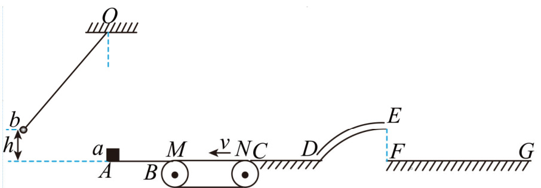
- ROI 裁剪图：[benchmarkallinone/outputs/report_priority_20/run_f2958f3118292117/datasets/physreason/artifacts/crops/prob_4fc9ebcb563cd3afdf658f5a_primary_roi.png](../../datasets/physreason/artifacts/crops/prob_4fc9ebcb563cd3afdf658f5a_primary_roi.png)

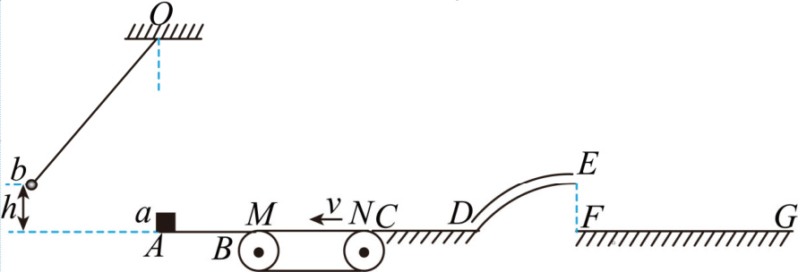

### 5) 清洗判定证据

```json
{
  "clean_score": 0.86,
  "decision": "review",
  "decision_reason_codes": [
    "alignment_risky"
  ],
  "alignment_summary": {
    "alignment_id": "align_d850645d9b8d37e3bd949fae",
    "coverage_score": 0.9,
    "consistency_score": 0.74,
    "alignment_status": "risky",
    "conflict_count": 2
  },
  "solvability_summary": {
    "solvability_id": "solv_prob_4fc9ebcb563cd3afdf658f5a",
    "solvability_score": 1.0,
    "reasoning_path_exists": true,
    "decision_hint": "pass",
    "failure_codes": []
  },
  "missing_field_summary": {
    "missing_question_text": false,
    "missing_answer_text": false,
    "missing_image_count": 0
  },
  "risk_flags": [],
  "reject_record": null
}
```

---

## 06. prob_5611cf71068c5b07ff0f9d2f

- 样本文件：[benchmarkallinone/outputs/report_priority_20/run_f2958f3118292117/datasets/physreason/samples/prob_5611cf71068c5b07ff0f9d2f.json](../../datasets/physreason/samples/prob_5611cf71068c5b07ff0f9d2f.json)
- 源数据集：`PhysReason`
- 源 split：`mini`
- 源题目 ID：`cal_problem_00128`
- 清洗路径：`multimodal_full`
- 是否文本主导：`False`
- 是否依赖图像：`True`
- 决策：`reject`
- 决策原因码：`low_resolution`
- 开放化改写策略：`keep_open`
- 对齐状态：`risky`
- 可解性分数：`1.0`
- 可解性提示：`pass`
- 质量风险标记：`low_resolution`

### 采集阶段信号

```json
{
  "core_asset_completeness": {
    "has_question_text": true,
    "has_answer_text": true,
    "image_count": 1,
    "has_multiple_images": false
  },
  "initial_scores": {
    "initial_image_dependency_score": 0.9,
    "initial_multi_solution_score": 0.46,
    "initial_verifiability_score": 0.7139
  }
}
```

### 1) 处理前：原始题目 / 原始答案

**原始题目**

```text
A horizontal metal ring with a radius of $r=0.2\mathsf{m}$ is fixed. Two metal rods, each with a length of $r$ and a resistance of $R_{0}$, are placed along the diameter of the ring. One end of each rod is in good contact with the ring, and the other end is fixed to a conductive vertical rotating shaft $OO^{\prime}$ passing through the center of the ring. The rods rotate uniformly with an angular velocity of $\omega=600\ rad/s$. A uniform magnetic field with a magnetic induction strength of $\mathsf{B}_{1}$ exists in the left half of the ring. The edge of the ring and the brushes in good contact with the rotating shaft are connected to parallel horizontal metal tracks with a distance of $l_{1}$. A capacitor with a capacitance of $C=0.09\ F$ is connected between the tracks. The capacitor can be connected to terminals 1 and 2 via a single-pole double-throw switch S. On the left side of the capacitor is a region with a width of $l_{1}$, a length of $l_{2}$, and a uniform magnetic field with a magnetic induction strength of $B_{2}$. A metal rod $ab$ is placed perpendicularly to the track near the left edge within the magnetic field region. Outside the magnetic field region, there are insulated tracks with a distance of $l_{1}$ smoothly connected to the metal tracks. A "[" shaped metal frame fcde is placed on the horizontal section of the insulated tracks. The length of rod ab and the width of the "[" shaped frame are both $l_{1}$, and their masses are both $m=0.01\ kg$. The lengths of de and $cf$ are both $l_{3}=0.08\ m$. It is known that $l_{1}=0.25\ m$, $l_{2}=0.068\ m$, $B_{1}=B_{2}=1\ T$, and the directions are both vertically upwards. The resistance of the rod ab and the cd side of the "[" shaped frame are both $R=0.1\ \Omega$. Other resistances are negligible. The tracks are smooth, and the rod ab is in good contact with the tracks and remains perpendicular to the tracks during its motion. Initially, the switch S is connected to terminal 1. After the capacitor is fully charged, S is switched from 1 to 2. The capacitor discharges, and the rod ab is ejected out of the magnetic field. The rod ab then sticks to the "[" shaped frame, forming a closed frame abcd. At this point, S is disconnected from 2. It is known that the center of mass of the frame abcd rises by $0.2\ m$ on the inclined track before returning into the magnetic field.

1. Determine the amount of charge $Q$ on the capacitor after it is fully charged, and which plate ($M$ or $N$) is positively charged?
2. Calculate the amount of charge $\Delta Q$ released by the capacitor.
3. Calculate the maximum distance $x$ between side ab and the left boundary of the magnetic field region after the frame abcd enters the magnetic field.
```

**原始答案**

```text
0.54C, plate M becomes positively charged
0.16C
0.14m
```

### 2) 处理后：规范化题目 / 规范化答案

**规范化题目**

```text
A horizontal metal ring with a radius of $r=0.2\mathsf{m}$ is fixed. Two metal rods, each with a length of $r$ and a resistance of $R_{0}$, are placed along the diameter of the ring. One end of each rod is in good contact with the ring, and the other end is fixed to a conductive vertical rotating shaft $OO^{\prime}$ passing through the center of the ring. The rods rotate uniformly with an angular velocity of $\omega=600\ rad/s$. A uniform magnetic field with a magnetic induction strength of $\mathsf{B}_{1}$ exists in the left half of the ring. The edge of the ring and the brushes in good contact with the rotating shaft are connected to parallel horizontal metal tracks with a distance of $l_{1}$. A capacitor with a capacitance of $C=0.09\ F$ is connected between the tracks. The capacitor can be connected to terminals 1 and 2 via a single-pole double-throw switch S. On the left side of the capacitor is a region with a width of $l_{1}$, a length of $l_{2}$, and a uniform magnetic field with a magnetic induction strength of $B_{2}$. A metal rod $ab$ is placed perpendicularly to the track near the left edge within the magnetic field region. Outside the magnetic field region, there are insulated tracks with a distance of $l_{1}$ smoothly connected to the metal tracks. A "[" shaped metal frame fcde is placed on the horizontal section of the insulated tracks. The length of rod ab and the width of the "[" shaped frame are both $l_{1}$, and their masses are both $m=0.01\ kg$. The lengths of de and $cf$ are both $l_{3}=0.08\ m$. It is known that $l_{1}=0.25\ m$, $l_{2}=0.068\ m$, $B_{1}=B_{2}=1\ T$, and the directions are both vertically upwards. The resistance of the rod ab and the cd side of the "[" shaped frame are both $R=0.1\ \Omega$. Other resistances are negligible. The tracks are smooth, and the rod ab is in good contact with the tracks and remains perpendicular to the tracks during its motion. Initially, the switch S is connected to terminal 1. After the capacitor is fully charged, S is switched from 1 to 2. The capacitor discharges, and the rod ab is ejected out of the magnetic field. The rod ab then sticks to the "[" shaped frame, forming a closed frame abcd. At this point, S is disconnected from 2. It is known that the center of mass of the frame abcd rises by $0.2\ m$ on the inclined track before returning into the magnetic field.

1. Determine the amount of charge $Q$ on the capacitor after it is fully charged, and which plate ($M$ or $N$) is positively charged?
2. Calculate the amount of charge $\Delta Q$ released by the capacitor.
3. Calculate the maximum distance $x$ between side ab and the left boundary of the magnetic field region after the frame abcd enters the magnetic field.
```

**规范化答案**

```text
0.54C, plate M becomes positively charged
0.16C
0.14m
```

### 3) 开放化改写前后

**改写前（使用规范化题目作为输入）**

```text
A horizontal metal ring with a radius of $r=0.2\mathsf{m}$ is fixed. Two metal rods, each with a length of $r$ and a resistance of $R_{0}$, are placed along the diameter of the ring. One end of each rod is in good contact with the ring, and the other end is fixed to a conductive vertical rotating shaft $OO^{\prime}$ passing through the center of the ring. The rods rotate uniformly with an angular velocity of $\omega=600\ rad/s$. A uniform magnetic field with a magnetic induction strength of $\mathsf{B}_{1}$ exists in the left half of the ring. The edge of the ring and the brushes in good contact with the rotating shaft are connected to parallel horizontal metal tracks with a distance of $l_{1}$. A capacitor with a capacitance of $C=0.09\ F$ is connected between the tracks. The capacitor can be connected to terminals 1 and 2 via a single-pole double-throw switch S. On the left side of the capacitor is a region with a width of $l_{1}$, a length of $l_{2}$, and a uniform magnetic field with a magnetic induction strength of $B_{2}$. A metal rod $ab$ is placed perpendicularly to the track near the left edge within the magnetic field region. Outside the magnetic field region, there are insulated tracks with a distance of $l_{1}$ smoothly connected to the metal tracks. A "[" shaped metal frame fcde is placed on the horizontal section of the insulated tracks. The length of rod ab and the width of the "[" shaped frame are both $l_{1}$, and their masses are both $m=0.01\ kg$. The lengths of de and $cf$ are both $l_{3}=0.08\ m$. It is known that $l_{1}=0.25\ m$, $l_{2}=0.068\ m$, $B_{1}=B_{2}=1\ T$, and the directions are both vertically upwards. The resistance of the rod ab and the cd side of the "[" shaped frame are both $R=0.1\ \Omega$. Other resistances are negligible. The tracks are smooth, and the rod ab is in good contact with the tracks and remains perpendicular to the tracks during its motion. Initially, the switch S is connected to terminal 1. After the capacitor is fully charged, S is switched from 1 to 2. The capacitor discharges, and the rod ab is ejected out of the magnetic field. The rod ab then sticks to the "[" shaped frame, forming a closed frame abcd. At this point, S is disconnected from 2. It is known that the center of mass of the frame abcd rises by $0.2\ m$ on the inclined track before returning into the magnetic field.

1. Determine the amount of charge $Q$ on the capacitor after it is fully charged, and which plate ($M$ or $N$) is positively charged?
2. Calculate the amount of charge $\Delta Q$ released by the capacitor.
3. Calculate the maximum distance $x$ between side ab and the left boundary of the magnetic field region after the frame abcd enters the magnetic field.
```

**改写后（开放题变体）**

```text
A horizontal metal ring with a radius of $r=0.2\mathsf{m}$ is fixed. Two metal rods, each with a length of $r$ and a resistance of $R_{0}$, are placed along the diameter of the ring. One end of each rod is in good contact with the ring, and the other end is fixed to a conductive vertical rotating shaft $OO^{\prime}$ passing through the center of the ring. The rods rotate uniformly with an angular velocity of $\omega=600\ rad/s$. A uniform magnetic field with a magnetic induction strength of $\mathsf{B}_{1}$ exists in the left half of the ring. The edge of the ring and the brushes in good contact with the rotating shaft are connected to parallel horizontal metal tracks with a distance of $l_{1}$. A capacitor with a capacitance of $C=0.09\ F$ is connected between the tracks. The capacitor can be connected to terminals 1 and 2 via a single-pole double-throw switch S. On the left side of the capacitor is a region with a width of $l_{1}$, a length of $l_{2}$, and a uniform magnetic field with a magnetic induction strength of $B_{2}$. A metal rod $ab$ is placed perpendicularly to the track near the left edge within the magnetic field region. Outside the magnetic field region, there are insulated tracks with a distance of $l_{1}$ smoothly connected to the metal tracks. A "[" shaped metal frame fcde is placed on the horizontal section of the insulated tracks. The length of rod ab and the width of the "[" shaped frame are both $l_{1}$, and their masses are both $m=0.01\ kg$. The lengths of de and $cf$ are both $l_{3}=0.08\ m$. It is known that $l_{1}=0.25\ m$, $l_{2}=0.068\ m$, $B_{1}=B_{2}=1\ T$, and the directions are both vertically upwards. The resistance of the rod ab and the cd side of the "[" shaped frame are both $R=0.1\ \Omega$. Other resistances are negligible. The tracks are smooth, and the rod ab is in good contact with the tracks and remains perpendicular to the tracks during its motion. Initially, the switch S is connected to terminal 1. After the capacitor is fully charged, S is switched from 1 to 2. The capacitor discharges, and the rod ab is ejected out of the magnetic field. The rod ab then sticks to the "[" shaped frame, forming a closed frame abcd. At this point, S is disconnected from 2. It is known that the center of mass of the frame abcd rises by $0.2\ m$ on the inclined track before returning into the magnetic field.

1. Determine the amount of charge $Q$ on the capacitor after it is fully charged, and which plate ($M$ or $N$) is positively charged?
2. Calculate the amount of charge $\Delta Q$ released by the capacitor.
3. Calculate the maximum distance $x$ between side ab and the left boundary of the magnetic field region after the frame abcd enters the magnetic field.
```

- 期望答案类型：`set`
- 期望答案：`0.54C, plate M becomes positively charged
0.16C
0.14m`
- 改写 rationale：`Question is already open-ended.`
- 丢弃原因码：`无`

### 4) 图像与可视化产物

- 原始图像来源：[benchmark/outputs/repo_cache/hf_raw/physreason/PhysReason-mini/cal_problem_00128/images/a36cdd0fd41a4ecc23c51569f2929dcacec7fbf33c0eb6fb82728a46e5c0695c.jpg](../../../../../../benchmark/outputs/repo_cache/hf_raw/physreason/PhysReason-mini/cal_problem_00128/images/a36cdd0fd41a4ecc23c51569f2929dcacec7fbf33c0eb6fb82728a46e5c0695c.jpg)
- 持久化主图：[benchmarkallinone/outputs/report_priority_20/run_f2958f3118292117/datasets/physreason/artifacts/images/prob_5611cf71068c5b07ff0f9d2f_primary.png](../../datasets/physreason/artifacts/images/prob_5611cf71068c5b07ff0f9d2f_primary.png)

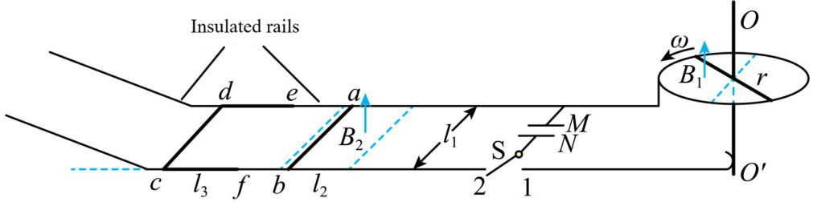
- ROI 裁剪图：无

### 5) 清洗判定证据

```json
{
  "clean_score": 0.8684,
  "decision": "reject",
  "decision_reason_codes": [
    "low_resolution"
  ],
  "alignment_summary": {
    "alignment_id": "align_0393e44e46e4f170ccec1b03",
    "coverage_score": 0.9,
    "consistency_score": 0.74,
    "alignment_status": "risky",
    "conflict_count": 2
  },
  "solvability_summary": {
    "solvability_id": "solv_prob_5611cf71068c5b07ff0f9d2f",
    "solvability_score": 1.0,
    "reasoning_path_exists": true,
    "decision_hint": "pass",
    "failure_codes": []
  },
  "missing_field_summary": {
    "missing_question_text": false,
    "missing_answer_text": false,
    "missing_image_count": 0
  },
  "risk_flags": [
    "low_resolution"
  ],
  "reject_record": {
    "reject_id": "reject_0393e44e46e4f170ccec1b03",
    "problem_id": "prob_5611cf71068c5b07ff0f9d2f",
    "stage": "cleaning",
    "reject_level": "problem",
    "reject_reason_codes": [
      "low_resolution"
    ],
    "reject_reason_detail": "Question is already open-ended.",
    "blocking_fields": [
      "low_resolution"
    ],
    "evidence_refs": [
      "align_0393e44e46e4f170ccec1b03",
      "solv_prob_5611cf71068c5b07ff0f9d2f"
    ],
    "recoverable": false,
    "recommended_action": "drop",
    "reviewed_by": null,
    "created_at": "2026-03-25T08:49:00Z"
  }
}
```

---

## 07. prob_5b507737105efbd93015e697

- 样本文件：[benchmarkallinone/outputs/report_priority_20/run_f2958f3118292117/datasets/physreason/samples/prob_5b507737105efbd93015e697.json](../../datasets/physreason/samples/prob_5b507737105efbd93015e697.json)
- 源数据集：`PhysReason`
- 源 split：`mini`
- 源题目 ID：`cal_problem_00138`
- 清洗路径：`multimodal_full`
- 是否文本主导：`False`
- 是否依赖图像：`True`
- 决策：`review`
- 决策原因码：`alignment_risky`
- 开放化改写策略：`keep_open`
- 对齐状态：`risky`
- 可解性分数：`1.0`
- 可解性提示：`pass`
- 质量风险标记：`无`

### 采集阶段信号

```json
{
  "core_asset_completeness": {
    "has_question_text": true,
    "has_answer_text": true,
    "image_count": 1,
    "has_multiple_images": false
  },
  "initial_scores": {
    "initial_image_dependency_score": 0.9,
    "initial_multi_solution_score": 0.46,
    "initial_verifiability_score": 0.7136
  }
}
```

### 1) 处理前：原始题目 / 原始答案

**原始题目**

```text
As shown in the figure, $M$ is a particle accelerator; N is a velocity selector, with a uniform electric field and a uniform magnetic field perpendicular to each other between two parallel conductive plates. The magnetic field direction is into the page, with a magnetic flux density of $B$. A positively charged particle with a mass of $m$ and charge of $q$, released from point S with an initial velocity of 0, is accelerated by $M$ and then passes through N along a straight line (the dashed line parallel to the conductive plates) with a velocity $v$. Gravity is negligible.

1. Determine the accelerating voltage $U$ of the particle accelerator $M$.
2. Determine the magnitude and direction of the electric field strength $E$ between the two plates of the velocity selector N.
3. Another positively charged particle with a mass of $2m$ and charge of $q$, also released from point S with an initial velocity of 0, departs from N with a deviation of $d$ from the dashed line in the figure. Calculate the kinetic energy $E_{k}$ of this particle when it leaves N.
```

**原始答案**

```text
U = \frac{mv^{2}}{2q}
E = vB, the direction is vertically downward perpendicular to the conductor plate.
E_{k} = \frac{1}{2}m v^{2} + q B v d
```

### 2) 处理后：规范化题目 / 规范化答案

**规范化题目**

```text
As shown in the figure, $M$ is a particle accelerator; N is a velocity selector, with a uniform electric field and a uniform magnetic field perpendicular to each other between two parallel conductive plates. The magnetic field direction is into the page, with a magnetic flux density of $B$. A positively charged particle with a mass of $m$ and charge of $q$, released from point S with an initial velocity of 0, is accelerated by $M$ and then passes through N along a straight line (the dashed line parallel to the conductive plates) with a velocity $v$. Gravity is negligible.

1. Determine the accelerating voltage $U$ of the particle accelerator $M$.
2. Determine the magnitude and direction of the electric field strength $E$ between the two plates of the velocity selector N.
3. Another positively charged particle with a mass of $2m$ and charge of $q$, also released from point S with an initial velocity of 0, departs from N with a deviation of $d$ from the dashed line in the figure. Calculate the kinetic energy $E_{k}$ of this particle when it leaves N.
```

**规范化答案**

```text
U = \frac{mv^{2}}{2q}
E = vB, the direction is vertically downward perpendicular to the conductor plate.
E_{k} = \frac{1}{2}m v^{2} + q B v d
```

### 3) 开放化改写前后

**改写前（使用规范化题目作为输入）**

```text
As shown in the figure, $M$ is a particle accelerator; N is a velocity selector, with a uniform electric field and a uniform magnetic field perpendicular to each other between two parallel conductive plates. The magnetic field direction is into the page, with a magnetic flux density of $B$. A positively charged particle with a mass of $m$ and charge of $q$, released from point S with an initial velocity of 0, is accelerated by $M$ and then passes through N along a straight line (the dashed line parallel to the conductive plates) with a velocity $v$. Gravity is negligible.

1. Determine the accelerating voltage $U$ of the particle accelerator $M$.
2. Determine the magnitude and direction of the electric field strength $E$ between the two plates of the velocity selector N.
3. Another positively charged particle with a mass of $2m$ and charge of $q$, also released from point S with an initial velocity of 0, departs from N with a deviation of $d$ from the dashed line in the figure. Calculate the kinetic energy $E_{k}$ of this particle when it leaves N.
```

**改写后（开放题变体）**

```text
As shown in the figure, $M$ is a particle accelerator; N is a velocity selector, with a uniform electric field and a uniform magnetic field perpendicular to each other between two parallel conductive plates. The magnetic field direction is into the page, with a magnetic flux density of $B$. A positively charged particle with a mass of $m$ and charge of $q$, released from point S with an initial velocity of 0, is accelerated by $M$ and then passes through N along a straight line (the dashed line parallel to the conductive plates) with a velocity $v$. Gravity is negligible.

1. Determine the accelerating voltage $U$ of the particle accelerator $M$.
2. Determine the magnitude and direction of the electric field strength $E$ between the two plates of the velocity selector N.
3. Another positively charged particle with a mass of $2m$ and charge of $q$, also released from point S with an initial velocity of 0, departs from N with a deviation of $d$ from the dashed line in the figure. Calculate the kinetic energy $E_{k}$ of this particle when it leaves N.
```

- 期望答案类型：`set`
- 期望答案：`U = \frac{mv^{2}}{2q}
E = vB, the direction is vertically downward perpendicular to the conductor plate.
E_{k} = \frac{1}{2}m v^{2} + q B v d`
- 改写 rationale：`Question is already open-ended.`
- 丢弃原因码：`无`

### 4) 图像与可视化产物

- 原始图像来源：[benchmark/outputs/repo_cache/hf_raw/physreason/PhysReason-mini/cal_problem_00138/images/47b732dff9e57b9c139638c7a6aecb516c2dad3bb609ad6f9b07bcf7f84dd072.jpg](../../../../../../benchmark/outputs/repo_cache/hf_raw/physreason/PhysReason-mini/cal_problem_00138/images/47b732dff9e57b9c139638c7a6aecb516c2dad3bb609ad6f9b07bcf7f84dd072.jpg)
- 持久化主图：[benchmarkallinone/outputs/report_priority_20/run_f2958f3118292117/datasets/physreason/artifacts/images/prob_5b507737105efbd93015e697_primary.png](../../datasets/physreason/artifacts/images/prob_5b507737105efbd93015e697_primary.png)

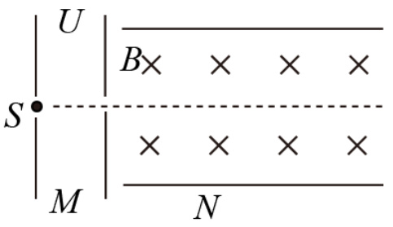
- ROI 裁剪图：[benchmarkallinone/outputs/report_priority_20/run_f2958f3118292117/datasets/physreason/artifacts/crops/prob_5b507737105efbd93015e697_primary_roi.png](../../datasets/physreason/artifacts/crops/prob_5b507737105efbd93015e697_primary_roi.png)

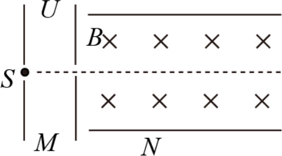

### 5) 清洗判定证据

```json
{
  "clean_score": 0.8819,
  "decision": "review",
  "decision_reason_codes": [
    "alignment_risky"
  ],
  "alignment_summary": {
    "alignment_id": "align_cd59ca0a3f67b43fa78057d5",
    "coverage_score": 0.9,
    "consistency_score": 0.82,
    "alignment_status": "risky",
    "conflict_count": 1
  },
  "solvability_summary": {
    "solvability_id": "solv_prob_5b507737105efbd93015e697",
    "solvability_score": 1.0,
    "reasoning_path_exists": true,
    "decision_hint": "pass",
    "failure_codes": []
  },
  "missing_field_summary": {
    "missing_question_text": false,
    "missing_answer_text": false,
    "missing_image_count": 0
  },
  "risk_flags": [],
  "reject_record": null
}
```

---

## 08. prob_8517248998e4cbaef8336db9

- 样本文件：[benchmarkallinone/outputs/report_priority_20/run_f2958f3118292117/datasets/physreason/samples/prob_8517248998e4cbaef8336db9.json](../../datasets/physreason/samples/prob_8517248998e4cbaef8336db9.json)
- 源数据集：`PhysReason`
- 源 split：`mini`
- 源题目 ID：`cal_problem_00066`
- 清洗路径：`multimodal_full`
- 是否文本主导：`False`
- 是否依赖图像：`True`
- 决策：`review`
- 决策原因码：`alignment_risky`
- 开放化改写策略：`keep_open`
- 对齐状态：`risky`
- 可解性分数：`1.0`
- 可解性提示：`pass`
- 质量风险标记：`无`

### 采集阶段信号

```json
{
  "core_asset_completeness": {
    "has_question_text": true,
    "has_answer_text": true,
    "image_count": 1,
    "has_multiple_images": false
  },
  "initial_scores": {
    "initial_image_dependency_score": 0.9,
    "initial_multi_solution_score": 0.46,
    "initial_verifiability_score": 0.8708
  }
}
```

### 1) 处理前：原始题目 / 原始答案

**原始题目**

```text
A horizontal platform of height $H=0.4m$ is placed on a level ground, on which a rough straight track $AB$ with an inclination angle of $\theta=37^{\circ}$, a horizontal smooth straight track $BC$, a quarter-circular smooth thin circular pipe $CD$, and a semi-circular smooth track $DEF$ are vertically placed, and they are smoothly connected. The radius of the pipe $CD$ is $r=0.1m$ with its center at point $O_{1}$, and the radius of the track $DEF$ is $R=0.2m$ with its center at point $O_{2}$. Points $O_{1}$, $D$, $O_{2}$, and $F$ are all on the same horizontal line. A small slider starts from rest at point $P$ on the track $AB$, which is at a height $h$ above the platform, and slides down. It undergoes an elastic collision with a small ball of equal mass at rest on the track $BC$. After the collision, the small ball passes through the pipe $CD$ and the track $DEF$, moving vertically downwards from point $F$ and collides with a triangular prism $G$ fixed on a straight rod directly below. After the collision, the ball's velocity direction is horizontal to the right, and its magnitude is the same as before the collision. Finally, it lands at point $Q$ on the ground. The coefficient of kinetic friction between the slider and the track $AB$ is $\mu=\frac{1}{12}$, $\sin37^{\circ}=0.6$, and $\cos37^{\circ}=0.8$.

1. If the initial height of the slider is $h=0.9m$, calculate the magnitude of the velocity $v_{0}$ of the slider when it reaches point $B$.
2. If the small ball can complete the entire motion process, determine the minimum value of $h$, denoted as $h_{min}$.
3. If the small ball just barely passes the highest point $E$, and the position of the triangular prism $G$ is adjustable vertically, calculate the maximum horizontal distance $x_{max}$ between the landing point $Q$ and point $F$.
```

**原始答案**

```text
$4m/s$
$h_{min} = 0.45m$
$0.8m$
```

### 2) 处理后：规范化题目 / 规范化答案

**规范化题目**

```text
A horizontal platform of height $H=0.4m$ is placed on a level ground, on which a rough straight track $AB$ with an inclination angle of $\theta=37^{\circ}$, a horizontal smooth straight track $BC$, a quarter-circular smooth thin circular pipe $CD$, and a semi-circular smooth track $DEF$ are vertically placed, and they are smoothly connected. The radius of the pipe $CD$ is $r=0.1m$ with its center at point $O_{1}$, and the radius of the track $DEF$ is $R=0.2m$ with its center at point $O_{2}$. Points $O_{1}$, $D$, $O_{2}$, and $F$ are all on the same horizontal line. A small slider starts from rest at point $P$ on the track $AB$, which is at a height $h$ above the platform, and slides down. It undergoes an elastic collision with a small ball of equal mass at rest on the track $BC$. After the collision, the small ball passes through the pipe $CD$ and the track $DEF$, moving vertically downwards from point $F$ and collides with a triangular prism $G$ fixed on a straight rod directly below. After the collision, the ball's velocity direction is horizontal to the right, and its magnitude is the same as before the collision. Finally, it lands at point $Q$ on the ground. The coefficient of kinetic friction between the slider and the track $AB$ is $\mu=\frac{1}{12}$, $\sin37^{\circ}=0.6$, and $\cos37^{\circ}=0.8$.

1. If the initial height of the slider is $h=0.9m$, calculate the magnitude of the velocity $v_{0}$ of the slider when it reaches point $B$.
2. If the small ball can complete the entire motion process, determine the minimum value of $h$, denoted as $h_{min}$.
3. If the small ball just barely passes the highest point $E$, and the position of the triangular prism $G$ is adjustable vertically, calculate the maximum horizontal distance $x_{max}$ between the landing point $Q$ and point $F$.
```

**规范化答案**

```text
$4m/s$
$h_{min} = 0.45m$
$0.8m$
```

### 3) 开放化改写前后

**改写前（使用规范化题目作为输入）**

```text
A horizontal platform of height $H=0.4m$ is placed on a level ground, on which a rough straight track $AB$ with an inclination angle of $\theta=37^{\circ}$, a horizontal smooth straight track $BC$, a quarter-circular smooth thin circular pipe $CD$, and a semi-circular smooth track $DEF$ are vertically placed, and they are smoothly connected. The radius of the pipe $CD$ is $r=0.1m$ with its center at point $O_{1}$, and the radius of the track $DEF$ is $R=0.2m$ with its center at point $O_{2}$. Points $O_{1}$, $D$, $O_{2}$, and $F$ are all on the same horizontal line. A small slider starts from rest at point $P$ on the track $AB$, which is at a height $h$ above the platform, and slides down. It undergoes an elastic collision with a small ball of equal mass at rest on the track $BC$. After the collision, the small ball passes through the pipe $CD$ and the track $DEF$, moving vertically downwards from point $F$ and collides with a triangular prism $G$ fixed on a straight rod directly below. After the collision, the ball's velocity direction is horizontal to the right, and its magnitude is the same as before the collision. Finally, it lands at point $Q$ on the ground. The coefficient of kinetic friction between the slider and the track $AB$ is $\mu=\frac{1}{12}$, $\sin37^{\circ}=0.6$, and $\cos37^{\circ}=0.8$.

1. If the initial height of the slider is $h=0.9m$, calculate the magnitude of the velocity $v_{0}$ of the slider when it reaches point $B$.
2. If the small ball can complete the entire motion process, determine the minimum value of $h$, denoted as $h_{min}$.
3. If the small ball just barely passes the highest point $E$, and the position of the triangular prism $G$ is adjustable vertically, calculate the maximum horizontal distance $x_{max}$ between the landing point $Q$ and point $F$.
```

**改写后（开放题变体）**

```text
A horizontal platform of height $H=0.4m$ is placed on a level ground, on which a rough straight track $AB$ with an inclination angle of $\theta=37^{\circ}$, a horizontal smooth straight track $BC$, a quarter-circular smooth thin circular pipe $CD$, and a semi-circular smooth track $DEF$ are vertically placed, and they are smoothly connected. The radius of the pipe $CD$ is $r=0.1m$ with its center at point $O_{1}$, and the radius of the track $DEF$ is $R=0.2m$ with its center at point $O_{2}$. Points $O_{1}$, $D$, $O_{2}$, and $F$ are all on the same horizontal line. A small slider starts from rest at point $P$ on the track $AB$, which is at a height $h$ above the platform, and slides down. It undergoes an elastic collision with a small ball of equal mass at rest on the track $BC$. After the collision, the small ball passes through the pipe $CD$ and the track $DEF$, moving vertically downwards from point $F$ and collides with a triangular prism $G$ fixed on a straight rod directly below. After the collision, the ball's velocity direction is horizontal to the right, and its magnitude is the same as before the collision. Finally, it lands at point $Q$ on the ground. The coefficient of kinetic friction between the slider and the track $AB$ is $\mu=\frac{1}{12}$, $\sin37^{\circ}=0.6$, and $\cos37^{\circ}=0.8$.

1. If the initial height of the slider is $h=0.9m$, calculate the magnitude of the velocity $v_{0}$ of the slider when it reaches point $B$.
2. If the small ball can complete the entire motion process, determine the minimum value of $h$, denoted as $h_{min}$.
3. If the small ball just barely passes the highest point $E$, and the position of the triangular prism $G$ is adjustable vertically, calculate the maximum horizontal distance $x_{max}$ between the landing point $Q$ and point $F$.
```

- 期望答案类型：`short_text`
- 期望答案：`$4m/s$
$h_{min} = 0.45m$
$0.8m$`
- 改写 rationale：`Question is already open-ended.`
- 丢弃原因码：`无`

### 4) 图像与可视化产物

- 原始图像来源：[benchmark/outputs/repo_cache/hf_raw/physreason/PhysReason-mini/cal_problem_00066/images/7e3bf99cfec19475fab414cdb3d58b6525897ee0191278f46526b61dec196f23.jpg](../../../../../../benchmark/outputs/repo_cache/hf_raw/physreason/PhysReason-mini/cal_problem_00066/images/7e3bf99cfec19475fab414cdb3d58b6525897ee0191278f46526b61dec196f23.jpg)
- 持久化主图：[benchmarkallinone/outputs/report_priority_20/run_f2958f3118292117/datasets/physreason/artifacts/images/prob_8517248998e4cbaef8336db9_primary.png](../../datasets/physreason/artifacts/images/prob_8517248998e4cbaef8336db9_primary.png)

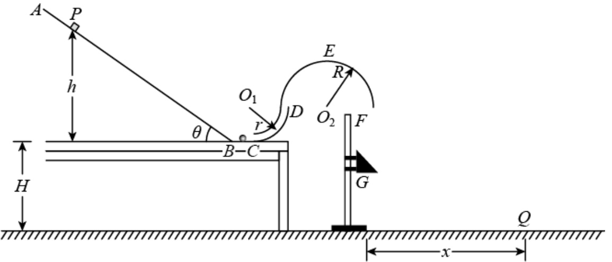
- ROI 裁剪图：[benchmarkallinone/outputs/report_priority_20/run_f2958f3118292117/datasets/physreason/artifacts/crops/prob_8517248998e4cbaef8336db9_primary_roi.png](../../datasets/physreason/artifacts/crops/prob_8517248998e4cbaef8336db9_primary_roi.png)

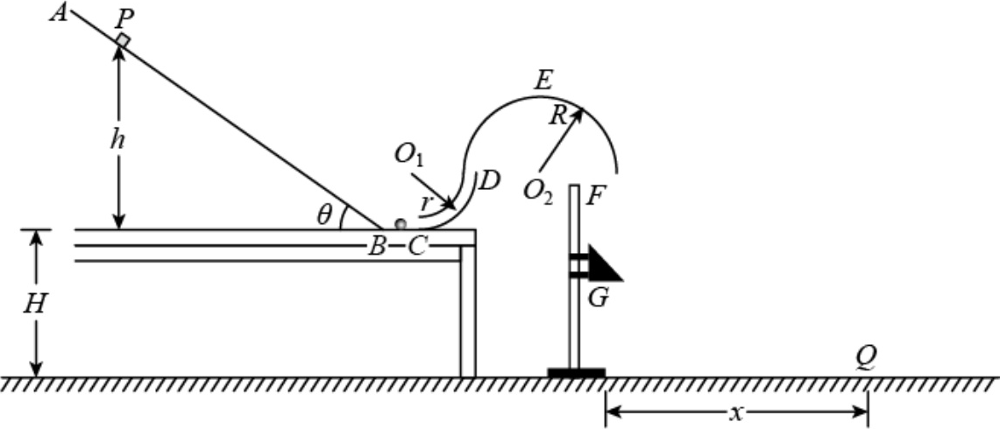

### 5) 清洗判定证据

```json
{
  "clean_score": 0.8639,
  "decision": "review",
  "decision_reason_codes": [
    "alignment_risky"
  ],
  "alignment_summary": {
    "alignment_id": "align_23911557fa709b8580c5fc13",
    "coverage_score": 0.9,
    "consistency_score": 0.74,
    "alignment_status": "risky",
    "conflict_count": 2
  },
  "solvability_summary": {
    "solvability_id": "solv_prob_8517248998e4cbaef8336db9",
    "solvability_score": 1.0,
    "reasoning_path_exists": true,
    "decision_hint": "pass",
    "failure_codes": []
  },
  "missing_field_summary": {
    "missing_question_text": false,
    "missing_answer_text": false,
    "missing_image_count": 0
  },
  "risk_flags": [],
  "reject_record": null
}
```

---

## 09. prob_902de17c914dbce198fcb290

- 样本文件：[benchmarkallinone/outputs/report_priority_20/run_f2958f3118292117/datasets/physreason/samples/prob_902de17c914dbce198fcb290.json](../../datasets/physreason/samples/prob_902de17c914dbce198fcb290.json)
- 源数据集：`PhysReason`
- 源 split：`mini`
- 源题目 ID：`cal_problem_00121`
- 清洗路径：`multimodal_full`
- 是否文本主导：`False`
- 是否依赖图像：`True`
- 决策：`review`
- 决策原因码：`alignment_risky`
- 开放化改写策略：`keep_open`
- 对齐状态：`risky`
- 可解性分数：`1.0`
- 可解性提示：`pass`
- 质量风险标记：`无`

### 采集阶段信号

```json
{
  "core_asset_completeness": {
    "has_question_text": true,
    "has_answer_text": true,
    "image_count": 1,
    "has_multiple_images": false
  },
  "initial_scores": {
    "initial_image_dependency_score": 0.9,
    "initial_multi_solution_score": 0.46,
    "initial_verifiability_score": 0.8867
  }
}
```

### 1) 处理前：原始题目 / 原始答案

**原始题目**

```text
Electromagnetic aircraft launch is the most advanced catapult technology for aircraft carriers, and China has reached the world's advanced level in this field. An interest group is conducting research on the design of an electromagnetic launch system. As shown in Figure (1), the mover (not shown in the figure), used to propel a model aircraft, is insulated and fixed to the coil. The coil drives the mover, which can slide without friction on the horizontal rails. The coil is located in a radial magnetic field between the rails, where the magnitude of the magnetic flux density is $B$. When switch S is connected to 1, the constant current source is connected to the coil. The mover starts from rest, accelerating the aircraft. When the aircraft reaches takeoff speed, it detaches from the mover. At this time, S is thrown to 2, connecting the fixed resistor $R_{0}$. Simultaneously, a retraction force $F$ is applied. Under the action of $F$ and the magnetic force, the mover returns to its initial position and stops. The $v-t$ diagram of the mover from rest to return is shown in Figure (2). From time $t_{1}$ to $t_{3}$, $F=(800-10v)N$, and $F$ is removed at $t_{3}$. It is known that the takeoff speed $v_{1}=80m/s$, $t_{1}=1.5s$, the number of turns of the coil is $n=100$, the circumference of each turn is $l=1{m}$, the mass of the aircraft is $M=10{kg}$, the total mass of the mover and coil is $m=5{kg}$, $R_{0}=9.5\Omega$, and $B=0.1T$. Air resistance and the effect of aircraft takeoff on the mover's velocity are negligible.

1. What is the current $I$ of the constant current source?
2. What is the resistance $R$ of the coil?
3. What is the time $t_{3}$?
```

**原始答案**

```text
80A
0.5Ω
$t_3 = \frac{\sqrt{5}+3}{2}s$
```

### 2) 处理后：规范化题目 / 规范化答案

**规范化题目**

```text
Electromagnetic aircraft launch is the most advanced catapult technology for aircraft carriers, and China has reached the world's advanced level in this field. An interest group is conducting research on the design of an electromagnetic launch system. As shown in Figure (1), the mover (not shown in the figure), used to propel a model aircraft, is insulated and fixed to the coil. The coil drives the mover, which can slide without friction on the horizontal rails. The coil is located in a radial magnetic field between the rails, where the magnitude of the magnetic flux density is $B$. When switch S is connected to 1, the constant current source is connected to the coil. The mover starts from rest, accelerating the aircraft. When the aircraft reaches takeoff speed, it detaches from the mover. At this time, S is thrown to 2, connecting the fixed resistor $R_{0}$. Simultaneously, a retraction force $F$ is applied. Under the action of $F$ and the magnetic force, the mover returns to its initial position and stops. The $v-t$ diagram of the mover from rest to return is shown in Figure (2). From time $t_{1}$ to $t_{3}$, $F=(800-10v)N$, and $F$ is removed at $t_{3}$. It is known that the takeoff speed $v_{1}=80m/s$, $t_{1}=1.5s$, the number of turns of the coil is $n=100$, the circumference of each turn is $l=1{m}$, the mass of the aircraft is $M=10{kg}$, the total mass of the mover and coil is $m=5{kg}$, $R_{0}=9.5\Omega$, and $B=0.1T$. Air resistance and the effect of aircraft takeoff on the mover's velocity are negligible.

1. What is the current $I$ of the constant current source?
2. What is the resistance $R$ of the coil?
3. What is the time $t_{3}$?
```

**规范化答案**

```text
80A
0.5Ω
$t_3 = \frac{\sqrt{5}+3}{2}s$
```

### 3) 开放化改写前后

**改写前（使用规范化题目作为输入）**

```text
Electromagnetic aircraft launch is the most advanced catapult technology for aircraft carriers, and China has reached the world's advanced level in this field. An interest group is conducting research on the design of an electromagnetic launch system. As shown in Figure (1), the mover (not shown in the figure), used to propel a model aircraft, is insulated and fixed to the coil. The coil drives the mover, which can slide without friction on the horizontal rails. The coil is located in a radial magnetic field between the rails, where the magnitude of the magnetic flux density is $B$. When switch S is connected to 1, the constant current source is connected to the coil. The mover starts from rest, accelerating the aircraft. When the aircraft reaches takeoff speed, it detaches from the mover. At this time, S is thrown to 2, connecting the fixed resistor $R_{0}$. Simultaneously, a retraction force $F$ is applied. Under the action of $F$ and the magnetic force, the mover returns to its initial position and stops. The $v-t$ diagram of the mover from rest to return is shown in Figure (2). From time $t_{1}$ to $t_{3}$, $F=(800-10v)N$, and $F$ is removed at $t_{3}$. It is known that the takeoff speed $v_{1}=80m/s$, $t_{1}=1.5s$, the number of turns of the coil is $n=100$, the circumference of each turn is $l=1{m}$, the mass of the aircraft is $M=10{kg}$, the total mass of the mover and coil is $m=5{kg}$, $R_{0}=9.5\Omega$, and $B=0.1T$. Air resistance and the effect of aircraft takeoff on the mover's velocity are negligible.

1. What is the current $I$ of the constant current source?
2. What is the resistance $R$ of the coil?
3. What is the time $t_{3}$?
```

**改写后（开放题变体）**

```text
Electromagnetic aircraft launch is the most advanced catapult technology for aircraft carriers, and China has reached the world's advanced level in this field. An interest group is conducting research on the design of an electromagnetic launch system. As shown in Figure (1), the mover (not shown in the figure), used to propel a model aircraft, is insulated and fixed to the coil. The coil drives the mover, which can slide without friction on the horizontal rails. The coil is located in a radial magnetic field between the rails, where the magnitude of the magnetic flux density is $B$. When switch S is connected to 1, the constant current source is connected to the coil. The mover starts from rest, accelerating the aircraft. When the aircraft reaches takeoff speed, it detaches from the mover. At this time, S is thrown to 2, connecting the fixed resistor $R_{0}$. Simultaneously, a retraction force $F$ is applied. Under the action of $F$ and the magnetic force, the mover returns to its initial position and stops. The $v-t$ diagram of the mover from rest to return is shown in Figure (2). From time $t_{1}$ to $t_{3}$, $F=(800-10v)N$, and $F$ is removed at $t_{3}$. It is known that the takeoff speed $v_{1}=80m/s$, $t_{1}=1.5s$, the number of turns of the coil is $n=100$, the circumference of each turn is $l=1{m}$, the mass of the aircraft is $M=10{kg}$, the total mass of the mover and coil is $m=5{kg}$, $R_{0}=9.5\Omega$, and $B=0.1T$. Air resistance and the effect of aircraft takeoff on the mover's velocity are negligible.

1. What is the current $I$ of the constant current source?
2. What is the resistance $R$ of the coil?
3. What is the time $t_{3}$?
```

- 期望答案类型：`short_text`
- 期望答案：`80A
0.5Ω
$t_3 = \frac{\sqrt{5}+3}{2}s$`
- 改写 rationale：`Question is already open-ended.`
- 丢弃原因码：`无`

### 4) 图像与可视化产物

- 原始图像来源：[benchmark/outputs/repo_cache/hf_raw/physreason/PhysReason-mini/cal_problem_00121/images/7b12698a51f2b4a37f359cb1289ef851fe9c40f29046d422d09fa8e9832db059.jpg](../../../../../../benchmark/outputs/repo_cache/hf_raw/physreason/PhysReason-mini/cal_problem_00121/images/7b12698a51f2b4a37f359cb1289ef851fe9c40f29046d422d09fa8e9832db059.jpg)
- 持久化主图：[benchmarkallinone/outputs/report_priority_20/run_f2958f3118292117/datasets/physreason/artifacts/images/prob_902de17c914dbce198fcb290_primary.png](../../datasets/physreason/artifacts/images/prob_902de17c914dbce198fcb290_primary.png)

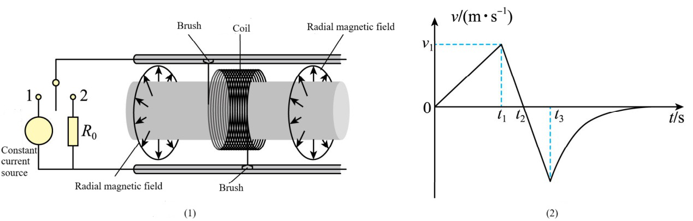
- ROI 裁剪图：[benchmarkallinone/outputs/report_priority_20/run_f2958f3118292117/datasets/physreason/artifacts/crops/prob_902de17c914dbce198fcb290_primary_roi.png](../../datasets/physreason/artifacts/crops/prob_902de17c914dbce198fcb290_primary_roi.png)

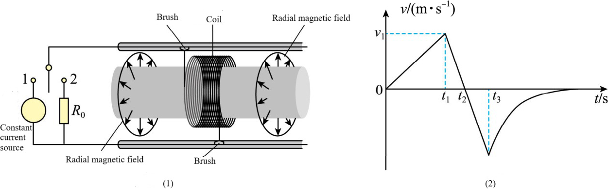

### 5) 清洗判定证据

```json
{
  "clean_score": 0.9007,
  "decision": "review",
  "decision_reason_codes": [
    "alignment_risky"
  ],
  "alignment_summary": {
    "alignment_id": "align_b0c1f2480daa8e7d77e6b80c",
    "coverage_score": 0.9,
    "consistency_score": 0.82,
    "alignment_status": "risky",
    "conflict_count": 1
  },
  "solvability_summary": {
    "solvability_id": "solv_prob_902de17c914dbce198fcb290",
    "solvability_score": 1.0,
    "reasoning_path_exists": true,
    "decision_hint": "pass",
    "failure_codes": []
  },
  "missing_field_summary": {
    "missing_question_text": false,
    "missing_answer_text": false,
    "missing_image_count": 0
  },
  "risk_flags": [],
  "reject_record": null
}
```

---

## 10. prob_9272ed3673830bfa084f1db3

- 样本文件：[benchmarkallinone/outputs/report_priority_20/run_f2958f3118292117/datasets/physreason/samples/prob_9272ed3673830bfa084f1db3.json](../../datasets/physreason/samples/prob_9272ed3673830bfa084f1db3.json)
- 源数据集：`PhysReason`
- 源 split：`mini`
- 源题目 ID：`cal_problem_00157`
- 清洗路径：`multimodal_full`
- 是否文本主导：`False`
- 是否依赖图像：`True`
- 决策：`pass`
- 决策原因码：`meets_cleaning_requirements`
- 开放化改写策略：`keep_open`
- 对齐状态：`good`
- 可解性分数：`1.0`
- 可解性提示：`pass`
- 质量风险标记：`无`

### 采集阶段信号

```json
{
  "core_asset_completeness": {
    "has_question_text": true,
    "has_answer_text": true,
    "image_count": 1,
    "has_multiple_images": false
  },
  "initial_scores": {
    "initial_image_dependency_score": 0.9,
    "initial_multi_solution_score": 0.46,
    "initial_verifiability_score": 0.8842
  }
}
```

### 1) 处理前：原始题目 / 原始答案

**原始题目**

```text
An electromagnetic railgun fire truck utilizes electromagnetic propulsion technology to launch fire extinguishing projectiles into high-rise buildings for rapid fire suppression. The energy stored in capacitors is converted into the kinetic energy of the projectile through electromagnetic induction. By setting the working voltage of the energy storage capacitors, the desired muzzle velocity of the projectile can be achieved. The railgun is aimed directly at a high-rise building, with a horizontal distance $L=60\mathrm{m}$ between them. The muzzle velocity of the projectile is $v_{0}=50\mathrm{m/s}$, and the launch angle relative to the horizontal plane is $\theta=53^{\circ}$. Neglecting the height of the railgun above the ground and air resistance, and taking the acceleration due to gravity as $g=10\mathrm{m/s}^{2}$, and $\sin53^{\circ}=0.8$.

1. Determine the height $H$ above the ground at which the fire extinguishing projectile hits the high-rise building.
2. Given that the electrical energy stored in the capacitor is $E=\frac{1}{2}C U^{2}$, the efficiency of converting this electrical energy into the kinetic energy of the projectile is $\eta=15\%$, the mass of the projectile is $3\mathrm{kg}$, and the capacitance is $C=2.5\times10^{4}\upmu\mathrm{F}$, what should the working voltage $U$ of the capacitor be set to?
```

**原始答案**

```text
60m
1000\sqrt{2}V
```

### 2) 处理后：规范化题目 / 规范化答案

**规范化题目**

```text
An electromagnetic railgun fire truck utilizes electromagnetic propulsion technology to launch fire extinguishing projectiles into high-rise buildings for rapid fire suppression. The energy stored in capacitors is converted into the kinetic energy of the projectile through electromagnetic induction. By setting the working voltage of the energy storage capacitors, the desired muzzle velocity of the projectile can be achieved. The railgun is aimed directly at a high-rise building, with a horizontal distance $L=60\mathrm{m}$ between them. The muzzle velocity of the projectile is $v_{0}=50\mathrm{m/s}$, and the launch angle relative to the horizontal plane is $\theta=53^{\circ}$. Neglecting the height of the railgun above the ground and air resistance, and taking the acceleration due to gravity as $g=10\mathrm{m/s}^{2}$, and $\sin53^{\circ}=0.8$.

1. Determine the height $H$ above the ground at which the fire extinguishing projectile hits the high-rise building.
2. Given that the electrical energy stored in the capacitor is $E=\frac{1}{2}C U^{2}$, the efficiency of converting this electrical energy into the kinetic energy of the projectile is $\eta=15\%$, the mass of the projectile is $3\mathrm{kg}$, and the capacitance is $C=2.5\times10^{4}\upmu\mathrm{F}$, what should the working voltage $U$ of the capacitor be set to?
```

**规范化答案**

```text
60m
1000\sqrt{2}V
```

### 3) 开放化改写前后

**改写前（使用规范化题目作为输入）**

```text
An electromagnetic railgun fire truck utilizes electromagnetic propulsion technology to launch fire extinguishing projectiles into high-rise buildings for rapid fire suppression. The energy stored in capacitors is converted into the kinetic energy of the projectile through electromagnetic induction. By setting the working voltage of the energy storage capacitors, the desired muzzle velocity of the projectile can be achieved. The railgun is aimed directly at a high-rise building, with a horizontal distance $L=60\mathrm{m}$ between them. The muzzle velocity of the projectile is $v_{0}=50\mathrm{m/s}$, and the launch angle relative to the horizontal plane is $\theta=53^{\circ}$. Neglecting the height of the railgun above the ground and air resistance, and taking the acceleration due to gravity as $g=10\mathrm{m/s}^{2}$, and $\sin53^{\circ}=0.8$.

1. Determine the height $H$ above the ground at which the fire extinguishing projectile hits the high-rise building.
2. Given that the electrical energy stored in the capacitor is $E=\frac{1}{2}C U^{2}$, the efficiency of converting this electrical energy into the kinetic energy of the projectile is $\eta=15\%$, the mass of the projectile is $3\mathrm{kg}$, and the capacitance is $C=2.5\times10^{4}\upmu\mathrm{F}$, what should the working voltage $U$ of the capacitor be set to?
```

**改写后（开放题变体）**

```text
An electromagnetic railgun fire truck utilizes electromagnetic propulsion technology to launch fire extinguishing projectiles into high-rise buildings for rapid fire suppression. The energy stored in capacitors is converted into the kinetic energy of the projectile through electromagnetic induction. By setting the working voltage of the energy storage capacitors, the desired muzzle velocity of the projectile can be achieved. The railgun is aimed directly at a high-rise building, with a horizontal distance $L=60\mathrm{m}$ between them. The muzzle velocity of the projectile is $v_{0}=50\mathrm{m/s}$, and the launch angle relative to the horizontal plane is $\theta=53^{\circ}$. Neglecting the height of the railgun above the ground and air resistance, and taking the acceleration due to gravity as $g=10\mathrm{m/s}^{2}$, and $\sin53^{\circ}=0.8$.

1. Determine the height $H$ above the ground at which the fire extinguishing projectile hits the high-rise building.
2. Given that the electrical energy stored in the capacitor is $E=\frac{1}{2}C U^{2}$, the efficiency of converting this electrical energy into the kinetic energy of the projectile is $\eta=15\%$, the mass of the projectile is $3\mathrm{kg}$, and the capacitance is $C=2.5\times10^{4}\upmu\mathrm{F}$, what should the working voltage $U$ of the capacitor be set to?
```

- 期望答案类型：`short_text`
- 期望答案：`60m
1000\sqrt{2}V`
- 改写 rationale：`Question is already open-ended.`
- 丢弃原因码：`无`

### 4) 图像与可视化产物

- 原始图像来源：[benchmark/outputs/repo_cache/hf_raw/physreason/PhysReason-mini/cal_problem_00157/images/a9e9f1617e23a58a535652283b8ee2613ec1918a2ed622ebe6fff2c0e07792be.jpg](../../../../../../benchmark/outputs/repo_cache/hf_raw/physreason/PhysReason-mini/cal_problem_00157/images/a9e9f1617e23a58a535652283b8ee2613ec1918a2ed622ebe6fff2c0e07792be.jpg)
- 持久化主图：[benchmarkallinone/outputs/report_priority_20/run_f2958f3118292117/datasets/physreason/artifacts/images/prob_9272ed3673830bfa084f1db3_primary.png](../../datasets/physreason/artifacts/images/prob_9272ed3673830bfa084f1db3_primary.png)

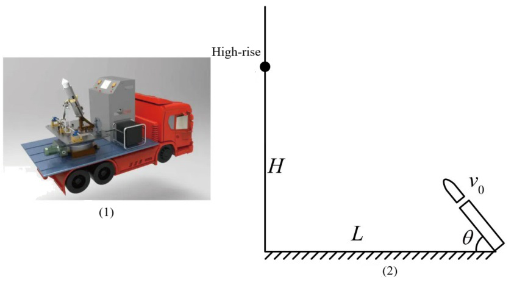
- ROI 裁剪图：[benchmarkallinone/outputs/report_priority_20/run_f2958f3118292117/datasets/physreason/artifacts/crops/prob_9272ed3673830bfa084f1db3_primary_roi.png](../../datasets/physreason/artifacts/crops/prob_9272ed3673830bfa084f1db3_primary_roi.png)

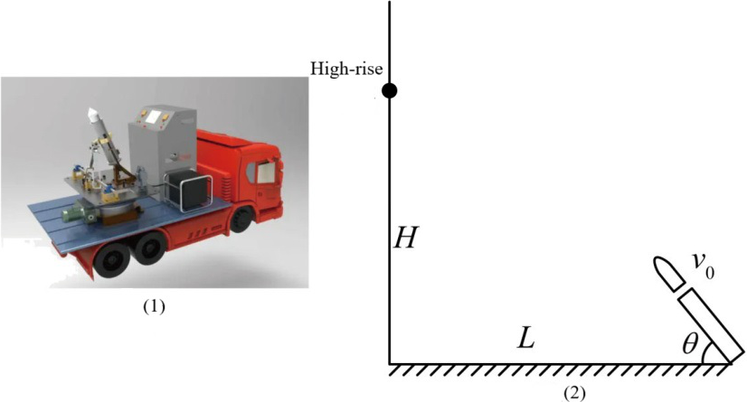

### 5) 清洗判定证据

```json
{
  "clean_score": 0.9111,
  "decision": "pass",
  "decision_reason_codes": [
    "meets_cleaning_requirements"
  ],
  "alignment_summary": {
    "alignment_id": "align_7ae83e609b42378041e81002",
    "coverage_score": 0.9,
    "consistency_score": 0.9,
    "alignment_status": "good",
    "conflict_count": 1
  },
  "solvability_summary": {
    "solvability_id": "solv_prob_9272ed3673830bfa084f1db3",
    "solvability_score": 1.0,
    "reasoning_path_exists": true,
    "decision_hint": "pass",
    "failure_codes": []
  },
  "missing_field_summary": {
    "missing_question_text": false,
    "missing_answer_text": false,
    "missing_image_count": 0
  },
  "risk_flags": [],
  "reject_record": null
}
```

---

## 11. prob_949f728a443057eb8f5dd2db

- 样本文件：[benchmarkallinone/outputs/report_priority_20/run_f2958f3118292117/datasets/physreason/samples/prob_949f728a443057eb8f5dd2db.json](../../datasets/physreason/samples/prob_949f728a443057eb8f5dd2db.json)
- 源数据集：`PhysReason`
- 源 split：`mini`
- 源题目 ID：`cal_problem_00155`
- 清洗路径：`multimodal_full`
- 是否文本主导：`False`
- 是否依赖图像：`True`
- 决策：`review`
- 决策原因码：`alignment_risky`
- 开放化改写策略：`keep_open`
- 对齐状态：`risky`
- 可解性分数：`1.0`
- 可解性提示：`pass`
- 质量风险标记：`无`

### 采集阶段信号

```json
{
  "core_asset_completeness": {
    "has_question_text": true,
    "has_answer_text": true,
    "image_count": 1,
    "has_multiple_images": false
  },
  "initial_scores": {
    "initial_image_dependency_score": 0.9,
    "initial_multi_solution_score": 0.46,
    "initial_verifiability_score": 0.7151
  }
}
```

### 1) 处理前：原始题目 / 原始答案

**原始题目**

```text
The working principle of a certain type of mass spectrometer is shown in Figure (1). M and N are two vertically placed metal plates with a voltage $U$ between them. Plate Q is the recording plate, and interface $P$ divides the region between N and Q into two parts, I and II, each with a width of $d$. The planes of M, N, P, and Q are parallel to each other. a and $b$ are two small, directly opposed holes on M and N, respectively. Taking the line passing through a and $b$ as the $z$-axis, with the right direction as positive, and the intersection point $o$ of the $z$-axis and plate Q as the origin, a Cartesian coordinate system $Oxyz$ is established. The positive $x$-axis is parallel to plate Q and points horizontally inward, and the positive $y$-axis is vertically upward. Region I is filled with a uniform magnetic field along the positive $x$-axis with magnetic field strength $B$, and region II is filled with a uniform electric field along the positive $x$-axis with electric field strength $E$. A particle with mass $m$ and charge $+q$ drifts into the electric field from hole a (initial velocity considered zero), passes through hole $b$, enters the magnetic field, passes through point $c$ on plane $P$ (not drawn in the figure), and then enters the electric field before finally hitting the recording plate Q. The gravity of the particle is negligible.

1. Determine the radius $R$ of the circular path of the particle in the magnetic field.
2. Determine the distance $L$ from point $c$ to the $z$-axis.
3. Determine the $x$-coordinate of the particle's impact point on the recording plate.
4. Determine the $y$-coordinate of the particle's impact point on the recording plate (expressed in terms of $R$ and $d$).
5. As shown in Figure (2), three points $s_1$, $s_2$, and $s_3$ are obtained on the recording plate. If these three points are the positions of a proton $_{1}^{1}\mathrm{H}$, a triton $_{1}^{3}\mathrm{H}$, and a helium nucleus $_{2}^{4}\mathrm{He}$, please specify which particle corresponds to each of these three points (neglecting the interaction between particles, no derivation required).
```

**原始答案**

```text
$R=\frac{\sqrt{2m q U}}{q B}$
$L=\frac{\sqrt{2m q U}}{q B}-\sqrt{\frac{2m U}{q B^{2}}-d^{2}}$
$x=\frac{m d^{2}E}{4m U-2q d^{2}B^{2}}$
$y=R-\sqrt{R^{2}-d^{2}}+\frac{d^{2}}{\sqrt{R^{2}-d^{2}}}$
$s_1$, $s_2$, $s_3$correspond to the positions of the tritium nucleus $_{1}^{3}\mathrm{H}$ 、the helium nucleus $_2^{4}\mathrm{He}$ and the proton $_{1}^{1}\mathrm{H}$ respectively.
```

### 2) 处理后：规范化题目 / 规范化答案

**规范化题目**

```text
The working principle of a certain type of mass spectrometer is shown in Figure (1). M and N are two vertically placed metal plates with a voltage $U$ between them. Plate Q is the recording plate, and interface $P$ divides the region between N and Q into two parts, I and II, each with a width of $d$. The planes of M, N, P, and Q are parallel to each other. a and $b$ are two small, directly opposed holes on M and N, respectively. Taking the line passing through a and $b$ as the $z$-axis, with the right direction as positive, and the intersection point $o$ of the $z$-axis and plate Q as the origin, a Cartesian coordinate system $Oxyz$ is established. The positive $x$-axis is parallel to plate Q and points horizontally inward, and the positive $y$-axis is vertically upward. Region I is filled with a uniform magnetic field along the positive $x$-axis with magnetic field strength $B$, and region II is filled with a uniform electric field along the positive $x$-axis with electric field strength $E$. A particle with mass $m$ and charge $+q$ drifts into the electric field from hole a (initial velocity considered zero), passes through hole $b$, enters the magnetic field, passes through point $c$ on plane $P$ (not drawn in the figure), and then enters the electric field before finally hitting the recording plate Q. The gravity of the particle is negligible.

1. Determine the radius $R$ of the circular path of the particle in the magnetic field.
2. Determine the distance $L$ from point $c$ to the $z$-axis.
3. Determine the $x$-coordinate of the particle's impact point on the recording plate.
4. Determine the $y$-coordinate of the particle's impact point on the recording plate (expressed in terms of $R$ and $d$).
5. As shown in Figure (2), three points $s_1$, $s_2$, and $s_3$ are obtained on the recording plate. If these three points are the positions of a proton $_{1}^{1}\mathrm{H}$, a triton $_{1}^{3}\mathrm{H}$, and a helium nucleus $_{2}^{4}\mathrm{He}$, please specify which particle corresponds to each of these three points (neglecting the interaction between particles, no derivation required).
```

**规范化答案**

```text
$R=\frac{\sqrt{2m q U}}{q B}$
$L=\frac{\sqrt{2m q U}}{q B}-\sqrt{\frac{2m U}{q B^{2}}-d^{2}}$
$x=\frac{m d^{2}E}{4m U-2q d^{2}B^{2}}$
$y=R-\sqrt{R^{2}-d^{2}}+\frac{d^{2}}{\sqrt{R^{2}-d^{2}}}$
$s_1$, $s_2$, $s_3$correspond to the positions of the tritium nucleus $_{1}^{3}\mathrm{H}$ 、the helium nucleus $_2^{4}\mathrm{He}$ and the proton $_{1}^{1}\mathrm{H}$ respectively
```

### 3) 开放化改写前后

**改写前（使用规范化题目作为输入）**

```text
The working principle of a certain type of mass spectrometer is shown in Figure (1). M and N are two vertically placed metal plates with a voltage $U$ between them. Plate Q is the recording plate, and interface $P$ divides the region between N and Q into two parts, I and II, each with a width of $d$. The planes of M, N, P, and Q are parallel to each other. a and $b$ are two small, directly opposed holes on M and N, respectively. Taking the line passing through a and $b$ as the $z$-axis, with the right direction as positive, and the intersection point $o$ of the $z$-axis and plate Q as the origin, a Cartesian coordinate system $Oxyz$ is established. The positive $x$-axis is parallel to plate Q and points horizontally inward, and the positive $y$-axis is vertically upward. Region I is filled with a uniform magnetic field along the positive $x$-axis with magnetic field strength $B$, and region II is filled with a uniform electric field along the positive $x$-axis with electric field strength $E$. A particle with mass $m$ and charge $+q$ drifts into the electric field from hole a (initial velocity considered zero), passes through hole $b$, enters the magnetic field, passes through point $c$ on plane $P$ (not drawn in the figure), and then enters the electric field before finally hitting the recording plate Q. The gravity of the particle is negligible.

1. Determine the radius $R$ of the circular path of the particle in the magnetic field.
2. Determine the distance $L$ from point $c$ to the $z$-axis.
3. Determine the $x$-coordinate of the particle's impact point on the recording plate.
4. Determine the $y$-coordinate of the particle's impact point on the recording plate (expressed in terms of $R$ and $d$).
5. As shown in Figure (2), three points $s_1$, $s_2$, and $s_3$ are obtained on the recording plate. If these three points are the positions of a proton $_{1}^{1}\mathrm{H}$, a triton $_{1}^{3}\mathrm{H}$, and a helium nucleus $_{2}^{4}\mathrm{He}$, please specify which particle corresponds to each of these three points (neglecting the interaction between particles, no derivation required).
```

**改写后（开放题变体）**

```text
The working principle of a certain type of mass spectrometer is shown in Figure (1). M and N are two vertically placed metal plates with a voltage $U$ between them. Plate Q is the recording plate, and interface $P$ divides the region between N and Q into two parts, I and II, each with a width of $d$. The planes of M, N, P, and Q are parallel to each other. a and $b$ are two small, directly opposed holes on M and N, respectively. Taking the line passing through a and $b$ as the $z$-axis, with the right direction as positive, and the intersection point $o$ of the $z$-axis and plate Q as the origin, a Cartesian coordinate system $Oxyz$ is established. The positive $x$-axis is parallel to plate Q and points horizontally inward, and the positive $y$-axis is vertically upward. Region I is filled with a uniform magnetic field along the positive $x$-axis with magnetic field strength $B$, and region II is filled with a uniform electric field along the positive $x$-axis with electric field strength $E$. A particle with mass $m$ and charge $+q$ drifts into the electric field from hole a (initial velocity considered zero), passes through hole $b$, enters the magnetic field, passes through point $c$ on plane $P$ (not drawn in the figure), and then enters the electric field before finally hitting the recording plate Q. The gravity of the particle is negligible.

1. Determine the radius $R$ of the circular path of the particle in the magnetic field.
2. Determine the distance $L$ from point $c$ to the $z$-axis.
3. Determine the $x$-coordinate of the particle's impact point on the recording plate.
4. Determine the $y$-coordinate of the particle's impact point on the recording plate (expressed in terms of $R$ and $d$).
5. As shown in Figure (2), three points $s_1$, $s_2$, and $s_3$ are obtained on the recording plate. If these three points are the positions of a proton $_{1}^{1}\mathrm{H}$, a triton $_{1}^{3}\mathrm{H}$, and a helium nucleus $_{2}^{4}\mathrm{He}$, please specify which particle corresponds to each of these three points (neglecting the interaction between particles, no derivation required).
```

- 期望答案类型：`set`
- 期望答案：`$R=\frac{\sqrt{2m q U}}{q B}$
$L=\frac{\sqrt{2m q U}}{q B}-\sqrt{\frac{2m U}{q B^{2}}-d^{2}}$
$x=\frac{m d^{2}E}{4m U-2q d^{2}B^{2}}$
$y=R-\sqrt{R^{2}-d^{2}}+\frac{d^{2}}{\sqrt{R^{2}-d^{2}}}$
$s_1$, $s_2$, $s_3$correspond to the positions of the tritium nucleus $_{1}^{3}\mathrm{H}$ 、the helium nucleus $_2^{4}\mathrm{He}$ and the proton $_{1}^{1}\mathrm{H}$ respectively`
- 改写 rationale：`Question is already open-ended.`
- 丢弃原因码：`无`

### 4) 图像与可视化产物

- 原始图像来源：[benchmark/outputs/repo_cache/hf_raw/physreason/PhysReason-mini/cal_problem_00155/images/8481947ab3d4b76b43c53eec0b78359db645561730d3d8a0c2a7492cd3e934a6.jpg](../../../../../../benchmark/outputs/repo_cache/hf_raw/physreason/PhysReason-mini/cal_problem_00155/images/8481947ab3d4b76b43c53eec0b78359db645561730d3d8a0c2a7492cd3e934a6.jpg)
- 持久化主图：[benchmarkallinone/outputs/report_priority_20/run_f2958f3118292117/datasets/physreason/artifacts/images/prob_949f728a443057eb8f5dd2db_primary.png](../../datasets/physreason/artifacts/images/prob_949f728a443057eb8f5dd2db_primary.png)

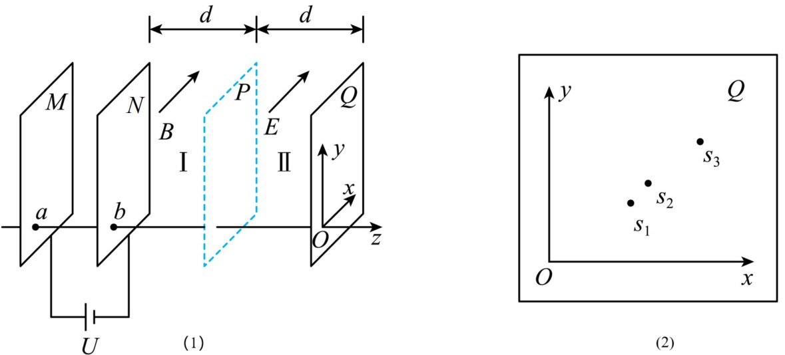
- ROI 裁剪图：[benchmarkallinone/outputs/report_priority_20/run_f2958f3118292117/datasets/physreason/artifacts/crops/prob_949f728a443057eb8f5dd2db_primary_roi.png](../../datasets/physreason/artifacts/crops/prob_949f728a443057eb8f5dd2db_primary_roi.png)

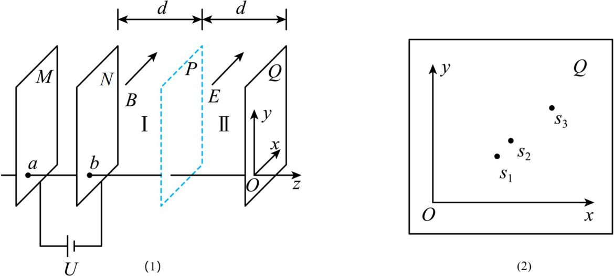

### 5) 清洗判定证据

```json
{
  "clean_score": 0.8841,
  "decision": "review",
  "decision_reason_codes": [
    "alignment_risky"
  ],
  "alignment_summary": {
    "alignment_id": "align_0b84e453208b9d0198c87a4e",
    "coverage_score": 0.9,
    "consistency_score": 0.82,
    "alignment_status": "risky",
    "conflict_count": 1
  },
  "solvability_summary": {
    "solvability_id": "solv_prob_949f728a443057eb8f5dd2db",
    "solvability_score": 1.0,
    "reasoning_path_exists": true,
    "decision_hint": "pass",
    "failure_codes": []
  },
  "missing_field_summary": {
    "missing_question_text": false,
    "missing_answer_text": false,
    "missing_image_count": 0
  },
  "risk_flags": [],
  "reject_record": null
}
```

---

## 12. prob_a376881173b7a83129f004c7

- 样本文件：[benchmarkallinone/outputs/report_priority_20/run_f2958f3118292117/datasets/physreason/samples/prob_a376881173b7a83129f004c7.json](../../datasets/physreason/samples/prob_a376881173b7a83129f004c7.json)
- 源数据集：`PhysReason`
- 源 split：`mini`
- 源题目 ID：`cal_problem_00035`
- 清洗路径：`multimodal_full`
- 是否文本主导：`False`
- 是否依赖图像：`True`
- 决策：`reject`
- 决策原因码：`low_resolution`
- 开放化改写策略：`keep_open`
- 对齐状态：`good`
- 可解性分数：`1.0`
- 可解性提示：`pass`
- 质量风险标记：`low_resolution`

### 采集阶段信号

```json
{
  "core_asset_completeness": {
    "has_question_text": true,
    "has_answer_text": true,
    "image_count": 1,
    "has_multiple_images": false
  },
  "initial_scores": {
    "initial_image_dependency_score": 0.9,
    "initial_multi_solution_score": 0.46,
    "initial_verifiability_score": 0.8848
  }
}
```

### 1) 处理前：原始题目 / 原始答案

**原始题目**

```text
An L-shaped skateboard A is initially at rest on a rough horizontal surface. A light spring with a spring constant of $k$ is fixed to the right end of the skateboard. The left end of the spring is connected to a small block B, and the spring is initially at its natural length. A small block C slides onto the skateboard from its leftmost end with an initial velocity $v_{0}$. After traveling a distance of $s_{0}$, it undergoes a perfectly inelastic collision with B (the collision time is extremely short), and then they move together to the right. After a certain period, the skateboard A also begins to move. The masses of A, B, and C are all m. The coefficient of kinetic friction between the skateboard and the small blocks, and between the skateboard and the ground, are both $\mu$. The magnitude of gravitational acceleration is $g$. The maximum static friction is approximately equal to the sliding friction, and the spring remains within its elastic limit throughout.

1. What is the magnitude of the velocity of C just before the collision?
2. What is the mechanical energy loss during the collision between C and B?
3. How much work is done by C and B against friction from the instant of the collision until A begins to move?
```

**原始答案**

```text
$\sqrt{v_{0}^{2}-2\mu g s_{0}}$
$\frac{1}{4}m(v_{0}^{2}-2\mu g s_{0})$
$\frac{2\mu^{2}m^{2}g^{2}}{k}$
```

### 2) 处理后：规范化题目 / 规范化答案

**规范化题目**

```text
An L-shaped skateboard A is initially at rest on a rough horizontal surface. A light spring with a spring constant of $k$ is fixed to the right end of the skateboard. The left end of the spring is connected to a small block B, and the spring is initially at its natural length. A small block C slides onto the skateboard from its leftmost end with an initial velocity $v_{0}$. After traveling a distance of $s_{0}$, it undergoes a perfectly inelastic collision with B (the collision time is extremely short), and then they move together to the right. After a certain period, the skateboard A also begins to move. The masses of A, B, and C are all m. The coefficient of kinetic friction between the skateboard and the small blocks, and between the skateboard and the ground, are both $\mu$. The magnitude of gravitational acceleration is $g$. The maximum static friction is approximately equal to the sliding friction, and the spring remains within its elastic limit throughout.

1. What is the magnitude of the velocity of C just before the collision?
2. What is the mechanical energy loss during the collision between C and B?
3. How much work is done by C and B against friction from the instant of the collision until A begins to move?
```

**规范化答案**

```text
$\sqrt{v_{0}^{2}-2\mu g s_{0}}$
$\frac{1}{4}m(v_{0}^{2}-2\mu g s_{0})$
$\frac{2\mu^{2}m^{2}g^{2}}{k}$
```

### 3) 开放化改写前后

**改写前（使用规范化题目作为输入）**

```text
An L-shaped skateboard A is initially at rest on a rough horizontal surface. A light spring with a spring constant of $k$ is fixed to the right end of the skateboard. The left end of the spring is connected to a small block B, and the spring is initially at its natural length. A small block C slides onto the skateboard from its leftmost end with an initial velocity $v_{0}$. After traveling a distance of $s_{0}$, it undergoes a perfectly inelastic collision with B (the collision time is extremely short), and then they move together to the right. After a certain period, the skateboard A also begins to move. The masses of A, B, and C are all m. The coefficient of kinetic friction between the skateboard and the small blocks, and between the skateboard and the ground, are both $\mu$. The magnitude of gravitational acceleration is $g$. The maximum static friction is approximately equal to the sliding friction, and the spring remains within its elastic limit throughout.

1. What is the magnitude of the velocity of C just before the collision?
2. What is the mechanical energy loss during the collision between C and B?
3. How much work is done by C and B against friction from the instant of the collision until A begins to move?
```

**改写后（开放题变体）**

```text
An L-shaped skateboard A is initially at rest on a rough horizontal surface. A light spring with a spring constant of $k$ is fixed to the right end of the skateboard. The left end of the spring is connected to a small block B, and the spring is initially at its natural length. A small block C slides onto the skateboard from its leftmost end with an initial velocity $v_{0}$. After traveling a distance of $s_{0}$, it undergoes a perfectly inelastic collision with B (the collision time is extremely short), and then they move together to the right. After a certain period, the skateboard A also begins to move. The masses of A, B, and C are all m. The coefficient of kinetic friction between the skateboard and the small blocks, and between the skateboard and the ground, are both $\mu$. The magnitude of gravitational acceleration is $g$. The maximum static friction is approximately equal to the sliding friction, and the spring remains within its elastic limit throughout.

1. What is the magnitude of the velocity of C just before the collision?
2. What is the mechanical energy loss during the collision between C and B?
3. How much work is done by C and B against friction from the instant of the collision until A begins to move?
```

- 期望答案类型：`short_text`
- 期望答案：`$\sqrt{v_{0}^{2}-2\mu g s_{0}}$
$\frac{1}{4}m(v_{0}^{2}-2\mu g s_{0})$
$\frac{2\mu^{2}m^{2}g^{2}}{k}$`
- 改写 rationale：`Question is already open-ended.`
- 丢弃原因码：`无`

### 4) 图像与可视化产物

- 原始图像来源：[benchmark/outputs/repo_cache/hf_raw/physreason/PhysReason-mini/cal_problem_00035/images/3b982699f3521c91bf104b4a7c38263c5b6125e8592e25ce92b9b89d6d73d922.jpg](../../../../../../benchmark/outputs/repo_cache/hf_raw/physreason/PhysReason-mini/cal_problem_00035/images/3b982699f3521c91bf104b4a7c38263c5b6125e8592e25ce92b9b89d6d73d922.jpg)
- 持久化主图：[benchmarkallinone/outputs/report_priority_20/run_f2958f3118292117/datasets/physreason/artifacts/images/prob_a376881173b7a83129f004c7_primary.png](../../datasets/physreason/artifacts/images/prob_a376881173b7a83129f004c7_primary.png)

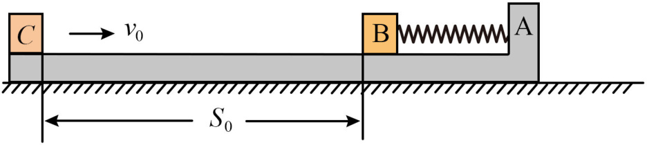
- ROI 裁剪图：[benchmarkallinone/outputs/report_priority_20/run_f2958f3118292117/datasets/physreason/artifacts/crops/prob_a376881173b7a83129f004c7_primary_roi.png](../../datasets/physreason/artifacts/crops/prob_a376881173b7a83129f004c7_primary_roi.png)

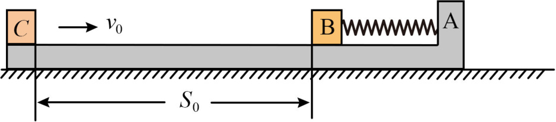

### 5) 清洗判定证据

```json
{
  "clean_score": 0.9119,
  "decision": "reject",
  "decision_reason_codes": [
    "low_resolution"
  ],
  "alignment_summary": {
    "alignment_id": "align_d81f0f1b6411dd1025353491",
    "coverage_score": 0.9,
    "consistency_score": 0.9,
    "alignment_status": "good",
    "conflict_count": 1
  },
  "solvability_summary": {
    "solvability_id": "solv_prob_a376881173b7a83129f004c7",
    "solvability_score": 1.0,
    "reasoning_path_exists": true,
    "decision_hint": "pass",
    "failure_codes": []
  },
  "missing_field_summary": {
    "missing_question_text": false,
    "missing_answer_text": false,
    "missing_image_count": 0
  },
  "risk_flags": [
    "low_resolution"
  ],
  "reject_record": {
    "reject_id": "reject_d81f0f1b6411dd1025353491",
    "problem_id": "prob_a376881173b7a83129f004c7",
    "stage": "cleaning",
    "reject_level": "problem",
    "reject_reason_codes": [
      "low_resolution"
    ],
    "reject_reason_detail": "Question is already open-ended.",
    "blocking_fields": [
      "low_resolution"
    ],
    "evidence_refs": [
      "align_d81f0f1b6411dd1025353491",
      "solv_prob_a376881173b7a83129f004c7"
    ],
    "recoverable": false,
    "recommended_action": "drop",
    "reviewed_by": null,
    "created_at": "2026-03-25T08:49:00Z"
  }
}
```

---

## 13. prob_a54b1902644c9ec85c18aa7a

- 样本文件：[benchmarkallinone/outputs/report_priority_20/run_f2958f3118292117/datasets/physreason/samples/prob_a54b1902644c9ec85c18aa7a.json](../../datasets/physreason/samples/prob_a54b1902644c9ec85c18aa7a.json)
- 源数据集：`PhysReason`
- 源 split：`mini`
- 源题目 ID：`cal_problem_00141`
- 清洗路径：`multimodal_full`
- 是否文本主导：`False`
- 是否依赖图像：`True`
- 决策：`review`
- 决策原因码：`alignment_risky`
- 开放化改写策略：`keep_open`
- 对齐状态：`risky`
- 可解性分数：`1.0`
- 可解性提示：`pass`
- 质量风险标记：`severe_crop_loss`

### 采集阶段信号

```json
{
  "core_asset_completeness": {
    "has_question_text": true,
    "has_answer_text": true,
    "image_count": 1,
    "has_multiple_images": false
  },
  "initial_scores": {
    "initial_image_dependency_score": 0.9,
    "initial_multi_solution_score": 0.46,
    "initial_verifiability_score": 0.7056
  }
}
```

### 1) 处理前：原始题目 / 原始答案

**原始题目**

```text
As shown in the figure, two baffles, each with a length of $l$, are placed vertically opposite each other, with a spacing of $l$. The upper edges $P$ and $M$ of the two baffles are at the same horizontal level. Above this horizontal level, there is a uniform electric field directed vertically downwards with an electric field strength of magnitude $E$. Between the two baffles, there is a uniform magnetic field perpendicular to the paper and outwards, with an adjustable magnetic induction strength. A particle with mass $m$ and charge $q (q>0)$ is launched horizontally to the right with a velocity of magnitude $v_0$ from a certain point in the electric field. It enters the magnetic field exactly at point $P$ and exits the magnetic field between the lower edges $Q$ and $N$ of the two baffles. During its motion, the particle does not collide with the baffles. It is known that the angle between the particle's velocity direction when entering the magnetic field and $PQ$ is ${60}^{\circ}$. Neglect gravity.

1. Determine the distance from the particle's launch position to point $P$.
2. Determine the range of values for the magnitude of the magnetic induction strength.
3. If the particle exits the magnetic field exactly at the midpoint of $QN$, determine the minimum distance between the particle's trajectory in the magnetic field and the baffle $MN$.
```

**原始答案**

```text
$\frac{\sqrt{13}mv_{0}^{2}}{6q E}$
$\frac{2mv_{0}}{(3+\sqrt{3})q l} \le B \le \frac{2mv_{0}}{q l}$
$\frac{39-10\sqrt{3}}{44}l$
```

### 2) 处理后：规范化题目 / 规范化答案

**规范化题目**

```text
As shown in the figure, two baffles, each with a length of $l$, are placed vertically opposite each other, with a spacing of $l$. The upper edges $P$ and $M$ of the two baffles are at the same horizontal level. Above this horizontal level, there is a uniform electric field directed vertically downwards with an electric field strength of magnitude $E$. Between the two baffles, there is a uniform magnetic field perpendicular to the paper and outwards, with an adjustable magnetic induction strength. A particle with mass $m$ and charge $q (q>0)$ is launched horizontally to the right with a velocity of magnitude $v_0$ from a certain point in the electric field. It enters the magnetic field exactly at point $P$ and exits the magnetic field between the lower edges $Q$ and $N$ of the two baffles. During its motion, the particle does not collide with the baffles. It is known that the angle between the particle's velocity direction when entering the magnetic field and $PQ$ is ${60}^{\circ}$. Neglect gravity.

1. Determine the distance from the particle's launch position to point $P$.
2. Determine the range of values for the magnitude of the magnetic induction strength.
3. If the particle exits the magnetic field exactly at the midpoint of $QN$, determine the minimum distance between the particle's trajectory in the magnetic field and the baffle $MN$.
```

**规范化答案**

```text
$\frac{\sqrt{13}mv_{0}^{2}}{6q E}$
$\frac{2mv_{0}}{(3+\sqrt{3})q l} \le B \le \frac{2mv_{0}}{q l}$
$\frac{39-10\sqrt{3}}{44}l$
```

### 3) 开放化改写前后

**改写前（使用规范化题目作为输入）**

```text
As shown in the figure, two baffles, each with a length of $l$, are placed vertically opposite each other, with a spacing of $l$. The upper edges $P$ and $M$ of the two baffles are at the same horizontal level. Above this horizontal level, there is a uniform electric field directed vertically downwards with an electric field strength of magnitude $E$. Between the two baffles, there is a uniform magnetic field perpendicular to the paper and outwards, with an adjustable magnetic induction strength. A particle with mass $m$ and charge $q (q>0)$ is launched horizontally to the right with a velocity of magnitude $v_0$ from a certain point in the electric field. It enters the magnetic field exactly at point $P$ and exits the magnetic field between the lower edges $Q$ and $N$ of the two baffles. During its motion, the particle does not collide with the baffles. It is known that the angle between the particle's velocity direction when entering the magnetic field and $PQ$ is ${60}^{\circ}$. Neglect gravity.

1. Determine the distance from the particle's launch position to point $P$.
2. Determine the range of values for the magnitude of the magnetic induction strength.
3. If the particle exits the magnetic field exactly at the midpoint of $QN$, determine the minimum distance between the particle's trajectory in the magnetic field and the baffle $MN$.
```

**改写后（开放题变体）**

```text
As shown in the figure, two baffles, each with a length of $l$, are placed vertically opposite each other, with a spacing of $l$. The upper edges $P$ and $M$ of the two baffles are at the same horizontal level. Above this horizontal level, there is a uniform electric field directed vertically downwards with an electric field strength of magnitude $E$. Between the two baffles, there is a uniform magnetic field perpendicular to the paper and outwards, with an adjustable magnetic induction strength. A particle with mass $m$ and charge $q (q>0)$ is launched horizontally to the right with a velocity of magnitude $v_0$ from a certain point in the electric field. It enters the magnetic field exactly at point $P$ and exits the magnetic field between the lower edges $Q$ and $N$ of the two baffles. During its motion, the particle does not collide with the baffles. It is known that the angle between the particle's velocity direction when entering the magnetic field and $PQ$ is ${60}^{\circ}$. Neglect gravity.

1. Determine the distance from the particle's launch position to point $P$.
2. Determine the range of values for the magnitude of the magnetic induction strength.
3. If the particle exits the magnetic field exactly at the midpoint of $QN$, determine the minimum distance between the particle's trajectory in the magnetic field and the baffle $MN$.
```

- 期望答案类型：`text`
- 期望答案：`$\frac{\sqrt{13}mv_{0}^{2}}{6q E}$
$\frac{2mv_{0}}{(3+\sqrt{3})q l} \le B \le \frac{2mv_{0}}{q l}$
$\frac{39-10\sqrt{3}}{44}l$`
- 改写 rationale：`Question is already open-ended.`
- 丢弃原因码：`无`

### 4) 图像与可视化产物

- 原始图像来源：[benchmark/outputs/repo_cache/hf_raw/physreason/PhysReason-mini/cal_problem_00141/images/cc2664dd624728a55b90077e201a011b402c60122500243d9557628c0af452ae.jpg](../../../../../../benchmark/outputs/repo_cache/hf_raw/physreason/PhysReason-mini/cal_problem_00141/images/cc2664dd624728a55b90077e201a011b402c60122500243d9557628c0af452ae.jpg)
- 持久化主图：[benchmarkallinone/outputs/report_priority_20/run_f2958f3118292117/datasets/physreason/artifacts/images/prob_a54b1902644c9ec85c18aa7a_primary.png](../../datasets/physreason/artifacts/images/prob_a54b1902644c9ec85c18aa7a_primary.png)

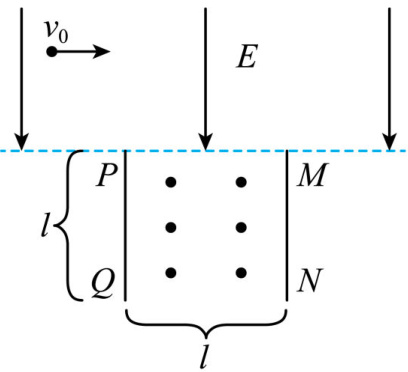
- ROI 裁剪图：[benchmarkallinone/outputs/report_priority_20/run_f2958f3118292117/datasets/physreason/artifacts/crops/prob_a54b1902644c9ec85c18aa7a_primary_roi.png](../../datasets/physreason/artifacts/crops/prob_a54b1902644c9ec85c18aa7a_primary_roi.png)

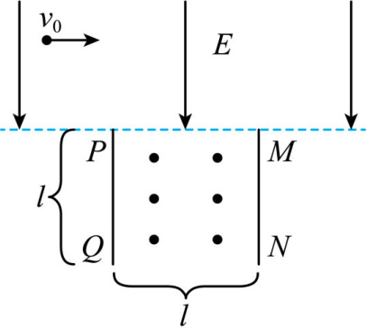

### 5) 清洗判定证据

```json
{
  "clean_score": 0.8704,
  "decision": "review",
  "decision_reason_codes": [
    "alignment_risky"
  ],
  "alignment_summary": {
    "alignment_id": "align_3d6701f3c1a380b690febde5",
    "coverage_score": 0.9,
    "consistency_score": 0.82,
    "alignment_status": "risky",
    "conflict_count": 1
  },
  "solvability_summary": {
    "solvability_id": "solv_prob_a54b1902644c9ec85c18aa7a",
    "solvability_score": 1.0,
    "reasoning_path_exists": true,
    "decision_hint": "pass",
    "failure_codes": []
  },
  "missing_field_summary": {
    "missing_question_text": false,
    "missing_answer_text": false,
    "missing_image_count": 0
  },
  "risk_flags": [
    "severe_crop_loss"
  ],
  "reject_record": null
}
```

---

## 14. prob_b047cd333ca93b256ac5cbd4

- 样本文件：[benchmarkallinone/outputs/report_priority_20/run_f2958f3118292117/datasets/physreason/samples/prob_b047cd333ca93b256ac5cbd4.json](../../datasets/physreason/samples/prob_b047cd333ca93b256ac5cbd4.json)
- 源数据集：`PhysReason`
- 源 split：`mini`
- 源题目 ID：`cal_problem_00161`
- 清洗路径：`multimodal_full`
- 是否文本主导：`False`
- 是否依赖图像：`True`
- 决策：`review`
- 决策原因码：`alignment_risky`
- 开放化改写策略：`keep_open`
- 对齐状态：`risky`
- 可解性分数：`1.0`
- 可解性提示：`pass`
- 质量风险标记：`无`

### 采集阶段信号

```json
{
  "core_asset_completeness": {
    "has_question_text": true,
    "has_answer_text": true,
    "image_count": 1,
    "has_multiple_images": false
  },
  "initial_scores": {
    "initial_image_dependency_score": 0.9,
    "initial_multi_solution_score": 0.64,
    "initial_verifiability_score": 0.874
  }
}
```

### 1) 处理前：原始题目 / 原始答案

**原始题目**

```text
A uniform electric field exists within a cylindrical region. The cross-section of the cylinder is a circle with center $o$ and radius $R$. AB is a diameter of the circle, as shown in the figure. A charged particle with mass $m$ and charge $q$ ($q>0$) enters the electric field at point A with different velocities in the plane of the paper, and the direction of the velocity is perpendicular to the electric field. It is known that a particle entering the field with zero initial velocity exits the field at point $C$ on the circumference with a speed $v_{0}$. The angle between AC and AB is ${\theta=60^{\circ}}$. The particle is only subjected to the electric force during its motion.

1. Determine the magnitude of the electric field strength.
2. To maximize the increase in the particle's kinetic energy after traversing the electric field, what should be the magnitude of the particle's initial velocity upon entering the field?
3. To ensure that the magnitude of the change in momentum of the particle before and after passing through the electric field is $m v_{0}$, what should be the particle's initial velocity upon entering the field?
```

**原始答案**

```text
$\frac{mv_{0}^{2}}{2q R}$
$\frac{\sqrt{2}v_{0}}{4}$
0 or $\frac{\sqrt{3}v_{0}}{2}$
```

### 2) 处理后：规范化题目 / 规范化答案

**规范化题目**

```text
A uniform electric field exists within a cylindrical region. The cross-section of the cylinder is a circle with center $o$ and radius $R$. AB is a diameter of the circle, as shown in the figure. A charged particle with mass $m$ and charge $q$ ($q>0$) enters the electric field at point A with different velocities in the plane of the paper, and the direction of the velocity is perpendicular to the electric field. It is known that a particle entering the field with zero initial velocity exits the field at point $C$ on the circumference with a speed $v_{0}$. The angle between AC and AB is ${\theta=60^{\circ}}$. The particle is only subjected to the electric force during its motion.

1. Determine the magnitude of the electric field strength.
2. To maximize the increase in the particle's kinetic energy after traversing the electric field, what should be the magnitude of the particle's initial velocity upon entering the field?
3. To ensure that the magnitude of the change in momentum of the particle before and after passing through the electric field is $m v_{0}$, what should be the particle's initial velocity upon entering the field?
```

**规范化答案**

```text
$\frac{mv_{0}^{2}}{2q R}$
$\frac{\sqrt{2}v_{0}}{4}$
0 or $\frac{\sqrt{3}v_{0}}{2}$
```

### 3) 开放化改写前后

**改写前（使用规范化题目作为输入）**

```text
A uniform electric field exists within a cylindrical region. The cross-section of the cylinder is a circle with center $o$ and radius $R$. AB is a diameter of the circle, as shown in the figure. A charged particle with mass $m$ and charge $q$ ($q>0$) enters the electric field at point A with different velocities in the plane of the paper, and the direction of the velocity is perpendicular to the electric field. It is known that a particle entering the field with zero initial velocity exits the field at point $C$ on the circumference with a speed $v_{0}$. The angle between AC and AB is ${\theta=60^{\circ}}$. The particle is only subjected to the electric force during its motion.

1. Determine the magnitude of the electric field strength.
2. To maximize the increase in the particle's kinetic energy after traversing the electric field, what should be the magnitude of the particle's initial velocity upon entering the field?
3. To ensure that the magnitude of the change in momentum of the particle before and after passing through the electric field is $m v_{0}$, what should be the particle's initial velocity upon entering the field?
```

**改写后（开放题变体）**

```text
A uniform electric field exists within a cylindrical region. The cross-section of the cylinder is a circle with center $o$ and radius $R$. AB is a diameter of the circle, as shown in the figure. A charged particle with mass $m$ and charge $q$ ($q>0$) enters the electric field at point A with different velocities in the plane of the paper, and the direction of the velocity is perpendicular to the electric field. It is known that a particle entering the field with zero initial velocity exits the field at point $C$ on the circumference with a speed $v_{0}$. The angle between AC and AB is ${\theta=60^{\circ}}$. The particle is only subjected to the electric force during its motion.

1. Determine the magnitude of the electric field strength.
2. To maximize the increase in the particle's kinetic energy after traversing the electric field, what should be the magnitude of the particle's initial velocity upon entering the field?
3. To ensure that the magnitude of the change in momentum of the particle before and after passing through the electric field is $m v_{0}$, what should be the particle's initial velocity upon entering the field?
```

- 期望答案类型：`short_text`
- 期望答案：`$\frac{mv_{0}^{2}}{2q R}$
$\frac{\sqrt{2}v_{0}}{4}$
0 or $\frac{\sqrt{3}v_{0}}{2}$`
- 改写 rationale：`Question is already open-ended.`
- 丢弃原因码：`无`

### 4) 图像与可视化产物

- 原始图像来源：[benchmark/outputs/repo_cache/hf_raw/physreason/PhysReason-mini/cal_problem_00161/images/e61a234c9d67e8d3c8c43f9d1c124ea241ae1ffca0d792c6410cf691f8f0b4e3.jpg](../../../../../../benchmark/outputs/repo_cache/hf_raw/physreason/PhysReason-mini/cal_problem_00161/images/e61a234c9d67e8d3c8c43f9d1c124ea241ae1ffca0d792c6410cf691f8f0b4e3.jpg)
- 持久化主图：[benchmarkallinone/outputs/report_priority_20/run_f2958f3118292117/datasets/physreason/artifacts/images/prob_b047cd333ca93b256ac5cbd4_primary.png](../../datasets/physreason/artifacts/images/prob_b047cd333ca93b256ac5cbd4_primary.png)

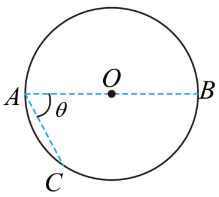
- ROI 裁剪图：[benchmarkallinone/outputs/report_priority_20/run_f2958f3118292117/datasets/physreason/artifacts/crops/prob_b047cd333ca93b256ac5cbd4_primary_roi.png](../../datasets/physreason/artifacts/crops/prob_b047cd333ca93b256ac5cbd4_primary_roi.png)

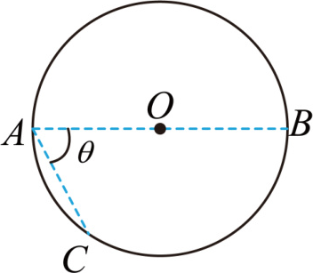

### 5) 清洗判定证据

```json
{
  "clean_score": 0.8825,
  "decision": "review",
  "decision_reason_codes": [
    "alignment_risky"
  ],
  "alignment_summary": {
    "alignment_id": "align_7e51bb4377c3e53468c850d0",
    "coverage_score": 0.9,
    "consistency_score": 0.82,
    "alignment_status": "risky",
    "conflict_count": 1
  },
  "solvability_summary": {
    "solvability_id": "solv_prob_b047cd333ca93b256ac5cbd4",
    "solvability_score": 1.0,
    "reasoning_path_exists": true,
    "decision_hint": "pass",
    "failure_codes": []
  },
  "missing_field_summary": {
    "missing_question_text": false,
    "missing_answer_text": false,
    "missing_image_count": 0
  },
  "risk_flags": [],
  "reject_record": null
}
```

---

## 15. prob_b4692663e9fdd3226da59d87

- 样本文件：[benchmarkallinone/outputs/report_priority_20/run_f2958f3118292117/datasets/physreason/samples/prob_b4692663e9fdd3226da59d87.json](../../datasets/physreason/samples/prob_b4692663e9fdd3226da59d87.json)
- 源数据集：`PhysReason`
- 源 split：`mini`
- 源题目 ID：`cal_problem_00057`
- 清洗路径：`multimodal_full`
- 是否文本主导：`False`
- 是否依赖图像：`True`
- 决策：`reject`
- 决策原因码：`low_resolution`
- 开放化改写策略：`keep_open`
- 对齐状态：`good`
- 可解性分数：`1.0`
- 可解性提示：`pass`
- 质量风险标记：`low_resolution`

### 采集阶段信号

```json
{
  "core_asset_completeness": {
    "has_question_text": true,
    "has_answer_text": true,
    "image_count": 1,
    "has_multiple_images": false
  },
  "initial_scores": {
    "initial_image_dependency_score": 0.9,
    "initial_multi_solution_score": 0.46,
    "initial_verifiability_score": 0.8722
  }
}
```

### 1) 处理前：原始题目 / 原始答案

**原始题目**

```text
A simple harmonic transverse wave propagates along the positive direction of the $x$-axis. The equilibrium position of the wave source is at the origin of the coordinate system. The vibration graph of the wave source within $0 \sim 4s$ is shown in the figure. It is known that the wave propagation speed is $0.5\mathsf{m}/\mathsf{s}$.

1. Determine the wavelength of this transverse wave.
2. Determine the distance traveled by the wave source within 4s.
```

**原始答案**

```text
$\lambda=2\mathsf{m}$
$s=16cm$
```

### 2) 处理后：规范化题目 / 规范化答案

**规范化题目**

```text
A simple harmonic transverse wave propagates along the positive direction of the $x$-axis. The equilibrium position of the wave source is at the origin of the coordinate system. The vibration graph of the wave source within $0 \sim 4s$ is shown in the figure. It is known that the wave propagation speed is $0.5\mathsf{m}/\mathsf{s}$.

1. Determine the wavelength of this transverse wave.
2. Determine the distance traveled by the wave source within 4s.
```

**规范化答案**

```text
$\lambda=2\mathsf{m}$
$s=16cm$
```

### 3) 开放化改写前后

**改写前（使用规范化题目作为输入）**

```text
A simple harmonic transverse wave propagates along the positive direction of the $x$-axis. The equilibrium position of the wave source is at the origin of the coordinate system. The vibration graph of the wave source within $0 \sim 4s$ is shown in the figure. It is known that the wave propagation speed is $0.5\mathsf{m}/\mathsf{s}$.

1. Determine the wavelength of this transverse wave.
2. Determine the distance traveled by the wave source within 4s.
```

**改写后（开放题变体）**

```text
A simple harmonic transverse wave propagates along the positive direction of the $x$-axis. The equilibrium position of the wave source is at the origin of the coordinate system. The vibration graph of the wave source within $0 \sim 4s$ is shown in the figure. It is known that the wave propagation speed is $0.5\mathsf{m}/\mathsf{s}$.

1. Determine the wavelength of this transverse wave.
2. Determine the distance traveled by the wave source within 4s.
```

- 期望答案类型：`short_text`
- 期望答案：`$\lambda=2\mathsf{m}$
$s=16cm$`
- 改写 rationale：`Question is already open-ended.`
- 丢弃原因码：`无`

### 4) 图像与可视化产物

- 原始图像来源：[benchmark/outputs/repo_cache/hf_raw/physreason/PhysReason-mini/cal_problem_00057/images/672c54e36ac4eebe2931d9bcde334c08d3c5a2662cf22a8e69d05440fe03a53d.jpg](../../../../../../benchmark/outputs/repo_cache/hf_raw/physreason/PhysReason-mini/cal_problem_00057/images/672c54e36ac4eebe2931d9bcde334c08d3c5a2662cf22a8e69d05440fe03a53d.jpg)
- 持久化主图：[benchmarkallinone/outputs/report_priority_20/run_f2958f3118292117/datasets/physreason/artifacts/images/prob_b4692663e9fdd3226da59d87_primary.png](../../datasets/physreason/artifacts/images/prob_b4692663e9fdd3226da59d87_primary.png)

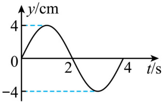
- ROI 裁剪图：[benchmarkallinone/outputs/report_priority_20/run_f2958f3118292117/datasets/physreason/artifacts/crops/prob_b4692663e9fdd3226da59d87_primary_roi.png](../../datasets/physreason/artifacts/crops/prob_b4692663e9fdd3226da59d87_primary_roi.png)

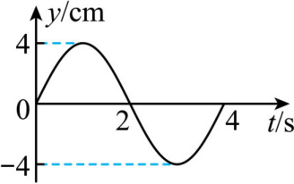

### 5) 清洗判定证据

```json
{
  "clean_score": 0.9079,
  "decision": "reject",
  "decision_reason_codes": [
    "low_resolution"
  ],
  "alignment_summary": {
    "alignment_id": "align_4bef5643d09982f56e1be190",
    "coverage_score": 0.9,
    "consistency_score": 0.98,
    "alignment_status": "good",
    "conflict_count": 0
  },
  "solvability_summary": {
    "solvability_id": "solv_prob_b4692663e9fdd3226da59d87",
    "solvability_score": 1.0,
    "reasoning_path_exists": true,
    "decision_hint": "pass",
    "failure_codes": []
  },
  "missing_field_summary": {
    "missing_question_text": false,
    "missing_answer_text": false,
    "missing_image_count": 0
  },
  "risk_flags": [
    "low_resolution"
  ],
  "reject_record": {
    "reject_id": "reject_4bef5643d09982f56e1be190",
    "problem_id": "prob_b4692663e9fdd3226da59d87",
    "stage": "cleaning",
    "reject_level": "problem",
    "reject_reason_codes": [
      "low_resolution"
    ],
    "reject_reason_detail": "Question is already open-ended.",
    "blocking_fields": [
      "low_resolution"
    ],
    "evidence_refs": [
      "align_4bef5643d09982f56e1be190",
      "solv_prob_b4692663e9fdd3226da59d87"
    ],
    "recoverable": false,
    "recommended_action": "drop",
    "reviewed_by": null,
    "created_at": "2026-03-25T08:49:00Z"
  }
}
```

---

## 16. prob_bbbb6c02b59706d1c5ccb1b7

- 样本文件：[benchmarkallinone/outputs/report_priority_20/run_f2958f3118292117/datasets/physreason/samples/prob_bbbb6c02b59706d1c5ccb1b7.json](../../datasets/physreason/samples/prob_bbbb6c02b59706d1c5ccb1b7.json)
- 源数据集：`PhysReason`
- 源 split：`mini`
- 源题目 ID：`cal_problem_00174`
- 清洗路径：`multimodal_full`
- 是否文本主导：`False`
- 是否依赖图像：`True`
- 决策：`pass`
- 决策原因码：`meets_cleaning_requirements`
- 开放化改写策略：`keep_open`
- 对齐状态：`good`
- 可解性分数：`1.0`
- 可解性提示：`pass`
- 质量风险标记：`无`

### 采集阶段信号

```json
{
  "core_asset_completeness": {
    "has_question_text": true,
    "has_answer_text": true,
    "image_count": 1,
    "has_multiple_images": false
  },
  "initial_scores": {
    "initial_image_dependency_score": 0.9,
    "initial_multi_solution_score": 0.46,
    "initial_verifiability_score": 0.8737
  }
}
```

### 1) 处理前：原始题目 / 原始答案

**原始题目**

```text
A U-shaped metal rod has a side length of $L=15cm$ and a mass of $m=1 \times 10^{-3}\mathrm{kg}$. Its lower end is immersed in a conductive liquid, which is connected to a power source. The space where the metal rod is located has a uniform magnetic field of $B=8 \times 10^{-2}\mathrm{T}$ perpendicular to the paper and directed inwards.

1. If the immersed depth of the conductive liquid is $h=2.5cm$, after closing the electrical switch, the metal rod flies up and its lower end is at a height of $H=10cm$ from the liquid surface. Assuming the current in the rod remains constant, determine the magnitude of the velocity of the metal rod when it leaves the liquid surface.
2. Determine the magnitude of the current in the metal rod.
3. If the lower end of the metal rod is initially in contact with the conductive liquid, and the magnitude of the electromotive force is changed, the metal rod jumps to a height of $H^{\prime}=5cm$ after being energized for a duration of $t^{\prime}=0.002\mathrm{s}$. Calculate the amount of electric charge that passes through the cross-section of the metal rod.
```

**原始答案**

```text
$\sqrt{2}m/s
4.17A
0.085C
```

### 2) 处理后：规范化题目 / 规范化答案

**规范化题目**

```text
A U-shaped metal rod has a side length of $L=15cm$ and a mass of $m=1 \times 10^{-3}\mathrm{kg}$. Its lower end is immersed in a conductive liquid, which is connected to a power source. The space where the metal rod is located has a uniform magnetic field of $B=8 \times 10^{-2}\mathrm{T}$ perpendicular to the paper and directed inwards.

1. If the immersed depth of the conductive liquid is $h=2.5cm$, after closing the electrical switch, the metal rod flies up and its lower end is at a height of $H=10cm$ from the liquid surface. Assuming the current in the rod remains constant, determine the magnitude of the velocity of the metal rod when it leaves the liquid surface.
2. Determine the magnitude of the current in the metal rod.
3. If the lower end of the metal rod is initially in contact with the conductive liquid, and the magnitude of the electromotive force is changed, the metal rod jumps to a height of $H^{\prime}=5cm$ after being energized for a duration of $t^{\prime}=0.002\mathrm{s}$. Calculate the amount of electric charge that passes through the cross-section of the metal rod.
```

**规范化答案**

```text
$\sqrt{2}m/s
4.17A
0.085C
```

### 3) 开放化改写前后

**改写前（使用规范化题目作为输入）**

```text
A U-shaped metal rod has a side length of $L=15cm$ and a mass of $m=1 \times 10^{-3}\mathrm{kg}$. Its lower end is immersed in a conductive liquid, which is connected to a power source. The space where the metal rod is located has a uniform magnetic field of $B=8 \times 10^{-2}\mathrm{T}$ perpendicular to the paper and directed inwards.

1. If the immersed depth of the conductive liquid is $h=2.5cm$, after closing the electrical switch, the metal rod flies up and its lower end is at a height of $H=10cm$ from the liquid surface. Assuming the current in the rod remains constant, determine the magnitude of the velocity of the metal rod when it leaves the liquid surface.
2. Determine the magnitude of the current in the metal rod.
3. If the lower end of the metal rod is initially in contact with the conductive liquid, and the magnitude of the electromotive force is changed, the metal rod jumps to a height of $H^{\prime}=5cm$ after being energized for a duration of $t^{\prime}=0.002\mathrm{s}$. Calculate the amount of electric charge that passes through the cross-section of the metal rod.
```

**改写后（开放题变体）**

```text
A U-shaped metal rod has a side length of $L=15cm$ and a mass of $m=1 \times 10^{-3}\mathrm{kg}$. Its lower end is immersed in a conductive liquid, which is connected to a power source. The space where the metal rod is located has a uniform magnetic field of $B=8 \times 10^{-2}\mathrm{T}$ perpendicular to the paper and directed inwards.

1. If the immersed depth of the conductive liquid is $h=2.5cm$, after closing the electrical switch, the metal rod flies up and its lower end is at a height of $H=10cm$ from the liquid surface. Assuming the current in the rod remains constant, determine the magnitude of the velocity of the metal rod when it leaves the liquid surface.
2. Determine the magnitude of the current in the metal rod.
3. If the lower end of the metal rod is initially in contact with the conductive liquid, and the magnitude of the electromotive force is changed, the metal rod jumps to a height of $H^{\prime}=5cm$ after being energized for a duration of $t^{\prime}=0.002\mathrm{s}$. Calculate the amount of electric charge that passes through the cross-section of the metal rod.
```

- 期望答案类型：`short_text`
- 期望答案：`$\sqrt{2}m/s
4.17A
0.085C`
- 改写 rationale：`Question is already open-ended.`
- 丢弃原因码：`无`

### 4) 图像与可视化产物

- 原始图像来源：[benchmark/outputs/repo_cache/hf_raw/physreason/PhysReason-mini/cal_problem_00174/images/725aeffc03fb688657960954d603e3d394713c4a822d965a0e0c5a089a25d60b.jpg](../../../../../../benchmark/outputs/repo_cache/hf_raw/physreason/PhysReason-mini/cal_problem_00174/images/725aeffc03fb688657960954d603e3d394713c4a822d965a0e0c5a089a25d60b.jpg)
- 持久化主图：[benchmarkallinone/outputs/report_priority_20/run_f2958f3118292117/datasets/physreason/artifacts/images/prob_bbbb6c02b59706d1c5ccb1b7_primary.png](../../datasets/physreason/artifacts/images/prob_bbbb6c02b59706d1c5ccb1b7_primary.png)

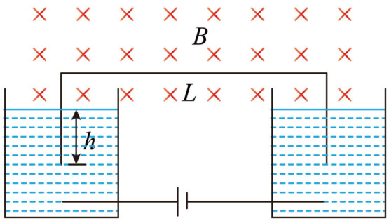
- ROI 裁剪图：[benchmarkallinone/outputs/report_priority_20/run_f2958f3118292117/datasets/physreason/artifacts/crops/prob_bbbb6c02b59706d1c5ccb1b7_primary_roi.png](../../datasets/physreason/artifacts/crops/prob_bbbb6c02b59706d1c5ccb1b7_primary_roi.png)

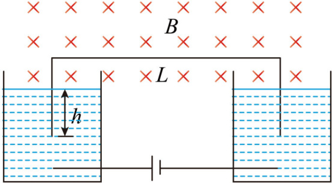

### 5) 清洗判定证据

```json
{
  "clean_score": 0.896,
  "decision": "pass",
  "decision_reason_codes": [
    "meets_cleaning_requirements"
  ],
  "alignment_summary": {
    "alignment_id": "align_a69a49c73f60bd9803605d63",
    "coverage_score": 0.9,
    "consistency_score": 0.9,
    "alignment_status": "good",
    "conflict_count": 1
  },
  "solvability_summary": {
    "solvability_id": "solv_prob_bbbb6c02b59706d1c5ccb1b7",
    "solvability_score": 1.0,
    "reasoning_path_exists": true,
    "decision_hint": "pass",
    "failure_codes": []
  },
  "missing_field_summary": {
    "missing_question_text": false,
    "missing_answer_text": false,
    "missing_image_count": 0
  },
  "risk_flags": [],
  "reject_record": null
}
```

---

## 17. prob_bc1ac5451dc05dab60eb599d

- 样本文件：[benchmarkallinone/outputs/report_priority_20/run_f2958f3118292117/datasets/physreason/samples/prob_bc1ac5451dc05dab60eb599d.json](../../datasets/physreason/samples/prob_bc1ac5451dc05dab60eb599d.json)
- 源数据集：`PhysReason`
- 源 split：`mini`
- 源题目 ID：`cal_problem_00049`
- 清洗路径：`multimodal_full`
- 是否文本主导：`False`
- 是否依赖图像：`True`
- 决策：`review`
- 决策原因码：`alignment_risky`
- 开放化改写策略：`keep_open`
- 对齐状态：`risky`
- 可解性分数：`1.0`
- 可解性提示：`pass`
- 质量风险标记：`无`

### 采集阶段信号

```json
{
  "core_asset_completeness": {
    "has_question_text": true,
    "has_answer_text": true,
    "image_count": 1,
    "has_multiple_images": false
  },
  "initial_scores": {
    "initial_image_dependency_score": 0.9,
    "initial_multi_solution_score": 0.46,
    "initial_verifiability_score": 0.8752
  }
}
```

### 1) 处理前：原始题目 / 原始答案

**原始题目**

```text
A basketball of mass $m$ is dropped from rest at a height $H$ above the ground. It undergoes an inelastic collision with the ground and rebounds to a maximum height $h$ above the ground. The magnitude of the air resistance experienced by the basketball during its motion is $\lambda$ times the magnitude of the gravitational force acting on the basketball (where $\lambda$ is a constant and $0<\lambda<\frac{H-h}{H+h}$). The ratio of the post-collision velocity to the pre-collision velocity is the same for each collision with the ground. The magnitude of the gravitational acceleration is $g$.

1. Determine the ratio of the post-collision velocity to the pre-collision velocity of the basketball during its collision with the ground.
2. If the basketball rebounds to the maximum height $h$, and at the instant the basketball reaches this maximum height, the athlete applies a downward force $F$, causing the basketball to rebound exactly to the height $h$ after colliding with the ground once. The force $F$ varies with height $y$ as shown in figure (b), where $h_{0}$ is known. Calculate the magnitude of $F_{0}$.
3. After being dropped from rest at height $H$, each time the basketball reaches its maximum rebound height, the athlete strikes it (with an extremely short impact duration), instantaneously giving it an equal, downward impulse $I$. After $N$ such strikes, the basketball rebounds to height $H$ again. Calculate the magnitude of the impulse $I$.
```

**原始答案**

```text
$k=\sqrt{\frac{(1+\lambda)h}{(1-\lambda)H}}$
$F_{0}=\frac{2m g(1-\lambda)(H-h)}{h-h_{0}}$
$I=m\sqrt{\frac{2g(1-\lambda)(H-h)(H^{N+1}-h^{N+1})}{h(H^{N}-h^{N})}}$
```

### 2) 处理后：规范化题目 / 规范化答案

**规范化题目**

```text
A basketball of mass $m$ is dropped from rest at a height $H$ above the ground. It undergoes an inelastic collision with the ground and rebounds to a maximum height $h$ above the ground. The magnitude of the air resistance experienced by the basketball during its motion is $\lambda$ times the magnitude of the gravitational force acting on the basketball (where $\lambda$ is a constant and $0<\lambda<\frac{H-h}{H+h}$). The ratio of the post-collision velocity to the pre-collision velocity is the same for each collision with the ground. The magnitude of the gravitational acceleration is $g$.

1. Determine the ratio of the post-collision velocity to the pre-collision velocity of the basketball during its collision with the ground.
2. If the basketball rebounds to the maximum height $h$, and at the instant the basketball reaches this maximum height, the athlete applies a downward force $F$, causing the basketball to rebound exactly to the height $h$ after colliding with the ground once. The force $F$ varies with height $y$ as shown in figure (b), where $h_{0}$ is known. Calculate the magnitude of $F_{0}$.
3. After being dropped from rest at height $H$, each time the basketball reaches its maximum rebound height, the athlete strikes it (with an extremely short impact duration), instantaneously giving it an equal, downward impulse $I$. After $N$ such strikes, the basketball rebounds to height $H$ again. Calculate the magnitude of the impulse $I$.
```

**规范化答案**

```text
$k=\sqrt{\frac{(1+\lambda)h}{(1-\lambda)H}}$
$F_{0}=\frac{2m g(1-\lambda)(H-h)}{h-h_{0}}$
$I=m\sqrt{\frac{2g(1-\lambda)(H-h)(H^{N+1}-h^{N+1})}{h(H^{N}-h^{N})}}$
```

### 3) 开放化改写前后

**改写前（使用规范化题目作为输入）**

```text
A basketball of mass $m$ is dropped from rest at a height $H$ above the ground. It undergoes an inelastic collision with the ground and rebounds to a maximum height $h$ above the ground. The magnitude of the air resistance experienced by the basketball during its motion is $\lambda$ times the magnitude of the gravitational force acting on the basketball (where $\lambda$ is a constant and $0<\lambda<\frac{H-h}{H+h}$). The ratio of the post-collision velocity to the pre-collision velocity is the same for each collision with the ground. The magnitude of the gravitational acceleration is $g$.

1. Determine the ratio of the post-collision velocity to the pre-collision velocity of the basketball during its collision with the ground.
2. If the basketball rebounds to the maximum height $h$, and at the instant the basketball reaches this maximum height, the athlete applies a downward force $F$, causing the basketball to rebound exactly to the height $h$ after colliding with the ground once. The force $F$ varies with height $y$ as shown in figure (b), where $h_{0}$ is known. Calculate the magnitude of $F_{0}$.
3. After being dropped from rest at height $H$, each time the basketball reaches its maximum rebound height, the athlete strikes it (with an extremely short impact duration), instantaneously giving it an equal, downward impulse $I$. After $N$ such strikes, the basketball rebounds to height $H$ again. Calculate the magnitude of the impulse $I$.
```

**改写后（开放题变体）**

```text
A basketball of mass $m$ is dropped from rest at a height $H$ above the ground. It undergoes an inelastic collision with the ground and rebounds to a maximum height $h$ above the ground. The magnitude of the air resistance experienced by the basketball during its motion is $\lambda$ times the magnitude of the gravitational force acting on the basketball (where $\lambda$ is a constant and $0<\lambda<\frac{H-h}{H+h}$). The ratio of the post-collision velocity to the pre-collision velocity is the same for each collision with the ground. The magnitude of the gravitational acceleration is $g$.

1. Determine the ratio of the post-collision velocity to the pre-collision velocity of the basketball during its collision with the ground.
2. If the basketball rebounds to the maximum height $h$, and at the instant the basketball reaches this maximum height, the athlete applies a downward force $F$, causing the basketball to rebound exactly to the height $h$ after colliding with the ground once. The force $F$ varies with height $y$ as shown in figure (b), where $h_{0}$ is known. Calculate the magnitude of $F_{0}$.
3. After being dropped from rest at height $H$, each time the basketball reaches its maximum rebound height, the athlete strikes it (with an extremely short impact duration), instantaneously giving it an equal, downward impulse $I$. After $N$ such strikes, the basketball rebounds to height $H$ again. Calculate the magnitude of the impulse $I$.
```

- 期望答案类型：`short_text`
- 期望答案：`$k=\sqrt{\frac{(1+\lambda)h}{(1-\lambda)H}}$
$F_{0}=\frac{2m g(1-\lambda)(H-h)}{h-h_{0}}$
$I=m\sqrt{\frac{2g(1-\lambda)(H-h)(H^{N+1}-h^{N+1})}{h(H^{N}-h^{N})}}$`
- 改写 rationale：`Question is already open-ended.`
- 丢弃原因码：`无`

### 4) 图像与可视化产物

- 原始图像来源：[benchmark/outputs/repo_cache/hf_raw/physreason/PhysReason-mini/cal_problem_00049/images/20241209133227.png](../../../../../../benchmark/outputs/repo_cache/hf_raw/physreason/PhysReason-mini/cal_problem_00049/images/20241209133227.png)
- 持久化主图：[benchmarkallinone/outputs/report_priority_20/run_f2958f3118292117/datasets/physreason/artifacts/images/prob_bc1ac5451dc05dab60eb599d_primary.png](../../datasets/physreason/artifacts/images/prob_bc1ac5451dc05dab60eb599d_primary.png)

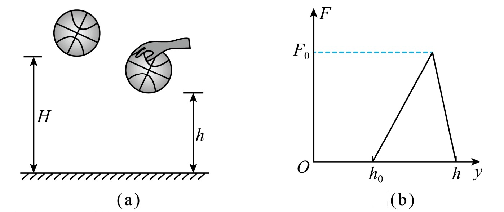
- ROI 裁剪图：[benchmarkallinone/outputs/report_priority_20/run_f2958f3118292117/datasets/physreason/artifacts/crops/prob_bc1ac5451dc05dab60eb599d_primary_roi.png](../../datasets/physreason/artifacts/crops/prob_bc1ac5451dc05dab60eb599d_primary_roi.png)

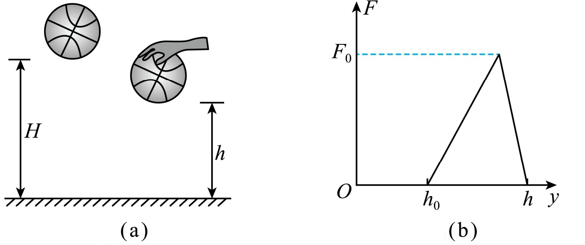

### 5) 清洗判定证据

```json
{
  "clean_score": 0.8843,
  "decision": "review",
  "decision_reason_codes": [
    "alignment_risky"
  ],
  "alignment_summary": {
    "alignment_id": "align_75ba9ae5a9bc1edb19c51775",
    "coverage_score": 0.9,
    "consistency_score": 0.82,
    "alignment_status": "risky",
    "conflict_count": 1
  },
  "solvability_summary": {
    "solvability_id": "solv_prob_bc1ac5451dc05dab60eb599d",
    "solvability_score": 1.0,
    "reasoning_path_exists": true,
    "decision_hint": "pass",
    "failure_codes": []
  },
  "missing_field_summary": {
    "missing_question_text": false,
    "missing_answer_text": false,
    "missing_image_count": 0
  },
  "risk_flags": [],
  "reject_record": null
}
```

---

## 18. prob_c1558af8379cd71bc05db2c2

- 样本文件：[benchmarkallinone/outputs/report_priority_20/run_f2958f3118292117/datasets/physreason/samples/prob_c1558af8379cd71bc05db2c2.json](../../datasets/physreason/samples/prob_c1558af8379cd71bc05db2c2.json)
- 源数据集：`PhysReason`
- 源 split：`mini`
- 源题目 ID：`cal_problem_00160`
- 清洗路径：`multimodal_full`
- 是否文本主导：`False`
- 是否依赖图像：`True`
- 决策：`pass`
- 决策原因码：`meets_cleaning_requirements`
- 开放化改写策略：`keep_open`
- 对齐状态：`good`
- 可解性分数：`1.0`
- 可解性提示：`pass`
- 质量风险标记：`无`

### 采集阶段信号

```json
{
  "core_asset_completeness": {
    "has_question_text": true,
    "has_answer_text": true,
    "image_count": 1,
    "has_multiple_images": false
  },
  "initial_scores": {
    "initial_image_dependency_score": 0.9,
    "initial_multi_solution_score": 0.46,
    "initial_verifiability_score": 0.7073
  }
}
```

### 1) 处理前：原始题目 / 原始答案

**原始题目**

```text
A uniform magnetic field, with its direction perpendicular to the paper, exists in the region $0 \le x \le h$ and $-\infty < y < +\infty$. The magnitude of the magnetic induction $B$ is adjustable, but its direction remains constant. A particle with mass $m$ and charge $q (q>0)$ enters the magnetic field from the left side along the x-axis with a velocity $v_{0}$, and gravity is negligible.

1. If the particle, after being deflected by the magnetic field, leaves the magnetic field by crossing the positive y-axis, analyze and explain the direction of the magnetic field and determine the minimum magnitude of magnetic induction $B_{m}$ in this case.
2. If the magnitude of the magnetic induction is $\frac{B_{m}}{2}$, the particle will leave the magnetic field through a point on the dashed boundary. Determine the angle between the particle's direction of motion at that point and the positive x-axis, as well as the distance from that point to the x-axis.
```

**原始答案**

```text
the direction of the magnetic field is into the plane of the paper.； $B_{m}=\frac{mv_{0}}{q h}$
$\alpha=\frac{\pi}{6}, y=(2-\sqrt{3})h$
```

### 2) 处理后：规范化题目 / 规范化答案

**规范化题目**

```text
A uniform magnetic field, with its direction perpendicular to the paper, exists in the region $0 \le x \le h$ and $-\infty < y < +\infty$. The magnitude of the magnetic induction $B$ is adjustable, but its direction remains constant. A particle with mass $m$ and charge $q (q>0)$ enters the magnetic field from the left side along the x-axis with a velocity $v_{0}$, and gravity is negligible.

1. If the particle, after being deflected by the magnetic field, leaves the magnetic field by crossing the positive y-axis, analyze and explain the direction of the magnetic field and determine the minimum magnitude of magnetic induction $B_{m}$ in this case.
2. If the magnitude of the magnetic induction is $\frac{B_{m}}{2}$, the particle will leave the magnetic field through a point on the dashed boundary. Determine the angle between the particle's direction of motion at that point and the positive x-axis, as well as the distance from that point to the x-axis.
```

**规范化答案**

```text
the direction of the magnetic field is into the plane of the paper.; $B_{m}=\frac{mv_{0}}{q h}$
$\alpha=\frac{\pi}{6}, y=(2-\sqrt{3})h$
```

### 3) 开放化改写前后

**改写前（使用规范化题目作为输入）**

```text
A uniform magnetic field, with its direction perpendicular to the paper, exists in the region $0 \le x \le h$ and $-\infty < y < +\infty$. The magnitude of the magnetic induction $B$ is adjustable, but its direction remains constant. A particle with mass $m$ and charge $q (q>0)$ enters the magnetic field from the left side along the x-axis with a velocity $v_{0}$, and gravity is negligible.

1. If the particle, after being deflected by the magnetic field, leaves the magnetic field by crossing the positive y-axis, analyze and explain the direction of the magnetic field and determine the minimum magnitude of magnetic induction $B_{m}$ in this case.
2. If the magnitude of the magnetic induction is $\frac{B_{m}}{2}$, the particle will leave the magnetic field through a point on the dashed boundary. Determine the angle between the particle's direction of motion at that point and the positive x-axis, as well as the distance from that point to the x-axis.
```

**改写后（开放题变体）**

```text
A uniform magnetic field, with its direction perpendicular to the paper, exists in the region $0 \le x \le h$ and $-\infty < y < +\infty$. The magnitude of the magnetic induction $B$ is adjustable, but its direction remains constant. A particle with mass $m$ and charge $q (q>0)$ enters the magnetic field from the left side along the x-axis with a velocity $v_{0}$, and gravity is negligible.

1. If the particle, after being deflected by the magnetic field, leaves the magnetic field by crossing the positive y-axis, analyze and explain the direction of the magnetic field and determine the minimum magnitude of magnetic induction $B_{m}$ in this case.
2. If the magnitude of the magnetic induction is $\frac{B_{m}}{2}$, the particle will leave the magnetic field through a point on the dashed boundary. Determine the angle between the particle's direction of motion at that point and the positive x-axis, as well as the distance from that point to the x-axis.
```

- 期望答案类型：`set`
- 期望答案：`the direction of the magnetic field is into the plane of the paper.; $B_{m}=\frac{mv_{0}}{q h}$
$\alpha=\frac{\pi}{6}, y=(2-\sqrt{3})h$`
- 改写 rationale：`Question is already open-ended.`
- 丢弃原因码：`无`

### 4) 图像与可视化产物

- 原始图像来源：[benchmark/outputs/repo_cache/hf_raw/physreason/PhysReason-mini/cal_problem_00160/images/34101c65980d40a1a60f1705a13ecfe354ca2c49ebb6471c818c882ce41e9b1b.jpg](../../../../../../benchmark/outputs/repo_cache/hf_raw/physreason/PhysReason-mini/cal_problem_00160/images/34101c65980d40a1a60f1705a13ecfe354ca2c49ebb6471c818c882ce41e9b1b.jpg)
- 持久化主图：[benchmarkallinone/outputs/report_priority_20/run_f2958f3118292117/datasets/physreason/artifacts/images/prob_c1558af8379cd71bc05db2c2_primary.png](../../datasets/physreason/artifacts/images/prob_c1558af8379cd71bc05db2c2_primary.png)

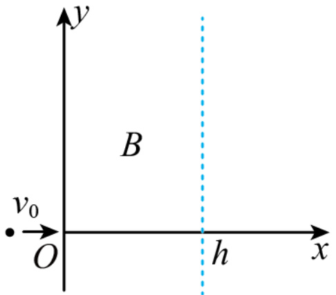
- ROI 裁剪图：[benchmarkallinone/outputs/report_priority_20/run_f2958f3118292117/datasets/physreason/artifacts/crops/prob_c1558af8379cd71bc05db2c2_primary_roi.png](../../datasets/physreason/artifacts/crops/prob_c1558af8379cd71bc05db2c2_primary_roi.png)

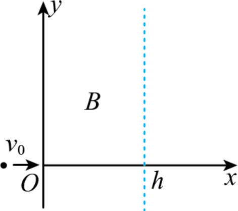

### 5) 清洗判定证据

```json
{
  "clean_score": 0.8869,
  "decision": "pass",
  "decision_reason_codes": [
    "meets_cleaning_requirements"
  ],
  "alignment_summary": {
    "alignment_id": "align_bbe81acf89e2adc019ce1c15",
    "coverage_score": 0.9,
    "consistency_score": 0.9,
    "alignment_status": "good",
    "conflict_count": 1
  },
  "solvability_summary": {
    "solvability_id": "solv_prob_c1558af8379cd71bc05db2c2",
    "solvability_score": 1.0,
    "reasoning_path_exists": true,
    "decision_hint": "pass",
    "failure_codes": []
  },
  "missing_field_summary": {
    "missing_question_text": false,
    "missing_answer_text": false,
    "missing_image_count": 0
  },
  "risk_flags": [],
  "reject_record": null
}
```

---

## 19. prob_f52b488facca65c7dc8f009c

- 样本文件：[benchmarkallinone/outputs/report_priority_20/run_f2958f3118292117/datasets/physreason/samples/prob_f52b488facca65c7dc8f009c.json](../../datasets/physreason/samples/prob_f52b488facca65c7dc8f009c.json)
- 源数据集：`PhysReason`
- 源 split：`mini`
- 源题目 ID：`cal_problem_00069`
- 清洗路径：`text_lightweight`
- 是否文本主导：`True`
- 是否依赖图像：`False`
- 决策：`pass`
- 决策原因码：`meets_cleaning_requirements`
- 开放化改写策略：`keep_open`
- 对齐状态：`good`
- 可解性分数：`1.0`
- 可解性提示：`pass`
- 质量风险标记：`无`

### 采集阶段信号

```json
{
  "core_asset_completeness": {
    "has_question_text": true,
    "has_answer_text": true,
    "image_count": 0,
    "has_multiple_images": false
  },
  "initial_scores": {
    "initial_image_dependency_score": 0.2,
    "initial_multi_solution_score": 0.46,
    "initial_verifiability_score": 0.78
  }
}
```

### 1) 处理前：原始题目 / 原始答案

**原始题目**

```text
A basketball with a mass of $m = 0.60\mathrm{kg}$ is released from rest at a height of $h_1 = 1.8\mathrm{m}$ above the ground, and it rebounds to a height of $h_2 = 1.2\mathrm{m}$. If the basketball is released from rest at a height of $h_3 = 1.5\mathrm{m}$ and simultaneously struck downwards by the athlete as it begins to fall, such that after impacting the ground, it rebounds to a height of $1.5\mathrm{m}$. Assume the athlete applies a constant force for a duration of $t = 0.20\mathrm{s}$ when striking the ball; the ratio of the kinetic energy of the basketball before and after each collision with the ground remains constant. The magnitude of gravitational acceleration is $g = 10\mathrm{m}/\mathrm{s}^{2}$, and air resistance is neglected.

1. What is the work $w$ done by the athlete on the basketball during the dribbling process?

2. What is the magnitude of the force applied by the athlete on the basketball when dribbling?
```

**原始答案**

```text
4.5J
9N
```

### 2) 处理后：规范化题目 / 规范化答案

**规范化题目**

```text
A basketball with a mass of $m = 0.60\mathrm{kg}$ is released from rest at a height of $h_1 = 1.8\mathrm{m}$ above the ground, and it rebounds to a height of $h_2 = 1.2\mathrm{m}$. If the basketball is released from rest at a height of $h_3 = 1.5\mathrm{m}$ and simultaneously struck downwards by the athlete as it begins to fall, such that after impacting the ground, it rebounds to a height of $1.5\mathrm{m}$. Assume the athlete applies a constant force for a duration of $t = 0.20\mathrm{s}$ when striking the ball; the ratio of the kinetic energy of the basketball before and after each collision with the ground remains constant. The magnitude of gravitational acceleration is $g = 10\mathrm{m}/\mathrm{s}^{2}$, and air resistance is neglected.

1. What is the work $w$ done by the athlete on the basketball during the dribbling process?

2. What is the magnitude of the force applied by the athlete on the basketball when dribbling?
```

**规范化答案**

```text
4.5J
9N
```

### 3) 开放化改写前后

**改写前（使用规范化题目作为输入）**

```text
A basketball with a mass of $m = 0.60\mathrm{kg}$ is released from rest at a height of $h_1 = 1.8\mathrm{m}$ above the ground, and it rebounds to a height of $h_2 = 1.2\mathrm{m}$. If the basketball is released from rest at a height of $h_3 = 1.5\mathrm{m}$ and simultaneously struck downwards by the athlete as it begins to fall, such that after impacting the ground, it rebounds to a height of $1.5\mathrm{m}$. Assume the athlete applies a constant force for a duration of $t = 0.20\mathrm{s}$ when striking the ball; the ratio of the kinetic energy of the basketball before and after each collision with the ground remains constant. The magnitude of gravitational acceleration is $g = 10\mathrm{m}/\mathrm{s}^{2}$, and air resistance is neglected.

1. What is the work $w$ done by the athlete on the basketball during the dribbling process?

2. What is the magnitude of the force applied by the athlete on the basketball when dribbling?
```

**改写后（开放题变体）**

```text
A basketball with a mass of $m = 0.60\mathrm{kg}$ is released from rest at a height of $h_1 = 1.8\mathrm{m}$ above the ground, and it rebounds to a height of $h_2 = 1.2\mathrm{m}$. If the basketball is released from rest at a height of $h_3 = 1.5\mathrm{m}$ and simultaneously struck downwards by the athlete as it begins to fall, such that after impacting the ground, it rebounds to a height of $1.5\mathrm{m}$. Assume the athlete applies a constant force for a duration of $t = 0.20\mathrm{s}$ when striking the ball; the ratio of the kinetic energy of the basketball before and after each collision with the ground remains constant. The magnitude of gravitational acceleration is $g = 10\mathrm{m}/\mathrm{s}^{2}$, and air resistance is neglected.

1. What is the work $w$ done by the athlete on the basketball during the dribbling process?

2. What is the magnitude of the force applied by the athlete on the basketball when dribbling?
```

- 期望答案类型：`short_text`
- 期望答案：`4.5J
9N`
- 改写 rationale：`Question is already open-ended.`
- 丢弃原因码：`无`

### 4) 图像与可视化产物

- 原始图像来源：无
- 持久化主图：无
- ROI 裁剪图：无

### 5) 清洗判定证据

```json
{
  "clean_score": 0.8888,
  "decision": "pass",
  "decision_reason_codes": [
    "meets_cleaning_requirements"
  ],
  "alignment_summary": {
    "alignment_id": "align_b202a434b5b815e16344f5ba",
    "coverage_score": 1.0,
    "consistency_score": 1.0,
    "alignment_status": "good",
    "conflict_count": 0
  },
  "solvability_summary": {
    "solvability_id": "solv_prob_f52b488facca65c7dc8f009c",
    "solvability_score": 1.0,
    "reasoning_path_exists": true,
    "decision_hint": "pass",
    "failure_codes": []
  },
  "missing_field_summary": {
    "missing_question_text": false,
    "missing_answer_text": false,
    "missing_image_count": 0
  },
  "risk_flags": [],
  "reject_record": null
}
```

---

## 20. prob_f7463f83338ea759accb846b

- 样本文件：[benchmarkallinone/outputs/report_priority_20/run_f2958f3118292117/datasets/physreason/samples/prob_f7463f83338ea759accb846b.json](../../datasets/physreason/samples/prob_f7463f83338ea759accb846b.json)
- 源数据集：`PhysReason`
- 源 split：`mini`
- 源题目 ID：`cal_problem_00144`
- 清洗路径：`multimodal_full`
- 是否文本主导：`False`
- 是否依赖图像：`True`
- 决策：`review`
- 决策原因码：`alignment_risky`
- 开放化改写策略：`keep_open`
- 对齐状态：`risky`
- 可解性分数：`1.0`
- 可解性提示：`pass`
- 质量风险标记：`无`

### 采集阶段信号

```json
{
  "core_asset_completeness": {
    "has_question_text": true,
    "has_answer_text": true,
    "image_count": 1,
    "has_multiple_images": false
  },
  "initial_scores": {
    "initial_image_dependency_score": 0.9,
    "initial_multi_solution_score": 0.46,
    "initial_verifiability_score": 0.7222
  }
}
```

### 1) 处理前：原始题目 / 原始答案

**原始题目**

```text
In the process of chip manufacturing, ion implantation is a crucial step. Ions are accelerated and enter a velocity selector horizontally, then pass through a magnetic analyzer, which selects ions with a specific charge-to-mass ratio. Subsequently, the ions are deflected by a deflection system and implanted into a wafer (silicon chip) lying in the horizontal plane. The uniform magnetic fields in the velocity selector, magnetic analyzer, and deflection system all have a magnetic induction magnitude of B, directed outward perpendicular to the plane of the paper. The uniform electric fields in the velocity selector and deflection system have an electric field magnitude of E, directed vertically upwards and outward perpendicular to the plane of the paper, respectively. The cross-section of the magnetic analyzer is a quarter-circular ring with inner and outer radii of $R_{1}$ and $R_{2}$, respectively, with small apertures at the center positions M and N at its ends. In the deflection system, the electric and magnetic fields are distributed within the same cube with side length L. The bottom of the deflection system is parallel to the horizontal plane of the wafer, and the distance between them is L as well. When no electric or magnetic field is applied to the deflection system, the ions are injected vertically onto point O on the wafer (which is the origin of coordinates in the figure, with the x-axis directed outward perpendicular to the paper). The entire system is in a vacuum, and the gravitational force on ions is negligible. The deflection angles of ions caused by the electric and magnetic fields are both small. When $\alpha$ is small, we have $\sin\alpha \approx \tan\alpha \approx \alpha$, and $\cos \alpha \approx 1-\frac{1}{2}\alpha^{2}$.

1. The magnitude of the velocity $v$ of the ions after passing through the velocity selector and the charge-to-mass ratio of the ions selected by the magnetic analyzer.
2. The position of the ion-implanted wafer, when only an electric field is applied in the deflection system, is represented by coordinates $(x, y)$.

3. The position where ions are implanted on the wafer when only a magnetic field is applied in the deflection system is represented by coordinates $(x, y)$.

4. Determine the position where the ions are implanted on the wafer, represented by coordinates $(x, y)$, when both electric and magnetic fields are applied simultaneously in the deflection system, and provide the justification.
```

**原始答案**

```text
$v=\frac{E}{B}$, $\frac{q}{m}=\frac{2E}{(R_{1}+R_{2})B^{2}}$
$(\frac{3L^{2}}{R_{1}+R_{2}}, 0)$
$(0, \frac{3L^{2}}{R_{1}+R_{2}})$
$(\frac{3L^{2}}{R_{1}+R_{2}}, \frac{3L^{2}}{R_{1}+R_{2}})$
```

### 2) 处理后：规范化题目 / 规范化答案

**规范化题目**

```text
In the process of chip manufacturing, ion implantation is a crucial step. Ions are accelerated and enter a velocity selector horizontally, then pass through a magnetic analyzer, which selects ions with a specific charge-to-mass ratio. Subsequently, the ions are deflected by a deflection system and implanted into a wafer (silicon chip) lying in the horizontal plane. The uniform magnetic fields in the velocity selector, magnetic analyzer, and deflection system all have a magnetic induction magnitude of B, directed outward perpendicular to the plane of the paper. The uniform electric fields in the velocity selector and deflection system have an electric field magnitude of E, directed vertically upwards and outward perpendicular to the plane of the paper, respectively. The cross-section of the magnetic analyzer is a quarter-circular ring with inner and outer radii of $R_{1}$ and $R_{2}$, respectively, with small apertures at the center positions M and N at its ends. In the deflection system, the electric and magnetic fields are distributed within the same cube with side length L. The bottom of the deflection system is parallel to the horizontal plane of the wafer, and the distance between them is L as well. When no electric or magnetic field is applied to the deflection system, the ions are injected vertically onto point O on the wafer (which is the origin of coordinates in the figure, with the x-axis directed outward perpendicular to the paper). The entire system is in a vacuum, and the gravitational force on ions is negligible. The deflection angles of ions caused by the electric and magnetic fields are both small. When $\alpha$ is small, we have $\sin\alpha \approx \tan\alpha \approx \alpha$, and $\cos \alpha \approx 1-\frac{1}{2}\alpha^{2}$.

1. The magnitude of the velocity $v$ of the ions after passing through the velocity selector and the charge-to-mass ratio of the ions selected by the magnetic analyzer.
2. The position of the ion-implanted wafer, when only an electric field is applied in the deflection system, is represented by coordinates $(x, y)$.

3. The position where ions are implanted on the wafer when only a magnetic field is applied in the deflection system is represented by coordinates $(x, y)$.

4. Determine the position where the ions are implanted on the wafer, represented by coordinates $(x, y)$, when both electric and magnetic fields are applied simultaneously in the deflection system, and provide the justification.
```

**规范化答案**

```text
$v=\frac{E}{B}$, $\frac{q}{m}=\frac{2E}{(R_{1}+R_{2})B^{2}}$
$(\frac{3L^{2}}{R_{1}+R_{2}}, 0)$
$(0, \frac{3L^{2}}{R_{1}+R_{2}})$
$(\frac{3L^{2}}{R_{1}+R_{2}}, \frac{3L^{2}}{R_{1}+R_{2}})$
```

### 3) 开放化改写前后

**改写前（使用规范化题目作为输入）**

```text
In the process of chip manufacturing, ion implantation is a crucial step. Ions are accelerated and enter a velocity selector horizontally, then pass through a magnetic analyzer, which selects ions with a specific charge-to-mass ratio. Subsequently, the ions are deflected by a deflection system and implanted into a wafer (silicon chip) lying in the horizontal plane. The uniform magnetic fields in the velocity selector, magnetic analyzer, and deflection system all have a magnetic induction magnitude of B, directed outward perpendicular to the plane of the paper. The uniform electric fields in the velocity selector and deflection system have an electric field magnitude of E, directed vertically upwards and outward perpendicular to the plane of the paper, respectively. The cross-section of the magnetic analyzer is a quarter-circular ring with inner and outer radii of $R_{1}$ and $R_{2}$, respectively, with small apertures at the center positions M and N at its ends. In the deflection system, the electric and magnetic fields are distributed within the same cube with side length L. The bottom of the deflection system is parallel to the horizontal plane of the wafer, and the distance between them is L as well. When no electric or magnetic field is applied to the deflection system, the ions are injected vertically onto point O on the wafer (which is the origin of coordinates in the figure, with the x-axis directed outward perpendicular to the paper). The entire system is in a vacuum, and the gravitational force on ions is negligible. The deflection angles of ions caused by the electric and magnetic fields are both small. When $\alpha$ is small, we have $\sin\alpha \approx \tan\alpha \approx \alpha$, and $\cos \alpha \approx 1-\frac{1}{2}\alpha^{2}$.

1. The magnitude of the velocity $v$ of the ions after passing through the velocity selector and the charge-to-mass ratio of the ions selected by the magnetic analyzer.
2. The position of the ion-implanted wafer, when only an electric field is applied in the deflection system, is represented by coordinates $(x, y)$.

3. The position where ions are implanted on the wafer when only a magnetic field is applied in the deflection system is represented by coordinates $(x, y)$.

4. Determine the position where the ions are implanted on the wafer, represented by coordinates $(x, y)$, when both electric and magnetic fields are applied simultaneously in the deflection system, and provide the justification.
```

**改写后（开放题变体）**

```text
In the process of chip manufacturing, ion implantation is a crucial step. Ions are accelerated and enter a velocity selector horizontally, then pass through a magnetic analyzer, which selects ions with a specific charge-to-mass ratio. Subsequently, the ions are deflected by a deflection system and implanted into a wafer (silicon chip) lying in the horizontal plane. The uniform magnetic fields in the velocity selector, magnetic analyzer, and deflection system all have a magnetic induction magnitude of B, directed outward perpendicular to the plane of the paper. The uniform electric fields in the velocity selector and deflection system have an electric field magnitude of E, directed vertically upwards and outward perpendicular to the plane of the paper, respectively. The cross-section of the magnetic analyzer is a quarter-circular ring with inner and outer radii of $R_{1}$ and $R_{2}$, respectively, with small apertures at the center positions M and N at its ends. In the deflection system, the electric and magnetic fields are distributed within the same cube with side length L. The bottom of the deflection system is parallel to the horizontal plane of the wafer, and the distance between them is L as well. When no electric or magnetic field is applied to the deflection system, the ions are injected vertically onto point O on the wafer (which is the origin of coordinates in the figure, with the x-axis directed outward perpendicular to the paper). The entire system is in a vacuum, and the gravitational force on ions is negligible. The deflection angles of ions caused by the electric and magnetic fields are both small. When $\alpha$ is small, we have $\sin\alpha \approx \tan\alpha \approx \alpha$, and $\cos \alpha \approx 1-\frac{1}{2}\alpha^{2}$.

1. The magnitude of the velocity $v$ of the ions after passing through the velocity selector and the charge-to-mass ratio of the ions selected by the magnetic analyzer.
2. The position of the ion-implanted wafer, when only an electric field is applied in the deflection system, is represented by coordinates $(x, y)$.

3. The position where ions are implanted on the wafer when only a magnetic field is applied in the deflection system is represented by coordinates $(x, y)$.

4. Determine the position where the ions are implanted on the wafer, represented by coordinates $(x, y)$, when both electric and magnetic fields are applied simultaneously in the deflection system, and provide the justification.
```

- 期望答案类型：`set`
- 期望答案：`$v=\frac{E}{B}$, $\frac{q}{m}=\frac{2E}{(R_{1}+R_{2})B^{2}}$
$(\frac{3L^{2}}{R_{1}+R_{2}}, 0)$
$(0, \frac{3L^{2}}{R_{1}+R_{2}})$
$(\frac{3L^{2}}{R_{1}+R_{2}}, \frac{3L^{2}}{R_{1}+R_{2}})$`
- 改写 rationale：`Question is already open-ended.`
- 丢弃原因码：`无`

### 4) 图像与可视化产物

- 原始图像来源：[benchmark/outputs/repo_cache/hf_raw/physreason/PhysReason-mini/cal_problem_00144/images/eb8dea03a3f740708ca1d493fd1e8c5384872e20865d6e333a63c2667b9e85a7.jpg](../../../../../../benchmark/outputs/repo_cache/hf_raw/physreason/PhysReason-mini/cal_problem_00144/images/eb8dea03a3f740708ca1d493fd1e8c5384872e20865d6e333a63c2667b9e85a7.jpg)
- 持久化主图：[benchmarkallinone/outputs/report_priority_20/run_f2958f3118292117/datasets/physreason/artifacts/images/prob_f7463f83338ea759accb846b_primary.png](../../datasets/physreason/artifacts/images/prob_f7463f83338ea759accb846b_primary.png)

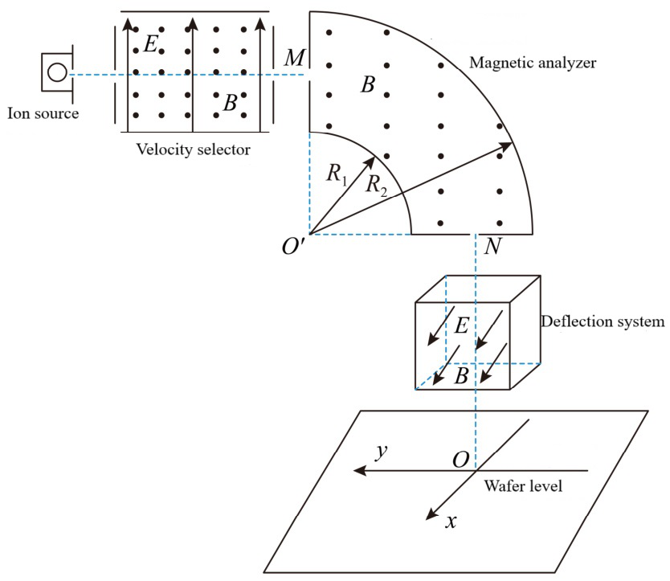
- ROI 裁剪图：[benchmarkallinone/outputs/report_priority_20/run_f2958f3118292117/datasets/physreason/artifacts/crops/prob_f7463f83338ea759accb846b_primary_roi.png](../../datasets/physreason/artifacts/crops/prob_f7463f83338ea759accb846b_primary_roi.png)

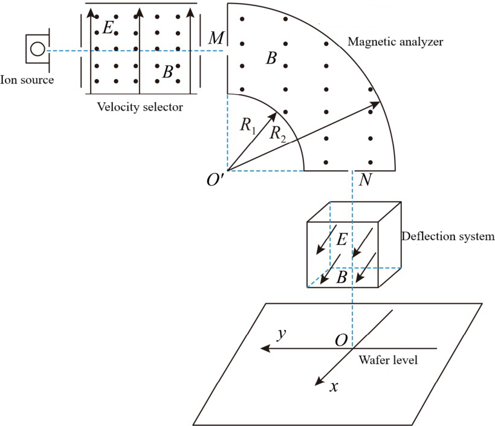

### 5) 清洗判定证据

```json
{
  "clean_score": 0.8942,
  "decision": "review",
  "decision_reason_codes": [
    "alignment_risky"
  ],
  "alignment_summary": {
    "alignment_id": "align_edce3f790f21f4a52304d1c8",
    "coverage_score": 0.9,
    "consistency_score": 0.82,
    "alignment_status": "risky",
    "conflict_count": 1
  },
  "solvability_summary": {
    "solvability_id": "solv_prob_f7463f83338ea759accb846b",
    "solvability_score": 1.0,
    "reasoning_path_exists": true,
    "decision_hint": "pass",
    "failure_codes": []
  },
  "missing_field_summary": {
    "missing_question_text": false,
    "missing_answer_text": false,
    "missing_image_count": 0
  },
  "risk_flags": [],
  "reject_record": null
}
```

