# SCEMQA：20 条采集清洗逐样本报告

- pipeline_run_id：`run_f2958f3118292117`
- 数据集 key：`scemqa`
- processed_samples：`20` / requested `20`
- 决策计数：`pass=2`，`review=0`，`reject=18`
- 改写策略计数：`{"blank_open": 11, "split_open": 9}`
- 对齐状态计数：`good:18, bad:2`
- 高频原因码：`low_resolution:17, meets_cleaning_requirements:2, missing_grounded_visual_path:2, text_image_misaligned:2`
- 占位符题面（`text/bar`）样本数：`0`
- 文本主导样本数：`0`

## 01. prob_1793b6128a17fa3b924e3e7c

- 样本文件：[benchmarkallinone/outputs/report_priority_20/run_f2958f3118292117/datasets/scemqa/samples/prob_1793b6128a17fa3b924e3e7c.json](../../datasets/scemqa/samples/prob_1793b6128a17fa3b924e3e7c.json)
- 源数据集：`SCEMQA`
- 源 split：`test`
- 源题目 ID：`17`
- 清洗路径：`multimodal_full`
- 是否文本主导：`False`
- 是否依赖图像：`True`
- 决策：`reject`
- 决策原因码：`low_resolution`
- 开放化改写策略：`split_open`
- 对齐状态：`good`
- 可解性分数：`1.0`
- 可解性提示：`pass`
- 质量风险标记：`low_resolution`

### 采集阶段信号

```json
{
  "core_asset_completeness": {
    "has_question_text": true,
    "has_answer_text": true,
    "image_count": 1,
    "has_multiple_images": false
  },
  "initial_scores": {
    "initial_image_dependency_score": 0.9,
    "initial_multi_solution_score": 0.24,
    "initial_verifiability_score": 0.8681
  }
}
```

### 1) 处理前：原始题目 / 原始答案

**原始题目**

```text
Following is a histogram of ages of people applying for a particular high-school teaching position. Which of the following statements are true?
I. The median age is between 24 and 25.
II. The mean age is between 22 and 23.
III. The mean age is greater than the median age.


```

**原始答案**

```text
2
```

### 2) 处理后：规范化题目 / 规范化答案

**规范化题目**

```text
Following is a histogram of ages of people applying for a particular high-school teaching position. Which of the following statements are true?
I. The median age is between 24 and 25.
II. The mean age is between 22 and 23.
III. The mean age is greater than the median age.
```

**规范化答案**

```text
2
```

### 3) 开放化改写前后

**改写前（使用规范化题目作为输入）**

```text
Following is a histogram of ages of people applying for a particular high-school teaching position. Which of the following statements are true?
I. The median age is between 24 and 25.
II. The mean age is between 22 and 23.
III. The mean age is greater than the median age.
```

**改写后（开放题变体）**

```text
Following is a histogram of ages of people applying for a particular high-school teaching position. Which of the following statements are true?
I. The median age is between 24 and 25.
II. The mean age is between 22 and 23.
III. The mean age is greater than the median age.
请只回答第 1 个目标量。
```

- 期望答案类型：`short_text`
- 期望答案：`2`
- 改写 rationale：`Compound choice answer was split into multiple open-ended targets.`
- 丢弃原因码：`无`

### 4) 图像与可视化产物

- 原始图像来源：`inline://pil_image`
- 持久化主图：[benchmarkallinone/outputs/report_priority_20/run_f2958f3118292117/datasets/scemqa/artifacts/images/prob_1793b6128a17fa3b924e3e7c_primary.png](../../datasets/scemqa/artifacts/images/prob_1793b6128a17fa3b924e3e7c_primary.png)

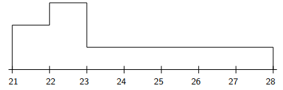
- ROI 裁剪图：[benchmarkallinone/outputs/report_priority_20/run_f2958f3118292117/datasets/scemqa/artifacts/crops/prob_1793b6128a17fa3b924e3e7c_primary_roi.png](../../datasets/scemqa/artifacts/crops/prob_1793b6128a17fa3b924e3e7c_primary_roi.png)

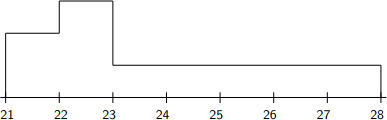

### 5) 清洗判定证据

```json
{
  "clean_score": 0.8885,
  "decision": "reject",
  "decision_reason_codes": [
    "low_resolution"
  ],
  "alignment_summary": {
    "alignment_id": "align_0ac65db6a3bed38b65955497",
    "coverage_score": 0.9,
    "consistency_score": 0.9,
    "alignment_status": "good",
    "conflict_count": 1
  },
  "solvability_summary": {
    "solvability_id": "solv_prob_1793b6128a17fa3b924e3e7c",
    "solvability_score": 1.0,
    "reasoning_path_exists": true,
    "decision_hint": "pass",
    "failure_codes": []
  },
  "missing_field_summary": {
    "missing_question_text": false,
    "missing_answer_text": false,
    "missing_image_count": 0
  },
  "risk_flags": [
    "low_resolution"
  ],
  "reject_record": {
    "reject_id": "reject_0ac65db6a3bed38b65955497",
    "problem_id": "prob_1793b6128a17fa3b924e3e7c",
    "stage": "cleaning",
    "reject_level": "problem",
    "reject_reason_codes": [
      "low_resolution"
    ],
    "reject_reason_detail": "Compound choice answer was split into multiple open-ended targets.",
    "blocking_fields": [
      "low_resolution"
    ],
    "evidence_refs": [
      "align_0ac65db6a3bed38b65955497",
      "solv_prob_1793b6128a17fa3b924e3e7c"
    ],
    "recoverable": false,
    "recommended_action": "drop",
    "reviewed_by": null,
    "created_at": "2026-03-25T08:47:18Z"
  }
}
```

---

## 02. prob_1d9eb57cc683e1341268453b

- 样本文件：[benchmarkallinone/outputs/report_priority_20/run_f2958f3118292117/datasets/scemqa/samples/prob_1d9eb57cc683e1341268453b.json](../../datasets/scemqa/samples/prob_1d9eb57cc683e1341268453b.json)
- 源数据集：`SCEMQA`
- 源 split：`test`
- 源题目 ID：`10`
- 清洗路径：`multimodal_full`
- 是否文本主导：`False`
- 是否依赖图像：`True`
- 决策：`pass`
- 决策原因码：`meets_cleaning_requirements`
- 开放化改写策略：`blank_open`
- 对齐状态：`good`
- 可解性分数：`1.0`
- 可解性提示：`pass`
- 质量风险标记：`无`

### 采集阶段信号

```json
{
  "core_asset_completeness": {
    "has_question_text": true,
    "has_answer_text": true,
    "image_count": 1,
    "has_multiple_images": false
  },
  "initial_scores": {
    "initial_image_dependency_score": 0.9,
    "initial_multi_solution_score": 0.24,
    "initial_verifiability_score": 0.8731
  }
}
```

### 1) 处理前：原始题目 / 原始答案

**原始题目**

```text
The graph of a function, $f$, is shown above. Let $h(x)$ be defined as $h(x) = (x + 1) \cdot f(x)$. Find $h'(4)$.


```

**原始答案**

```text
0
```

### 2) 处理后：规范化题目 / 规范化答案

**规范化题目**

```text
The graph of a function, $f$, is shown above. Let $h(x)$ be defined as $h(x) = (x + 1) \cdot f(x)$. Find $h'(4)$.
```

**规范化答案**

```text
0
```

### 3) 开放化改写前后

**改写前（使用规范化题目作为输入）**

```text
The graph of a function, $f$, is shown above. Let $h(x)$ be defined as $h(x) = (x + 1) \cdot f(x)$. Find $h'(4)$.
```

**改写后（开放题变体）**

```text
The graph of a function, $f$, is shown above. Let $h(x)$ be defined as $h(x) = (x + 1) \cdot f(x)$. Find $h'(4)$.
```

- 期望答案类型：`numeric`
- 期望答案：`0`
- 改写 rationale：`Converted multiple choice into blank-style open-ended question.`
- 丢弃原因码：`无`

### 4) 图像与可视化产物

- 原始图像来源：`inline://pil_image`
- 持久化主图：[benchmarkallinone/outputs/report_priority_20/run_f2958f3118292117/datasets/scemqa/artifacts/images/prob_1d9eb57cc683e1341268453b_primary.png](../../datasets/scemqa/artifacts/images/prob_1d9eb57cc683e1341268453b_primary.png)


- ROI 裁剪图：[benchmarkallinone/outputs/report_priority_20/run_f2958f3118292117/datasets/scemqa/artifacts/crops/prob_1d9eb57cc683e1341268453b_primary_roi.png](../../datasets/scemqa/artifacts/crops/prob_1d9eb57cc683e1341268453b_primary_roi.png)

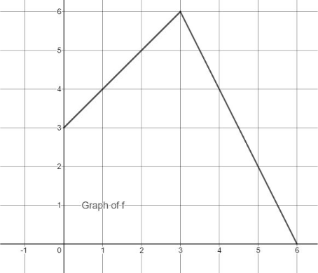

### 5) 清洗判定证据

```json
{
  "clean_score": 0.8856,
  "decision": "pass",
  "decision_reason_codes": [
    "meets_cleaning_requirements"
  ],
  "alignment_summary": {
    "alignment_id": "align_ced1cfc1f3aa62f8f5edf42d",
    "coverage_score": 0.9,
    "consistency_score": 0.98,
    "alignment_status": "good",
    "conflict_count": 0
  },
  "solvability_summary": {
    "solvability_id": "solv_prob_1d9eb57cc683e1341268453b",
    "solvability_score": 1.0,
    "reasoning_path_exists": true,
    "decision_hint": "pass",
    "failure_codes": []
  },
  "missing_field_summary": {
    "missing_question_text": false,
    "missing_answer_text": false,
    "missing_image_count": 0
  },
  "risk_flags": [],
  "reject_record": null
}
```

---

## 03. prob_24b5273bd5e0473373b6d479

- 样本文件：[benchmarkallinone/outputs/report_priority_20/run_f2958f3118292117/datasets/scemqa/samples/prob_24b5273bd5e0473373b6d479.json](../../datasets/scemqa/samples/prob_24b5273bd5e0473373b6d479.json)
- 源数据集：`SCEMQA`
- 源 split：`test`
- 源题目 ID：`14`
- 清洗路径：`multimodal_full`
- 是否文本主导：`False`
- 是否依赖图像：`True`
- 决策：`pass`
- 决策原因码：`meets_cleaning_requirements`
- 开放化改写策略：`blank_open`
- 对齐状态：`good`
- 可解性分数：`1.0`
- 可解性提示：`pass`
- 质量风险标记：`无`

### 采集阶段信号

```json
{
  "core_asset_completeness": {
    "has_question_text": true,
    "has_answer_text": true,
    "image_count": 1,
    "has_multiple_images": false
  },
  "initial_scores": {
    "initial_image_dependency_score": 0.9,
    "initial_multi_solution_score": 0.24,
    "initial_verifiability_score": 0.8659
  }
}
```

### 1) 处理前：原始题目 / 原始答案

**原始题目**

```text
The graph of $f$ is shown above. Which of the following statements is false?


```

**原始答案**

```text
0
```

### 2) 处理后：规范化题目 / 规范化答案

**规范化题目**

```text
The graph of $f$ is shown above. Which of the following statements is false?
```

**规范化答案**

```text
0
```

### 3) 开放化改写前后

**改写前（使用规范化题目作为输入）**

```text
The graph of $f$ is shown above. Which of the following statements is false?
```

**改写后（开放题变体）**

```text
The graph of $f$ is shown above. Which of the following statements is false?
```

- 期望答案类型：`numeric`
- 期望答案：`0`
- 改写 rationale：`Converted multiple choice into blank-style open-ended question.`
- 丢弃原因码：`无`

### 4) 图像与可视化产物

- 原始图像来源：`inline://pil_image`
- 持久化主图：[benchmarkallinone/outputs/report_priority_20/run_f2958f3118292117/datasets/scemqa/artifacts/images/prob_24b5273bd5e0473373b6d479_primary.png](../../datasets/scemqa/artifacts/images/prob_24b5273bd5e0473373b6d479_primary.png)

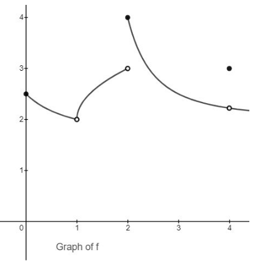
- ROI 裁剪图：[benchmarkallinone/outputs/report_priority_20/run_f2958f3118292117/datasets/scemqa/artifacts/crops/prob_24b5273bd5e0473373b6d479_primary_roi.png](../../datasets/scemqa/artifacts/crops/prob_24b5273bd5e0473373b6d479_primary_roi.png)

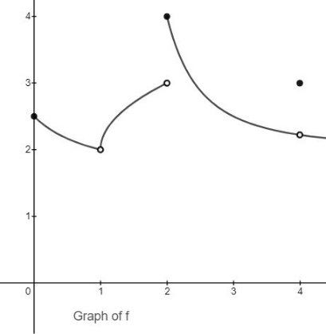

### 5) 清洗判定证据

```json
{
  "clean_score": 0.87,
  "decision": "pass",
  "decision_reason_codes": [
    "meets_cleaning_requirements"
  ],
  "alignment_summary": {
    "alignment_id": "align_f9fd11f67eeee159be329f1a",
    "coverage_score": 0.9,
    "consistency_score": 0.98,
    "alignment_status": "good",
    "conflict_count": 0
  },
  "solvability_summary": {
    "solvability_id": "solv_prob_24b5273bd5e0473373b6d479",
    "solvability_score": 1.0,
    "reasoning_path_exists": true,
    "decision_hint": "pass",
    "failure_codes": []
  },
  "missing_field_summary": {
    "missing_question_text": false,
    "missing_answer_text": false,
    "missing_image_count": 0
  },
  "risk_flags": [],
  "reject_record": null
}
```

---

## 04. prob_2c51d6bcc3e66f75a13abc12

- 样本文件：[benchmarkallinone/outputs/report_priority_20/run_f2958f3118292117/datasets/scemqa/samples/prob_2c51d6bcc3e66f75a13abc12.json](../../datasets/scemqa/samples/prob_2c51d6bcc3e66f75a13abc12.json)
- 源数据集：`SCEMQA`
- 源 split：`test`
- 源题目 ID：`5`
- 清洗路径：`multimodal_full`
- 是否文本主导：`False`
- 是否依赖图像：`True`
- 决策：`reject`
- 决策原因码：`low_resolution`
- 开放化改写策略：`blank_open`
- 对齐状态：`good`
- 可解性分数：`1.0`
- 可解性提示：`pass`
- 质量风险标记：`low_resolution`

### 采集阶段信号

```json
{
  "core_asset_completeness": {
    "has_question_text": true,
    "has_answer_text": true,
    "image_count": 1,
    "has_multiple_images": false
  },
  "initial_scores": {
    "initial_image_dependency_score": 0.9,
    "initial_multi_solution_score": 0.24,
    "initial_verifiability_score": 0.8685
  }
}
```

### 1) 处理前：原始题目 / 原始答案

**原始题目**

```text
Which of the graphs shown does the $\lim_{x \to 3} f(x)$ exist?


```

**原始答案**

```text
4
```

### 2) 处理后：规范化题目 / 规范化答案

**规范化题目**

```text
Which of the graphs shown does the $\lim_{x \to 3} f(x)$ exist?
```

**规范化答案**

```text
4
```

### 3) 开放化改写前后

**改写前（使用规范化题目作为输入）**

```text
Which of the graphs shown does the $\lim_{x \to 3} f(x)$ exist?
```

**改写后（开放题变体）**

```text
Which of the graphs shown does the $\lim_{x \to 3} f(x)$ exist?
```

- 期望答案类型：`numeric`
- 期望答案：`4`
- 改写 rationale：`Converted multiple choice into blank-style open-ended question.`
- 丢弃原因码：`无`

### 4) 图像与可视化产物

- 原始图像来源：`inline://pil_image`
- 持久化主图：[benchmarkallinone/outputs/report_priority_20/run_f2958f3118292117/datasets/scemqa/artifacts/images/prob_2c51d6bcc3e66f75a13abc12_primary.png](../../datasets/scemqa/artifacts/images/prob_2c51d6bcc3e66f75a13abc12_primary.png)

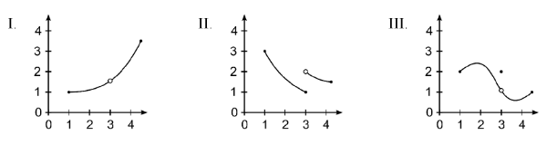
- ROI 裁剪图：[benchmarkallinone/outputs/report_priority_20/run_f2958f3118292117/datasets/scemqa/artifacts/crops/prob_2c51d6bcc3e66f75a13abc12_primary_roi.png](../../datasets/scemqa/artifacts/crops/prob_2c51d6bcc3e66f75a13abc12_primary_roi.png)

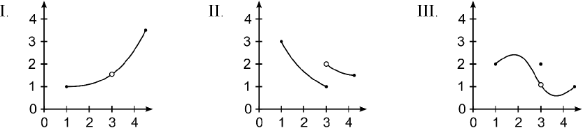

### 5) 清洗判定证据

```json
{
  "clean_score": 0.8593,
  "decision": "reject",
  "decision_reason_codes": [
    "low_resolution"
  ],
  "alignment_summary": {
    "alignment_id": "align_6698558b3afa970a2fe14ed3",
    "coverage_score": 0.9,
    "consistency_score": 0.9,
    "alignment_status": "good",
    "conflict_count": 1
  },
  "solvability_summary": {
    "solvability_id": "solv_prob_2c51d6bcc3e66f75a13abc12",
    "solvability_score": 1.0,
    "reasoning_path_exists": true,
    "decision_hint": "pass",
    "failure_codes": []
  },
  "missing_field_summary": {
    "missing_question_text": false,
    "missing_answer_text": false,
    "missing_image_count": 0
  },
  "risk_flags": [
    "low_resolution"
  ],
  "reject_record": {
    "reject_id": "reject_6698558b3afa970a2fe14ed3",
    "problem_id": "prob_2c51d6bcc3e66f75a13abc12",
    "stage": "cleaning",
    "reject_level": "problem",
    "reject_reason_codes": [
      "low_resolution"
    ],
    "reject_reason_detail": "Converted multiple choice into blank-style open-ended question.",
    "blocking_fields": [
      "low_resolution"
    ],
    "evidence_refs": [
      "align_6698558b3afa970a2fe14ed3",
      "solv_prob_2c51d6bcc3e66f75a13abc12"
    ],
    "recoverable": false,
    "recommended_action": "drop",
    "reviewed_by": null,
    "created_at": "2026-03-25T08:47:18Z"
  }
}
```

---

## 05. prob_3639107c5b51f2542e1f3084

- 样本文件：[benchmarkallinone/outputs/report_priority_20/run_f2958f3118292117/datasets/scemqa/samples/prob_3639107c5b51f2542e1f3084.json](../../datasets/scemqa/samples/prob_3639107c5b51f2542e1f3084.json)
- 源数据集：`SCEMQA`
- 源 split：`test`
- 源题目 ID：`9`
- 清洗路径：`multimodal_full`
- 是否文本主导：`False`
- 是否依赖图像：`True`
- 决策：`reject`
- 决策原因码：`low_resolution`
- 开放化改写策略：`split_open`
- 对齐状态：`good`
- 可解性分数：`1.0`
- 可解性提示：`pass`
- 质量风险标记：`low_resolution`

### 采集阶段信号

```json
{
  "core_asset_completeness": {
    "has_question_text": true,
    "has_answer_text": true,
    "image_count": 1,
    "has_multiple_images": false
  },
  "initial_scores": {
    "initial_image_dependency_score": 0.9,
    "initial_multi_solution_score": 0.42,
    "initial_verifiability_score": 0.875
  }
}
```

### 1) 处理前：原始题目 / 原始答案

**原始题目**

```text
The table above gives selected values for the twice-differentiable function f. In which of the following intervals must there be a number c such that $f'(c) = -2$.


```

**原始答案**

```text
1
```

### 2) 处理后：规范化题目 / 规范化答案

**规范化题目**

```text
The table above gives selected values for the twice-differentiable function f. In which of the following intervals must there be a number c such that $f'(c) = -2$.
```

**规范化答案**

```text
1
```

### 3) 开放化改写前后

**改写前（使用规范化题目作为输入）**

```text
The table above gives selected values for the twice-differentiable function f. In which of the following intervals must there be a number c such that $f'(c) = -2$.
```

**改写后（开放题变体）**

```text
The table above gives selected values for the twice-differentiable function f. In which of the following intervals must there be a number c such that $f'(c) = -2$.
请只回答第 1 个目标量。
```

- 期望答案类型：`short_text`
- 期望答案：`1`
- 改写 rationale：`Compound choice answer was split into multiple open-ended targets.`
- 丢弃原因码：`无`

### 4) 图像与可视化产物

- 原始图像来源：`inline://pil_image`
- 持久化主图：[benchmarkallinone/outputs/report_priority_20/run_f2958f3118292117/datasets/scemqa/artifacts/images/prob_3639107c5b51f2542e1f3084_primary.png](../../datasets/scemqa/artifacts/images/prob_3639107c5b51f2542e1f3084_primary.png)

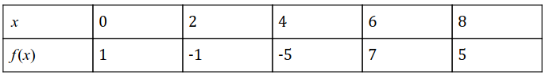
- ROI 裁剪图：[benchmarkallinone/outputs/report_priority_20/run_f2958f3118292117/datasets/scemqa/artifacts/crops/prob_3639107c5b51f2542e1f3084_primary_roi.png](../../datasets/scemqa/artifacts/crops/prob_3639107c5b51f2542e1f3084_primary_roi.png)

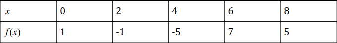

### 5) 清洗判定证据

```json
{
  "clean_score": 0.8954,
  "decision": "reject",
  "decision_reason_codes": [
    "low_resolution"
  ],
  "alignment_summary": {
    "alignment_id": "align_77b614c6d9e3662652b74aad",
    "coverage_score": 0.9,
    "consistency_score": 0.98,
    "alignment_status": "good",
    "conflict_count": 0
  },
  "solvability_summary": {
    "solvability_id": "solv_prob_3639107c5b51f2542e1f3084",
    "solvability_score": 1.0,
    "reasoning_path_exists": true,
    "decision_hint": "pass",
    "failure_codes": []
  },
  "missing_field_summary": {
    "missing_question_text": false,
    "missing_answer_text": false,
    "missing_image_count": 0
  },
  "risk_flags": [
    "low_resolution"
  ],
  "reject_record": {
    "reject_id": "reject_77b614c6d9e3662652b74aad",
    "problem_id": "prob_3639107c5b51f2542e1f3084",
    "stage": "cleaning",
    "reject_level": "problem",
    "reject_reason_codes": [
      "low_resolution"
    ],
    "reject_reason_detail": "Compound choice answer was split into multiple open-ended targets.",
    "blocking_fields": [
      "low_resolution"
    ],
    "evidence_refs": [
      "align_77b614c6d9e3662652b74aad",
      "solv_prob_3639107c5b51f2542e1f3084"
    ],
    "recoverable": false,
    "recommended_action": "drop",
    "reviewed_by": null,
    "created_at": "2026-03-25T08:47:18Z"
  }
}
```

---

## 06. prob_3d706c1156c72537399802e4

- 样本文件：[benchmarkallinone/outputs/report_priority_20/run_f2958f3118292117/datasets/scemqa/samples/prob_3d706c1156c72537399802e4.json](../../datasets/scemqa/samples/prob_3d706c1156c72537399802e4.json)
- 源数据集：`SCEMQA`
- 源 split：`test`
- 源题目 ID：`6`
- 清洗路径：`multimodal_full`
- 是否文本主导：`False`
- 是否依赖图像：`True`
- 决策：`reject`
- 决策原因码：`low_resolution`
- 开放化改写策略：`split_open`
- 对齐状态：`good`
- 可解性分数：`1.0`
- 可解性提示：`pass`
- 质量风险标记：`low_resolution`

### 采集阶段信号

```json
{
  "core_asset_completeness": {
    "has_question_text": true,
    "has_answer_text": true,
    "image_count": 1,
    "has_multiple_images": false
  },
  "initial_scores": {
    "initial_image_dependency_score": 0.9,
    "initial_multi_solution_score": 0.24,
    "initial_verifiability_score": 0.8686
  }
}
```

### 1) 处理前：原始题目 / 原始答案

**原始题目**

```text
A graph of function $f(x)$ on the interval $[-1, 4]$ is shown. Regions A, B, and C have areas of 1, 2, and 3 respectively. What is $\int_{-1}^{4} (f(x) + 2) dx$?


```

**原始答案**

```text
3
```

### 2) 处理后：规范化题目 / 规范化答案

**规范化题目**

```text
A graph of function $f(x)$ on the interval $[-1, 4]$ is shown. Regions A, B, and C have areas of 1, 2, and 3 respectively. What is $\int_{-1}^{4} (f(x) + 2) dx$?
```

**规范化答案**

```text
3
```

### 3) 开放化改写前后

**改写前（使用规范化题目作为输入）**

```text
A graph of function $f(x)$ on the interval $[-1, 4]$ is shown. Regions A, B, and C have areas of 1, 2, and 3 respectively. What is $\int_{-1}^{4} (f(x) + 2) dx$?
```

**改写后（开放题变体）**

```text
A graph of function $f(x)$ on the interval $[-1, 4]$ is shown. Regions A, B, and C have areas of 1, 2, and 3 respectively. What is $\int_{-1}^{4} (f(x) + 2) dx$?
请只回答第 1 个目标量。
```

- 期望答案类型：`short_text`
- 期望答案：`3`
- 改写 rationale：`Compound choice answer was split into multiple open-ended targets.`
- 丢弃原因码：`无`

### 4) 图像与可视化产物

- 原始图像来源：`inline://pil_image`
- 持久化主图：[benchmarkallinone/outputs/report_priority_20/run_f2958f3118292117/datasets/scemqa/artifacts/images/prob_3d706c1156c72537399802e4_primary.png](../../datasets/scemqa/artifacts/images/prob_3d706c1156c72537399802e4_primary.png)

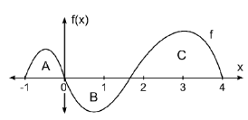
- ROI 裁剪图：[benchmarkallinone/outputs/report_priority_20/run_f2958f3118292117/datasets/scemqa/artifacts/crops/prob_3d706c1156c72537399802e4_primary_roi.png](../../datasets/scemqa/artifacts/crops/prob_3d706c1156c72537399802e4_primary_roi.png)

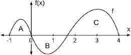

### 5) 清洗判定证据

```json
{
  "clean_score": 0.8861,
  "decision": "reject",
  "decision_reason_codes": [
    "low_resolution"
  ],
  "alignment_summary": {
    "alignment_id": "align_83c0a071ff557f2919fcb575",
    "coverage_score": 0.9,
    "consistency_score": 0.98,
    "alignment_status": "good",
    "conflict_count": 0
  },
  "solvability_summary": {
    "solvability_id": "solv_prob_3d706c1156c72537399802e4",
    "solvability_score": 1.0,
    "reasoning_path_exists": true,
    "decision_hint": "pass",
    "failure_codes": []
  },
  "missing_field_summary": {
    "missing_question_text": false,
    "missing_answer_text": false,
    "missing_image_count": 0
  },
  "risk_flags": [
    "low_resolution"
  ],
  "reject_record": {
    "reject_id": "reject_83c0a071ff557f2919fcb575",
    "problem_id": "prob_3d706c1156c72537399802e4",
    "stage": "cleaning",
    "reject_level": "problem",
    "reject_reason_codes": [
      "low_resolution"
    ],
    "reject_reason_detail": "Compound choice answer was split into multiple open-ended targets.",
    "blocking_fields": [
      "low_resolution"
    ],
    "evidence_refs": [
      "align_83c0a071ff557f2919fcb575",
      "solv_prob_3d706c1156c72537399802e4"
    ],
    "recoverable": false,
    "recommended_action": "drop",
    "reviewed_by": null,
    "created_at": "2026-03-25T08:47:18Z"
  }
}
```

---

## 07. prob_4e6fe4820447d4d8636523b5

- 样本文件：[benchmarkallinone/outputs/report_priority_20/run_f2958f3118292117/datasets/scemqa/samples/prob_4e6fe4820447d4d8636523b5.json](../../datasets/scemqa/samples/prob_4e6fe4820447d4d8636523b5.json)
- 源数据集：`SCEMQA`
- 源 split：`test`
- 源题目 ID：`16`
- 清洗路径：`multimodal_full`
- 是否文本主导：`False`
- 是否依赖图像：`True`
- 决策：`reject`
- 决策原因码：`low_resolution`
- 开放化改写策略：`blank_open`
- 对齐状态：`good`
- 可解性分数：`1.0`
- 可解性提示：`pass`
- 质量风险标记：`low_resolution`

### 采集阶段信号

```json
{
  "core_asset_completeness": {
    "has_question_text": true,
    "has_answer_text": true,
    "image_count": 1,
    "has_multiple_images": false
  },
  "initial_scores": {
    "initial_image_dependency_score": 0.9,
    "initial_multi_solution_score": 0.24,
    "initial_verifiability_score": 0.8705
  }
}
```

### 1) 处理前：原始题目 / 原始答案

**原始题目**

```text
The graph below shows cumulative proportions plotted against land values (in dollars per acre) for farms on sale in a rural community. What is the median land value?


```

**原始答案**

```text
0
```

### 2) 处理后：规范化题目 / 规范化答案

**规范化题目**

```text
The graph below shows cumulative proportions plotted against land values (in dollars per acre) for farms on sale in a rural community. What is the median land value?
```

**规范化答案**

```text
0
```

### 3) 开放化改写前后

**改写前（使用规范化题目作为输入）**

```text
The graph below shows cumulative proportions plotted against land values (in dollars per acre) for farms on sale in a rural community. What is the median land value?
```

**改写后（开放题变体）**

```text
The graph below shows cumulative proportions plotted against land values (in dollars per acre) for farms on sale in a rural community. What is the median land value?
```

- 期望答案类型：`numeric`
- 期望答案：`0`
- 改写 rationale：`Converted multiple choice into blank-style open-ended question.`
- 丢弃原因码：`无`

### 4) 图像与可视化产物

- 原始图像来源：`inline://pil_image`
- 持久化主图：[benchmarkallinone/outputs/report_priority_20/run_f2958f3118292117/datasets/scemqa/artifacts/images/prob_4e6fe4820447d4d8636523b5_primary.png](../../datasets/scemqa/artifacts/images/prob_4e6fe4820447d4d8636523b5_primary.png)

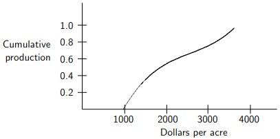
- ROI 裁剪图：[benchmarkallinone/outputs/report_priority_20/run_f2958f3118292117/datasets/scemqa/artifacts/crops/prob_4e6fe4820447d4d8636523b5_primary_roi.png](../../datasets/scemqa/artifacts/crops/prob_4e6fe4820447d4d8636523b5_primary_roi.png)

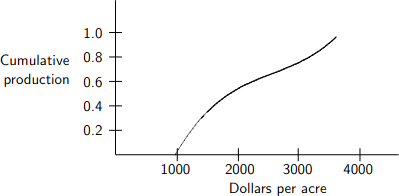

### 5) 清洗判定证据

```json
{
  "clean_score": 0.8894,
  "decision": "reject",
  "decision_reason_codes": [
    "low_resolution"
  ],
  "alignment_summary": {
    "alignment_id": "align_efcb09527b8e0d883a4f320f",
    "coverage_score": 0.9,
    "consistency_score": 0.98,
    "alignment_status": "good",
    "conflict_count": 0
  },
  "solvability_summary": {
    "solvability_id": "solv_prob_4e6fe4820447d4d8636523b5",
    "solvability_score": 1.0,
    "reasoning_path_exists": true,
    "decision_hint": "pass",
    "failure_codes": []
  },
  "missing_field_summary": {
    "missing_question_text": false,
    "missing_answer_text": false,
    "missing_image_count": 0
  },
  "risk_flags": [
    "low_resolution"
  ],
  "reject_record": {
    "reject_id": "reject_efcb09527b8e0d883a4f320f",
    "problem_id": "prob_4e6fe4820447d4d8636523b5",
    "stage": "cleaning",
    "reject_level": "problem",
    "reject_reason_codes": [
      "low_resolution"
    ],
    "reject_reason_detail": "Converted multiple choice into blank-style open-ended question.",
    "blocking_fields": [
      "low_resolution"
    ],
    "evidence_refs": [
      "align_efcb09527b8e0d883a4f320f",
      "solv_prob_4e6fe4820447d4d8636523b5"
    ],
    "recoverable": false,
    "recommended_action": "drop",
    "reviewed_by": null,
    "created_at": "2026-03-25T08:47:18Z"
  }
}
```

---

## 08. prob_5a1030536aced4a21bef1ddb

- 样本文件：[benchmarkallinone/outputs/report_priority_20/run_f2958f3118292117/datasets/scemqa/samples/prob_5a1030536aced4a21bef1ddb.json](../../datasets/scemqa/samples/prob_5a1030536aced4a21bef1ddb.json)
- 源数据集：`SCEMQA`
- 源 split：`test`
- 源题目 ID：`2`
- 清洗路径：`multimodal_full`
- 是否文本主导：`False`
- 是否依赖图像：`True`
- 决策：`reject`
- 决策原因码：`low_resolution`
- 开放化改写策略：`blank_open`
- 对齐状态：`good`
- 可解性分数：`1.0`
- 可解性提示：`pass`
- 质量风险标记：`low_resolution`

### 采集阶段信号

```json
{
  "core_asset_completeness": {
    "has_question_text": true,
    "has_answer_text": true,
    "image_count": 1,
    "has_multiple_images": false
  },
  "initial_scores": {
    "initial_image_dependency_score": 0.9,
    "initial_multi_solution_score": 0.24,
    "initial_verifiability_score": 0.8685
  }
}
```

### 1) 处理前：原始题目 / 原始答案

**原始题目**

```text
Shown is a graph of $f''$, the second derivative of function $f$. The curve is given by the equation $f'' = (x - a)^2 (x - d)$. The graph of $f$ has inflection points at which values of $x$?


```

**原始答案**

```text
4
```

### 2) 处理后：规范化题目 / 规范化答案

**规范化题目**

```text
Shown is a graph of $f''$, the second derivative of function $f$. The curve is given by the equation $f'' = (x - a)^2 (x - d)$. The graph of $f$ has inflection points at which values of $x$?
```

**规范化答案**

```text
4
```

### 3) 开放化改写前后

**改写前（使用规范化题目作为输入）**

```text
Shown is a graph of $f''$, the second derivative of function $f$. The curve is given by the equation $f'' = (x - a)^2 (x - d)$. The graph of $f$ has inflection points at which values of $x$?
```

**改写后（开放题变体）**

```text
Shown is a graph of $f''$, the second derivative of function $f$. The curve is given by the equation $f'' = (x - a)^2 (x - d)$. The graph of $f$ has inflection points at which values of $x$?
```

- 期望答案类型：`numeric`
- 期望答案：`4`
- 改写 rationale：`Converted multiple choice into blank-style open-ended question.`
- 丢弃原因码：`无`

### 4) 图像与可视化产物

- 原始图像来源：`inline://pil_image`
- 持久化主图：[benchmarkallinone/outputs/report_priority_20/run_f2958f3118292117/datasets/scemqa/artifacts/images/prob_5a1030536aced4a21bef1ddb_primary.png](../../datasets/scemqa/artifacts/images/prob_5a1030536aced4a21bef1ddb_primary.png)

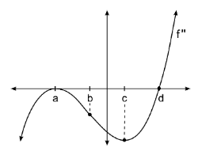
- ROI 裁剪图：[benchmarkallinone/outputs/report_priority_20/run_f2958f3118292117/datasets/scemqa/artifacts/crops/prob_5a1030536aced4a21bef1ddb_primary_roi.png](../../datasets/scemqa/artifacts/crops/prob_5a1030536aced4a21bef1ddb_primary_roi.png)

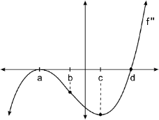

### 5) 清洗判定证据

```json
{
  "clean_score": 0.89,
  "decision": "reject",
  "decision_reason_codes": [
    "low_resolution"
  ],
  "alignment_summary": {
    "alignment_id": "align_5e256833f914c1e1a1d5bf5f",
    "coverage_score": 0.9,
    "consistency_score": 0.98,
    "alignment_status": "good",
    "conflict_count": 0
  },
  "solvability_summary": {
    "solvability_id": "solv_prob_5a1030536aced4a21bef1ddb",
    "solvability_score": 1.0,
    "reasoning_path_exists": true,
    "decision_hint": "pass",
    "failure_codes": []
  },
  "missing_field_summary": {
    "missing_question_text": false,
    "missing_answer_text": false,
    "missing_image_count": 0
  },
  "risk_flags": [
    "low_resolution"
  ],
  "reject_record": {
    "reject_id": "reject_5e256833f914c1e1a1d5bf5f",
    "problem_id": "prob_5a1030536aced4a21bef1ddb",
    "stage": "cleaning",
    "reject_level": "problem",
    "reject_reason_codes": [
      "low_resolution"
    ],
    "reject_reason_detail": "Converted multiple choice into blank-style open-ended question.",
    "blocking_fields": [
      "low_resolution"
    ],
    "evidence_refs": [
      "align_5e256833f914c1e1a1d5bf5f",
      "solv_prob_5a1030536aced4a21bef1ddb"
    ],
    "recoverable": false,
    "recommended_action": "drop",
    "reviewed_by": null,
    "created_at": "2026-03-25T08:47:18Z"
  }
}
```

---

## 09. prob_7bb85de12ecef424ef62b739

- 样本文件：[benchmarkallinone/outputs/report_priority_20/run_f2958f3118292117/datasets/scemqa/samples/prob_7bb85de12ecef424ef62b739.json](../../datasets/scemqa/samples/prob_7bb85de12ecef424ef62b739.json)
- 源数据集：`SCEMQA`
- 源 split：`test`
- 源题目 ID：`11`
- 清洗路径：`multimodal_full`
- 是否文本主导：`False`
- 是否依赖图像：`True`
- 决策：`reject`
- 决策原因码：`low_resolution`
- 开放化改写策略：`split_open`
- 对齐状态：`good`
- 可解性分数：`1.0`
- 可解性提示：`pass`
- 质量风险标记：`low_resolution`

### 采集阶段信号

```json
{
  "core_asset_completeness": {
    "has_question_text": true,
    "has_answer_text": true,
    "image_count": 1,
    "has_multiple_images": false
  },
  "initial_scores": {
    "initial_image_dependency_score": 0.9,
    "initial_multi_solution_score": 0.42,
    "initial_verifiability_score": 0.8773
  }
}
```

### 1) 处理前：原始题目 / 原始答案

**原始题目**

```text
Two differentiable functions, $f$ and $g$ have the property that $f(x) \geq g(x)$ for all real numbers and form a closed region $R$ that is bounded from $x = 1$ to $x = 7$. Selected values of $f$ and $g$ are in the table above. Estimate the area between the curves $f$ and $g$ between $x = 1$ and $x = 7$ using a Right Riemann sum with the three sub-intervals given in the table.


```

**原始答案**

```text
1
```

### 2) 处理后：规范化题目 / 规范化答案

**规范化题目**

```text
Two differentiable functions, $f$ and $g$ have the property that $f(x) \geq g(x)$ for all real numbers and form a closed region $R$ that is bounded from $x = 1$ to $x = 7$. Selected values of $f$ and $g$ are in the table above. Estimate the area between the curves $f$ and $g$ between $x = 1$ and $x = 7$ using a Right Riemann sum with the three sub-intervals given in the table.
```

**规范化答案**

```text
1
```

### 3) 开放化改写前后

**改写前（使用规范化题目作为输入）**

```text
Two differentiable functions, $f$ and $g$ have the property that $f(x) \geq g(x)$ for all real numbers and form a closed region $R$ that is bounded from $x = 1$ to $x = 7$. Selected values of $f$ and $g$ are in the table above. Estimate the area between the curves $f$ and $g$ between $x = 1$ and $x = 7$ using a Right Riemann sum with the three sub-intervals given in the table.
```

**改写后（开放题变体）**

```text
Two differentiable functions, $f$ and $g$ have the property that $f(x) \geq g(x)$ for all real numbers and form a closed region $R$ that is bounded from $x = 1$ to $x = 7$. Selected values of $f$ and $g$ are in the table above. Estimate the area between the curves $f$ and $g$ between $x = 1$ and $x = 7$ using a Right Riemann sum with the three sub-intervals given in the table.
请只回答第 1 个目标量。
```

- 期望答案类型：`short_text`
- 期望答案：`1`
- 改写 rationale：`Compound choice answer was split into multiple open-ended targets.`
- 丢弃原因码：`无`

### 4) 图像与可视化产物

- 原始图像来源：`inline://pil_image`
- 持久化主图：[benchmarkallinone/outputs/report_priority_20/run_f2958f3118292117/datasets/scemqa/artifacts/images/prob_7bb85de12ecef424ef62b739_primary.png](../../datasets/scemqa/artifacts/images/prob_7bb85de12ecef424ef62b739_primary.png)

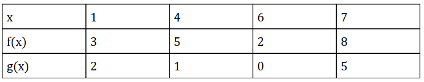
- ROI 裁剪图：[benchmarkallinone/outputs/report_priority_20/run_f2958f3118292117/datasets/scemqa/artifacts/crops/prob_7bb85de12ecef424ef62b739_primary_roi.png](../../datasets/scemqa/artifacts/crops/prob_7bb85de12ecef424ef62b739_primary_roi.png)

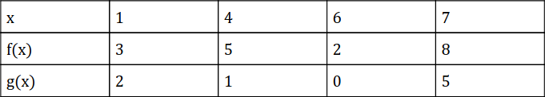

### 5) 清洗判定证据

```json
{
  "clean_score": 0.9155,
  "decision": "reject",
  "decision_reason_codes": [
    "low_resolution"
  ],
  "alignment_summary": {
    "alignment_id": "align_8481378253246b2f86217dc0",
    "coverage_score": 0.9,
    "consistency_score": 0.98,
    "alignment_status": "good",
    "conflict_count": 0
  },
  "solvability_summary": {
    "solvability_id": "solv_prob_7bb85de12ecef424ef62b739",
    "solvability_score": 1.0,
    "reasoning_path_exists": true,
    "decision_hint": "pass",
    "failure_codes": []
  },
  "missing_field_summary": {
    "missing_question_text": false,
    "missing_answer_text": false,
    "missing_image_count": 0
  },
  "risk_flags": [
    "low_resolution"
  ],
  "reject_record": {
    "reject_id": "reject_8481378253246b2f86217dc0",
    "problem_id": "prob_7bb85de12ecef424ef62b739",
    "stage": "cleaning",
    "reject_level": "problem",
    "reject_reason_codes": [
      "low_resolution"
    ],
    "reject_reason_detail": "Compound choice answer was split into multiple open-ended targets.",
    "blocking_fields": [
      "low_resolution"
    ],
    "evidence_refs": [
      "align_8481378253246b2f86217dc0",
      "solv_prob_7bb85de12ecef424ef62b739"
    ],
    "recoverable": false,
    "recommended_action": "drop",
    "reviewed_by": null,
    "created_at": "2026-03-25T08:47:18Z"
  }
}
```

---

## 10. prob_7df57e918ef35dfcbb2e8be5

- 样本文件：[benchmarkallinone/outputs/report_priority_20/run_f2958f3118292117/datasets/scemqa/samples/prob_7df57e918ef35dfcbb2e8be5.json](../../datasets/scemqa/samples/prob_7df57e918ef35dfcbb2e8be5.json)
- 源数据集：`SCEMQA`
- 源 split：`test`
- 源题目 ID：`15`
- 清洗路径：`multimodal_full`
- 是否文本主导：`False`
- 是否依赖图像：`True`
- 决策：`reject`
- 决策原因码：`low_resolution`
- 开放化改写策略：`split_open`
- 对齐状态：`good`
- 可解性分数：`1.0`
- 可解性提示：`pass`
- 质量风险标记：`low_resolution`

### 采集阶段信号

```json
{
  "core_asset_completeness": {
    "has_question_text": true,
    "has_answer_text": true,
    "image_count": 1,
    "has_multiple_images": false
  },
  "initial_scores": {
    "initial_image_dependency_score": 0.9,
    "initial_multi_solution_score": 0.24,
    "initial_verifiability_score": 0.8773
  }
}
```

### 1) 处理前：原始题目 / 原始答案

**原始题目**

```text
Consider the following back-to-back stemplot:
Which of the following are true statements?
I. The distributions have the same mean.
II. The distributions have the same range.
III. The distributions have the same standard deviation.


```

**原始答案**

```text
3
```

### 2) 处理后：规范化题目 / 规范化答案

**规范化题目**

```text
Consider the following back-to-back stemplot:
Which of the following are true statements?
I. The distributions have the same mean.
II. The distributions have the same range.
III. The distributions have the same standard deviation.
```

**规范化答案**

```text
3
```

### 3) 开放化改写前后

**改写前（使用规范化题目作为输入）**

```text
Consider the following back-to-back stemplot:
Which of the following are true statements?
I. The distributions have the same mean.
II. The distributions have the same range.
III. The distributions have the same standard deviation.
```

**改写后（开放题变体）**

```text
Consider the following back-to-back stemplot:
Which of the following are true statements?
I. The distributions have the same mean.
II. The distributions have the same range.
III. The distributions have the same standard deviation.
请只回答第 1 个目标量。
```

- 期望答案类型：`short_text`
- 期望答案：`3`
- 改写 rationale：`Compound choice answer was split into multiple open-ended targets.`
- 丢弃原因码：`无`

### 4) 图像与可视化产物

- 原始图像来源：`inline://pil_image`
- 持久化主图：[benchmarkallinone/outputs/report_priority_20/run_f2958f3118292117/datasets/scemqa/artifacts/images/prob_7df57e918ef35dfcbb2e8be5_primary.png](../../datasets/scemqa/artifacts/images/prob_7df57e918ef35dfcbb2e8be5_primary.png)

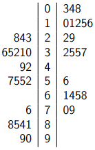
- ROI 裁剪图：[benchmarkallinone/outputs/report_priority_20/run_f2958f3118292117/datasets/scemqa/artifacts/crops/prob_7df57e918ef35dfcbb2e8be5_primary_roi.png](../../datasets/scemqa/artifacts/crops/prob_7df57e918ef35dfcbb2e8be5_primary_roi.png)

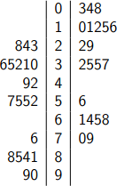

### 5) 清洗判定证据

```json
{
  "clean_score": 0.8958,
  "decision": "reject",
  "decision_reason_codes": [
    "low_resolution"
  ],
  "alignment_summary": {
    "alignment_id": "align_b005274c1e56542c2ee0caff",
    "coverage_score": 0.9,
    "consistency_score": 0.9,
    "alignment_status": "good",
    "conflict_count": 1
  },
  "solvability_summary": {
    "solvability_id": "solv_prob_7df57e918ef35dfcbb2e8be5",
    "solvability_score": 1.0,
    "reasoning_path_exists": true,
    "decision_hint": "pass",
    "failure_codes": []
  },
  "missing_field_summary": {
    "missing_question_text": false,
    "missing_answer_text": false,
    "missing_image_count": 0
  },
  "risk_flags": [
    "low_resolution"
  ],
  "reject_record": {
    "reject_id": "reject_b005274c1e56542c2ee0caff",
    "problem_id": "prob_7df57e918ef35dfcbb2e8be5",
    "stage": "cleaning",
    "reject_level": "problem",
    "reject_reason_codes": [
      "low_resolution"
    ],
    "reject_reason_detail": "Compound choice answer was split into multiple open-ended targets.",
    "blocking_fields": [
      "low_resolution"
    ],
    "evidence_refs": [
      "align_b005274c1e56542c2ee0caff",
      "solv_prob_7df57e918ef35dfcbb2e8be5"
    ],
    "recoverable": false,
    "recommended_action": "drop",
    "reviewed_by": null,
    "created_at": "2026-03-25T08:47:18Z"
  }
}
```

---

## 11. prob_80511fe3dbb76971a8d87952

- 样本文件：[benchmarkallinone/outputs/report_priority_20/run_f2958f3118292117/datasets/scemqa/samples/prob_80511fe3dbb76971a8d87952.json](../../datasets/scemqa/samples/prob_80511fe3dbb76971a8d87952.json)
- 源数据集：`SCEMQA`
- 源 split：`test`
- 源题目 ID：`0`
- 清洗路径：`multimodal_full`
- 是否文本主导：`False`
- 是否依赖图像：`True`
- 决策：`reject`
- 决策原因码：`low_resolution, missing_grounded_visual_path, text_image_misaligned`
- 开放化改写策略：`blank_open`
- 对齐状态：`bad`
- 可解性分数：`0.8`
- 可解性提示：`reject`
- 质量风险标记：`low_resolution`

### 采集阶段信号

```json
{
  "core_asset_completeness": {
    "has_question_text": true,
    "has_answer_text": true,
    "image_count": 1,
    "has_multiple_images": false
  },
  "initial_scores": {
    "initial_image_dependency_score": 0.9,
    "initial_multi_solution_score": 0.42,
    "initial_verifiability_score": 0.8721
  }
}
```

### 1) 处理前：原始题目 / 原始答案

**原始题目**

```text
At which value of x is f continuous but not differentiable?


```

**原始答案**

```text
3
```

### 2) 处理后：规范化题目 / 规范化答案

**规范化题目**

```text
At which value of x is f continuous but not differentiable?
```

**规范化答案**

```text
3
```

### 3) 开放化改写前后

**改写前（使用规范化题目作为输入）**

```text
At which value of x is f continuous but not differentiable?
```

**改写后（开放题变体）**

```text
At which value of x is f continuous but not differentiable?
```

- 期望答案类型：`numeric`
- 期望答案：`3`
- 改写 rationale：`Converted multiple choice into blank-style open-ended question.`
- 丢弃原因码：`无`

### 4) 图像与可视化产物

- 原始图像来源：`inline://pil_image`
- 持久化主图：[benchmarkallinone/outputs/report_priority_20/run_f2958f3118292117/datasets/scemqa/artifacts/images/prob_80511fe3dbb76971a8d87952_primary.png](../../datasets/scemqa/artifacts/images/prob_80511fe3dbb76971a8d87952_primary.png)

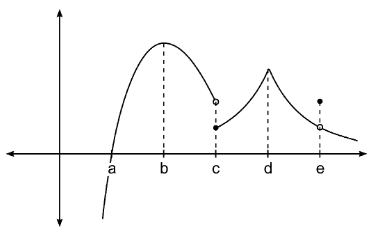
- ROI 裁剪图：[benchmarkallinone/outputs/report_priority_20/run_f2958f3118292117/datasets/scemqa/artifacts/crops/prob_80511fe3dbb76971a8d87952_primary_roi.png](../../datasets/scemqa/artifacts/crops/prob_80511fe3dbb76971a8d87952_primary_roi.png)

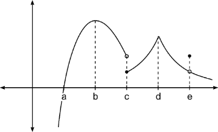

### 5) 清洗判定证据

```json
{
  "clean_score": 0.7079,
  "decision": "reject",
  "decision_reason_codes": [
    "low_resolution",
    "missing_grounded_visual_path",
    "text_image_misaligned"
  ],
  "alignment_summary": {
    "alignment_id": "align_e17d88c6ed8a2966eea7ff02",
    "coverage_score": 0.18,
    "consistency_score": 0.1,
    "alignment_status": "bad",
    "conflict_count": 1
  },
  "solvability_summary": {
    "solvability_id": "solv_prob_80511fe3dbb76971a8d87952",
    "solvability_score": 0.8,
    "reasoning_path_exists": false,
    "decision_hint": "reject",
    "failure_codes": [
      "missing_grounded_visual_path"
    ]
  },
  "missing_field_summary": {
    "missing_question_text": false,
    "missing_answer_text": false,
    "missing_image_count": 0
  },
  "risk_flags": [
    "low_resolution"
  ],
  "reject_record": {
    "reject_id": "reject_e17d88c6ed8a2966eea7ff02",
    "problem_id": "prob_80511fe3dbb76971a8d87952",
    "stage": "cleaning",
    "reject_level": "problem",
    "reject_reason_codes": [
      "low_resolution",
      "missing_grounded_visual_path",
      "text_image_misaligned"
    ],
    "reject_reason_detail": "Converted multiple choice into blank-style open-ended question.",
    "blocking_fields": [
      "low_resolution"
    ],
    "evidence_refs": [
      "align_e17d88c6ed8a2966eea7ff02",
      "solv_prob_80511fe3dbb76971a8d87952"
    ],
    "recoverable": false,
    "recommended_action": "drop",
    "reviewed_by": null,
    "created_at": "2026-03-25T08:47:18Z"
  }
}
```

---

## 12. prob_8daa573007ea28757e433f93

- 样本文件：[benchmarkallinone/outputs/report_priority_20/run_f2958f3118292117/datasets/scemqa/samples/prob_8daa573007ea28757e433f93.json](../../datasets/scemqa/samples/prob_8daa573007ea28757e433f93.json)
- 源数据集：`SCEMQA`
- 源 split：`test`
- 源题目 ID：`13`
- 清洗路径：`multimodal_full`
- 是否文本主导：`False`
- 是否依赖图像：`True`
- 决策：`reject`
- 决策原因码：`low_resolution`
- 开放化改写策略：`split_open`
- 对齐状态：`good`
- 可解性分数：`1.0`
- 可解性提示：`pass`
- 质量风险标记：`low_resolution`

### 采集阶段信号

```json
{
  "core_asset_completeness": {
    "has_question_text": true,
    "has_answer_text": true,
    "image_count": 1,
    "has_multiple_images": false
  },
  "initial_scores": {
    "initial_image_dependency_score": 0.9,
    "initial_multi_solution_score": 0.24,
    "initial_verifiability_score": 0.8634
  }
}
```

### 1) 处理前：原始题目 / 原始答案

**原始题目**

```text
The function $f$ is continuous on the closed interval $[-2,2]$. The graph of $f'$, the derivative of $f$, is shown above. On which interval(s) is $f(x)$ increasing?


```

**原始答案**

```text
2
```

### 2) 处理后：规范化题目 / 规范化答案

**规范化题目**

```text
The function $f$ is continuous on the closed interval $[-2,2]$. The graph of $f'$, the derivative of $f$, is shown above. On which interval(s) is $f(x)$ increasing?
```

**规范化答案**

```text
2
```

### 3) 开放化改写前后

**改写前（使用规范化题目作为输入）**

```text
The function $f$ is continuous on the closed interval $[-2,2]$. The graph of $f'$, the derivative of $f$, is shown above. On which interval(s) is $f(x)$ increasing?
```

**改写后（开放题变体）**

```text
The function $f$ is continuous on the closed interval $[-2,2]$. The graph of $f'$, the derivative of $f$, is shown above. On which interval(s) is $f(x)$ increasing?
请只回答第 1 个目标量。
```

- 期望答案类型：`short_text`
- 期望答案：`2`
- 改写 rationale：`Compound choice answer was split into multiple open-ended targets.`
- 丢弃原因码：`无`

### 4) 图像与可视化产物

- 原始图像来源：`inline://pil_image`
- 持久化主图：[benchmarkallinone/outputs/report_priority_20/run_f2958f3118292117/datasets/scemqa/artifacts/images/prob_8daa573007ea28757e433f93_primary.png](../../datasets/scemqa/artifacts/images/prob_8daa573007ea28757e433f93_primary.png)

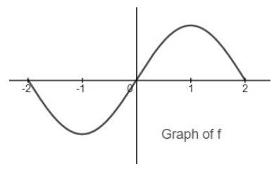
- ROI 裁剪图：[benchmarkallinone/outputs/report_priority_20/run_f2958f3118292117/datasets/scemqa/artifacts/crops/prob_8daa573007ea28757e433f93_primary_roi.png](../../datasets/scemqa/artifacts/crops/prob_8daa573007ea28757e433f93_primary_roi.png)

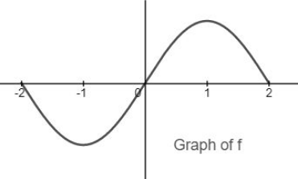

### 5) 清洗判定证据

```json
{
  "clean_score": 0.879,
  "decision": "reject",
  "decision_reason_codes": [
    "low_resolution"
  ],
  "alignment_summary": {
    "alignment_id": "align_74937d5fdb34127f8bac147f",
    "coverage_score": 0.9,
    "consistency_score": 0.98,
    "alignment_status": "good",
    "conflict_count": 0
  },
  "solvability_summary": {
    "solvability_id": "solv_prob_8daa573007ea28757e433f93",
    "solvability_score": 1.0,
    "reasoning_path_exists": true,
    "decision_hint": "pass",
    "failure_codes": []
  },
  "missing_field_summary": {
    "missing_question_text": false,
    "missing_answer_text": false,
    "missing_image_count": 0
  },
  "risk_flags": [
    "low_resolution"
  ],
  "reject_record": {
    "reject_id": "reject_74937d5fdb34127f8bac147f",
    "problem_id": "prob_8daa573007ea28757e433f93",
    "stage": "cleaning",
    "reject_level": "problem",
    "reject_reason_codes": [
      "low_resolution"
    ],
    "reject_reason_detail": "Compound choice answer was split into multiple open-ended targets.",
    "blocking_fields": [
      "low_resolution"
    ],
    "evidence_refs": [
      "align_74937d5fdb34127f8bac147f",
      "solv_prob_8daa573007ea28757e433f93"
    ],
    "recoverable": false,
    "recommended_action": "drop",
    "reviewed_by": null,
    "created_at": "2026-03-25T08:47:18Z"
  }
}
```

---

## 13. prob_90d45a1806756f769f311ab0

- 样本文件：[benchmarkallinone/outputs/report_priority_20/run_f2958f3118292117/datasets/scemqa/samples/prob_90d45a1806756f769f311ab0.json](../../datasets/scemqa/samples/prob_90d45a1806756f769f311ab0.json)
- 源数据集：`SCEMQA`
- 源 split：`test`
- 源题目 ID：`4`
- 清洗路径：`multimodal_full`
- 是否文本主导：`False`
- 是否依赖图像：`True`
- 决策：`reject`
- 决策原因码：`low_resolution`
- 开放化改写策略：`blank_open`
- 对齐状态：`good`
- 可解性分数：`1.0`
- 可解性提示：`pass`
- 质量风险标记：`low_resolution`

### 采集阶段信号

```json
{
  "core_asset_completeness": {
    "has_question_text": true,
    "has_answer_text": true,
    "image_count": 1,
    "has_multiple_images": false
  },
  "initial_scores": {
    "initial_image_dependency_score": 0.9,
    "initial_multi_solution_score": 0.24,
    "initial_verifiability_score": 0.8685
  }
}
```

### 1) 处理前：原始题目 / 原始答案

**原始题目**

```text
Shown is a graph of $f'$, the derivative of function $f$. Which of the following statements is true?


```

**原始答案**

```text
3
```

### 2) 处理后：规范化题目 / 规范化答案

**规范化题目**

```text
Shown is a graph of $f'$, the derivative of function $f$. Which of the following statements is true?
```

**规范化答案**

```text
3
```

### 3) 开放化改写前后

**改写前（使用规范化题目作为输入）**

```text
Shown is a graph of $f'$, the derivative of function $f$. Which of the following statements is true?
```

**改写后（开放题变体）**

```text
Shown is a graph of $f'$, the derivative of function $f$. Which of the following statements is true?
```

- 期望答案类型：`numeric`
- 期望答案：`3`
- 改写 rationale：`Converted multiple choice into blank-style open-ended question.`
- 丢弃原因码：`无`

### 4) 图像与可视化产物

- 原始图像来源：`inline://pil_image`
- 持久化主图：[benchmarkallinone/outputs/report_priority_20/run_f2958f3118292117/datasets/scemqa/artifacts/images/prob_90d45a1806756f769f311ab0_primary.png](../../datasets/scemqa/artifacts/images/prob_90d45a1806756f769f311ab0_primary.png)

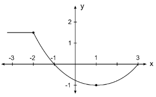
- ROI 裁剪图：[benchmarkallinone/outputs/report_priority_20/run_f2958f3118292117/datasets/scemqa/artifacts/crops/prob_90d45a1806756f769f311ab0_primary_roi.png](../../datasets/scemqa/artifacts/crops/prob_90d45a1806756f769f311ab0_primary_roi.png)

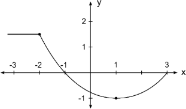

### 5) 清洗判定证据

```json
{
  "clean_score": 0.8772,
  "decision": "reject",
  "decision_reason_codes": [
    "low_resolution"
  ],
  "alignment_summary": {
    "alignment_id": "align_dd54ae43aca8903cdc094c21",
    "coverage_score": 0.9,
    "consistency_score": 0.98,
    "alignment_status": "good",
    "conflict_count": 0
  },
  "solvability_summary": {
    "solvability_id": "solv_prob_90d45a1806756f769f311ab0",
    "solvability_score": 1.0,
    "reasoning_path_exists": true,
    "decision_hint": "pass",
    "failure_codes": []
  },
  "missing_field_summary": {
    "missing_question_text": false,
    "missing_answer_text": false,
    "missing_image_count": 0
  },
  "risk_flags": [
    "low_resolution"
  ],
  "reject_record": {
    "reject_id": "reject_dd54ae43aca8903cdc094c21",
    "problem_id": "prob_90d45a1806756f769f311ab0",
    "stage": "cleaning",
    "reject_level": "problem",
    "reject_reason_codes": [
      "low_resolution"
    ],
    "reject_reason_detail": "Converted multiple choice into blank-style open-ended question.",
    "blocking_fields": [
      "low_resolution"
    ],
    "evidence_refs": [
      "align_dd54ae43aca8903cdc094c21",
      "solv_prob_90d45a1806756f769f311ab0"
    ],
    "recoverable": false,
    "recommended_action": "drop",
    "reviewed_by": null,
    "created_at": "2026-03-25T08:47:18Z"
  }
}
```

---

## 14. prob_924bc13c6b523d35d09ac9c1

- 样本文件：[benchmarkallinone/outputs/report_priority_20/run_f2958f3118292117/datasets/scemqa/samples/prob_924bc13c6b523d35d09ac9c1.json](../../datasets/scemqa/samples/prob_924bc13c6b523d35d09ac9c1.json)
- 源数据集：`SCEMQA`
- 源 split：`test`
- 源题目 ID：`7`
- 清洗路径：`multimodal_full`
- 是否文本主导：`False`
- 是否依赖图像：`True`
- 决策：`reject`
- 决策原因码：`missing_grounded_visual_path, text_image_misaligned`
- 开放化改写策略：`blank_open`
- 对齐状态：`bad`
- 可解性分数：`0.8`
- 可解性提示：`reject`
- 质量风险标记：`无`

### 采集阶段信号

```json
{
  "core_asset_completeness": {
    "has_question_text": true,
    "has_answer_text": true,
    "image_count": 1,
    "has_multiple_images": false
  },
  "initial_scores": {
    "initial_image_dependency_score": 0.9,
    "initial_multi_solution_score": 0.42,
    "initial_verifiability_score": 0.8724
  }
}
```

### 1) 处理前：原始题目 / 原始答案

**原始题目**

```text
Shown above is a slope field for which of the following differential equations?


```

**原始答案**

```text
2
```

### 2) 处理后：规范化题目 / 规范化答案

**规范化题目**

```text
Shown above is a slope field for which of the following differential equations?
```

**规范化答案**

```text
2
```

### 3) 开放化改写前后

**改写前（使用规范化题目作为输入）**

```text
Shown above is a slope field for which of the following differential equations?
```

**改写后（开放题变体）**

```text
Shown above is a slope field for which of the following differential equations?
```

- 期望答案类型：`numeric`
- 期望答案：`2`
- 改写 rationale：`Converted multiple choice into blank-style open-ended question.`
- 丢弃原因码：`无`

### 4) 图像与可视化产物

- 原始图像来源：`inline://pil_image`
- 持久化主图：[benchmarkallinone/outputs/report_priority_20/run_f2958f3118292117/datasets/scemqa/artifacts/images/prob_924bc13c6b523d35d09ac9c1_primary.png](../../datasets/scemqa/artifacts/images/prob_924bc13c6b523d35d09ac9c1_primary.png)

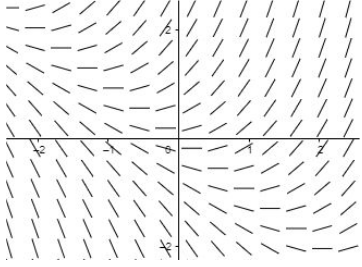
- ROI 裁剪图：[benchmarkallinone/outputs/report_priority_20/run_f2958f3118292117/datasets/scemqa/artifacts/crops/prob_924bc13c6b523d35d09ac9c1_primary_roi.png](../../datasets/scemqa/artifacts/crops/prob_924bc13c6b523d35d09ac9c1_primary_roi.png)

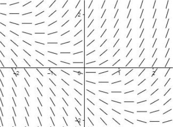

### 5) 清洗判定证据

```json
{
  "clean_score": 0.7112,
  "decision": "reject",
  "decision_reason_codes": [
    "missing_grounded_visual_path",
    "text_image_misaligned"
  ],
  "alignment_summary": {
    "alignment_id": "align_d0fc5d5b11235b88a40f2d40",
    "coverage_score": 0.18,
    "consistency_score": 0.1,
    "alignment_status": "bad",
    "conflict_count": 1
  },
  "solvability_summary": {
    "solvability_id": "solv_prob_924bc13c6b523d35d09ac9c1",
    "solvability_score": 0.8,
    "reasoning_path_exists": false,
    "decision_hint": "reject",
    "failure_codes": [
      "missing_grounded_visual_path"
    ]
  },
  "missing_field_summary": {
    "missing_question_text": false,
    "missing_answer_text": false,
    "missing_image_count": 0
  },
  "risk_flags": [],
  "reject_record": {
    "reject_id": "reject_d0fc5d5b11235b88a40f2d40",
    "problem_id": "prob_924bc13c6b523d35d09ac9c1",
    "stage": "cleaning",
    "reject_level": "problem",
    "reject_reason_codes": [
      "missing_grounded_visual_path",
      "text_image_misaligned"
    ],
    "reject_reason_detail": "Converted multiple choice into blank-style open-ended question.",
    "blocking_fields": [],
    "evidence_refs": [
      "align_d0fc5d5b11235b88a40f2d40",
      "solv_prob_924bc13c6b523d35d09ac9c1"
    ],
    "recoverable": false,
    "recommended_action": "drop",
    "reviewed_by": null,
    "created_at": "2026-03-25T08:47:18Z"
  }
}
```

---

## 15. prob_984046dc6ae9ad78f6209b8c

- 样本文件：[benchmarkallinone/outputs/report_priority_20/run_f2958f3118292117/datasets/scemqa/samples/prob_984046dc6ae9ad78f6209b8c.json](../../datasets/scemqa/samples/prob_984046dc6ae9ad78f6209b8c.json)
- 源数据集：`SCEMQA`
- 源 split：`test`
- 源题目 ID：`8`
- 清洗路径：`multimodal_full`
- 是否文本主导：`False`
- 是否依赖图像：`True`
- 决策：`reject`
- 决策原因码：`low_resolution`
- 开放化改写策略：`blank_open`
- 对齐状态：`good`
- 可解性分数：`1.0`
- 可解性提示：`pass`
- 质量风险标记：`low_resolution`

### 采集阶段信号

```json
{
  "core_asset_completeness": {
    "has_question_text": true,
    "has_answer_text": true,
    "image_count": 1,
    "has_multiple_images": false
  },
  "initial_scores": {
    "initial_image_dependency_score": 0.9,
    "initial_multi_solution_score": 0.24,
    "initial_verifiability_score": 0.8649
  }
}
```

### 1) 处理前：原始题目 / 原始答案

**原始题目**

```text
The graph of a piecewise linear function $f(x)$ is above. Evaluate $\int_{3}^{8} f'(x) , dx$.


```

**原始答案**

```text
1
```

### 2) 处理后：规范化题目 / 规范化答案

**规范化题目**

```text
The graph of a piecewise linear function $f(x)$ is above. Evaluate $\int_{3}^{8} f'(x) , dx$.
```

**规范化答案**

```text
1
```

### 3) 开放化改写前后

**改写前（使用规范化题目作为输入）**

```text
The graph of a piecewise linear function $f(x)$ is above. Evaluate $\int_{3}^{8} f'(x) , dx$.
```

**改写后（开放题变体）**

```text
The graph of a piecewise linear function $f(x)$ is above. Evaluate $\int_{3}^{8} f'(x) , dx$.
```

- 期望答案类型：`numeric`
- 期望答案：`1`
- 改写 rationale：`Converted multiple choice into blank-style open-ended question.`
- 丢弃原因码：`无`

### 4) 图像与可视化产物

- 原始图像来源：`inline://pil_image`
- 持久化主图：[benchmarkallinone/outputs/report_priority_20/run_f2958f3118292117/datasets/scemqa/artifacts/images/prob_984046dc6ae9ad78f6209b8c_primary.png](../../datasets/scemqa/artifacts/images/prob_984046dc6ae9ad78f6209b8c_primary.png)

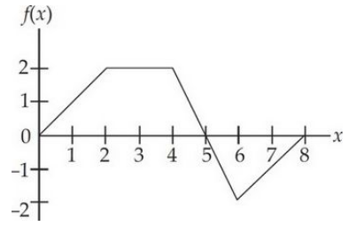
- ROI 裁剪图：[benchmarkallinone/outputs/report_priority_20/run_f2958f3118292117/datasets/scemqa/artifacts/crops/prob_984046dc6ae9ad78f6209b8c_primary_roi.png](../../datasets/scemqa/artifacts/crops/prob_984046dc6ae9ad78f6209b8c_primary_roi.png)

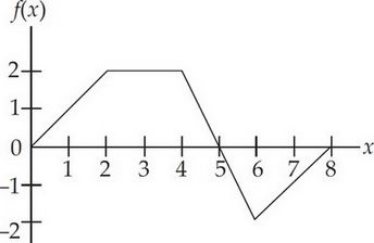

### 5) 清洗判定证据

```json
{
  "clean_score": 0.871,
  "decision": "reject",
  "decision_reason_codes": [
    "low_resolution"
  ],
  "alignment_summary": {
    "alignment_id": "align_86ede78570c22341b9805486",
    "coverage_score": 0.9,
    "consistency_score": 0.98,
    "alignment_status": "good",
    "conflict_count": 0
  },
  "solvability_summary": {
    "solvability_id": "solv_prob_984046dc6ae9ad78f6209b8c",
    "solvability_score": 1.0,
    "reasoning_path_exists": true,
    "decision_hint": "pass",
    "failure_codes": []
  },
  "missing_field_summary": {
    "missing_question_text": false,
    "missing_answer_text": false,
    "missing_image_count": 0
  },
  "risk_flags": [
    "low_resolution"
  ],
  "reject_record": {
    "reject_id": "reject_86ede78570c22341b9805486",
    "problem_id": "prob_984046dc6ae9ad78f6209b8c",
    "stage": "cleaning",
    "reject_level": "problem",
    "reject_reason_codes": [
      "low_resolution"
    ],
    "reject_reason_detail": "Converted multiple choice into blank-style open-ended question.",
    "blocking_fields": [
      "low_resolution"
    ],
    "evidence_refs": [
      "align_86ede78570c22341b9805486",
      "solv_prob_984046dc6ae9ad78f6209b8c"
    ],
    "recoverable": false,
    "recommended_action": "drop",
    "reviewed_by": null,
    "created_at": "2026-03-25T08:47:18Z"
  }
}
```

---

## 16. prob_b7af09a228801c5522714e37

- 样本文件：[benchmarkallinone/outputs/report_priority_20/run_f2958f3118292117/datasets/scemqa/samples/prob_b7af09a228801c5522714e37.json](../../datasets/scemqa/samples/prob_b7af09a228801c5522714e37.json)
- 源数据集：`SCEMQA`
- 源 split：`test`
- 源题目 ID：`19`
- 清洗路径：`multimodal_full`
- 是否文本主导：`False`
- 是否依赖图像：`True`
- 决策：`reject`
- 决策原因码：`low_resolution`
- 开放化改写策略：`split_open`
- 对齐状态：`good`
- 可解性分数：`1.0`
- 可解性提示：`pass`
- 质量风险标记：`low_resolution`

### 采集阶段信号

```json
{
  "core_asset_completeness": {
    "has_question_text": true,
    "has_answer_text": true,
    "image_count": 1,
    "has_multiple_images": false
  },
  "initial_scores": {
    "initial_image_dependency_score": 0.9,
    "initial_multi_solution_score": 0.24,
    "initial_verifiability_score": 0.871
  }
}
```

### 1) 处理前：原始题目 / 原始答案

**原始题目**

```text
The boxpolts below summarize the distribution of SAT verbal and math scores among students at an upstate New York high school. Which of the following statements are true?
I. The range of the math scores equals the range of the verbal scores.
II. The highest math score equals the median verbal score.
III. The verbal scores appear to be roughly symmetric, while the math scores appear to be skewed to the right.


```

**原始答案**

```text
2
```

### 2) 处理后：规范化题目 / 规范化答案

**规范化题目**

```text
The boxpolts below summarize the distribution of SAT verbal and math scores among students at an upstate New York high school. Which of the following statements are true?
I. The range of the math scores equals the range of the verbal scores.
II. The highest math score equals the median verbal score.
III. The verbal scores appear to be roughly symmetric, while the math scores appear to be skewed to the right.
```

**规范化答案**

```text
2
```

### 3) 开放化改写前后

**改写前（使用规范化题目作为输入）**

```text
The boxpolts below summarize the distribution of SAT verbal and math scores among students at an upstate New York high school. Which of the following statements are true?
I. The range of the math scores equals the range of the verbal scores.
II. The highest math score equals the median verbal score.
III. The verbal scores appear to be roughly symmetric, while the math scores appear to be skewed to the right.
```

**改写后（开放题变体）**

```text
The boxpolts below summarize the distribution of SAT verbal and math scores among students at an upstate New York high school. Which of the following statements are true?
I. The range of the math scores equals the range of the verbal scores.
II. The highest math score equals the median verbal score.
III. The verbal scores appear to be roughly symmetric, while the math scores appear to be skewed to the right.
请只回答第 1 个目标量。
```

- 期望答案类型：`short_text`
- 期望答案：`2`
- 改写 rationale：`Compound choice answer was split into multiple open-ended targets.`
- 丢弃原因码：`无`

### 4) 图像与可视化产物

- 原始图像来源：`inline://pil_image`
- 持久化主图：[benchmarkallinone/outputs/report_priority_20/run_f2958f3118292117/datasets/scemqa/artifacts/images/prob_b7af09a228801c5522714e37_primary.png](../../datasets/scemqa/artifacts/images/prob_b7af09a228801c5522714e37_primary.png)

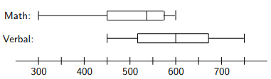
- ROI 裁剪图：[benchmarkallinone/outputs/report_priority_20/run_f2958f3118292117/datasets/scemqa/artifacts/crops/prob_b7af09a228801c5522714e37_primary_roi.png](../../datasets/scemqa/artifacts/crops/prob_b7af09a228801c5522714e37_primary_roi.png)

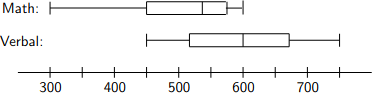

### 5) 清洗判定证据

```json
{
  "clean_score": 0.8939,
  "decision": "reject",
  "decision_reason_codes": [
    "low_resolution"
  ],
  "alignment_summary": {
    "alignment_id": "align_9bddf1c766be7f97b2308cb8",
    "coverage_score": 0.9,
    "consistency_score": 0.9,
    "alignment_status": "good",
    "conflict_count": 1
  },
  "solvability_summary": {
    "solvability_id": "solv_prob_b7af09a228801c5522714e37",
    "solvability_score": 1.0,
    "reasoning_path_exists": true,
    "decision_hint": "pass",
    "failure_codes": []
  },
  "missing_field_summary": {
    "missing_question_text": false,
    "missing_answer_text": false,
    "missing_image_count": 0
  },
  "risk_flags": [
    "low_resolution"
  ],
  "reject_record": {
    "reject_id": "reject_9bddf1c766be7f97b2308cb8",
    "problem_id": "prob_b7af09a228801c5522714e37",
    "stage": "cleaning",
    "reject_level": "problem",
    "reject_reason_codes": [
      "low_resolution"
    ],
    "reject_reason_detail": "Compound choice answer was split into multiple open-ended targets.",
    "blocking_fields": [
      "low_resolution"
    ],
    "evidence_refs": [
      "align_9bddf1c766be7f97b2308cb8",
      "solv_prob_b7af09a228801c5522714e37"
    ],
    "recoverable": false,
    "recommended_action": "drop",
    "reviewed_by": null,
    "created_at": "2026-03-25T08:47:18Z"
  }
}
```

---

## 17. prob_bc762be58bbf95a8703d81d6

- 样本文件：[benchmarkallinone/outputs/report_priority_20/run_f2958f3118292117/datasets/scemqa/samples/prob_bc762be58bbf95a8703d81d6.json](../../datasets/scemqa/samples/prob_bc762be58bbf95a8703d81d6.json)
- 源数据集：`SCEMQA`
- 源 split：`test`
- 源题目 ID：`18`
- 清洗路径：`multimodal_full`
- 是否文本主导：`False`
- 是否依赖图像：`True`
- 决策：`reject`
- 决策原因码：`low_resolution`
- 开放化改写策略：`split_open`
- 对齐状态：`good`
- 可解性分数：`1.0`
- 可解性提示：`pass`
- 质量风险标记：`low_resolution`

### 采集阶段信号

```json
{
  "core_asset_completeness": {
    "has_question_text": true,
    "has_answer_text": true,
    "image_count": 1,
    "has_multiple_images": false
  },
  "initial_scores": {
    "initial_image_dependency_score": 0.9,
    "initial_multi_solution_score": 0.24,
    "initial_verifiability_score": 0.875
  }
}
```

### 1) 处理前：原始题目 / 原始答案

**原始题目**

```text
A study was conducted to determine the effectiveness of varying amounts of vitamin C in reducing the number of common colds. A survey of 450 people provided the following information:

Is there evidence of a relationship between catching a cold and taking vitamin C?


```

**原始答案**

```text
4
```

### 2) 处理后：规范化题目 / 规范化答案

**规范化题目**

```text
A study was conducted to determine the effectiveness of varying amounts of vitamin C in reducing the number of common colds. A survey of 450 people provided the following information:

Is there evidence of a relationship between catching a cold and taking vitamin C?
```

**规范化答案**

```text
4
```

### 3) 开放化改写前后

**改写前（使用规范化题目作为输入）**

```text
A study was conducted to determine the effectiveness of varying amounts of vitamin C in reducing the number of common colds. A survey of 450 people provided the following information:

Is there evidence of a relationship between catching a cold and taking vitamin C?
```

**改写后（开放题变体）**

```text
A study was conducted to determine the effectiveness of varying amounts of vitamin C in reducing the number of common colds. A survey of 450 people provided the following information:

Is there evidence of a relationship between catching a cold and taking vitamin C?
请只回答第 1 个目标量。
```

- 期望答案类型：`short_text`
- 期望答案：`4`
- 改写 rationale：`Compound choice answer was split into multiple open-ended targets.`
- 丢弃原因码：`无`

### 4) 图像与可视化产物

- 原始图像来源：`inline://pil_image`
- 持久化主图：[benchmarkallinone/outputs/report_priority_20/run_f2958f3118292117/datasets/scemqa/artifacts/images/prob_bc762be58bbf95a8703d81d6_primary.png](../../datasets/scemqa/artifacts/images/prob_bc762be58bbf95a8703d81d6_primary.png)

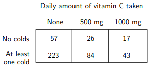
- ROI 裁剪图：[benchmarkallinone/outputs/report_priority_20/run_f2958f3118292117/datasets/scemqa/artifacts/crops/prob_bc762be58bbf95a8703d81d6_primary_roi.png](../../datasets/scemqa/artifacts/crops/prob_bc762be58bbf95a8703d81d6_primary_roi.png)

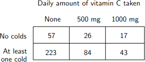

### 5) 清洗判定证据

```json
{
  "clean_score": 0.8976,
  "decision": "reject",
  "decision_reason_codes": [
    "low_resolution"
  ],
  "alignment_summary": {
    "alignment_id": "align_5b32d8bc782059d7ce14e65f",
    "coverage_score": 0.9,
    "consistency_score": 0.9,
    "alignment_status": "good",
    "conflict_count": 1
  },
  "solvability_summary": {
    "solvability_id": "solv_prob_bc762be58bbf95a8703d81d6",
    "solvability_score": 1.0,
    "reasoning_path_exists": true,
    "decision_hint": "pass",
    "failure_codes": []
  },
  "missing_field_summary": {
    "missing_question_text": false,
    "missing_answer_text": false,
    "missing_image_count": 0
  },
  "risk_flags": [
    "low_resolution"
  ],
  "reject_record": {
    "reject_id": "reject_5b32d8bc782059d7ce14e65f",
    "problem_id": "prob_bc762be58bbf95a8703d81d6",
    "stage": "cleaning",
    "reject_level": "problem",
    "reject_reason_codes": [
      "low_resolution"
    ],
    "reject_reason_detail": "Compound choice answer was split into multiple open-ended targets.",
    "blocking_fields": [
      "low_resolution"
    ],
    "evidence_refs": [
      "align_5b32d8bc782059d7ce14e65f",
      "solv_prob_bc762be58bbf95a8703d81d6"
    ],
    "recoverable": false,
    "recommended_action": "drop",
    "reviewed_by": null,
    "created_at": "2026-03-25T08:47:18Z"
  }
}
```

---

## 18. prob_c9971c7fd41b26eeaae5e45b

- 样本文件：[benchmarkallinone/outputs/report_priority_20/run_f2958f3118292117/datasets/scemqa/samples/prob_c9971c7fd41b26eeaae5e45b.json](../../datasets/scemqa/samples/prob_c9971c7fd41b26eeaae5e45b.json)
- 源数据集：`SCEMQA`
- 源 split：`test`
- 源题目 ID：`3`
- 清洗路径：`multimodal_full`
- 是否文本主导：`False`
- 是否依赖图像：`True`
- 决策：`reject`
- 决策原因码：`low_resolution`
- 开放化改写策略：`blank_open`
- 对齐状态：`good`
- 可解性分数：`1.0`
- 可解性提示：`pass`
- 质量风险标记：`low_resolution`

### 采集阶段信号

```json
{
  "core_asset_completeness": {
    "has_question_text": true,
    "has_answer_text": true,
    "image_count": 1,
    "has_multiple_images": false
  },
  "initial_scores": {
    "initial_image_dependency_score": 0.9,
    "initial_multi_solution_score": 0.24,
    "initial_verifiability_score": 0.869
  }
}
```

### 1) 处理前：原始题目 / 原始答案

**原始题目**

```text
Shown in the diagram is a graph of $f'$, the derivative of function $f$. If $f(3) = 3$, then $f(1)=$?


```

**原始答案**

```text
1
```

### 2) 处理后：规范化题目 / 规范化答案

**规范化题目**

```text
Shown in the diagram is a graph of $f'$, the derivative of function $f$. If $f(3) = 3$, then $f(1)=$?
```

**规范化答案**

```text
1
```

### 3) 开放化改写前后

**改写前（使用规范化题目作为输入）**

```text
Shown in the diagram is a graph of $f'$, the derivative of function $f$. If $f(3) = 3$, then $f(1)=$?
```

**改写后（开放题变体）**

```text
Shown in the diagram is a graph of $f'$, the derivative of function $f$. If $f(3) = 3$, then $f(1)=$?
```

- 期望答案类型：`numeric`
- 期望答案：`1`
- 改写 rationale：`Converted multiple choice into blank-style open-ended question.`
- 丢弃原因码：`无`

### 4) 图像与可视化产物

- 原始图像来源：`inline://pil_image`
- 持久化主图：[benchmarkallinone/outputs/report_priority_20/run_f2958f3118292117/datasets/scemqa/artifacts/images/prob_c9971c7fd41b26eeaae5e45b_primary.png](../../datasets/scemqa/artifacts/images/prob_c9971c7fd41b26eeaae5e45b_primary.png)

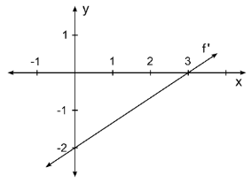
- ROI 裁剪图：[benchmarkallinone/outputs/report_priority_20/run_f2958f3118292117/datasets/scemqa/artifacts/crops/prob_c9971c7fd41b26eeaae5e45b_primary_roi.png](../../datasets/scemqa/artifacts/crops/prob_c9971c7fd41b26eeaae5e45b_primary_roi.png)

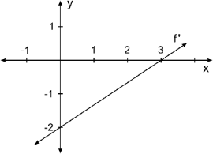

### 5) 清洗判定证据

```json
{
  "clean_score": 0.878,
  "decision": "reject",
  "decision_reason_codes": [
    "low_resolution"
  ],
  "alignment_summary": {
    "alignment_id": "align_b0973bbe67ca817dc82ecadf",
    "coverage_score": 0.9,
    "consistency_score": 0.98,
    "alignment_status": "good",
    "conflict_count": 0
  },
  "solvability_summary": {
    "solvability_id": "solv_prob_c9971c7fd41b26eeaae5e45b",
    "solvability_score": 1.0,
    "reasoning_path_exists": true,
    "decision_hint": "pass",
    "failure_codes": []
  },
  "missing_field_summary": {
    "missing_question_text": false,
    "missing_answer_text": false,
    "missing_image_count": 0
  },
  "risk_flags": [
    "low_resolution"
  ],
  "reject_record": {
    "reject_id": "reject_b0973bbe67ca817dc82ecadf",
    "problem_id": "prob_c9971c7fd41b26eeaae5e45b",
    "stage": "cleaning",
    "reject_level": "problem",
    "reject_reason_codes": [
      "low_resolution"
    ],
    "reject_reason_detail": "Converted multiple choice into blank-style open-ended question.",
    "blocking_fields": [
      "low_resolution"
    ],
    "evidence_refs": [
      "align_b0973bbe67ca817dc82ecadf",
      "solv_prob_c9971c7fd41b26eeaae5e45b"
    ],
    "recoverable": false,
    "recommended_action": "drop",
    "reviewed_by": null,
    "created_at": "2026-03-25T08:47:18Z"
  }
}
```

---

## 19. prob_d2e18289d6790272f6e58c9b

- 样本文件：[benchmarkallinone/outputs/report_priority_20/run_f2958f3118292117/datasets/scemqa/samples/prob_d2e18289d6790272f6e58c9b.json](../../datasets/scemqa/samples/prob_d2e18289d6790272f6e58c9b.json)
- 源数据集：`SCEMQA`
- 源 split：`test`
- 源题目 ID：`1`
- 清洗路径：`multimodal_full`
- 是否文本主导：`False`
- 是否依赖图像：`True`
- 决策：`reject`
- 决策原因码：`low_resolution`
- 开放化改写策略：`blank_open`
- 对齐状态：`good`
- 可解性分数：`1.0`
- 可解性提示：`pass`
- 质量风险标记：`low_resolution`

### 采集阶段信号

```json
{
  "core_asset_completeness": {
    "has_question_text": true,
    "has_answer_text": true,
    "image_count": 1,
    "has_multiple_images": false
  },
  "initial_scores": {
    "initial_image_dependency_score": 0.9,
    "initial_multi_solution_score": 0.24,
    "initial_verifiability_score": 0.8798
  }
}
```

### 1) 处理前：原始题目 / 原始答案

**原始题目**

```text
The table shows values of $f'$, the derivative of function $f$. Although $f'$ is continuous over all real numbers, only selected values of $f'$ are shown. If $f'$ has exactly two real zeros, then $f$ is increasing over which of the following intervals?


```

**原始答案**

```text
1
```

### 2) 处理后：规范化题目 / 规范化答案

**规范化题目**

```text
The table shows values of $f'$, the derivative of function $f$. Although $f'$ is continuous over all real numbers, only selected values of $f'$ are shown. If $f'$ has exactly two real zeros, then $f$ is increasing over which of the following intervals?
```

**规范化答案**

```text
1
```

### 3) 开放化改写前后

**改写前（使用规范化题目作为输入）**

```text
The table shows values of $f'$, the derivative of function $f$. Although $f'$ is continuous over all real numbers, only selected values of $f'$ are shown. If $f'$ has exactly two real zeros, then $f$ is increasing over which of the following intervals?
```

**改写后（开放题变体）**

```text
The table shows values of $f'$, the derivative of function $f$. Although $f'$ is continuous over all real numbers, only selected values of $f'$ are shown. If $f'$ has exactly two real zeros, then $f$ is increasing over which of the following intervals?
```

- 期望答案类型：`numeric`
- 期望答案：`1`
- 改写 rationale：`Converted multiple choice into blank-style open-ended question.`
- 丢弃原因码：`无`

### 4) 图像与可视化产物

- 原始图像来源：`inline://pil_image`
- 持久化主图：[benchmarkallinone/outputs/report_priority_20/run_f2958f3118292117/datasets/scemqa/artifacts/images/prob_d2e18289d6790272f6e58c9b_primary.png](../../datasets/scemqa/artifacts/images/prob_d2e18289d6790272f6e58c9b_primary.png)

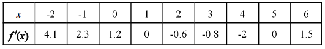
- ROI 裁剪图：[benchmarkallinone/outputs/report_priority_20/run_f2958f3118292117/datasets/scemqa/artifacts/crops/prob_d2e18289d6790272f6e58c9b_primary_roi.png](../../datasets/scemqa/artifacts/crops/prob_d2e18289d6790272f6e58c9b_primary_roi.png)

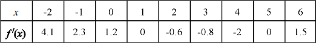

### 5) 清洗判定证据

```json
{
  "clean_score": 0.9151,
  "decision": "reject",
  "decision_reason_codes": [
    "low_resolution"
  ],
  "alignment_summary": {
    "alignment_id": "align_c65590113616fcbceadcef83",
    "coverage_score": 0.9,
    "consistency_score": 0.98,
    "alignment_status": "good",
    "conflict_count": 0
  },
  "solvability_summary": {
    "solvability_id": "solv_prob_d2e18289d6790272f6e58c9b",
    "solvability_score": 1.0,
    "reasoning_path_exists": true,
    "decision_hint": "pass",
    "failure_codes": []
  },
  "missing_field_summary": {
    "missing_question_text": false,
    "missing_answer_text": false,
    "missing_image_count": 0
  },
  "risk_flags": [
    "low_resolution"
  ],
  "reject_record": {
    "reject_id": "reject_c65590113616fcbceadcef83",
    "problem_id": "prob_d2e18289d6790272f6e58c9b",
    "stage": "cleaning",
    "reject_level": "problem",
    "reject_reason_codes": [
      "low_resolution"
    ],
    "reject_reason_detail": "Converted multiple choice into blank-style open-ended question.",
    "blocking_fields": [
      "low_resolution"
    ],
    "evidence_refs": [
      "align_c65590113616fcbceadcef83",
      "solv_prob_d2e18289d6790272f6e58c9b"
    ],
    "recoverable": false,
    "recommended_action": "drop",
    "reviewed_by": null,
    "created_at": "2026-03-25T08:47:18Z"
  }
}
```

---

## 20. prob_f784c8e088fe1ec7bdfd6528

- 样本文件：[benchmarkallinone/outputs/report_priority_20/run_f2958f3118292117/datasets/scemqa/samples/prob_f784c8e088fe1ec7bdfd6528.json](../../datasets/scemqa/samples/prob_f784c8e088fe1ec7bdfd6528.json)
- 源数据集：`SCEMQA`
- 源 split：`test`
- 源题目 ID：`12`
- 清洗路径：`multimodal_full`
- 是否文本主导：`False`
- 是否依赖图像：`True`
- 决策：`reject`
- 决策原因码：`low_resolution`
- 开放化改写策略：`split_open`
- 对齐状态：`good`
- 可解性分数：`1.0`
- 可解性提示：`pass`
- 质量风险标记：`low_resolution`

### 采集阶段信号

```json
{
  "core_asset_completeness": {
    "has_question_text": true,
    "has_answer_text": true,
    "image_count": 1,
    "has_multiple_images": false
  },
  "initial_scores": {
    "initial_image_dependency_score": 0.9,
    "initial_multi_solution_score": 0.42,
    "initial_verifiability_score": 0.8744
  }
}
```

### 1) 处理前：原始题目 / 原始答案

**原始题目**

```text
The table above gives values of a differentiable function $f(x)$ at selected $x$ values. Based on the table, which of the following statements about $f(x)$ could be false?


```

**原始答案**

```text
1
```

### 2) 处理后：规范化题目 / 规范化答案

**规范化题目**

```text
The table above gives values of a differentiable function $f(x)$ at selected $x$ values. Based on the table, which of the following statements about $f(x)$ could be false?
```

**规范化答案**

```text
1
```

### 3) 开放化改写前后

**改写前（使用规范化题目作为输入）**

```text
The table above gives values of a differentiable function $f(x)$ at selected $x$ values. Based on the table, which of the following statements about $f(x)$ could be false?
```

**改写后（开放题变体）**

```text
The table above gives values of a differentiable function $f(x)$ at selected $x$ values. Based on the table, which of the following statements about $f(x)$ could be false?
请只回答第 1 个目标量。
```

- 期望答案类型：`short_text`
- 期望答案：`1`
- 改写 rationale：`Compound choice answer was split into multiple open-ended targets.`
- 丢弃原因码：`无`

### 4) 图像与可视化产物

- 原始图像来源：`inline://pil_image`
- 持久化主图：[benchmarkallinone/outputs/report_priority_20/run_f2958f3118292117/datasets/scemqa/artifacts/images/prob_f784c8e088fe1ec7bdfd6528_primary.png](../../datasets/scemqa/artifacts/images/prob_f784c8e088fe1ec7bdfd6528_primary.png)

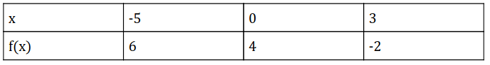
- ROI 裁剪图：[benchmarkallinone/outputs/report_priority_20/run_f2958f3118292117/datasets/scemqa/artifacts/crops/prob_f784c8e088fe1ec7bdfd6528_primary_roi.png](../../datasets/scemqa/artifacts/crops/prob_f784c8e088fe1ec7bdfd6528_primary_roi.png)

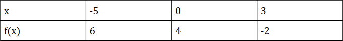

### 5) 清洗判定证据

```json
{
  "clean_score": 0.8958,
  "decision": "reject",
  "decision_reason_codes": [
    "low_resolution"
  ],
  "alignment_summary": {
    "alignment_id": "align_2217010d7312c8a8bf66e86b",
    "coverage_score": 0.9,
    "consistency_score": 0.98,
    "alignment_status": "good",
    "conflict_count": 0
  },
  "solvability_summary": {
    "solvability_id": "solv_prob_f784c8e088fe1ec7bdfd6528",
    "solvability_score": 1.0,
    "reasoning_path_exists": true,
    "decision_hint": "pass",
    "failure_codes": []
  },
  "missing_field_summary": {
    "missing_question_text": false,
    "missing_answer_text": false,
    "missing_image_count": 0
  },
  "risk_flags": [
    "low_resolution"
  ],
  "reject_record": {
    "reject_id": "reject_2217010d7312c8a8bf66e86b",
    "problem_id": "prob_f784c8e088fe1ec7bdfd6528",
    "stage": "cleaning",
    "reject_level": "problem",
    "reject_reason_codes": [
      "low_resolution"
    ],
    "reject_reason_detail": "Compound choice answer was split into multiple open-ended targets.",
    "blocking_fields": [
      "low_resolution"
    ],
    "evidence_refs": [
      "align_2217010d7312c8a8bf66e86b",
      "solv_prob_f784c8e088fe1ec7bdfd6528"
    ],
    "recoverable": false,
    "recommended_action": "drop",
    "reviewed_by": null,
    "created_at": "2026-03-25T08:47:18Z"
  }
}
```

