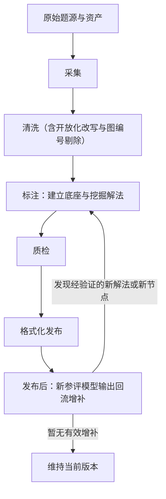
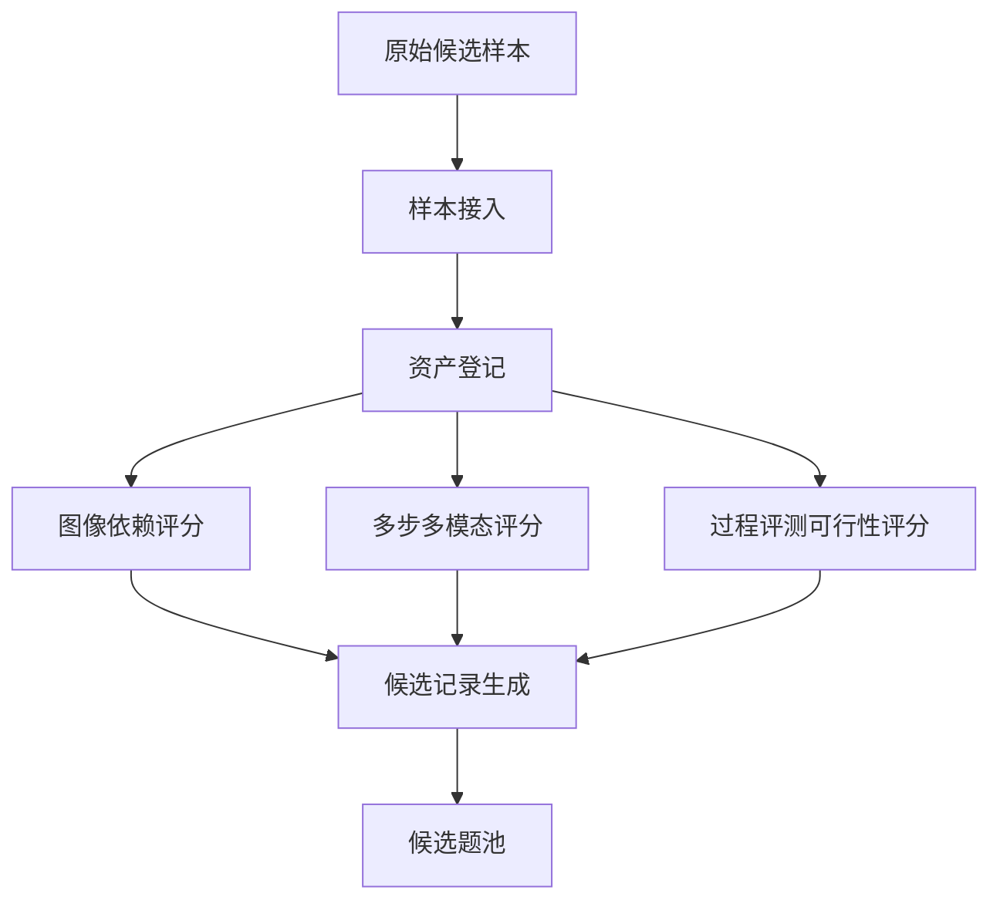
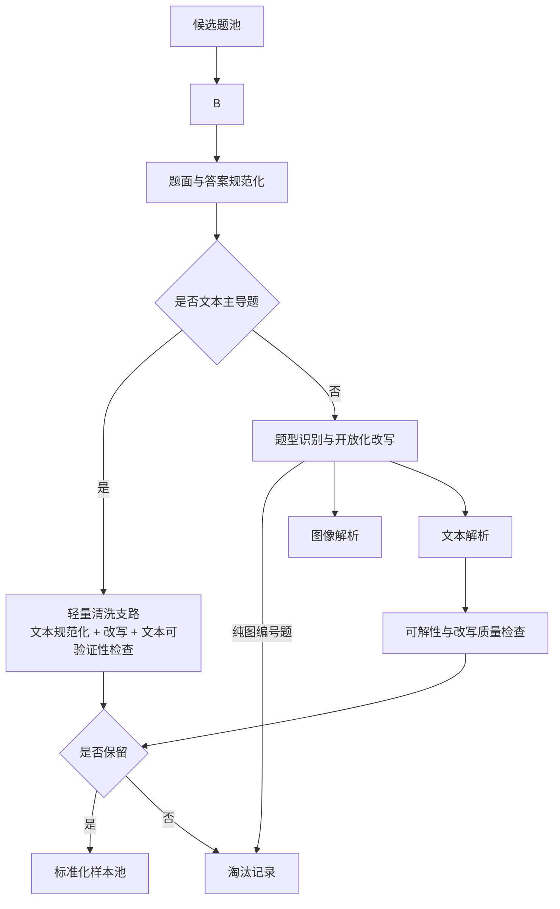

# CIRCUIT 数据集 Pipeline 与 Multi-Agent 自动化方案

## 需要先确定的点：
1.数据应该格式化为什么格式，这个的设计需要考虑后面的步骤所需的字段
2.确定pipeline
3.所以先理一下后面用什么字段，这个有数据集中带的，也有我们自己需要生成的

## 结论：现在GPT5.4在xhigh思考努力的情况下绝大概率不会有问题，先把流程跑通之后再检查一下有没有问题

## 1. 整体 Pipeline

### 1.1 总目标

围绕高质量、多解法、可持续更新的多模态推理数据集，构建一条可自动化运行的数据生产线；在本文后续细化部分，以 M3CoT 中的“真正的多步多模态题”作为代表样本展开说明。

主线仍采用五段，但清洗阶段内部新增“选择题开放化改写与图编号剔除”子流程：

1. 采集（Collection）
2. 清洗（Cleaning，含选择题开放化改写）
3. 标注（Annotation）
4. 质检（QA）
5. 格式化发布（Format）

### 1.2 总体流程图

| 节点 | 含义 | 详细解释 |
| --- | --- | --- |
| 原始题源与资产 | 全流程起点 | 指原始题图、题干、答案、来源信息及其他辅助资源，尚未经过筛选和标准化。 |
| 采集 | 候选题接入阶段 | 把来自不同来源的原始样本统一接入系统，形成候选题池与初始元数据。 |
| 清洗 | 标准化与筛题阶段 | 对候选题做规范化、可解性检查与题型开放化改写；对依赖干扰项成立的概念辨析题执行“挖空式”开放问答改写，对纯图编号选择题直接剔除。 |
| 标注：建立底座与挖掘解法 | 首轮深标阶段 | 先构建 `P/T/K` 底座，再利用多模型、多策略挖掘候选解法与中间节点，形成首轮高覆盖度标注结果。 |
| 质检 | 发布前审核阶段 | 对结构正确性、证据充分性、解法覆盖度和可重建性做集中审核。 |
| 格式化发布 | 数据出库阶段 | 将通过审核的结果写成统一数据格式，生成正式版本与发布包。 |
| 发布后：新参评模型输出回流增补 | 发布后持续维护闭环 | 收集新发布或新参加测评模型的答案与轨迹，对“答案正确、验证通过但中间节点命中率低”的路径做合法性审核，并把真正的新中间节点 / 新解法以补丁形式回写到后续版本。 |

### 1.3 六段主线的输入输出（其中发布后回流为非阻塞增量环）

| 阶段 | 目标 | 主要输入 | 主要输出 |
| --- | --- | --- | --- |
| 采集 | 建立高冗余候选池 | 原始题图或多张辅助图、题干、答案、来源信息 | 候选题池、初始元数据与初始评分 |
| 清洗 | 筛出适合深标的高质量样本，并把可改写选择题转成开放问答版本 | 候选题池 | 标准化样本池、开放化改写记录、淘汰记录 |
| 标注 | 生成 `P/T/K/R/S/A/B` 结构化 GT，并为后续回流预留可对齐的节点库与解法库 | 标准化样本池 | 首轮高覆盖度的多解法结构化标注 |
| 质检 | 验证结构、证据、覆盖度 | 标注结果 | 发布候选集、`qa_records`（质检记录） |
| 格式化 | 生成稳定可维护的数据组织 | 发布候选集 | 发布包、版本快照 |
| 发布后回流增补 | 利用新参评模型持续扩展节点与解法库 | 已发布数据集、新参评模型答案 / 轨迹、现有节点库与解法库 | `dataset_patch`（数据集补丁）、新版本候选 |

---

## 2. 分阶段细化方案

## 2.1 采集阶段

### 2.1.1 目标

从数据集中筛出的“真正的多步多模态题”候选样本建立大规模候选池，为后续清洗和深标做准备。

### 2.1.2 输入

- 原始题图或多张辅助图
- 原始题干
- 原始答案
- 题目 ID / 来源信息 / 领域标签
- 如有公开解析、步骤说明或参考说明文本

### 2.1.3 输出

- `candidate_problem_record`：候选题目记录，表示一条样本在进入正式清洗前的结构化草稿信息
- `raw_asset_bundle`：原始资源包，表示该题关联的图像、文本、答案和来源元数据集合
- `initial_image_dependency_score`：初始图像依赖分数，表示该题对图像信息的依赖强度
- `initial_multi_solution_score`：初始多解潜力分数，表示该题可能存在多种合法解法的程度
- `initial_verifiability_score`：初始可验证性分数，表示该题答案与过程是否容易被后续程序或规则验证

### 2.1.4 这一阶段做什么

#### Step C1：样本接入

做什么：
- 收集候选样本、题图、题干、答案、来源元数据
- 给每个样本分配稳定 ID

用什么做：
- 样本抓取脚本
- 元数据登记脚本
- GPT 元数据补全

#### Step C2：资产登记**应该都是齐全的**

做什么：
- 检查图像 / 文本 / answer 是否齐全
- 建立资产清单

用什么做：
- 资产校验脚本
- 文件完整性检查器

#### Step C3：初步价值打分**这几个比较重要**

做什么：
- 判断图像依赖强不强
- 判断是否是真正的多步多模态题**这里有些数据集已经有标识，比如M3CoT，但是没有标注的数据集，需要做：
  - 1.判断图文是否相关
  
- 判断多解的可能性，针对不同的数据集判断方式不一样。
- 把“多解潜力高的数据集 / 多解潜力低的数据集”显式分流：
  - 如果该数据集以单解题为主，则不要强推多解 agent，也不要为了凑多解而增加额外生成压力；这类数据集只保留基础可验证性与可标注性检查。
  - 只有当该数据集整体上存在较稳定的多解潜力，或者该题本身被判定为高多解潜力时，才进入后续的强多解挖掘链路。

用什么做：
- GPT 分类器
- 规则打分器
- 多步多模态可评测性启发式脚本
- 数据集级分流规则表（控制多解挖掘强度）

#### Step C4：候选入池

做什么：
- 把样本登记为候选题
- 保存初始分数和来源信息

用什么做：
- schema validator
- 候选池写入脚本

### 2.1.5 数据采集自动化流程图

| 节点 | 含义 | 详细解释 |
| --- | --- | --- |
| 原始候选样本 | 采集输入 | 指从 M3CoT 或其他来源拿到的原始题目样本，通常包含图像、题干、答案与基础来源信息。 |
| 样本接入 | 统一登记入口 | 给样本分配稳定 ID，并把分散来源的数据拉到统一处理框架中。 |
| 资产登记 | 资源清点 | 检查图像、文本、答案、来源元数据是否完整，建立资源清单。 |
| 图像依赖评分 | 多模态必要性初筛 | 判断该题是否真的必须使用图像，避免把“带图但不需要看图”的题混进来。 |
| 多步多模态评分 | 多步性筛选 | 判断该题是否至少需要两步以上图文联合推理，而不是单步视觉识别或单步文本判断。 |
| 过程评测可行性评分 | 过程可标注性筛选 | 判断该题能否拆出中间步骤、证据绑定和评测 rubric。 |
| 候选记录生成 | 入库前结构化 | 把评分结果与原始元数据写成统一候选记录。 |
| 候选题池 | 采集阶段产物 | 作为后续清洗阶段的输入，是尚未标准化但已经过初筛的样本集合。 |

## 2.2 清洗阶段**这部分主要是做规范化数据，去掉数据集中的冗余内容，剔除模糊的图片等等**

### 2.2.1 目标

把候选池变成适合深度标注的高质量标准化样本池，并在进入标注前完成题型标准化：

- 原本就是开放问答的题直接保留；
- 选择题改写成开放问答，注意这一步答案和题目都要改写。
- 依赖干扰项才能成立的概念辨析题，不保留显式选项列表，而是把原先由选项承载的目标项融合进题目中，“挖空”后让模型直接回答；
- 纯图编号选择题（意思是没有办法改写成开放式问答的题目，比如说需要让你选择四张图片中的一张作为答案的，如 graph A/B/C/D、diagram A/B/C/D）直接淘汰，不进入后续深标。

### 2.2.2 输入

- `candidate_problem_record`
- `raw_asset_bundle`
- 初始评分

### 2.2.3 输出

- `clean_problem_record`：清洗后题目记录，表示通过基础清洗与筛选后的题目主记录
- `normalized_assets`：标准化资源包，表示经过格式统一和区域规范化后的资源集合
- `alignment_report`：对齐报告，表示图像与文本在实体、条件和目标层面的对应关系与冲突信息
- `solvability_report`：可解性报告，表示题目是否具备清晰目标、可验证答案、足够文本条件与必要视觉锚定
- `rewrite_report`：题型改写报告，表示原题是否被改成开放问答、是否被拆成多道子题、是否因纯图编号而被剔除
- `open_ended_problem_variants`：开放问答版本集合，表示由原题派生出的一个或多个开放问答题面
- `clean_pool_entry`：清洗池条目，表示允许进入深度标注阶段的样本记录
- `reject_log`：淘汰日志，表示被过滤样本及其淘汰原因的记录

### 2.2.4 这一阶段做什么

#### Step L2：规范化**规范化为我们自己的格式，自己规定一个**

做什么：
- 变量命名统一
- 单位统一
- 图像区域裁剪与标注统一
- 题面与答案格式标准化
- 去掉 `（2018山东高考）` 等数据集私有噪声标记，保留真正有语义的题面内容
- 当前版本明确**不做 OCR 矫正**，也不做复杂的图中文字修复；这里只做格式标准化、噪声清理和字段规范化。
- 对文本主导题先做“图像必要性判断”；如果判定该题完全只需要文字即可作答，则去掉这道题。

用什么做：
- rule-based text cleaner
- unit normalizer
- image region normalizer
- answer normalizer
- text-dominant detector（文本主导题识别器）

#### Step L3：题型标准化与开放化改写
- 原本就是开放问答的题直接保留；
- 选择题改写成开放问答，注意这一步答案和题目都要改写。
- 依赖干扰项才能成立的概念辨析题，不保留显式选项列表，而是把原先由选项承载的目标项融合进题目中，“挖空”后让模型直接回答；
- 纯图编号选择题（意思是没有办法改写成开放式问答的题目，比如说需要让你选择四张图片中的一张作为答案的，如 graph A/B/C/D、diagram A/B/C/D）直接淘汰，不进入后续深标。

#### Step L4：图文对齐

注意！！！这一步不做。

#### Step L5：保留或淘汰

做什么：
- 对开放化改写失败、改写后目标不明确、拆分后答案不可校验的样本退回复核或淘汰
- 对纯图编号选择题直接淘汰
- 根据图文绑定强度、可验证性、多步性和改写质量决定保留或淘汰；有些数据集比如化学或生物题本身主要依赖文字，不需要图像，这类数据可以保留但不能占太高比例
你可以参考用什么做：
- gatekeeper 规则
- rewrite validator
- GPT 复核器
- text-first gate（文本优先门控规则）

### 2.2.5 清洗阶段流程图

| 节点 | 含义 | 详细解释 |
| --- | --- | --- |
| 候选题池 | 清洗输入 | 来自采集阶段的候选样本集合，质量参差不齐，需要进一步清洗。 |
| 题面与答案规范化 | 基础标准化 | 统一变量、单位、题面格式和答案表达，并清理 `<image>`、`Choices` 等噪声标记；当前版本明确不把 OCR 矫正当作该步骤的必做项。 |
| 是否文本主导题 | 清洗分流判断 | 判断该题是否主要依赖文字即可完成作答；若是，则走轻量清洗支路，减少不必要的视觉解析负担。 |
| 轻量清洗支路 | 文本优先清洗 | 面向文本主导题，只做文本规范化、开放化改写、文本结构检查与文本可验证性检查，不强制进入完整图像解析链。 |
| 题型识别与开放化改写 | 题型标准化 | 识别开放题、普通选择题、概念辨析题、可拆分组合题和纯图编号题；将可改写题改成开放问答，将纯图编号题直接剔除。 |
| 文本解析 | 条件目标抽取 | 从题干中抽出已知条件、约束、目标，以及开放化改写后的回答槽位。 |
| 可解性与改写质量检查 | 可评测性判断 | 检查答案是否可验证、是否存在至少一条合法图文联合推理路径，以及改写后的开放题是否目标明确。 |
| 是否保留 | 清洗门控 | 根据图像必要性、多步性、可验证性、对齐质量和改写质量决定保留还是淘汰；文本主导题允许基于轻量支路结果直接决策。 |
| 标准化样本池 | 清洗结果 | 留给标注阶段的高质量样本集合。 |
| 淘汰记录 | 清洗日志 | 保存被过滤样本及其淘汰原因，便于回溯和分析。 |
