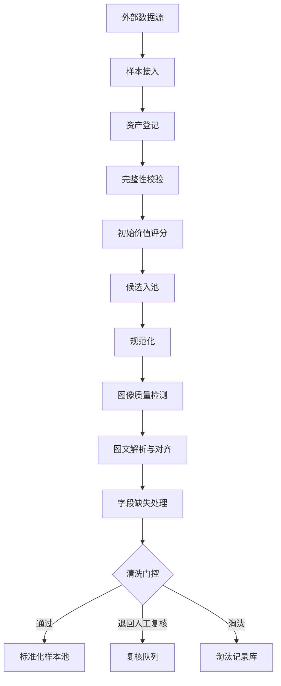
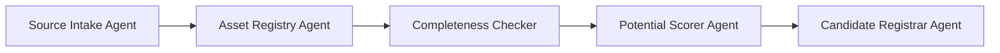
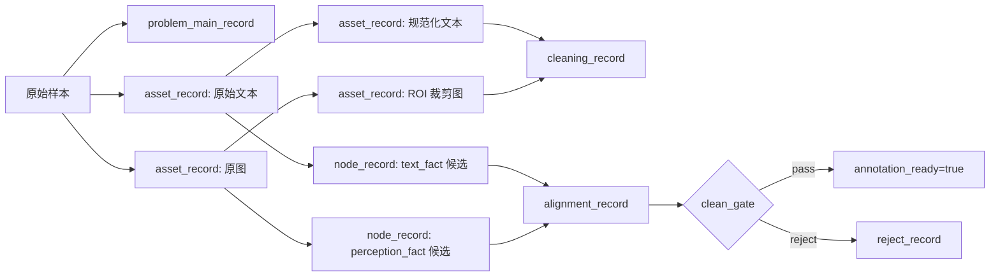

# 数据采集与清洗自动化搭建文档

## 1. 文档定位

本文档用于落地 [`plans/pipeline初步设计.md`](plans/pipeline初步设计.md) 中“采集（Collection）”与“清洗（Cleaning）”两大阶段，目标不是只描述概念，而是直接给出一套可执行、可自动化、可扩展、并且能够无缝衔接后续标注、质检、格式化发布阶段的工程化方案。

本文档重点回答以下问题：

1. 采集阶段到底采什么、怎么采、如何标准化入池。
2. 清洗阶段到底洗什么、怎么判断保留或淘汰。
3. 我们自己的数据格式应该如何设计，哪些字段来自原始数据，哪些字段由系统生成，哪些字段为后续阶段预留。
4. 节点到底如何定义，尤其是如何区分客观事实、常识属性、题目感知属性、计算得到属性、推理得到属性。
5. 如果字段缺失怎么办，哪些可以补，哪些不能补，哪些必须淘汰。
6. 图像模糊、遮挡、低分辨率、文字不可辨认时如何自动识别并剔除。
7. 如何保证后续标注、QA、发布阶段不用返工前面的数据结构。

---

## 2. 适用范围与设计目标

### 2.1 适用范围

本文档适用于以下类型的数据源：

- 多模态题目数据集
- 图文联合推理题
- 带图题、图表题、几何题、科学图示题、流程图题、读图题
- 已有原始答案、但未必有结构化解析的数据集
- 不同来源、不同格式、不同质量等级的候选题源

### 2.2 核心目标

采集与清洗阶段的核心目标不是“尽可能多地保留题”，而是“尽可能稳定地筛出适合后续深标和多解法建模的高价值样本”。

因此整个设计要同时满足四个目标：

1. **可扩展**：后面可以继续接更多数据源，而不用推翻 schema。
2. **可审计**：每个字段从哪里来、为什么被改、为什么被删，都能追溯。
3. **可门控**：每一步都有通过、退回、淘汰的明确规则。
4. **可衔接**：采集和清洗产物能直接喂给后续的 [`P/T/K/R`](plans/pipeline初步设计.md:54) 标注、[`qa_records`](plans/pipeline初步设计.md:55)、发布格式化。

### 2.3 设计原则

#### 原则 1：原始数据与生成数据严格分层

任何来自题源的字段都不能和系统生成字段混写。必须能区分：

- 原始提供字段
- 自动抽取得到字段
- 模型推断得到字段
- 规则计算得到字段
- 人工复核修订字段

#### 原则 2：先保留证据，再保留结论

对于多模态题，后续最重要的是保证来源文本、图像资产和结构化证据都可追溯。因此在采集和清洗阶段优先保留：

- 原图
- 数据集原始题干文本
- 数据集原始答案文本
- 区域框
- 图文对齐证据
- 清洗日志
- 评分依据

而不是只保留一个“清洗后的最终文本”或脱离来源的派生结论。

#### 原则 3：一切门控必须可解释

不管是入池、规范化、模糊图剔除还是清洗淘汰，都必须记录：

- 决策规则
- 决策阈值
- 命中的具体信号
- 最终处理动作

#### 原则 4：采集阶段做“广覆盖”，清洗阶段做“强约束”

- 采集阶段允许高召回、低精度，只要候选价值足够即可入候选池。
- 清洗阶段必须收紧标准，只保留适合后续深度标注的数据。

#### 原则 5：节点设计从一开始就面向后续标注

虽然正式的 [`p_facts`](plans/pipeline初步设计.md:314)、[`t_facts`](plans/pipeline初步设计.md:315)、[`k_atoms`](plans/pipeline初步设计.md:316)、[`r_nodes`](plans/pipeline初步设计.md:317) 主要在标注阶段产生，但采集与清洗阶段必须提前把“节点容器”和“节点属性规则”设计好，否则后面一定返工。

---

## 3. 采集与清洗在整条 Pipeline 中的边界

### 3.1 阶段边界

#### 采集阶段负责什么

采集阶段负责把不同来源的原始题目接入系统，形成统一候选题池。

采集阶段重点处理：

- 样本接入
- 资产登记
- 基本完整性检查
- 来源信息整理
- 稳定 ID 生成
- 初始价值评分
- 候选入池

采集阶段**不负责**：

- 深层语义纠错
- 精细图文对齐
- 最终答案规范化裁决
- 解题过程标注
- 多解法建模

#### 清洗阶段负责什么

清洗阶段负责把候选题池转化为适合后续标注的标准化样本池。

清洗阶段重点处理：

- 文本规范化
- 数据集字段标准化映射
- 单位统一
- 变量形式统一
- 图像质量判断
- 模糊图剔除
- 图像区域标准化
- 图文对齐
- 字段缺失补救或淘汰
- 保留/退回/淘汰门控

清洗阶段**不负责**：

- 穷举全部解法
- 构建完整推理图
- 做发布版数据切片

### 3.2 与后续阶段的接口要求

清洗完成后，至少要保证后续标注阶段能够直接读取以下能力：

1. 知道题目的唯一主键。
2. 知道题目有哪些图、哪些文本、哪些答案资产。
3. 知道哪些文本是原始文本，哪些是清洗修订文本。
4. 知道图中的哪些区域重要。
5. 知道图文之间有哪些显式对齐关系。
6. 知道当前题目是否存在风险，例如文本缺失风险、图像模糊风险、答案歧义风险。
7. 知道该题是否允许进入正式标注。

换句话说，清洗阶段不是只输出一个 [`clean_problem_record`](plans/pipeline初步设计.md:186)，而是要输出一套能够支撑后续所有表的“前置底座对象”。

当前实现至少会稳定产出 `clean_problem_record`、`normalized_assets`、`text_structure_record`、`visual_structure_record`、`alignment_record`、`solvability_report`、`rewrite_report`、`open_ended_problem_variants`、`cleaning_record`、`reject_record` 与 `field_audit_record`。

---

## 4. 总体自动化架构

## 4.1 总体流程

### 4.2 推荐工程组件

建议最少包含以下组件：

| 组件 | 职责 | 说明 |
| --- | --- | --- |
| `Orchestrator` | 全局编排 | 负责阶段调度、状态流转、失败重试、并发控制。 |
| `Source Connector` | 数据源接入层 | 适配不同来源的数据集格式。 |
| `Object Store` | 对象存储 | 存原图、裁剪图、标准化文本快照、对齐结果、日志。 |
| `Metadata Store` | 元数据存储 | 存主记录、资产记录、节点记录、清洗记录、淘汰记录。 |
| `Task Queue` | 异步任务队列 | 管理图像检测、对齐、规范化、清洗等任务。 |
| `Rule Engine` | 规则引擎 | 负责阈值判定、缺失处理、淘汰门控。 |
| `Model Gateway` | 模型调用层 | 统一调用 VLM、LLM、分类器等服务。 |
| `Review Console` | 人工复核入口 | 对边界样本、低置信度样本进行人工裁决。 |
| `Audit Logger` | 审计日志 | 记录所有字段变化、版本变化、决策结果。 |

### 4.3 状态机建议

每个题目主记录建议维护统一状态字段：

- `ingested`
- `registered`
- `candidate_scored`
- `candidate_accepted`
- `normalizing`
- `cleaning_review`
- `clean_passed`
- `clean_rejected`
- `archived`

这样后续任何阶段都可以按照状态增量执行，而不是全量重跑。

---

## 5. 数据对象设计总览

为了支撑后续的标注、QA、发布，建议从采集阶段开始就建立以下五类核心对象：

1. `problem_main_record`：主记录
2. `asset_record`：资产记录
3. `node_record`：节点记录
4. `cleaning_record`：清洗记录
5. `reject_record`：淘汰记录

同时建议再配八类清洗辅助对象：

6. `normalized_assets`：规范化资源包
7. `text_structure_record`：文本结构记录
8. `visual_structure_record`：视觉结构记录
9. `alignment_record`：图文对齐记录
10. `solvability_report`：可解性报告
11. `rewrite_report`：开放化改写记录
12. `open_ended_problem_variants`：开放题变体集合
13. `field_audit_record`：字段审计记录

前五类是主表；后八类用于补足清洗阶段的结构化中间产物与审计轨迹。

### 5.1 数据来源分层

每个字段必须标记 `field_origin`，推荐统一为以下枚举：

| 值 | 含义 | 说明 |
| --- | --- | --- |
| `source_provided` | 原始数据直接提供 | 来自外部数据集原字段。 |
| `source_derived` | 从原始资产直接解析得到 | 例如从文件路径解析 split、从图片读到宽高。 |
| `rule_generated` | 规则生成 | 例如哈希值、稳定 ID、清晰度分。 |
| `model_generated` | 模型生成 | 例如题型分类、图文对齐关系。 |
| `human_corrected` | 人工修正 | 例如人工纠正答案文本。 |
| `system_reserved` | 系统预留字段 | 为后续标注、QA、发布保留。 |
|

### 5.2 字段级可信度分层

建议每个关键字段同时维护：

- `value`
- `confidence`
- `field_origin`
- `evidence_refs`
- `last_updated_by`
- `last_updated_at`

这样后面 QA 或人工复核时可以直接看到字段是怎么来的。

---

## 6. 推荐数据 Schema 草案

## 6.1 主记录 [`problem_main_record`](plans/数据采集与清洗自动化搭建文档.md)

主记录是所有后续对象的根。

### 6.1.1 主记录字段表

| 字段名 | 类型 | 是否必填 | 来源类型 | 阶段 | 含义 | 缺失处理 |
| --- | --- | --- | --- | --- | --- | --- |
| `problem_id` | string | 是 | `rule_generated` | 采集 | 题目全局稳定唯一 ID | 不可缺失，缺失则不能入库 |
| `source_dataset` | string | 是 | `source_provided` | 采集 | 原始来源数据集名称 | 缺失则退回接入层补齐 |
| `source_split` | string | 否 | `source_provided/source_derived` | 采集 | train/val/test 等 | 可为空，标 `unknown` |
| `source_problem_id` | string | 否 | `source_provided` | 采集 | 原始数据集内部题号 | 可为空，但必须记录为空原因 |
| `ingest_batch_id` | string | 是 | `rule_generated` | 采集 | 当前导入批次号 | 不可缺失 |
| `problem_type` | string | 否 | `model_generated/human_corrected` | 清洗 | 题型分类，如几何、图表、流程图 | 可为空，后续补标 |
| `domain_tags` | array[string] | 否 | `source_provided/model_generated` | 采集/清洗 | 学科或领域标签 | 可为空 |
| `language` | string | 否 | `source_provided/model_generated` | 清洗 | 题面语言 | 可自动识别 |
| `raw_question_text` | string | 否 | `source_provided` | 采集 | 原始题干文本 | 若无则允许仅图模式，但需标风险 |
| `normalized_question_text` | string | 否 | `model_generated/human_corrected` | 清洗 | 规范化题干 | 如果原始文本存在则应尽量生成 |
| `raw_answer_text` | string | 否 | `source_provided` | 采集 | 原始答案 | 若答案缺失，默认不进入后续深标 |
| `normalized_answer_text` | string | 否 | `rule_generated/model_generated/human_corrected` | 清洗 | 规范化答案 | 不可校验时标风险 |
| `answer_type` | string | 否 | `model_generated/rule_generated` | 清洗 | 数值、选项、短文本、集合等 | 可自动识别 |
| `image_count` | int | 是 | `source_derived` | 采集 | 题目相关图片数量 | 无图则按纯文本题处理或直接排除 |
| `has_multiple_images` | bool | 是 | `source_derived` | 采集 | 是否多图 | 自动生成 |
| `requires_image` | bool | 否 | `model_generated/rule_generated` | 采集/清洗 | 是否必须依赖图像求解 | 低置信度则人工复核 |
| `multimodal_strength_score` | float | 否 | `model_generated/rule_generated` | 采集 | 图文联合推理强度 | 低于阈值可降优先级 |
| `multi_step_score` | float | 否 | `model_generated/rule_generated` | 采集 | 多步性潜力 | 低于阈值可降优先级 |
| `verifiability_score` | float | 否 | `model_generated/rule_generated` | 采集 | 过程可验证性评分 | 低分不一定淘汰，但需标记 |
| `quality_risk_flags` | array[string] | 否 | `rule_generated/model_generated` | 清洗 | 风险标签集合 | 可为空数组 |
| `current_status` | string | 是 | `rule_generated` | 全流程 | 当前状态机状态 | 不可缺失 |
| `clean_decision` | string | 否 | `rule_generated/human_corrected` | 清洗 | `pass/review/reject` | 清洗完成后必须有 |
| `clean_decision_reason_codes` | array[string] | 否 | `rule_generated` | 清洗 | 门控命中原因码 | 清洗完成后必须有 |
| `review_priority` | string | 否 | `rule_generated` | 清洗 | 人工复核优先级 | 默认 `normal` |
| `annotation_ready` | bool | 是 | `rule_generated` | 清洗 | 是否可进入标注阶段 | 清洗通过后为 `true` |
| `qa_precheck_ready` | bool | 是 | `system_reserved` | 清洗 | 是否满足后续 QA 前置结构要求 | 系统自动填充 |
| `release_reserved` | object | 否 | `system_reserved` | 清洗 | 为发布阶段预留的版本字段 | 默认空对象 |
| `candidate_id` | string | 否 | `rule_generated` | 采集/清洗 | 候选池阶段的稳定关联 ID | 可为空，但进入清洗结果后建议回填 |
| `rewrite_strategy` | string | 否 | `model_generated/rule_generated` | 清洗 | 题型改写策略 | 未改写时可为空 |
| `open_variant_count` | int | 是 | `rule_generated` | 清洗 | 开放题变体数量 | 默认 `0` |
| `text_dominant` | bool | 是 | `rule_generated` | 清洗 | 是否走文本优先清洗支路 | 自动生成 |
| `cleaning_path` | string | 是 | `rule_generated` | 清洗 | 清洗路径，如 `text_lightweight` / `multimodal_full` | 自动生成 |
| `alignment_status` | string | 否 | `model_generated/rule_generated` | 清洗 | 图文对齐状态 | 文本主导题可为轻量结果 |
| `solvability_score` | float | 否 | `rule_generated/model_generated` | 清洗 | 最小可解性得分 | 低分进入复核或淘汰 |
| `solvability_decision_hint` | string | 否 | `rule_generated/model_generated` | 清洗 | 可解性给出的 `pass/review/reject` 建议 | 供门控参考 |
| `created_at` | datetime | 是 | `rule_generated` | 采集 | 创建时间 | 不可缺失 |
| `updated_at` | datetime | 是 | `rule_generated` | 全流程 | 最后更新时间 | 不可缺失 |

### 6.1.2 主记录中的字段分层建议

主记录里的字段建议从业务上分成四层：

1. **来源层**：题来自哪里。
2. **内容层**：题干、答案、语言、题型。
3. **评估层**：多模态强度、多步性、可验证性、风险标签。
4. **状态层**：当前处理到哪一步、是否可进入标注、是否需要人工复核。

这样后续无论是做统计、调度还是做 QA，都很容易按层处理。

---

## 6.2 资产记录 [`asset_record`](plans/数据采集与清洗自动化搭建文档.md)

资产记录用于管理图像、文本、中间裁剪图、答案文件等所有原始与衍生资源。

### 6.2.1 资产记录字段表

| 字段名 | 类型 | 是否必填 | 来源类型 | 阶段 | 含义 | 缺失处理 |
| --- | --- | --- | --- | --- | --- | --- |
| `asset_id` | string | 是 | `rule_generated` | 采集 | 资产唯一 ID | 不可缺失 |
| `problem_id` | string | 是 | `rule_generated` | 采集 | 关联题目 ID | 不可缺失 |
| `asset_type` | string | 是 | `source_provided/source_derived` | 采集 | `image/text/answer/crop/metadata` | 不可缺失 |
| `asset_role` | string | 是 | `rule_generated` | 采集/清洗 | `primary_image/aux_image/question_text_source/question_text_normalized/raw_answer/normalized_answer` 等 | 不可缺失 |
| `source_uri` | string | 否 | `source_provided` | 采集 | 原始路径或来源地址 | 可为空 |
| `storage_uri` | string | 是 | `rule_generated` | 采集 | 存储位置 | 不可缺失 |
| `file_format` | string | 否 | `source_derived` | 采集 | `jpg/png/webp/txt/json` 等 | 自动解析 |
| `file_size_bytes` | int | 否 | `source_derived` | 采集 | 文件大小 | 自动解析 |
| `width` | int | 否 | `source_derived` | 采集 | 图像宽度 | 非图像资产可为空 |
| `height` | int | 否 | `source_derived` | 采集 | 图像高度 | 非图像资产可为空 |
| `sha256` | string | 是 | `rule_generated` | 采集 | 文件哈希，用于资产审计、追踪与完整性校验 | 不可缺失 |
| `perceptual_hash` | string | 否 | `rule_generated` | 清洗 | 感知哈希，用于图像视觉指纹、资产回溯与裁剪一致性比对 | 图像资产建议生成 |
| `source_text_snapshot` | string | 否 | `source_provided` | 采集 | 从原始数据集读取到的文本快照 | 非文本资产可为空 |
| `normalized_text_snapshot` | string | 否 | `rule_generated/model_generated/human_corrected` | 清洗 | 规范化后的文本快照 | 非文本资产可为空 |
| `text_completeness_score` | float | 否 | `rule_generated/model_generated` | 清洗 | 文本字段完整性评分 | 非文本资产可为空 |
| `blur_score` | float | 否 | `rule_generated` | 清洗 | 模糊度评分 | 图像资产建议必算 |
| `readability_score` | float | 否 | `model_generated/rule_generated` | 清洗 | 图像关键信息可辨认性评分 | 图像资产建议必算 |
| `noise_score` | float | 否 | `rule_generated` | 清洗 | 噪声评分 | 图像资产建议必算 |
| `cropped_from_asset_id` | string | 否 | `rule_generated` | 清洗 | 如果是裁剪图，指向原图 | 原图为空 |
| `roi_bbox` | object | 否 | `model_generated/human_corrected` | 清洗 | 区域框 | 非裁剪资产可为空 |
| `asset_quality_flags` | array[string] | 否 | `rule_generated/model_generated` | 清洗 | 资产风险标签 | 可为空数组 |
| `is_usable` | bool | 是 | `rule_generated/human_corrected` | 清洗 | 当前资产能否继续使用 | 不可缺失 |
| `discard_reason_codes` | array[string] | 否 | `rule_generated` | 清洗 | 资产淘汰原因码 | 淘汰时必填 |
| `created_at` | datetime | 是 | `rule_generated` | 采集 | 创建时间 | 不可缺失 |
| `updated_at` | datetime | 是 | `rule_generated` | 全流程 | 更新时间 | 不可缺失 |

### 6.2.2 资产角色设计建议

`asset_role` 不建议只写笼统的 `image`，而要写清楚它在题中的职责，例如：

- `primary_image`
- `auxiliary_image`
- `diagram_image`
- `chart_image`
- `question_text_source`
- `question_text_normalized`
- `answer_raw`
- `answer_normalized`
- `answer_raw`
- `answer_normalized`
- `region_crop`
- `review_snapshot`

这样后续 [`Visual Parser Agent`](plans/pipeline初步设计.md:290) 和 [`Alignment Agent`](plans/pipeline初步设计.md:292) 读取时不用再猜。

---

## 6.3 节点记录 [`node_record`](plans/数据采集与清洗自动化搭建文档.md)

节点记录是本文档最关键的部分之一。虽然正式节点大规模生成发生在标注阶段，但从清洗阶段就必须有统一定义，否则后续会出现“节点类型不一致、属性来源不一致、支撑证据断裂”的问题。

### 6.3.1 节点定义原则

一个节点表示“某个可引用、可追溯、可被后续推理或验证使用的信息单元”。

节点不能只是一句自然语言。节点必须能回答：

1. 这个信息是什么。
2. 它属于哪一类。
3. 它从哪里来。
4. 它的可信度如何。
5. 它能否直接作为后续推理支撑。
6. 它是否允许被修订。

### 6.3.2 节点大类

建议统一采用以下一级节点类型：

| 节点类型 | 含义 | 对应后续阶段 |
| --- | --- | --- |
| `perception_fact` | 图像中客观可见的事实 | 对应后续 [`p_facts`](plans/pipeline初步设计.md:314) |
| `text_fact` | 题干明确给出的条件、目标、限制 | 对应后续 [`t_facts`](plans/pipeline初步设计.md:315) |
| `knowledge_atom` | 常识、规则、定理、领域知识 | 对应后续 [`k_atoms`](plans/pipeline初步设计.md:316) |
| `derived_value` | 通过规则或计算直接算出来的值 | 为后续推理做桥接 |
| `reasoning_claim` | 推理得到的中间结论 | 对应后续 [`r_nodes`](plans/pipeline初步设计.md:317) |
| `answer_claim` | 最终答案节点 | 对应后续答案验证 |
| `quality_signal` | 与清洗、质量、风险相关的节点 | 供清洗门控和 QA 使用 |

### 6.3.3 节点属性分层

针对你特别强调的“每个节点需要有属性，客观事实或者常识属性，题目中感知的，计算得到的，推理得到的等属性”，建议将每个节点统一包含以下属性层：

| 属性层 | 字段 | 含义 |
| --- | --- | --- |
| 节点身份层 | `node_id`、`problem_id`、`node_type` | 节点是谁、属于哪道题、属于哪类节点 |
| 内容层 | `canonical_value`、`surface_forms` | 节点的标准表达和表面表达 |
| 来源层 | `origin_kind`、`source_refs` | 来自图、文本、知识库、规则计算还是推理生成 |
| 认知层 | `cognitive_level` | 客观事实、常识、感知、计算、推理 |
| 支撑层 | `evidence_refs`、`upstream_node_ids` | 由哪些证据或前驱节点支撑 |
| 质量层 | `confidence`、`verifiability`、`ambiguity_level` | 节点质量如何 |
| 生命周期层 | `stage_created`、`status`、`version` | 节点在哪个阶段创建，目前是否有效 |

### 6.3.4 节点记录字段表

| 字段名 | 类型 | 是否必填 | 来源类型 | 阶段 | 含义 |
| --- | --- | --- | --- | --- | --- |
| `node_id` | string | 是 | `rule_generated` | 清洗/标注 | 节点唯一 ID |
| `problem_id` | string | 是 | `rule_generated` | 清洗/标注 | 所属题目 |
| `node_type` | string | 是 | `rule_generated` | 清洗/标注 | 节点类型 |
| `canonical_value` | string | 是 | `model_generated/rule_generated/human_corrected` | 清洗/标注 | 标准化节点表达 |
| `surface_forms` | array[string] | 否 | `source_provided/model_generated` | 清洗/标注 | 原始或候选表达集合 |
| `origin_kind` | string | 是 | `rule_generated` | 清洗/标注 | `image/text/knowledge/calculation/reasoning/system_quality` |
| `cognitive_level` | string | 是 | `rule_generated` | 清洗/标注 | `objective/common_sense/perceived/computed/inferred` |
| `source_refs` | array[string] | 否 | `rule_generated` | 清洗/标注 | 引用到哪些资产或来源片段 |
| `evidence_refs` | array[string] | 否 | `rule_generated/model_generated` | 清洗/标注 | 具体证据引用 |
| `upstream_node_ids` | array[string] | 否 | `rule_generated` | 标注 | 上游节点 |
| `value_type` | string | 否 | `rule_generated` | 清洗/标注 | `text/number/boolean/option/span/relation/object` |
| `normalized_value` | object | 否 | `rule_generated/model_generated` | 清洗/标注 | 结构化值 |
| `unit` | string | 否 | `rule_generated/model_generated` | 清洗/标注 | 数值类节点单位 |
| `confidence` | float | 否 | `model_generated/rule_generated` | 清洗/标注 | 置信度 |
| `verifiability` | string | 否 | `rule_generated/model_generated` | 清洗/标注 | `high/medium/low/unverifiable` |
| `ambiguity_level` | string | 否 | `model_generated` | 清洗/标注 | `none/low/medium/high` |
| `is_direct_from_source` | bool | 是 | `rule_generated` | 清洗/标注 | 是否可直接在原始数据中定位 |
| `is_generated_by_system` | bool | 是 | `rule_generated` | 清洗/标注 | 是否由系统新生成 |
| `is_reviewed_by_human` | bool | 是 | `rule_generated` | 清洗/标注 | 是否经过人工确认 |
| `stage_created` | string | 是 | `rule_generated` | 清洗/标注 | 创建节点的阶段 |
| `status` | string | 是 | `rule_generated` | 清洗/标注 | `active/deprecated/rejected/pending_review` |
| `version` | int | 是 | `rule_generated` | 清洗/标注 | 节点版本号 |
| `created_at` | datetime | 是 | `rule_generated` | 清洗/标注 | 创建时间 |
| `updated_at` | datetime | 是 | `rule_generated` | 清洗/标注 | 更新时间 |

### 6.3.5 节点的 `cognitive_level` 推荐定义

这是整个后续体系中非常重要的一列，建议强制要求所有节点都打这个标签：

| 取值 | 定义 | 示例 |
| --- | --- | --- |
| `objective` | 与观察者无关的客观事实 | 图中有三条线段；题干写明 AB=5 |
| `common_sense` | 不特属于该题，但可合理调用的常识知识 | 白天通常有太阳；温度升高时水银柱上升 |
| `perceived` | 从题目图像、图表、布局、标注中感知得到 | 图中箭头指向右侧；折线先升后降 |
| `computed` | 通过显式规则、公式或程序计算得到 | 5+3=8；面积=长×宽 |
| `inferred` | 通过多步推理得到，不能直接观察或简单计算得到 | 因为趋势变化且条件成立，所以答案应选 C |

其中：

- `objective` 更强调“题源明示”。
- `perceived` 更强调“从图或布局感知出来”。
- `computed` 更强调“程序可复算”。
- `inferred` 更强调“依赖前提链条”。
- `common_sense` 更强调“非题内但允许使用的知识”。

### 6.3.6 节点记录在采集与清洗阶段的用途

虽然采集和清洗阶段不会产生完整的推理图，但仍建议建立以下初级节点：

1. `perception_fact` 候选节点：记录图中明显实体、标注、区域、方向、趋势。
2. `text_fact` 候选节点：记录题干中的已知条件、目标、约束。
3. `quality_signal` 节点：记录图像模糊、文本字段缺失或低完整度、答案歧义等风险。
4. `derived_value` 节点：记录由规则直接计算出的属性，例如图片宽高、清晰度分、文本长度等。

这样后续正式标注时不是从零开始，而是在清洗阶段已有“可回收的前置结构”。

---

## 6.4 清洗记录 [`cleaning_record`](plans/数据采集与清洗自动化搭建文档.md)

清洗记录用于保存一次完整清洗过程中的动作、输入、输出和决策。

### 6.4.1 清洗记录字段表

| 字段名 | 类型 | 是否必填 | 来源类型 | 含义 |
| --- | --- | --- | --- | --- |
| `cleaning_id` | string | 是 | `rule_generated` | 一次清洗流程实例 ID |
| `problem_id` | string | 是 | `rule_generated` | 所属题目 |
| `cleaning_version` | string | 是 | `rule_generated` | 清洗规则版本 |
| `pipeline_run_id` | string | 是 | `rule_generated` | 当前流水线运行 ID |
| `dataset_name` | string | 是 | `source_provided` | 数据集名称 |
| `cleaning_path` | string | 否 | `rule_generated` | 本次命中的清洗路径 |
| `text_dominant` | bool | 否 | `rule_generated` | 是否走文本优先清洗支路 |
| `input_asset_ids` | array[string] | 是 | `rule_generated` | 本次使用的输入资产 |
| `normalization_actions` | array[object] | 否 | `rule_generated/model_generated` | 文本、答案、单位、变量的规范化动作 |
| `quality_checks` | array[object] | 否 | `rule_generated/model_generated` | 各类质量检查结果 |
| `alignment_summary` | object | 否 | `model_generated` | 图文对齐摘要 |
| `text_structure_summary` | object | 否 | `model_generated/rule_generated` | 文本结构摘要 |
| `solvability_summary` | object | 否 | `model_generated/rule_generated` | 最小可解性摘要 |
| `rewrite_summary` | object | 否 | `model_generated/rule_generated` | 题型改写与开放题变体摘要 |
| `missing_field_summary` | object | 否 | `rule_generated` | 缺失字段及处理方式 |
| `risk_flags` | array[string] | 否 | `rule_generated/model_generated` | 风险标签 |
| `clean_score` | float | 否 | `rule_generated` | 综合清洗得分 |
| `decision` | string | 是 | `rule_generated/human_corrected` | `pass/review/reject` |
| `decision_reason_codes` | array[string] | 是 | `rule_generated` | 决策原因码 |
| `review_ticket_id` | string | 否 | `rule_generated` | 人工复核工单 |
| `operator_type` | string | 是 | `rule_generated` | `system/human/hybrid` |
| `started_at` | datetime | 是 | `rule_generated` | 开始时间 |
| `finished_at` | datetime | 是 | `rule_generated` | 结束时间 |

### 6.4.2 清洗动作建议结构

`normalization_actions` 中建议至少记录：

- 动作类型，例如 `text_normalized`、`unit_normalized`、`answer_canonicalized`
- 修改前值
- 修改后值
- 触发规则或模型
- 置信度
- 是否人工确认

这部分对后续 QA 追查非常重要。

---

## 6.5 淘汰记录 [`reject_record`](plans/数据采集与清洗自动化搭建文档.md)

淘汰记录不能只写一句“图像不好”。必须结构化。

### 6.5.1 淘汰记录字段表

| 字段名 | 类型 | 是否必填 | 来源类型 | 含义 |
| --- | --- | --- | --- | --- |
| `reject_id` | string | 是 | `rule_generated` | 淘汰记录 ID |
| `problem_id` | string | 是 | `rule_generated` | 所属题目 |
| `stage` | string | 是 | `rule_generated` | 在哪一阶段淘汰 |
| `reject_level` | string | 是 | `rule_generated` | `asset/problem/pipeline_run` |
| `reject_reason_codes` | array[string] | 是 | `rule_generated` | 原因码列表 |
| `reject_reason_detail` | string | 否 | `rule_generated/human_corrected` | 详细说明 |
| `blocking_fields` | array[string] | 否 | `rule_generated` | 导致淘汰的关键字段 |
| `evidence_refs` | array[string] | 否 | `rule_generated/model_generated` | 证据引用 |
| `recoverable` | bool | 是 | `rule_generated` | 是否可通过补数据恢复 |
| `recommended_action` | string | 否 | `rule_generated` | `drop/recollect/manual_fix/recollect_from_source` |
| `reviewed_by` | string | 否 | `human_corrected` | 人工裁定人 |
| `created_at` | datetime | 是 | `rule_generated` | 创建时间 |

### 6.5.2 推荐淘汰原因码

| 原因码 | 含义 |
| --- | --- |
| `missing_core_image` | 缺主图 |
| `missing_question_text` | 缺题干文本 |
| `missing_answer` | 缺答案 |
| `image_unreadable` | 图像不可辨认 |
| `severe_blur` | 严重模糊 |
| `source_text_unrecoverable` | 来源文本无法回补 |
| `text_image_misaligned` | 图文严重不对齐 |
| `answer_ambiguous` | 答案歧义且不可裁决 |
| `low_multimodal_dependency` | 图像依赖度过低 |
| `not_multistep_enough` | 多步性不足 |
| `duplicate_problem` | 与已有样本重复 |
| `corrupted_asset` | 资产损坏 |

---

## 6.6 对齐记录 [`alignment_record`](plans/数据采集与清洗自动化搭建文档.md)

虽然用户没有强制要求单列这个表，但从后续标注与 QA 的可用性看，强烈建议单独保存。

| 字段名 | 类型 | 是否必填 | 含义 |
| --- | --- | --- | --- |
| `alignment_id` | string | 是 | 对齐记录 ID |
| `problem_id` | string | 是 | 所属题目 |
| `image_entity_refs` | array[string] | 否 | 图像实体引用 |
| `text_span_refs` | array[string] | 否 | 文本片段引用 |
| `alignment_pairs` | array[object] | 否 | 对齐对列表 |
| `conflict_pairs` | array[object] | 否 | 冲突对列表 |
| `coverage_score` | float | 否 | 图文覆盖率 |
| `consistency_score` | float | 否 | 一致性得分 |
| `alignment_status` | string | 是 | `good/risky/bad` |
| `created_at` | datetime | 是 | 创建时间 |

---

## 7. 哪些字段直接得到，哪些字段系统生成

这是设计数据格式时必须提前讲清楚的地方。

## 7.1 直接来自原始数据的字段

这类字段原则上不允许被覆盖，只允许“派生出清洗版本”。

典型字段包括：

- `source_dataset`
- `source_split`
- `source_problem_id`
- `raw_question_text`
- `raw_answer_text`
- 原始图片文件
- 原始来源元数据

这些字段必须原样保留。

## 7.2 可由规则直接生成的字段

这类字段最稳定，应该优先依赖规则而不是模型。

典型字段包括：

- `problem_id`
- `asset_id`
- `sha256`
- `perceptual_hash`
- `image_count`
- `width`
- `height`
- `blur_score`
- `current_status`
- `clean_decision_reason_codes`
- `created_at`
- `updated_at`

## 7.3 可由模型生成的字段

这类字段有价值，但必须带置信度和证据。

典型字段包括：

- `normalized_question_text`
- `normalized_answer_text`
- `problem_type`
- `requires_image`
- `multimodal_strength_score`
- `multi_step_score`
- `alignment_pairs`
- `text_fact` 候选节点
- `perception_fact` 候选节点
- `quality_risk_flags`

## 7.4 系统为后续阶段预留的字段

这类字段在采集和清洗阶段可能为空，但 schema 必须提前留好。

典型字段包括：

- `annotation_ready`
- `qa_precheck_ready`
- `release_reserved`
- `node_record.upstream_node_ids`
- `node_record.verifiability`
- `node_record.version`
- `problem_main_record.review_priority`

### 7.5 严格禁止直接覆写原始字段

例如：

- 不能把 `raw_question_text` 直接改成清洗后的文本。
- 不能把原始答案直接替换成规范化答案。
- 不能删除原始模糊图，只能标 `is_usable=false` 并记录淘汰原因。

这是为了后续审计、追责、复现和重新清洗。

---

## 8. 字段缺失处理策略

“如果有一个字段没有的话应该怎么办”必须变成明确规则，而不是临时拍脑袋。

## 8.1 先按字段重要性分级

建议将字段分为四级：

| 等级 | 含义 | 处理原则 |
| --- | --- | --- |
| `P0` | 核心阻断字段 | 缺失即不可继续 |
| `P1` | 高优先关键字段 | 优先补齐，补不齐则进入人工复核或淘汰 |
| `P2` | 可选增强字段 | 可为空，但需记录缺失 |
| `P3` | 统计或预留字段 | 可延后补全 |

### 8.1.1 推荐字段等级

#### `P0` 核心阻断字段

- `problem_id`
- 至少一份主图或明确声明该题无需图
- 题目主内容（图或题干二者不能都没有）
- `raw_answer_text` 或可替代答案来源
- 资产可读取

#### `P1` 高优先关键字段

- `normalized_question_text`
- `normalized_answer_text`
- `requires_image`
- `blur_score`
- `clean_decision`
- 图文对齐结果摘要

#### `P2` 可选增强字段

- `domain_tags`
- `problem_type`
- `roi_bbox`
- `text_completeness_score`

#### `P3` 预留字段

- `release_reserved`
- `review_priority`
- 非关键统计字段

## 8.2 缺失处理动作枚举

建议统一定义以下动作：

| 动作 | 含义 |
| --- | --- |
| `backfill_from_source` | 回源补数 |
| `derive_by_rule` | 规则推导 |
| `generate_by_model` | 模型补全 |
| `manual_review` | 人工复核 |
| `leave_null_with_flag` | 保留空值并打风险标 |
| `hard_reject` | 直接淘汰 |

## 8.3 具体缺失场景处理建议

### 场景 1：缺 `source_problem_id`

处理：

- 不阻断入库。
- 由系统生成 `problem_id`。
- `source_problem_id` 保留空值。
- 在 `missing_field_summary` 中记录。

### 场景 2：缺题干，但图片完整

处理：

- 若来源中存在补充文本字段、解析页或元数据，则走 `回源补数 -> 规范化 -> 人工边界复核`。
- 若回源后仍不可恢复，则进入 `review/reject`。
- 不允许无任何题面信息直接进入深标。

### 场景 3：缺答案

处理：

- 默认视为高风险。
- 除非来源中可从解析页、选项页或元数据恢复答案，否则不进入后续标注。
- 优先打入 `manual_review` 或 `hard_reject`。

### 场景 4：缺图，但题目标注为多模态题

处理：

- 直接判为 `P0` 缺失。
- 若可回源补图，则先补图。
- 无法补图则淘汰。

### 场景 5：缺 `normalized_question_text`

处理：

- 可在清洗阶段补齐。
- 但若原始文本存在且系统一直无法规范化，则进入人工复核。

### 场景 6：缺 `blur_score`

处理：

- 不允许作为最终清洗结果提交。
- 图像资产必须跑质量检测。
- 否则清洗流程状态停留在 `normalizing` 或 `review`。

---

## 9. 图像模糊与不可辨认样本剔除规则

你特别要求“清洗阶段，遇到图像比较模糊不好辨认的情况，剔除掉”，这一点必须独立成硬规则。

## 9.1 为什么必须硬剔除

对于多模态推理任务，如果图像本身不可辨认，会带来四类严重问题：

1. 后续 [`Perception Extraction Agent`](plans/pipeline初步设计.md:442) 会从错误视觉信号中提取错误事实。
2. 后续 [`Evidence Binder Agent`](plans/pipeline初步设计.md:449) 无法绑定稳定证据。
3. QA 无法判断问题来自原图质量还是后续处理流程。
4. 即使答案正确，也无法用来做可靠的过程监督。

因此模糊图不是“质量差一点”，而是“可能破坏整个后续标注可靠性”的硬问题。

## 9.2 模糊图判定信号

建议不要只依赖单一 `blur_score`，而是多信号联合。

| 信号 | 检测方式 | 作用 |
| --- | --- | --- |
| `blur_score` | Laplacian 方差、边缘强度 | 判断整体失焦 |
| `readability_score` | 文本区域可读率、关键符号可辨识率 | 判断文字是否可辨认 |
| `resolution_check` | 最小分辨率阈值 | 判断是否像素过低 |
| `text_density_check` | 文本区域密度与可辨识关键字符差值 | 判断有字但读不清 |
| `contrast_score` | 对比度检测 | 判断是否过暗或过亮 |
| `crop_integrity_check` | 主体是否被截断 | 判断截图是否残缺 |
| `visual_conflict_rate` | 多模型视觉抽取差异率 | 判断视觉解析是否稳定 |

## 9.3 推荐剔除规则

建议采用“三层门控”：

### 第一层：硬阈值淘汰

命中以下任一条件，直接淘汰：

- 主图分辨率低于最低阈值且不可上采样恢复。
- `readability_score` 极低，题干、关键数字、选项均不可辨认。
- 关键区域严重截断。
- 图片文件损坏。
- 模糊导致答案验证所需关键信息不可恢复。

### 第二层：风险复核

命中以下条件，进入人工复核：

- 整体可见，但关键局部略模糊。
- 关键文字大部分可辨认，但少量核心符号不稳定。
- 不同视觉模型抽取结果差异较大。
- 原图模糊，但存在可疑似恢复空间。

### 第三层：通过但挂风险标

满足以下条件可保留，但挂风险标：

- 图像整体清晰，只有非关键边缘区域略模糊。
- 关键对象、数字、图形关系均清楚。
- 关键区域可通过裁剪增强后稳定识别。

## 9.4 模糊图原因码建议

| 原因码 | 说明 |
| --- | --- |
| `severe_global_blur` | 整图严重失焦 |
| `key_region_blur` | 关键区域模糊 |
| `key_text_unreadable` | 关键文本不可辨认 |
| `low_resolution` | 分辨率过低 |
| `severe_crop_loss` | 裁剪缺损严重 |
| `contrast_too_low` | 对比度过低 |
| `visual_parser_unstable` | 视觉解析不稳定 |

## 9.5 模糊图剔除的工程实现建议

### 9.5.1 检测顺序

1. 读取图片元数据。
2. 跑基础质量指标。
3. 跑关键区域检测。
4. 检查关键文本与符号可辨认性。
5. 跑多模型视觉一致性检查。
6. 汇总成图像质量结论。

### 9.5.2 输出格式建议

所有图像质量判断结果都写入 [`asset_record`](plans/数据采集与清洗自动化搭建文档.md) 和 [`cleaning_record`](plans/数据采集与清洗自动化搭建文档.md)，至少保存：

- 原图引用
- 关键分数
- 命中的原因码
- 是否属于主图问题
- 是否建议复核
- 最终是否可用

---

## 10. 采集自动化搭建方案

## 10.1 采集阶段目标

采集阶段要形成的是“高召回候选池”，而不是“最终可发布样本”。

因此建议采集阶段输出最少包含：

- 一条 [`problem_main_record`](plans/数据采集与清洗自动化搭建文档.md)
- 若干条 [`asset_record`](plans/数据采集与清洗自动化搭建文档.md)
- 零到若干条初始 [`node_record`](plans/数据采集与清洗自动化搭建文档.md)
- 一条候选评分结果

## 10.2 采集阶段标准流程

### Step C1：数据源接入

输入：外部数据集、文件系统、网页抓取结果或已有压缩包。

动作：

- 读取源数据 schema。
- 建立数据源映射配置。
- 识别图像、文本、答案、元数据字段。
- 记录源数据版本。

输出：原始样本包。

### Step C2：稳定 ID 生成

建议 `problem_id` 由以下信息生成：

- `source_dataset`
- `source_problem_id`（如果有）
- 主图哈希摘要
- 批次号

如果没有原始题号，则使用稳定内容指纹，避免每次导入都变 ID。

### Step C3：资产登记

动作：

- 给每个图片、文本、答案对象生成 `asset_id`
- 写入存储
- 计算哈希
- 读取基础文件属性
- 建立 `problem_id -> asset_id` 映射

### Step C4：完整性检查

最少检查：

- 题目是否有内容承载体
- 是否至少存在一个答案来源
- 图像文件是否损坏
- 文本编码是否正常
- 元数据是否能关联到主记录

### Step C5：候选价值评分

建议采集阶段做三类初始分：

| 分数 | 含义 | 推荐来源 |
| --- | --- | --- |
| `multimodal_strength_score` | 是否真的依赖图像 | 规则 + VLM |
| `multi_step_score` | 是否至少是多步推理 | 规则 + LLM |
| `verifiability_score` | 后续是否容易验证 | 规则 + 轻量模型 |

### Step C6：候选入池

规则：

- 只要不是明显垃圾样本，就尽量入候选池。
- 低分样本可以降优先级，不建议采集阶段过早强淘汰。
- 但 `P0` 缺失样本不应进入候选池。

## 10.3 采集阶段推荐 Agent 编排

### 10.3.1 推荐职责

| Agent | 主要职责 | 关键输出 |
| --- | --- | --- |
| `Source Intake Agent` | 读取并映射原始数据源 | 原始样本包 |
| `Asset Registry Agent` | 登记所有原始资产 | [`asset_record`](plans/数据采集与清洗自动化搭建文档.md) |
| `Completeness Checker` | 做字段与资产完整性检查 | 完整性报告 |
| `Potential Scorer Agent` | 计算初始价值分 | 候选评分 |
| `Candidate Registrar Agent` | 生成候选题池记录 | 候选主记录 |

---

## 11. 清洗自动化搭建方案

## 11.1 清洗阶段总目标

清洗阶段不是简单“修文案”，而是把候选样本变成“后续标注可信可用的结构化样本”。

一个样本要进入后续标注，至少要满足：

1. 主图可辨认。
2. 题面文本在源数据中完整且可规范化。
3. 答案有稳定表示。
4. 图文之间不是严重冲突。
5. 基础字段齐备。
6. 风险可解释。

## 11.2 清洗阶段标准流程

### Step L1：规范化

动作：

- 源文本字段规范化
- Unicode 清洗
- 单位统一
- 变量名统一
- 答案格式标准化
- 多图排序标准化
- 题面段落拆分标准化

### Step L2：图像质量检测

动作：

- 计算图像模糊度
- 评估关键文本与符号可辨认性
- 评估分辨率与对比度
- 检查截图完整性
- 标记不可用资产

### Step L3：图像区域标准化

动作：

- 检出关键图像区域
- 裁剪 ROI
- 给 ROI 分配 `asset_id`
- 记录 `roi_bbox`
- 供后续视觉抽取和图文对齐使用

### Step L4：文本结构抽取

动作：

- 抽题干条件
- 抽目标与回答槽位
- 抽约束与实体提及
- 抽选项与答案类型
- 记录变量别名、单位提及与文本结构状态

### Step L5：视觉结构抽取

动作：

- 抽对象、区域与局部 ROI
- 抽标注与全局属性
- 抽几何关系、位置关系、方向关系、趋势关系
- 为多图样本分别生成 `visual_structure_record`，并形成初级 `perception_fact` 节点

### Step L6：图文对齐

动作：

- 把文本中提到的对象与图中实体对齐
- 把文本条件与图中标注或区域对齐
- 记录冲突、缺失与歧义
- 形成 [`alignment_record`](plans/数据采集与清洗自动化搭建文档.md)，并为 `solvability_report` 提供输入

### Step L7：缺失字段处理

动作：

- 判断缺失字段等级
- 尝试回源、规则补、模型补
- 不能补则进入复核或淘汰

### Step L8：清洗门控

动作：

- 汇总质量信号、对齐结果与缺失处理结果
- 结合 rewrite / text structure / solvability 信号
- 决策 `pass/review/reject`
- 产出 `clean_problem_record`、`cleaning_record`，必要时落 `reject_record`

## 11.3 清洗阶段保留/复核/淘汰规则

### 11.3.1 通过条件

满足以下条件可通过：

- 主图清晰可辨认
- 题干与答案稳定
- 图文对齐整体良好
- 核心字段完整
- 风险可控

### 11.3.2 复核条件

命中以下任一条件建议进入人工复核：

- 源文本补齐或规范化结果置信度较低，但仍有恢复空间
- 关键局部轻度模糊
- 图文对齐存在少量冲突
- 答案表达有轻度歧义但可裁决
- 模型评分边界样本

### 11.3.3 淘汰条件

命中以下任一条件建议淘汰：

- 主图不可辨认
- 核心字段缺失且不可恢复
- 图文严重冲突
- 答案不可验证且不可恢复
- 明显不是目标任务类型

---

## 12. 面向后续标注与 QA 的预埋设计

采集和清洗阶段如果只顾自己方便，后续一定返工。因此必须从一开始预埋后续需要的信息。

## 12.1 为标注阶段预埋什么

至少要预埋：

- 清洗后的图像资产和 ROI
- 图像/文本的可引用片段 ID
- 初级 `perception_fact` 候选节点
- 初级 `text_fact` 候选节点
- 图文对齐关系
- 风险节点
- 答案类型和标准答案表示

这能直接帮助后续 [`Perception Extraction Agent`](plans/pipeline初步设计.md:442)、[`Text Condition Agent`](plans/pipeline初步设计.md:443)、[`Evidence Binder Agent`](plans/pipeline初步设计.md:449) 省掉大量重复工作。

## 12.2 为 QA 阶段预埋什么

至少要预埋：

- 字段来源
- 字段修改历史
- 图像质量信号
- 清洗动作日志
- 决策原因码
- 对齐冲突记录
- 是否人工复核

这样后续 [`Rule Check Agent`](plans/pipeline初步设计.md:573) 和 [`Multimodal Verifier Agent`](plans/pipeline初步设计.md:574) 才能准确定位问题来源。

## 12.3 为发布阶段预埋什么

至少要预埋：

- 稳定主键
- 稳定资产引用
- 节点版本号
- 可追踪的状态机
- 可导出的结构化字段

这样后续 [`Formatter Agent`](plans/pipeline初步设计.md:667) 才能直接落表。

---

## 13. 工程实现细节建议

## 13.1 任务编排

推荐以“题目”为最小处理单元，以“资产”为子任务单元。

- 题目级任务负责主状态流转。
- 资产级任务负责图像检查、文本规范化、裁剪、质量评估。
- 对齐和门控作为题目级汇总任务执行。

## 13.2 队列设计

建议按任务类型拆队列：

- `ingest_queue`
- `text_normalization_queue`
- `image_quality_queue`
- `normalization_queue`
- `alignment_queue`
- `clean_gate_queue`
- `manual_review_queue`

这样便于单独扩缩容。

## 13.3 重试机制

不同任务建议不同重试策略：

| 任务 | 重试建议 |
| --- | --- |
| 文件读取失败 | 自动重试 3 次 |
| 回源补数失败 | 自动重试 2 次，必要时切备用数据镜像 |
| 图像质量检测失败 | 自动重试 1 次后报警 |
| 对齐任务失败 | 自动重试 1 次后进入人工复核 |
| 规则校验失败 | 不重试，直接返回错误 |

## 13.4 日志与审计

建议三层日志：

1. **运行日志**：记录任务执行是否成功。
2. **字段审计日志**：记录字段值如何变化。
3. **决策日志**：记录为什么通过、复核或淘汰。

### 13.4.1 字段审计最少记录

- 字段名
- 修改前值
- 修改后值
- 修改方式
- 触发规则/模型
- 操作者
- 时间

## 13.5 人工复核入口

人工复核不要做成全量人工，而是只处理边界样本。

推荐进入人工复核的情形：

- 模糊图边界样本
- 文本缺漏边界样本
- 图文冲突样本
- 答案歧义样本
- 低置信度但高价值样本

人工复核页面建议直接展示：

- 原图
- 裁剪图
- 来源文本快照与规范化文本
- 原始题干与规范化题干
- 清晰度分数
- 对齐结果
- 规则命中情况
- 当前建议动作

## 13.6 阈值配置管理

所有门控阈值不要硬编码在脚本里，建议统一配置化，例如：

- 最低分辨率阈值
- 模糊度阈值
- 关键文本可辨认性阈值
- 图文一致性阈值
- 通过/复核/淘汰综合分阈值

建议每次清洗运行记录 `cleaning_version`，确保不同版本阈值变更可追踪。

---

## 14. 推荐门控规则实现方式

## 14.1 分层门控

建议把门控拆成三层：

### 第一层：硬阻断规则

例如：

- 资产损坏
- 缺主图
- 缺答案
- 严重模糊

命中即直接 `reject`。

### 第二层：质量评分规则

例如：

- 文本完整性与规范化质量
- 图文对齐质量
- 多模态依赖度
- 文本规范化质量

分数低则 `review` 或 `reject`。

### 第三层：策略规则

例如：

- 当前批次预算不足时，优先保留高价值样本
- 高潜力但边界模糊样本可送人工复核

## 14.2 决策输出建议

门控输出必须包含：

- `decision`
- `decision_reason_codes`
- `score_breakdown`
- `suggested_next_action`
- `review_required`

---

## 15. 示例：一条样本在采集与清洗中的对象流转

### 15.1 样本流转说明

在这套设计里，清洗并不是“只改主记录文本”，而是同时生成和更新多个对象：

- 主记录负责全局身份和状态。
- 资产记录负责原始与衍生资源。
- 节点记录负责未来可复用的信息单元。
- 清洗记录负责一次处理过程。
- 淘汰记录负责失败可追溯。
- 对齐记录负责多模态融合证据。

---

## 16. 最小可落地版本建议

如果先做第一版，不需要一次把所有复杂能力都做满，建议按以下顺序实现。

### Phase 1：先跑通基础采集与硬清洗

先实现：

- 样本接入
- 稳定 ID
- 资产登记
- 原始字段保留
- 题干/答案规范化
- 图像质量检测
- 模糊图淘汰
- 主记录、资产记录、清洗记录、淘汰记录落库

### Phase 2：补齐图文对齐与节点底座

再实现：

- `text_fact` 候选节点
- `perception_fact` 候选节点
- `alignment_record`
- 缺失字段补救策略
- 人工复核入口

### Phase 3：面向后续标注完全对接

最后实现：

- 统一 `node_record` 体系
- 版本控制
- 字段审计日志
- 面向 QA 的风险追踪字段
- 面向发布的结构预留字段

---

## 17. 最终建议与结论

### 17.1 这套方案的核心价值

这份方案的关键不是“把采集和清洗写细”，而是把它们从“预处理脚本”升级为“后续多解法标注系统的前置结构化底座”。

### 17.2 必须坚持的几条硬原则

1. 原始字段绝不覆盖，只派生清洗版本。
2. 每个关键字段必须记录来源与置信度。
3. 节点从清洗阶段就开始统一设计，不要等到标注阶段再补。
4. 模糊图必须单独做硬门控，不可混进可标注池。
5. 缺失字段必须按等级处理，而不是统一填空。
6. 清洗结果必须是多对象输出，而不是只输出一个文本结果。

### 17.3 推荐最终产物

采集与清洗阶段最终建议至少产出以下对象集合：

- 一条 `problem_main_record`
- 多条 `asset_record`
- 若干条初级 `node_record`
- 一条 `cleaning_record`
- 必要时一条 `alignment_record`
- 若淘汰则生成一条 `reject_record`

这样后续标注、QA、发布三阶段都可以直接在此基础上继续扩展，而无需推翻前面设计。
