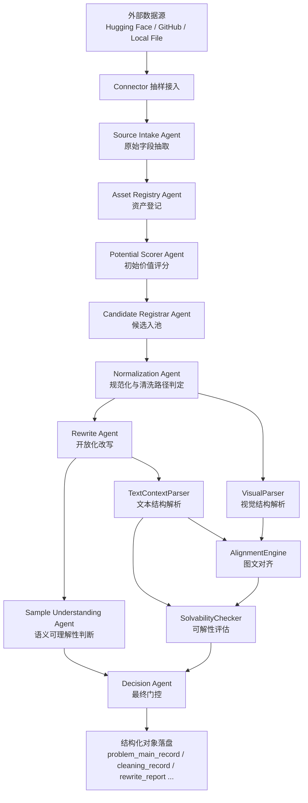

# 采集与清洗完整流程与 Agent 说明

## 1. 文档目标

本文档面向当前工程 [`benchmarkallinone`](benchmarkallinone)，完整说明“采集（Collection）+ 清洗（Cleaning）”整条链路的实现，包括：

- 完整流程图
- 阶段边界与执行顺序
- 数据流、输入对象、输出对象
- 所有 collection / cleaning agents 的定义、职责、输入、输出与回退机制
- 非 agent 规则模块在链路中的作用
- 运行入口、配置方式、实时进度输出方式
- 如何阅读单题输出 JSON，并把 JSON 各部分映射回生成它们的 agent / 模块

本文档描述的是**当前代码真实实现**，不是抽象规划稿。核心代码入口包括：

- 运行入口：[`run_pipeline.py`](benchmarkallinone/run_pipeline.py)
- 主流程：[`pipeline.py`](benchmarkallinone/src/benchmarkallinone/pipeline.py)
- 语义解析组件：[`cleaning_semantics.py`](benchmarkallinone/src/benchmarkallinone/cleaning_semantics.py)
- prompts 目录：[`prompts`](benchmarkallinone/prompts)
- 20 条多数据集配置：[`agent_multidataset_validation_20.yaml`](benchmarkallinone/configs/agent_multidataset_validation_20.yaml)
- 可双击运行脚本：[`run_multidataset_validation_20.command`](benchmarkallinone/scripts/run_multidataset_validation_20.command)

---

## 2. 系统定位

当前系统是一个**多数据集、多源接入、agent-first 的采集与清洗流水线**，目标是把外部原始题目样本转成后续标注可直接消费的结构化样本。

系统覆盖两段主链：

1. `Collection`
2. `Cleaning`

不覆盖：

- 标注阶段完整推理图构建
- 发布格式化
- QA 审核闭环
- 发布后回流增补

---

## 3. 总体架构

### 3.1 顶层模块

工程主模块由以下四层组成：

| 层 | 模块 | 作用 |
| --- | --- | --- |
| 运行入口层 | [`run_pipeline.py`](benchmarkallinone/run_pipeline.py) | 接收 CLI 参数，启动主流水线 |
| 编排层 | [`MultiDatasetCleaningPipeline`](benchmarkallinone/src/benchmarkallinone/pipeline.py:2789) | 按数据集、按样本调度完整采集与清洗链路 |
| Agent 层 | [`BaseStructuredAgent`](benchmarkallinone/src/benchmarkallinone/pipeline.py:1790) 及其子类 | 负责字段抽取、登记、评分、规范化、理解、改写、门控 |
| 语义规则层 | [`TextContextParser`](benchmarkallinone/src/benchmarkallinone/cleaning_semantics.py:169)、[`VisualParser`](benchmarkallinone/src/benchmarkallinone/cleaning_semantics.py:325)、[`AlignmentEngine`](benchmarkallinone/src/benchmarkallinone/cleaning_semantics.py:447)、[`SolvabilityChecker`](benchmarkallinone/src/benchmarkallinone/cleaning_semantics.py:586) | 负责规则化结构解析、图文对齐、可解性检查 |

### 3.2 运行入口

CLI 的真正入口是 [`main()`](benchmarkallinone/src/benchmarkallinone/pipeline.py:4336)，而包装脚本是 [`run_pipeline.py`](benchmarkallinone/run_pipeline.py)。

在 20 条配置场景下，建议直接通过：

- [`run_multidataset_validation_20.sh`](benchmarkallinone/scripts/run_multidataset_validation_20.sh)
- [`run_multidataset_validation_20.command`](benchmarkallinone/scripts/run_multidataset_validation_20.command)

来启动整条链路。

---

## 4. 完整流程图

### 4.1 顶层流程图



### 4.2 数据集级调度流程图

```mermaid
flowchart TD
    A[配置文件] --> B[PipelineConfig.from_yaml()]
    B --> C[MultiDatasetCleaningPipeline.run()]
    C --> D[逐数据集 run_single_dataset()]
    D --> E[connector.sample()]
    E --> F[样本列表]
    F --> G[逐样本 process_sample()]
    G --> H[记录聚合 bundle]
    H --> I[写 dataset summary.json]
    I --> J[写 run summary.json]
```

### 4.3 实时进度输出流程图

```mermaid
flowchart TD
    A[run()] --> B[打印 run 启动信息]
    B --> C[逐数据集 START]
    C --> D[run_single_dataset()]
    D --> E[打印 sampled / concurrency]
    E --> F[逐样本 consume_result()]
    F --> G[emit_sample_progress()]
    G --> H[打印 sample i/n + decision + rewrite]
    H --> I[数据集 END]
    I --> J[run finished]
```

---

## 5. 阶段边界

## 5.1 Collection 阶段负责什么

Collection 阶段负责把原始样本统一接入，并形成候选池所需的最小结构化证据。

当前代码中对应步骤：

1. connector 抽样与原始记录读取
2. [`SourceIntakeAgent`](benchmarkallinone/src/benchmarkallinone/pipeline.py:1808)
3. [`AssetRegistryAgent`](benchmarkallinone/src/benchmarkallinone/pipeline.py:1857)
4. [`PotentialScorerAgent`](benchmarkallinone/src/benchmarkallinone/pipeline.py:1989)
5. [`CandidateRegistrarAgent`](benchmarkallinone/src/benchmarkallinone/pipeline.py:2120)

输出对象包括：

- `source_intake_record`
- `asset_registry_record`
- `initial_scoring_record`
- `candidate_registration_record`
- `candidate_problem_record`
- `raw_asset_bundle`
- `candidate_pool_entry`

## 5.2 Cleaning 阶段负责什么

Cleaning 阶段负责把候选样本转成适合后续标注使用的标准化样本。

当前代码中对应步骤：

1. [`NormalizationAgent`](benchmarkallinone/src/benchmarkallinone/pipeline.py:2192)
2. [`RewriteAgent`](benchmarkallinone/src/benchmarkallinone/pipeline.py:2437)
3. [`TextContextParser`](benchmarkallinone/src/benchmarkallinone/cleaning_semantics.py:169)
4. [`VisualParser`](benchmarkallinone/src/benchmarkallinone/cleaning_semantics.py:325)
5. [`AlignmentEngine`](benchmarkallinone/src/benchmarkallinone/cleaning_semantics.py:447)
6. [`SampleUnderstandingAgent`](benchmarkallinone/src/benchmarkallinone/pipeline.py:2289)
7. [`SolvabilityChecker`](benchmarkallinone/src/benchmarkallinone/cleaning_semantics.py:586)
8. [`DecisionAgent`](benchmarkallinone/src/benchmarkallinone/pipeline.py:2559)

输出对象包括：

- `normalization_record`
- `clean_problem_record`
- `normalized_assets`
- `text_structure_records`
- `visual_structure_records`
- `alignment_records`
- `solvability_reports`
- `cleaning_records`
- `rewrite_reports`
- `open_ended_problem_variants`
- `clean_pool_entries`
- `reject_records`

---

## 6. 数据源接入层

## 6.1 统一 connector 抽象

所有数据源都继承 [`BaseConnector`](benchmarkallinone/src/benchmarkallinone/pipeline.py:857)。

统一接口：
- [`BaseConnector.sample()`](benchmarkallinone/src/benchmarkallinone/pipeline.py:869)

### 已实现 connector

| Connector | 代码位置 | 用途 |
| --- | --- | --- |
| [`SourceUnavailableConnector`](benchmarkallinone/src/benchmarkallinone/pipeline.py:875) | 无稳定源时占位 |
| [`LocalFileConnector`](benchmarkallinone/src/benchmarkallinone/pipeline.py:1060) | 读取本地 `json/jsonl/csv/tsv/parquet` |
| [`HuggingFaceConnector`](benchmarkallinone/src/benchmarkallinone/pipeline.py:1226) | 读取 Hugging Face 数据集 |
| [`GitHubConnector`](benchmarkallinone/src/benchmarkallinone/pipeline.py:1527) | 读取 GitHub 仓库数据 |

## 6.2 Hugging Face 接入

[`HuggingFaceConnector`](benchmarkallinone/src/benchmarkallinone/pipeline.py:1226) 支持：

- 自动探测 split：[`load_dataset_any()`](benchmarkallinone/src/benchmarkallinone/pipeline.py:1231)
- 图片字段解码：[`load_images()`](benchmarkallinone/src/benchmarkallinone/pipeline.py:1253)
- raw zip fallback：如 [`sample_from_physreason_zip()`](benchmarkallinone/src/benchmarkallinone/pipeline.py:1375)

## 6.3 GitHub 接入

[`GitHubConnector`](benchmarkallinone/src/benchmarkallinone/pipeline.py:1527) 支持：

- 自动 clone repo：[`ensure_repo()`](benchmarkallinone/src/benchmarkallinone/pipeline.py:1528)
- 自动发现结构化数据文件：[`discover_data_files()`](benchmarkallinone/src/benchmarkallinone/pipeline.py:1547)
- 对 Geometry3K 做图像兜底扫描：见 [`sample()`](benchmarkallinone/src/benchmarkallinone/pipeline.py:1702)

---

## 7. 运行配置层

## 7.1 配置对象

顶层配置由两个 dataclass 描述：

- [`ModelConfig`](benchmarkallinone/src/benchmarkallinone/pipeline.py:203)
- [`DatasetSpec`](benchmarkallinone/src/benchmarkallinone/pipeline.py:214)
- [`PipelineConfig`](benchmarkallinone/src/benchmarkallinone/pipeline.py:233)

## 7.2 DatasetSpec 字段说明

[`DatasetSpec`](benchmarkallinone/src/benchmarkallinone/pipeline.py:214) 是整个系统的数据集适配中心，关键字段包括：

| 字段 | 含义 |
| --- | --- |
| `key` | 数据集唯一键 |
| `display_name` | 展示名称 |
| `source_kind` | `huggingface/github/local_file/source_unavailable` |
| `source_locator` | 数据源定位符 |
| `question_fields` | 题干字段候选 |
| `answer_fields` | 答案字段候选 |
| `image_fields` | 图像字段候选 |
| `choice_fields` | 选项字段候选 |
| `force_requires_image` | 是否强制判定图像依赖 |
| `answer_index_base` | 答案索引基准，如 SCEMQA 的 0-base |
| `multi_solution_mode` | 多解挖掘策略 |

### SCEMQA 特别说明

SCEMQA 的原始 `answer` 字段是 **0-base 索引**，所以配置里显式加了：

- [`agent_multidataset_validation_20.yaml`](benchmarkallinone/configs/agent_multidataset_validation_20.yaml)
- [`agent_multidataset_validation_10.yaml`](benchmarkallinone/configs/agent_multidataset_validation_10.yaml)
- [`agent_eval_200.yaml`](benchmarkallinone/configs/agent_eval_200.yaml)
- [`report_priority_20.yaml`](benchmarkallinone/configs/report_priority_20.yaml)
- [`scemqa_parallel_20.yaml`](benchmarkallinone/configs/scemqa_parallel_20.yaml)

中的 `answer_index_base: 0`。

对应解码逻辑在 [`resolve_multiple_choice_answer_text()`](benchmarkallinone/src/benchmarkallinone/pipeline.py:1030)。

---

## 8. Agent 统一基类

所有 LLM agents 都继承 [`BaseStructuredAgent`](benchmarkallinone/src/benchmarkallinone/pipeline.py:1790)。

### 统一职责

[`BaseStructuredAgent`](benchmarkallinone/src/benchmarkallinone/pipeline.py:1790) 负责：

1. 读取 prompt 文件
2. 构造 JSON payload
3. 选择文本调用或图文调用
4. 从 OpenAI 兼容接口返回结构化 JSON

### 核心方法

- [`load_system_prompt()`](benchmarkallinone/src/benchmarkallinone/pipeline.py:1796)
- [`call_json()`](benchmarkallinone/src/benchmarkallinone/pipeline.py:1801)

这使得所有 agent 可以统一复用调用方式，而差异仅体现在：

- prompt 路径
- fallback 逻辑
- 输入 payload
- 输出字段约束

---

## 9. Collection Agents 详细说明

## 9.1 Source Intake Agent

### 代码位置

- 类定义：[`SourceIntakeAgent`](benchmarkallinone/src/benchmarkallinone/pipeline.py:1808)
- prompt：[`extract_unified_sample.md`](benchmarkallinone/prompts/extract_unified_sample.md)
- fallback：[`heuristic_extract_record_content()`](benchmarkallinone/src/benchmarkallinone/pipeline.py:946)

### 任务

从原始记录里抽出接近 `UnifiedSample` 的统一字段：

- `raw_question_text`
- `raw_answer_text`
- `choice_map`
- `image_paths`
- `force_requires_image`
- `question_field / answer_field / image_field / choice_field`
- `extraction_notes`

### 输入

输入 payload 由 [`SourceIntakeAgent.extract()`](benchmarkallinone/src/benchmarkallinone/pipeline.py:1816) 构造，核心包括：

- `dataset_name`
- `source_kind`
- `raw_record`
- `fallback`

### 输出

输出是统一抽取结果字典，用于生成 `UnifiedSample`。

### 回退机制

如果 agent 不可用或返回空：
- 回落到 [`heuristic_extract_record_content()`](benchmarkallinone/src/benchmarkallinone/pipeline.py:946)

### 特别说明

抽取 prompt 当前会尽量把选择题答案转成答案文本，但某些数据集答案字段本身是索引，因此又在后处理里增加了：

- [`resolve_answer_source_text()`](benchmarkallinone/src/benchmarkallinone/pipeline.py:1022)
- [`resolve_multiple_choice_answer_text()`](benchmarkallinone/src/benchmarkallinone/pipeline.py:1030)

来做数据集级答案解码。

---

## 9.2 Asset Registry Agent

### 代码位置

- 类定义：[`AssetRegistryAgent`](benchmarkallinone/src/benchmarkallinone/pipeline.py:1857)
- prompt：[`asset_registry.md`](benchmarkallinone/prompts/collection/asset_registry.md)

### 任务

检查单条候选样本的最小资产完备性：

- 题干是否存在
- 答案是否存在
- 图像是否存在、可读、格式正确
- 是否有明确缺失问题

### 输入

[`AssetRegistryAgent.process()`](benchmarkallinone/src/benchmarkallinone/pipeline.py:1930) 输入：

- `problem_id`
- `question_text`
- `answer_text`
- `image_sources`
- `image_qualities`
- `metadata`
- `requires_image`

### 输出

- `image_manifest`
- `text_manifest`
- `answer_manifest`
- `issues`
- `registry_passed`
- `llm_used`

### 回退机制

[`fallback_process()`](benchmarkallinone/src/benchmarkallinone/pipeline.py:1866) 会基于本地图像存在性和字段是否为空生成保底结果。

### 作用定位

这是 Collection 阶段的“硬完整性登记器”，也是后续打分与候选入池的证据起点。

---

## 9.3 Potential Scorer Agent

### 代码位置

- 类定义：[`PotentialScorerAgent`](benchmarkallinone/src/benchmarkallinone/pipeline.py:1989)
- prompt：[`potential_scorer.md`](benchmarkallinone/prompts/collection/potential_scorer.md)

### 任务

计算三类初始分数：

- `image_dependency_score`
- `multi_step_score`
- `verifiability_score`

### 输入

[`PotentialScorerAgent.process()`](benchmarkallinone/src/benchmarkallinone/pipeline.py:2042) 主要输入：

- `problem_id`
- `normalized_question_text`
- `normalized_answer_text`
- `answer_type`
- `requires_image`
- `text_dominant`
- `image_qualities`
- `choices`
- `multi_solution_policy`
- `asset_registry_record`
- `fallback_scores`

### 输出

- 三类分数
- `score_evidence`
- `risk_flags`
- `scoring_version`
- `llm_used`

### 回退机制

[`fallback_process()`](benchmarkallinone/src/benchmarkallinone/pipeline.py:1997) 基于启发式分数与资产登记结果，保守给出分数。

### 作用定位

这是候选池价值排序的核心评分器，也是多解挖掘强度分流的前置依据。

---

## 9.4 Candidate Registrar Agent

### 代码位置

- 类定义：[`CandidateRegistrarAgent`](benchmarkallinone/src/benchmarkallinone/pipeline.py:2120)
- prompt：[`candidate_registrar.md`](benchmarkallinone/prompts/collection/candidate_registrar.md)

### 任务

基于资产登记和初始评分决定：

- `keep`
- `low_priority`
- `reject`

### 输入

[`CandidateRegistrarAgent.process()`](benchmarkallinone/src/benchmarkallinone/pipeline.py:2159) 输入：

- `problem_id`
- `asset_registry_record`
- `initial_scoring_record`

### 输出

- `priority`
- `decision`
- `decision_reasons`
- `llm_used`

### 回退机制

[`fallback_process()`](benchmarkallinone/src/benchmarkallinone/pipeline.py:2128) 用规则计算综合优先级，并按阈值判断 `keep/low_priority/reject`。

### 作用定位

这是 Collection 阶段的最后门，决定样本是否能进入下一阶段的清洗主链。

---

## 10. Cleaning Agents 详细说明

## 10.1 Normalization Agent

### 代码位置

- 类定义：[`NormalizationAgent`](benchmarkallinone/src/benchmarkallinone/pipeline.py:2192)
- prompt：[`normalization_agent.md`](benchmarkallinone/prompts/cleaning/normalization_agent.md)
- 辅助工具：[`TextNormalizer`](benchmarkallinone/src/benchmarkallinone/pipeline.py:635)

### 任务

把原始题面与答案变成标准化输入：

- 去噪声
- 统一单位
- 统一答案格式
- 规范化选项
- 判断 `requires_image`
- 判断 `text_dominant`
- 选择 `cleaning_path`

### 输入

[`NormalizationAgent.process()`](benchmarkallinone/src/benchmarkallinone/pipeline.py:2225) 输入：

- `dataset_name`
- `raw_question_text`
- `raw_answer_text`
- `choice_map`
- `force_requires_image`
- `images`
- `image_qualities`

### 输出

- `normalized_question_text`
- `normalized_answer_text`
- `normalized_choice_map`
- `requires_image`
- `text_dominant`
- `cleaning_path`
- `normalization_notes`
- `llm_used`

### 回退机制

[`fallback_process()`](benchmarkallinone/src/benchmarkallinone/pipeline.py:2201) 用规则标准化文本并判定图像依赖。

### 关键规则

- [`TextNormalizer.normalize_text()`](benchmarkallinone/src/benchmarkallinone/pipeline.py:666)
- [`TextNormalizer.normalize_answer()`](benchmarkallinone/src/benchmarkallinone/pipeline.py:680)
- [`TextNormalizer.infer_requires_image()`](benchmarkallinone/src/benchmarkallinone/pipeline.py:740)

---

## 10.2 Sample Understanding Agent

### 代码位置

- 类定义：[`SampleUnderstandingAgent`](benchmarkallinone/src/benchmarkallinone/pipeline.py:2289)
- prompt：[`sample_understanding_agent.md`](benchmarkallinone/prompts/cleaning/sample_understanding_agent.md)

### 任务

判断样本在语义上是否足够可理解，避免只靠像素阈值粗暴过滤。

### 输入

[`SampleUnderstandingAgent.assess()`](benchmarkallinone/src/benchmarkallinone/pipeline.py:2357) 输入：

- `dataset_name`
- `normalized_question_text`
- `normalized_answer_text`
- `answer_type`
- `choices`
- `requires_image`
- `images`
- `image_qualities`
- `quality_flags`

### 输出

- `question_complete`
- `answer_complete`
- `completeness_status`
- `image_support_status`
- `joint_understanding_status`
- `reason_codes`
- `risk_flags`
- `rationale`
- `confidence`
- `llm_used`

### 回退机制

[`fallback_assess()`](benchmarkallinone/src/benchmarkallinone/pipeline.py:2297) 基于字段存在性和图像可用性给出保底结论。

### 作用定位

它相当于清洗阶段的“语义可解释 reviewer”。

---

## 10.3 Rewrite Agent

### 代码位置

- 类定义：[`RewriteAgent`](benchmarkallinone/src/benchmarkallinone/pipeline.py:2437)
- prompt：[`rewrite_agent.md`](benchmarkallinone/prompts/cleaning/rewrite_agent.md)

### 任务

把多选题转换成标注友好的开放题，或判定无法改写。

### 支持策略

见 [`rewrite_agent.md`](benchmarkallinone/prompts/cleaning/rewrite_agent.md:5)：

- `keep_open`
- `blank_open`
- `split_open`
- `drop_image_index`

### 输入

[`RewriteAgent.rewrite()`](benchmarkallinone/src/benchmarkallinone/pipeline.py:2518) 输入：

- `dataset_name`
- `normalized_question_text`
- `normalized_answer_text`
- `answer_type`
- `choices`

### 输出

- `strategy`
- `rationale`
- `discard_reason_codes`
- `variants`

### 回退机制

[`fallback_rewrite()`](benchmarkallinone/src/benchmarkallinone/pipeline.py:2446) 用规则判断：

- 已开放题直接保留
- 普通多选题改成开放问答
- 复合答案题拆成多个子问
- 纯图编号题丢弃

### 作用定位

它是清洗阶段最关键的题型标准化器，直接决定样本能否变成标注友好的开放问题。

---

## 10.4 Decision Agent

### 代码位置

- 类定义：[`DecisionAgent`](benchmarkallinone/src/benchmarkallinone/pipeline.py:2559)
- prompt：[`gate_decision_agent.md`](benchmarkallinone/prompts/cleaning/gate_decision_agent.md)

### 任务

做最终清洗门控：

- `pass`
- `review`
- `reject`

### 输入

[`DecisionAgent.decide()`](benchmarkallinone/src/benchmarkallinone/pipeline.py:2649) 输入：

- `dataset_name`
- `raw_question_text`
- `raw_answer_text`
- `quality_components`
- `sample_understanding`
- `rewrite_report`
- `open_variants`
- `alignment_record`
- `solvability_report`
- `quality_flags`
- `text_structure`

### 输出

- `decision`
- `reason_codes`
- `rationale`
- `review_required`
- `llm_used`

### 回退机制

[`fallback_decide()`](benchmarkallinone/src/benchmarkallinone/pipeline.py:2567) 用规则优先：

- 纯图编号题 reject
- 严重语义不可理解 reject
- 可恢复但有风险 review
- 否则 pass

### 作用定位

它是清洗阶段的最终裁决器。

---

## 11. 中间调度器：AgenticCleaningOrchestrator

### 代码位置

[`AgenticCleaningOrchestrator`](benchmarkallinone/src/benchmarkallinone/pipeline.py:2731)

### 作用

它不做新的推理，而是把：

- [`SampleUnderstandingAgent`](benchmarkallinone/src/benchmarkallinone/pipeline.py:2289)
- [`DecisionAgent`](benchmarkallinone/src/benchmarkallinone/pipeline.py:2559)

以统一接口组织起来，避免在主流程里直接散写逻辑。

### 方法

- [`assess_sample()`](benchmarkallinone/src/benchmarkallinone/pipeline.py:2736)
- [`decide_gate()`](benchmarkallinone/src/benchmarkallinone/pipeline.py:2760)

---

## 12. 非 Agent 规则模块说明

## 12.1 TextContextParser

### 代码位置

[`TextContextParser`](benchmarkallinone/src/benchmarkallinone/cleaning_semantics.py:169)

### 任务

从规范化题干中解析：

- `conditions`
- `targets`
- `answer_slots`
- `entity_mentions`
- `question_type`
- `text_structure_status`

### 输入

[`parse()`](benchmarkallinone/src/benchmarkallinone/cleaning_semantics.py:233) 输入：

- `problem_id`
- `normalized_question_text`
- `open_variants`
- `requires_image`
- `question_normalization`
- `answer_normalization`
- `choices`

### 输出

返回 `text_structure_record` 风格字典。

---

## 12.2 VisualParser

### 代码位置

[`VisualParser`](benchmarkallinone/src/benchmarkallinone/cleaning_semantics.py:325)

### 任务

对图像做轻量视觉结构抽取，不做 OCR 修复，只做：

- 视觉类型判断
- ROI 区域划分
- 子区域关系构造
- 视觉实体与视觉关系记录

### 输入

[`parse_many()`](benchmarkallinone/src/benchmarkallinone/cleaning_semantics.py:391) 输入：

- `problem_id`
- `images`
- `image_qualities`
- `question_text`

### 输出

返回多个 `visual_structure_record`。

---

## 12.3 AlignmentEngine

### 代码位置

[`AlignmentEngine`](benchmarkallinone/src/benchmarkallinone/cleaning_semantics.py:447)

### 任务

建立文本实体 / 回答槽位 与视觉区域之间的 grounding 关系，并计算：

- `alignment_pairs`
- `conflict_pairs`
- `coverage_score`
- `consistency_score`
- `alignment_status`

### 输入

[`align()`](benchmarkallinone/src/benchmarkallinone/cleaning_semantics.py:450) 输入：

- `problem_id`
- `requires_image`
- `text_structure`
- `visual_structures`
- `image_qualities`
- `normalized_question_text`

### 输出

返回 `alignment_record`。

---

## 12.4 SolvabilityChecker

### 代码位置

[`SolvabilityChecker`](benchmarkallinone/src/benchmarkallinone/cleaning_semantics.py:586)

### 任务

评估样本是否有足够清晰的目标、答案、文本条件、图文 grounding 去进入标注阶段。

### 输入

[`evaluate()`](benchmarkallinone/src/benchmarkallinone/cleaning_semantics.py:589) 输入：

- `problem_id`
- `normalized_answer_text`
- `answer_type`
- `requires_image`
- `open_variants`
- `text_structure`
- `visual_structures`
- `alignment_record`
- `quality_flags`

### 输出

- `failure_codes`
- `score_breakdown`
- `solvability_score`
- `decision_hint`
- `reasoning_path_exists`

---

## 13. 单样本主链详细拆解

单样本主链由 [`process_sample()`](benchmarkallinone/src/benchmarkallinone/pipeline.py:4077) 执行。

### 13.1 执行顺序

1. 生成 `candidate_id / problem_id`
2. 持久化图像并生成图像质量分析
3. 运行 [`NormalizationAgent`](benchmarkallinone/src/benchmarkallinone/pipeline.py:2192)
4. 生成 `source_intake_record`
5. 运行 [`AssetRegistryAgent`](benchmarkallinone/src/benchmarkallinone/pipeline.py:1857)
6. 生成多解策略并运行 [`PotentialScorerAgent`](benchmarkallinone/src/benchmarkallinone/pipeline.py:1989)
7. 运行 [`CandidateRegistrarAgent`](benchmarkallinone/src/benchmarkallinone/pipeline.py:2120)
8. 运行 [`RewriteAgent`](benchmarkallinone/src/benchmarkallinone/pipeline.py:2437)
9. 运行 [`TextContextParser`](benchmarkallinone/src/benchmarkallinone/cleaning_semantics.py:169)
10. 运行 [`VisualParser`](benchmarkallinone/src/benchmarkallinone/cleaning_semantics.py:325)
11. 运行 [`AlignmentEngine`](benchmarkallinone/src/benchmarkallinone/cleaning_semantics.py:447)
12. 构建 `quality_flags`
13. 运行 [`SampleUnderstandingAgent`](benchmarkallinone/src/benchmarkallinone/pipeline.py:2289)
14. 运行 [`SolvabilityChecker`](benchmarkallinone/src/benchmarkallinone/cleaning_semantics.py:586)
15. 运行 [`DecisionAgent`](benchmarkallinone/src/benchmarkallinone/pipeline.py:2559)
16. 生成所有结构化对象并写盘

---

## 14. 输出对象全表

当前每个样本会产出以下结构化对象：

| 对象 | 作用 | 主要生成者 |
| --- | --- | --- |
| `source_intake_record` | 原始记录抽取结果 | [`SourceIntakeAgent`](benchmarkallinone/src/benchmarkallinone/pipeline.py:1808) |
| `asset_registry_record` | 资产完备性登记 | [`AssetRegistryAgent`](benchmarkallinone/src/benchmarkallinone/pipeline.py:1857) |
| `initial_scoring_record` | 初始价值评分 | [`PotentialScorerAgent`](benchmarkallinone/src/benchmarkallinone/pipeline.py:1989) |
| `candidate_registration_record` | 候选入池结果 | [`CandidateRegistrarAgent`](benchmarkallinone/src/benchmarkallinone/pipeline.py:2120) |
| `normalization_record` | 规范化结果 | [`NormalizationAgent`](benchmarkallinone/src/benchmarkallinone/pipeline.py:2192) |
| `candidate_problem_record` | 候选问题主记录 | [`MultiDatasetCleaningPipeline.build_candidate_problem_record()`](benchmarkallinone/src/benchmarkallinone/pipeline.py:3058) |
| `raw_asset_bundle` | 原始资源包 | [`MultiDatasetCleaningPipeline.build_raw_asset_bundle()`](benchmarkallinone/src/benchmarkallinone/pipeline.py:3082) |
| `candidate_pool_entry` | 候选池条目 | [`MultiDatasetCleaningPipeline.build_candidate_pool_entry()`](benchmarkallinone/src/benchmarkallinone/pipeline.py:3116) |
| `clean_pool_entries` | 清洗后可入标注池条目 | [`process_sample()`](benchmarkallinone/src/benchmarkallinone/pipeline.py:4270) |
| `clean_problem_record` | 清洗后主问题记录 | [`MultiDatasetCleaningPipeline.build_clean_problem_record()`](benchmarkallinone/src/benchmarkallinone/pipeline.py:3293) |
| `normalized_assets` | 标准化资源包 | [`MultiDatasetCleaningPipeline.build_normalized_assets()`](benchmarkallinone/src/benchmarkallinone/pipeline.py:3267) |
| `problem_main_record` | 标注前主记录底座 | [`MultiDatasetCleaningPipeline.build_problem_main_record()`](benchmarkallinone/src/benchmarkallinone/pipeline.py:4030) |
| `asset_records` | 资产明细记录 | [`MultiDatasetCleaningPipeline.build_asset_records()`](benchmarkallinone/src/benchmarkallinone/pipeline.py:3379) |
| `text_structure_records` | 文本结构记录 | [`TextContextParser`](benchmarkallinone/src/benchmarkallinone/cleaning_semantics.py:169) |
| `visual_structure_records` | 视觉结构记录 | [`VisualParser`](benchmarkallinone/src/benchmarkallinone/cleaning_semantics.py:325) |
| `solvability_reports` | 可解性报告 | [`SolvabilityChecker`](benchmarkallinone/src/benchmarkallinone/cleaning_semantics.py:586) |
| `node_records` | 节点记录 | [`MultiDatasetCleaningPipeline.build_node_records()`](benchmarkallinone/src/benchmarkallinone/pipeline.py:3731) |
| `cleaning_records` | 清洗审计记录 | [`MultiDatasetCleaningPipeline.build_cleaning_record()`](benchmarkallinone/src/benchmarkallinone/pipeline.py:3929) |
| `reject_records` | 淘汰记录 | [`MultiDatasetCleaningPipeline.build_reject_record()`](benchmarkallinone/src/benchmarkallinone/pipeline.py:4012) |
| `alignment_records` | 图文对齐记录 | [`AlignmentEngine`](benchmarkallinone/src/benchmarkallinone/cleaning_semantics.py:447) |
| `field_audit_records` | 字段变更审计 | [`MultiDatasetCleaningPipeline.build_field_audit_records()`](benchmarkallinone/src/benchmarkallinone/pipeline.py:3862) |
| `rewrite_reports` | 改写报告 | [`RewriteAgent`](benchmarkallinone/src/benchmarkallinone/pipeline.py:2437) |
| `open_ended_problem_variants` | 开放题变体 | [`MultiDatasetCleaningPipeline.build_open_variants()`](benchmarkallinone/src/benchmarkallinone/pipeline.py:3131) |

这些对象在 [`run_single_dataset()`](benchmarkallinone/src/benchmarkallinone/pipeline.py:2872) 中被聚合成 `bundle`，最终写成各类 `jsonl` 文件。

---

## 15. 如何阅读单题输出 JSON

单题样本文件不是“单纯结果”，而是**这道题从原始输入到最终门控的完整执行档案**。推荐阅读对象是：

例如：[`prob_f732438f47fa7b38775bb162.json`](benchmarkallinone/outputs/agent_multidataset_validation_10/run_10fb07acd544b44d/datasets/mathvision/samples/prob_f732438f47fa7b38775bb162.json)

### 15.1 建议阅读顺序

1. [`source_intake_record`](benchmarkallinone/outputs/agent_multidataset_validation_10/run_10fb07acd544b44d/datasets/mathvision/samples/prob_f732438f47fa7b38775bb162.json:2)
2. [`asset_registry_record`](benchmarkallinone/outputs/agent_multidataset_validation_10/run_10fb07acd544b44d/datasets/mathvision/samples/prob_f732438f47fa7b38775bb162.json:24)
3. [`initial_scoring_record`](benchmarkallinone/outputs/agent_multidataset_validation_10/run_10fb07acd544b44d/datasets/mathvision/samples/prob_f732438f47fa7b38775bb162.json:55)
4. [`normalization_record`](benchmarkallinone/outputs/agent_multidataset_validation_10/run_10fb07acd544b44d/datasets/mathvision/samples/prob_f732438f47fa7b38775bb162.json:108)
5. [`rewrite_reports`](benchmarkallinone/outputs/agent_multidataset_validation_10/run_10fb07acd544b44d/datasets/mathvision/samples/prob_f732438f47fa7b38775bb162.json:2153)
6. [`text_structure_records`](benchmarkallinone/outputs/agent_multidataset_validation_10/run_10fb07acd544b44d/datasets/mathvision/samples/prob_f732438f47fa7b38775bb162.json:991)
7. [`visual_structure_records`](benchmarkallinone/outputs/agent_multidataset_validation_10/run_10fb07acd544b44d/datasets/mathvision/samples/prob_f732438f47fa7b38775bb162.json:1158)
8. [`alignment_records`](benchmarkallinone/outputs/agent_multidataset_validation_10/run_10fb07acd544b44d/datasets/mathvision/samples/prob_f732438f47fa7b38775bb162.json:1951)
9. [`clean_problem_record`](benchmarkallinone/outputs/agent_multidataset_validation_10/run_10fb07acd544b44d/datasets/mathvision/samples/prob_f732438f47fa7b38775bb162.json:254)
10. [`problem_main_record`](benchmarkallinone/outputs/agent_multidataset_validation_10/run_10fb07acd544b44d/datasets/mathvision/samples/prob_f732438f47fa7b38775bb162.json:422)
11. [`cleaning_records`](benchmarkallinone/outputs/agent_multidataset_validation_10/run_10fb07acd544b44d/datasets/mathvision/samples/prob_f732438f47fa7b38775bb162.json:1801)
12. [`field_audit_records`](benchmarkallinone/outputs/agent_multidataset_validation_10/run_10fb07acd544b44d/datasets/mathvision/samples/prob_f732438f47fa7b38775bb162.json:1995)

---

## 16. 单题 JSON 的模块映射示例

下面用实际样本 [`prob_f732438f47fa7b38775bb162.json`](benchmarkallinone/outputs/agent_multidataset_validation_10/run_10fb07acd544b44d/datasets/mathvision/samples/prob_f732438f47fa7b38775bb162.json) 说明“每个输出部分是由谁生成的”。

### 16.1 原始接入层

#### [`source_intake_record`](benchmarkallinone/outputs/agent_multidataset_validation_10/run_10fb07acd544b44d/datasets/mathvision/samples/prob_f732438f47fa7b38775bb162.json:2)
生成者：[`SourceIntakeAgent`](benchmarkallinone/src/benchmarkallinone/pipeline.py:1808)

作用：
- 保存原题文本、原始答案、原图路径、字段来源信息
- 这是整个样本的“原始材料袋”

#### [`asset_registry_record`](benchmarkallinone/outputs/agent_multidataset_validation_10/run_10fb07acd544b44d/datasets/mathvision/samples/prob_f732438f47fa7b38775bb162.json:24)
生成者：[`AssetRegistryAgent`](benchmarkallinone/src/benchmarkallinone/pipeline.py:1857)

作用：
- 保存图像尺寸、格式、存在性
- 保存题干/答案存在性
- 产出 `registry_passed`

#### [`initial_scoring_record`](benchmarkallinone/outputs/agent_multidataset_validation_10/run_10fb07acd544b44d/datasets/mathvision/samples/prob_f732438f47fa7b38775bb162.json:55)
生成者：[`PotentialScorerAgent`](benchmarkallinone/src/benchmarkallinone/pipeline.py:1989)

作用：
- 给出初始图像依赖、多步潜力、可验证性分数
- 说明这题为什么值得进候选池

---

### 16.2 规范化与改写层

#### [`normalization_record`](benchmarkallinone/outputs/agent_multidataset_validation_10/run_10fb07acd544b44d/datasets/mathvision/samples/prob_f732438f47fa7b38775bb162.json:108)
生成者：[`NormalizationAgent`](benchmarkallinone/src/benchmarkallinone/pipeline.py:2192)

作用：
- 记录规范化后的题干与答案
- 标明是否必须看图
- 标明走 `text_lightweight` 还是 `multimodal_full`

#### [`normalized_assets`](benchmarkallinone/outputs/agent_multidataset_validation_10/run_10fb07acd544b44d/datasets/mathvision/samples/prob_f732438f47fa7b38775bb162.json:280)
生成者：[`MultiDatasetCleaningPipeline.build_normalized_assets()`](benchmarkallinone/src/benchmarkallinone/pipeline.py:3267)

上游依赖：
- [`NormalizationAgent`](benchmarkallinone/src/benchmarkallinone/pipeline.py:2192)
- 图像质量分析

作用：
- 汇总规范化文本
- 汇总 `sentence_segments`
- 汇总图像 `roi_bbox` 与图像区域信息

#### [`rewrite_reports`](benchmarkallinone/outputs/agent_multidataset_validation_10/run_10fb07acd544b44d/datasets/mathvision/samples/prob_f732438f47fa7b38775bb162.json:2153)
生成者：[`RewriteAgent`](benchmarkallinone/src/benchmarkallinone/pipeline.py:2437)

作用：
- 记录题型改写策略
- 记录开放题版本、预期答案类型、预期答案

这个例子里：
- `strategy = keep_open`
- 说明它本来就是开放题，未做实质改写

---

### 16.3 文本结构、视觉结构、图文对齐层

#### [`text_structure_records`](benchmarkallinone/outputs/agent_multidataset_validation_10/run_10fb07acd544b44d/datasets/mathvision/samples/prob_f732438f47fa7b38775bb162.json:991)
生成者：[`TextContextParser`](benchmarkallinone/src/benchmarkallinone/cleaning_semantics.py:169)

作用：
- 把文字拆成 `conditions / targets / answer_slots / entity_mentions`
- 告诉系统“题目到底在问什么”

这个例子里它识别出：
- 目标：`How much is the sum of these two numbers?`
- 回答槽位：数值型答案，期望值是 `2`
- 文本实体：`triangle`、`angle`
- `requires_visual_grounding = true`

#### [`visual_structure_records`](benchmarkallinone/outputs/agent_multidataset_validation_10/run_10fb07acd544b44d/datasets/mathvision/samples/prob_f732438f47fa7b38775bb162.json:1158)
生成者：[`VisualParser`](benchmarkallinone/src/benchmarkallinone/cleaning_semantics.py:325)

作用：
- 把图像变成 `visual_kind / visual_entities / visual_relations`
- 告诉系统“图像里面大概有什么结构”

这个例子里它识别出：
- 图像类型：`geometry_diagram`
- 主内容区：`roi`
- 四个子区域：`roi_top_left / roi_top_right / roi_bottom_left / roi_bottom_right`
- 图像质量很好：`readability_score = 0.9297`

#### [`alignment_records`](benchmarkallinone/outputs/agent_multidataset_validation_10/run_10fb07acd544b44d/datasets/mathvision/samples/prob_f732438f47fa7b38775bb162.json:1951)
生成者：[`AlignmentEngine`](benchmarkallinone/src/benchmarkallinone/cleaning_semantics.py:447)

作用：
- 把文字里的实体与图像里的区域挂上关系
- 输出图文是否一致

这个例子里：
- `triangle -> roi`
- `angle -> roi`
- `alignment_status = good`
- `coverage_score = 0.9`
- `consistency_score = 0.9`

这说明图和题是对得上的。

---

### 16.4 可解性与最终决策层

#### [`solvability_reports`](benchmarkallinone/outputs/agent_multidataset_validation_10/run_10fb07acd544b44d/datasets/mathvision/samples/prob_f732438f47fa7b38775bb162.json:1290)
生成者：[`SolvabilityChecker`](benchmarkallinone/src/benchmarkallinone/cleaning_semantics.py:586)

作用：
- 判断这题是不是已经满足进入标注的最低条件

这个例子里：
- `answer_verifiable = true`
- `target_clear = true`
- `rewrite_complete = true`
- `visual_grounding_available = true`
- `solvability_score = 1.0`

#### [`clean_problem_record`](benchmarkallinone/outputs/agent_multidataset_validation_10/run_10fb07acd544b44d/datasets/mathvision/samples/prob_f732438f47fa7b38775bb162.json:254)
生成者：[`MultiDatasetCleaningPipeline.build_clean_problem_record()`](benchmarkallinone/src/benchmarkallinone/pipeline.py:3293)

上游依赖：
- [`DecisionAgent`](benchmarkallinone/src/benchmarkallinone/pipeline.py:2559)
- [`AlignmentEngine`](benchmarkallinone/src/benchmarkallinone/cleaning_semantics.py:447)
- [`SolvabilityChecker`](benchmarkallinone/src/benchmarkallinone/cleaning_semantics.py:586)

作用：
- 给出最精简的清洗结论摘要

这个例子里：
- `clean_decision = pass`
- `alignment_status = good`
- `solvability_score = 1.0`

#### [`problem_main_record`](benchmarkallinone/outputs/agent_multidataset_validation_10/run_10fb07acd544b44d/datasets/mathvision/samples/prob_f732438f47fa7b38775bb162.json:422)
生成者：[`MultiDatasetCleaningPipeline.build_problem_main_record()`](benchmarkallinone/src/benchmarkallinone/pipeline.py:4030)

作用：
- 这是整题最终总表
- 后续标注、QA、发布都主要读这个对象

它会汇总：
- 原题与规范化题干
- 原答案与规范化答案
- 图像数量
- 多模态强度、多步分、可验证性分
- 最终 `clean_decision`
- `annotation_ready`
- `rewrite_strategy`

---

### 16.5 审计与辅助层

#### [`cleaning_records`](benchmarkallinone/outputs/agent_multidataset_validation_10/run_10fb07acd544b44d/datasets/mathvision/samples/prob_f732438f47fa7b38775bb162.json:1801)
生成者：[`MultiDatasetCleaningPipeline.build_cleaning_record()`](benchmarkallinone/src/benchmarkallinone/pipeline.py:3929)

作用：
- 汇总清洗过程中发生的所有关键判断
- 是整题层面的“清洗审计总记录”

#### [`field_audit_records`](benchmarkallinone/outputs/agent_multidataset_validation_10/run_10fb07acd544b44d/datasets/mathvision/samples/prob_f732438f47fa7b38775bb162.json:1995)
生成者：[`MultiDatasetCleaningPipeline.build_field_audit_records()`](benchmarkallinone/src/benchmarkallinone/pipeline.py:3862)

作用：
- 记录每个字段改前改后
- 标明是谁触发了变更

例如这个样本里你能看到：
- `normalized_question_text` 去掉了 `<image1>`
- `rewrite_strategy` 被写成 `keep_open`
- `decision` 被写成 `pass`

#### [`node_records`](benchmarkallinone/outputs/agent_multidataset_validation_10/run_10fb07acd544b44d/datasets/mathvision/samples/prob_f732438f47fa7b38775bb162.json:1314)
生成者：[`MultiDatasetCleaningPipeline.build_node_records()`](benchmarkallinone/src/benchmarkallinone/pipeline.py:3731)

上游依赖：
- [`TextContextParser`](benchmarkallinone/src/benchmarkallinone/cleaning_semantics.py:169)
- [`VisualParser`](benchmarkallinone/src/benchmarkallinone/cleaning_semantics.py:325)
- [`SolvabilityChecker`](benchmarkallinone/src/benchmarkallinone/cleaning_semantics.py:586)

作用：
- 把目标槽位、感知事实、质量信号等再整理成节点形式
- 为后续标注阶段打底

---

## 17. 一张“输出对象 -> 生成者”速查表

| 输出部分 | 直接生成者 |
| --- | --- |
| `source_intake_record` | [`SourceIntakeAgent`](benchmarkallinone/src/benchmarkallinone/pipeline.py:1808) |
| `asset_registry_record` | [`AssetRegistryAgent`](benchmarkallinone/src/benchmarkallinone/pipeline.py:1857) |
| `initial_scoring_record` | [`PotentialScorerAgent`](benchmarkallinone/src/benchmarkallinone/pipeline.py:1989) |
| `candidate_registration_record` | [`CandidateRegistrarAgent`](benchmarkallinone/src/benchmarkallinone/pipeline.py:2120) |
| `normalization_record` | [`NormalizationAgent`](benchmarkallinone/src/benchmarkallinone/pipeline.py:2192) |
| `rewrite_reports` | [`RewriteAgent`](benchmarkallinone/src/benchmarkallinone/pipeline.py:2437) |
| `text_structure_records` | [`TextContextParser`](benchmarkallinone/src/benchmarkallinone/cleaning_semantics.py:169) |
| `visual_structure_records` | [`VisualParser`](benchmarkallinone/src/benchmarkallinone/cleaning_semantics.py:325) |
| `alignment_records` | [`AlignmentEngine`](benchmarkallinone/src/benchmarkallinone/cleaning_semantics.py:447) |
| `solvability_reports` | [`SolvabilityChecker`](benchmarkallinone/src/benchmarkallinone/cleaning_semantics.py:586) |
| `clean_problem_record` | [`MultiDatasetCleaningPipeline.build_clean_problem_record()`](benchmarkallinone/src/benchmarkallinone/pipeline.py:3293) |
| `problem_main_record` | [`MultiDatasetCleaningPipeline.build_problem_main_record()`](benchmarkallinone/src/benchmarkallinone/pipeline.py:4030) |
| `cleaning_records` | [`MultiDatasetCleaningPipeline.build_cleaning_record()`](benchmarkallinone/src/benchmarkallinone/pipeline.py:3929) |
| `field_audit_records` | [`MultiDatasetCleaningPipeline.build_field_audit_records()`](benchmarkallinone/src/benchmarkallinone/pipeline.py:3862) |
| `node_records` | [`MultiDatasetCleaningPipeline.build_node_records()`](benchmarkallinone/src/benchmarkallinone/pipeline.py:3731) |
| `candidate_problem_record` | [`MultiDatasetCleaningPipeline.build_candidate_problem_record()`](benchmarkallinone/src/benchmarkallinone/pipeline.py:3058) |
| `raw_asset_bundle` | [`MultiDatasetCleaningPipeline.build_raw_asset_bundle()`](benchmarkallinone/src/benchmarkallinone/pipeline.py:3082) |
| `candidate_pool_entry` | [`MultiDatasetCleaningPipeline.build_candidate_pool_entry()`](benchmarkallinone/src/benchmarkallinone/pipeline.py:3116) |
| `normalized_assets` | [`MultiDatasetCleaningPipeline.build_normalized_assets()`](benchmarkallinone/src/benchmarkallinone/pipeline.py:3267) |
| `asset_records` | [`MultiDatasetCleaningPipeline.build_asset_records()`](benchmarkallinone/src/benchmarkallinone/pipeline.py:3379) |
| `open_ended_problem_variants` | [`MultiDatasetCleaningPipeline.build_open_variants()`](benchmarkallinone/src/benchmarkallinone/pipeline.py:3131) |
| `clean_pool_entries` | [`process_sample()`](benchmarkallinone/src/benchmarkallinone/pipeline.py:4270) 基于最终门控即时生成 |
| `reject_records` | [`MultiDatasetCleaningPipeline.build_reject_record()`](benchmarkallinone/src/benchmarkallinone/pipeline.py:4012) |

---

## 18. 实时进度与运行脚本

## 18.1 运行脚本

### 多数据集 20 条整链路

- 终端脚本：[`run_multidataset_validation_20.sh`](benchmarkallinone/scripts/run_multidataset_validation_20.sh)
- 可双击脚本：[`run_multidataset_validation_20.command`](benchmarkallinone/scripts/run_multidataset_validation_20.command)
- 配置：[`agent_multidataset_validation_20.yaml`](benchmarkallinone/configs/agent_multidataset_validation_20.yaml)

### SCEMQA 单独整链路

- 脚本：[`run_scemqa_full_pipeline.sh`](benchmarkallinone/scripts/run_scemqa_full_pipeline.sh)

## 18.2 实时进度输出内容

实时进度由以下位置打印：

- run 启动与结束：[`run()`](benchmarkallinone/src/benchmarkallinone/pipeline.py:2843)
- 数据集 sampled / unavailable：[`run_single_dataset()`](benchmarkallinone/src/benchmarkallinone/pipeline.py:2872)
- 样本级进度：[`emit_sample_progress()`](benchmarkallinone/src/benchmarkallinone/pipeline.py:2966)

打印信息包括：

- run id
- 当前是第几个数据集
- 数据集 key / name
- sampled 条数
- 并发数
- 每个样本的 `source_problem_id`
- 每个样本的 `problem_id`
- 每个样本的 `decision`
- 每个样本的 `rewrite strategy`

---

## 19. 当前实现的正确性与限制

## 19.1 正确性

当前链路已经实现并跑通：

- 多源采集
- 资产登记
- 初始评分
- 候选入池
- 规范化
- 开放化改写
- 文本/视觉结构解析
- 图文对齐
- 可解性评估
- 最终门控
- 全量结构化落盘
- 实时运行进度输出

## 19.2 典型限制

当前仍有几类已知限制：

1. 视觉结构抽取较轻量，不做 OCR 修复
2. 图文对齐偏保守，复杂题容易进入 review
3. 可解性和语义理解模块有时存在评分校准不一致
4. 文本主导题过滤和多模态严格性仍需持续校准
5. 某些数据集需要 dataset-specific 规则适配，例如 SCEMQA 的 0-base 答案索引

---

## 20. 推荐阅读顺序

如果要真正读懂这条链路，建议按下面顺序读：

1. [`agent_multidataset_validation_20.yaml`](benchmarkallinone/configs/agent_multidataset_validation_20.yaml)
2. [`run_multidataset_validation_20.sh`](benchmarkallinone/scripts/run_multidataset_validation_20.sh)
3. [`MultiDatasetCleaningPipeline.run()`](benchmarkallinone/src/benchmarkallinone/pipeline.py:2843)
4. [`MultiDatasetCleaningPipeline.run_single_dataset()`](benchmarkallinone/src/benchmarkallinone/pipeline.py:2872)
5. [`MultiDatasetCleaningPipeline.process_sample()`](benchmarkallinone/src/benchmarkallinone/pipeline.py:4077)
6. 然后再逐个阅读各 agent 和 [`cleaning_semantics.py`](benchmarkallinone/src/benchmarkallinone/cleaning_semantics.py)

---

## 21. 结论

当前 [`benchmarkallinone`](benchmarkallinone) 中的采集与清洗系统已经形成一条完整的、工程化的、agent-first 的多数据集流水线。

它的核心特点是：

- 用 connector 统一异构数据源
- 用多个职责明确的 agent 完成字段抽取、资产登记、评分、规范化、改写、理解与门控
- 用规则模块补足文本/视觉结构解析、对齐和可解性检查
- 用统一对象集合产出后续标注可直接消费的数据底座
- 用运行脚本和实时进度输出支持真正可执行的大规模运行
- 用单题样本 JSON 保留从原始输入到最终门控的完整过程档案，并且每个输出部分都能映射回具体生成它的 agent 或规则模块

因此，这个系统不是“几个 prompt 的松散拼接”，而是一个带有明确阶段边界、完整输入输出对象、独立 agent 职责和可审计中间产物的采集与清洗生产线。