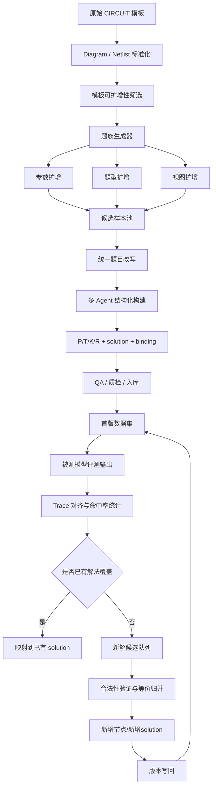
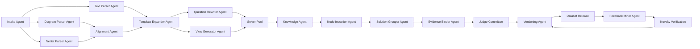

明白了。你负责的**不是整个 benchmark 定义**，而是这个大项目里的一个明确子模块：

> **针对具体数据集的数据特点，设计并自动化实现“数据集构建流程 + 多-agent 工作流 + 新解法回收闭环”。当前先以 CIRCUIT 为试点。**

这意味着你给师兄汇报时，口径要从“我们在定义整个过程评测体系”切换成：

- **我负责什么**：数据怎么来、怎么扩、怎么自动构建、怎么持续补新思路
- **我不负责什么**：最终整套 benchmark 的全部评测理论、总体 judge 体系、完整学科泛化结论
- **我当前的试点对象**：CIRCUIT
- **我当前的核心方法**：多-agent 自动化构建 + 评测回流增补多思维链

你现在最适合汇报的主线，可以直接定成下面这一版。

---

## 一、你负责部分的准确项目定位

可以直接这样讲：

**我负责的是 benchmark 数据构建侧的方法设计。目标不是直接评测模型，而是构建一套面向具体数据集的自动化数据生产框架。这个框架需要能够：**

1. **理解不同数据集的结构特点**，先从 CIRCUIT 开始；
2. **自动把原始样本加工成可用于过程评测的数据**；
3. **用多-agent 工作流完成样本改写、结构化、标注、质检与入库**；
4. **在真实评测时监控被测模型的新解题思路，并把合法新思路增量写回数据集**；
5. **最终形成一个可持续迭代丰富多思维链的数据构建闭环。**

这和你当前文档中的“扩数据思路”与“多 agent 闭环设计”是对齐的，分别落在 [`plans/circuit_single_dataset_framework.md`](plans/circuit_single_dataset_framework.md:151) 和 [`plans/circuit_single_dataset_framework.md`](plans/circuit_single_dataset_framework.md:585)。

---

## 二、你这部分工作的核心问题是什么

你这部分实际上在解决 3 个问题。

### 1. 原始数据不够直接可用

像 CIRCUIT 这种数据集，原始形式更接近 benchmark 样本，而不是“可持续扩增的数据母体”。

所以你要做的是把原始题，提升成三层对象：

- **模板层**：电路拓扑骨架
- **实例层**：参数化 setup
- **题型层**：从同一模板派生多种问题

这正对应 [`plans/circuit_single_dataset_framework.md`](plans/circuit_single_dataset_framework.md:210) 的 CIRCUIT 单数据集构建框架。

### 2. 人工构建太慢，必须 agent 自动化

师兄聊天里其实已经把要求说得很清楚：

- 参考 `paperbanana`、`autofigure` 这类多-agent workflow
- 数据采集好之后，整个流程尽量都让 agent 执行
- 核心是任务细化与角色分工

所以你不是只设计一个 pipeline，而是要设计：

- 哪些 agent
- 每个 agent 的输入输出
- 怎么串联
- 哪些能并行
- 哪些环节要仲裁与质检

### 3. 数据不能一次性静态建完

这是你这部分最有价值的地方。

你不只是生成第一版数据，而是要设计一个**会持续吸收新解法的数据构建系统**：

- 被测模型输出已有思路 -> 映射到旧 solution
- 被测模型输出低命中新思路但答案正确 -> 进入新解回收
- 经验证后 -> 新节点 / 新 solution 入库

所以你负责的不是“造一批数据”，而是“造一台持续长数据的机器”。

---

## 三、为什么先选 CIRCUIT 最合理

你给师兄汇报时，不需要把所有数据集都展开，重点讲：

**CIRCUIT 最适合做自动化试点。**

原因有四个：

1. **结构最规整**：元件、连接、局部模块都比较标准；
2. **双视图天然存在**：diagram + netlist，便于 agent 对齐和证据绑定；
3. **模板化程度高**：适合做模板扩增、参数扩增、题型扩增；
4. **自动验证空间大**：结构一致性、连通性、部分数值推导都能程序化检查。

这比先做 USNCO-V、EEE-Bench 更稳，因为后两者的异构性更强、版权与恢复成本更高。

---

## 四、你负责部分的总体设计框架

你这一部分的总体框架，建议汇报成 **“两阶段 + 一个回流闭环”**。

### 阶段 A：初始数据构建

目标：把 CIRCUIT 原始题变成可用于过程评测的结构化样本库。

包括：

1. 原始模板采集
2. 图与 netlist 标准化
3. 模板可扩增性筛选
4. 题族生成
5. 统一题目改写
6. 过程结构化
7. 质检入库

### 阶段 B：评测回流增补

目标：把被测模型生成的新思路回收进数据。

包括：

1. 收集模型 trace
2. 对齐已有节点 / solution
3. 检测低命中新解
4. 验证其合法性
5. 增量写回数据集

### 闭环目标

让 CIRCUIT 数据集从：

- 一次性静态样本库

变成：

- **不断吸收新思路的 evolving dataset**

---

## 五、最适合给师兄看的总体流程图

下面这张图是你这部分工作的主图。

这张图最能体现：

- 你的工作不是只做“样本构建”
- 而是“构建 + 自动化 + 回流迭代”三件事一起做

---

## 六、你负责部分里最关键的 agent 自动化设计

你这里最核心的不是“用了 agent”，而是**怎么拆任务**。

建议你汇报时，把 agent 分成 4 层。

### 第一层：数据理解层 agent

负责把原始 CIRCUIT 样本读懂。

#### 1. Intake Agent

输入：原始题目、题图、原始答案、元数据  
输出：标准化 `problem record`

#### 2. Diagram Parser Agent

输入：电路图  
输出：元件、节点、连边、局部结构候选

#### 3. Netlist Parser Agent

输入：netlist  
输出：结构化连接图

#### 4. Alignment Agent

输入：diagram 解析结果 + netlist 解析结果  
输出：统一电路结构底稿 + 冲突报告

#### 5. Text Parser Agent

输入：题干文本  
输出：目标量、约束、单位、已知条件

---

### 第二层：数据生成层 agent

负责把“一个模板”扩成“一个题族”。

#### 6. Template Expander Agent

做参数扩增：

- 替换元件值
- 替换输入频率 / 幅值
- 替换测量节点

#### 7. Question Rewriter Agent

做题型扩增：

- 结构理解题
- 功能判断题
- 定量求解题
- 反事实变化题

#### 8. View Generator Agent

做视图扩增：

- 只给 diagram
- 只给 netlist
- diagram + netlist 双视图

这一层的核心目标是：

**把 CIRCUIT 的单题，变成能持续扩增的题族母体。**

---

### 第三层：结构化标注层 agent

负责把新样本变成可评测数据。

#### 9. Knowledge Agent

给每题补候选知识原子，例如：

- 欧姆定律
- KCL / KVL
- 阻抗规则
- RC / RL 功能判据

#### 10. Solver Pool

不止一个 solver，而是多个角色并行：

- Direct Solver：直接解
- Method-specific Solver：指定方法解
- Reverse Solver：从答案反推路径
- Novelty Hunter：强行找不同思路
- Adversarial Solver：尝试替代表达和替代桥梁

#### 11. Node Induction Agent

把解题文本归纳成结构化对象：

- P：感知事实
- T：题干条件
- K：知识原子
- R：中间节点

#### 12. Solution Grouper Agent

把多条 candidate trace 聚成：

- 已有 solution 的不同表述
- 新的 solution family

#### 13. Evidence Binder Agent

给每个节点绑定支持来源：

- 图像
- netlist
- 题干
- 知识规则
- 前驱节点

---

### 第四层：质量控制与回流层 agent

负责让系统能长期迭代。

#### 14. Judge Committee

分三类：

- P Judge：检查感知是否真实
- K Judge：检查知识调用是否合规
- R Judge：检查中间节点是否被支持

#### 15. Conflict Arbiter Agent

处理争议样本：

- 是不是新解法
- 只是旧解法换表达，还是新路径
- 节点是否有足够支撑

#### 16. Feedback Miner Agent

扫描评测阶段真实输出，找：

- 命中率低但答案正确的 trace
- 高频出现的新桥梁节点
- 旧 solution 无法解释的新路径

#### 17. Incremental Writer / Versioning Agent

负责：

- 新节点入库
- 新 solution 建立
- 版本更新
- 变更日志记录

---

## 七、你这一部分最关键的创新点，不是 DAG，而是“闭环自动长数据”

这是你汇报时一定要强调的点。

你负责部分的亮点不是单纯：

- 把 CoT 转成 DAG

而是：

- **把数据构建做成自动化工作流**
- **把多解扩充做成持续回流系统**
- **把被测模型本身变成新数据来源**

所以你可以把你这部分概括成一句话：

> **我负责的是一个面向 CIRCUIT 的自动化数据工厂：先把原始模板扩成题族，再用多-agent 完成结构化构建，最后把评测中出现的新解法继续回收进数据集。**

这句话很适合汇报。

---

## 八、你给师兄汇报时，最该讲清楚的新思路回收机制

这个机制是你这部分工作的核心价值。

### 基本逻辑

1. 先用多-agent 给每题构建初始 solution library
2. 被测模型评测时产生 trace
3. 系统计算 trace 对已有 key claims / solution 的命中率
4. 若命中率高，则归为已有解法变体
5. 若命中率低但答案正确，则进入新解候选池
6. 再由验证 agent 检查：
   - 是否真的合法
   - 是否只是旧路径改写
   - 是否需要新增桥梁节点
7. 若通过，则把新节点与新 solution 回写进数据集

### 这个机制的意义

它解决的是：

- 初始标注不可能一次性穷尽多思维链
- 但真实模型会不断暴露新的解法空间
- 所以最好的做法不是一次性做完，而是持续增量扩库

### 这正好贴合你师兄的需求

师兄说的是：

- 整个流程最好都由 agent 执行
- 重点学习多-agent 如何把任务细化
- 最终要形成能自动跑的完整流程

而你的“新思路回收闭环”正是完整流程里最有研究味道的部分。

---

## 九、你汇报时可以直接用的第二张图：agent 自动化框架

这张图的重点在于：

- 前半段是“生成”
- 中间是“结构化”
- 后半段是“回流更新”

---

## 十、你汇报时的边界一定要讲清楚

你最好主动说清楚：

### 你负责的部分

- 面向 CIRCUIT 的数据构建流程设计
- 多-agent 自动化实现框架
- 初始数据生成与结构化入库
- 新解题思路的回收与增量写回闭环

### 你暂时不展开的部分

- 整个 benchmark 在所有学科上的统一评测理论
- 最终 judge scoring 体系的全局设计
- 全部数据集统一泛化方案

这样汇报会显得边界清楚，不会被师兄认为你在抢占整个项目定义。

---

## 十一、最适合你现在的汇报标题

你这一部分，我建议汇报标题直接用下面这种：

### 版本 1

**基于 CIRCUIT 的多模态过程数据自动化构建与多-agent 回流扩增框架**

### 版本 2

**面向 CIRCUIT 的多-agent 数据构建流程：从模板扩增到新解法回收**

### 版本 3

**CIRCUIT 试点：可持续迭代的多思维链数据构建框架**

我更推荐版本 2，最贴你的职责。

---

## 十二、你可以直接讲给师兄听的一段话

**我这部分主要聚焦数据构建，不是整个 benchmark 的总评测框架。当前先选 CIRCUIT 做试点，因为它结构规整、diagram 和 netlist 可对齐、适合模板化扩增，也适合 agent 自动化。我的目标是把原始样本变成一个可持续增长的数据系统：前端通过模板扩增、题型扩增和视图扩增生成候选题族，中间通过多-agent 完成解析、改写、结构化和质检，后端在真实评测中继续监控被测模型输出的新解题路径，把合法新思路增量写回数据集，逐步丰富多思维链覆盖。**

这段已经可以直接拿去说。

---

## 十三、你下一步最值得做的，不是继续扩理论，而是补一页“汇报专用版图”

你现在文档 [`plans/circuit_single_dataset_framework.md`](plans/circuit_single_dataset_framework.md:702) 里已经有流程图了，但更偏完整方案。

如果是给师兄汇报，建议单独再准备一页，只突出 3 件事：

1. **为什么先选 CIRCUIT**
2. **多-agent 如何自动构建数据**
3. **如何把被测模型的新思路继续写回数据集**

这三件事就是你负责部分的核心，不要被更大的评测理论分散掉。